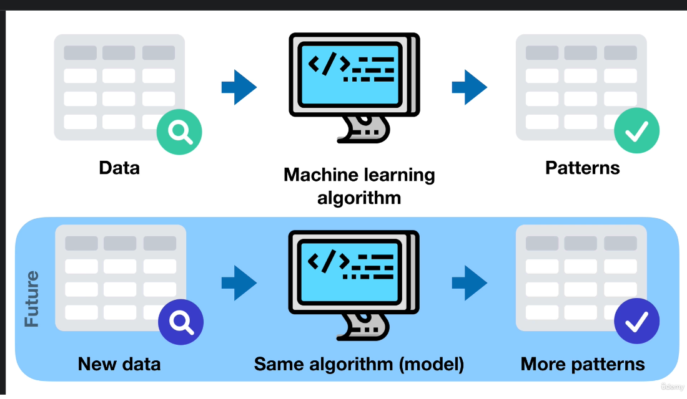
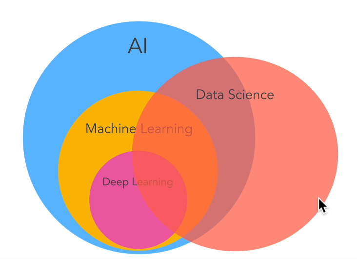
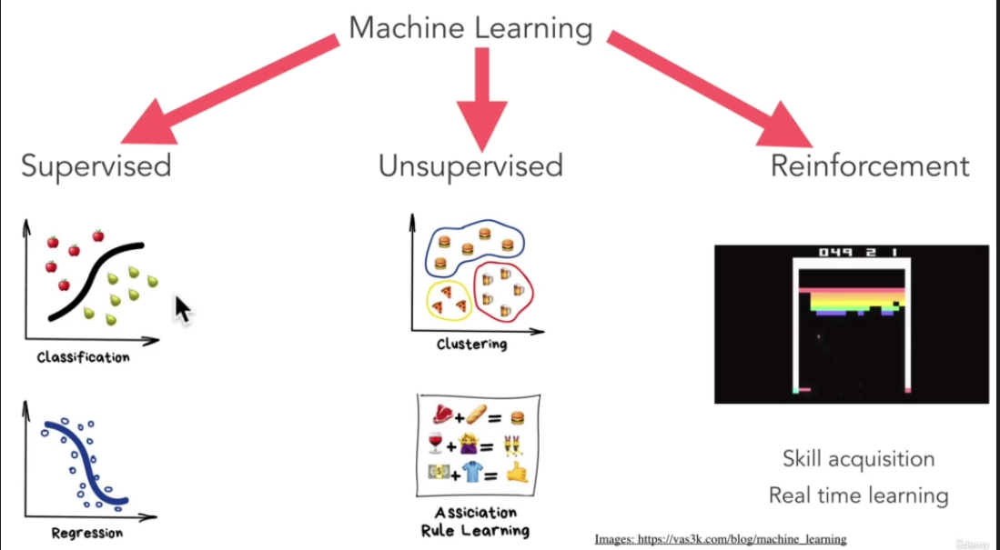

# Machine Learning

short: Systems that improve their performance in a given task with more and more experience or data.

ML is using an algorith or computer program to learn about different patterns in data, and then taking that algo and what its learned to make predictions about the future.

Without all the AI-bullshit, the only goal of machine learning is to predict results based on incoming data.

Data science is running experiments on a set of data with the hope of finding actionable insights within it.

Data Analysis and ML can be considered part of Data Science

AI above refers to general AI
- AI used in games like Chess, Go etc is called narrow AI, especialized AI

## Types of ML

Source: https://vas3k.com/blog/machine_learning/

