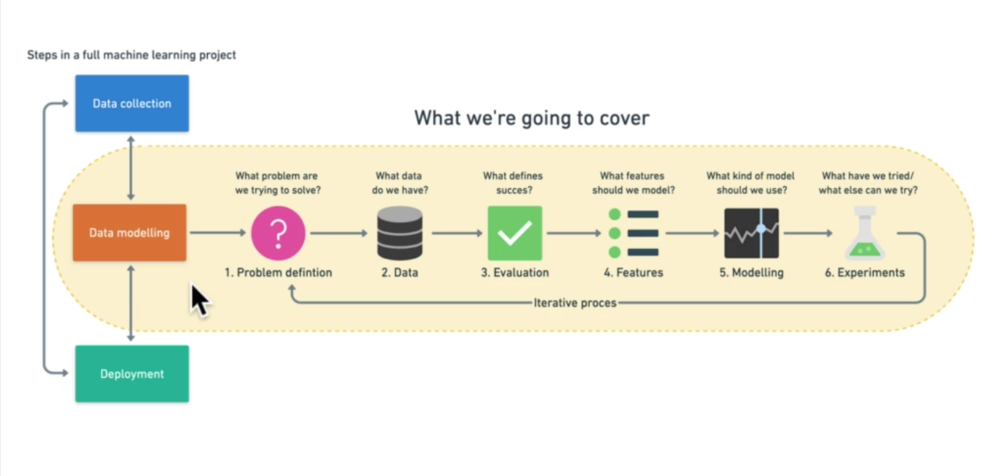
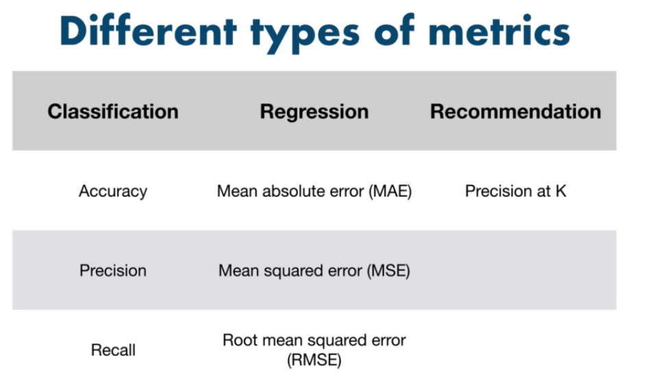
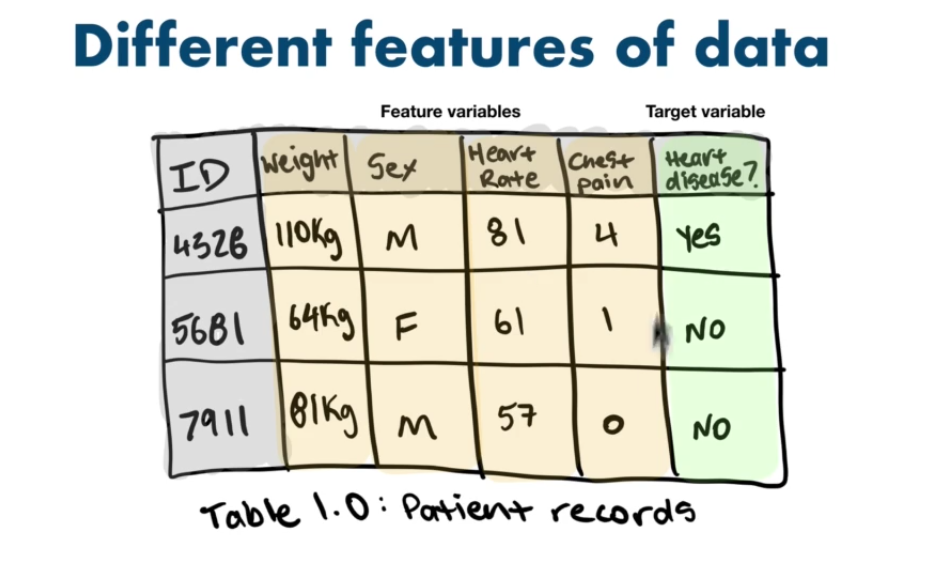
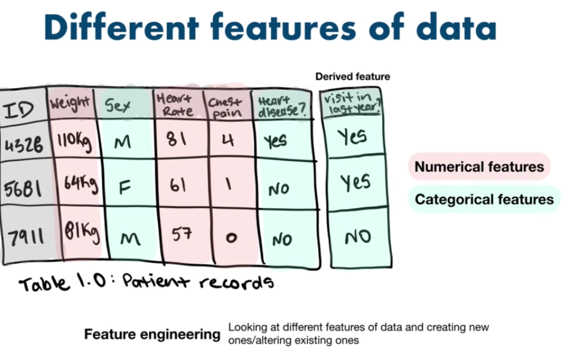
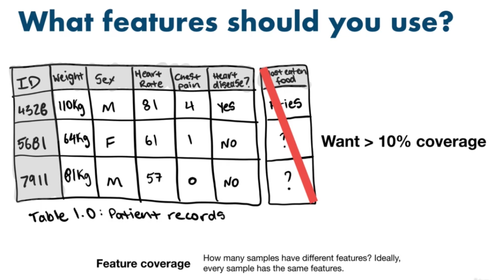
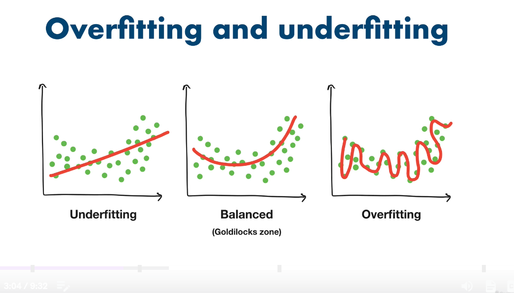

# Machine Learning Framework

6 step ML framework

## 1. Problem definition

#### Types of Machine Learning
1. Supervised
    - ML algo tries to use the data to predict the label for the data, and improves with each attempt
    - Two types
        -  Classification - Binary vs Multiclass (e.g. hear disease vs no heart disease vs identify dog breeds)
        -  Regression - trying to predict a number
2. UnSupervised
    - Has data but no labels
    - e.g. grouping customers into distinct groups / labels
    - aka clustering
3. Transfer Learning
    - using other ML models, fine tune it for other tasks
4. Reinforcement Learning
    - Having computer programs perform some action and eith rewarding it or punishing it, from which it learns
    - e.g chess engines

## 2. Types of Data

**Structured vs Unstructured**
Structured
- csv, excel sheets

Unstructured
- Images
- Text
- phone calls
- videos

**Static vs Streaming**
Static
- csv
- will not change over time

Streaming
- stock prices

## 3. Evaluation

Evaluation means "what defines success for us".
- e.g. For this project to be valuable, we need a machine model with 99% accuracy

## 4. Features

Features mean "what do we already know about the data"

Feature Engineering: Looking at different features of data and creating new ones/altering existing ones

Feature Coverage: How many samples have different features? Ideally, every sample has the same features and thus coverage is 100%

## 5. Modelling

3 parts to Modelling
1. Choosing and training a model
2. Tuning a model
3. Model comparison

**The most important concept in machine learning**
3 sets: 
1. Training set - Train our model on this data - 70-80% split
2. Validation - Tune your model on this - 10-15% split
3. Test set - test our model on this set - 10-15% split

**Generalization**: The ability of an ML model to perform well on data it has not see before.

Choosing a model: 
- Structured data: Catboost, XGBoost, RandomForest
- Unstructured data: Deep Learning, Transfer Learning

**Overfitting vs Underfitting**

Overfitting: Good performance on the training data, poor generliazation to other data. 
    - Another form of overfitting can come in the form of better performance on test data than training data.

Underfitting: Poor performance on the training data and poor generalization to other data

