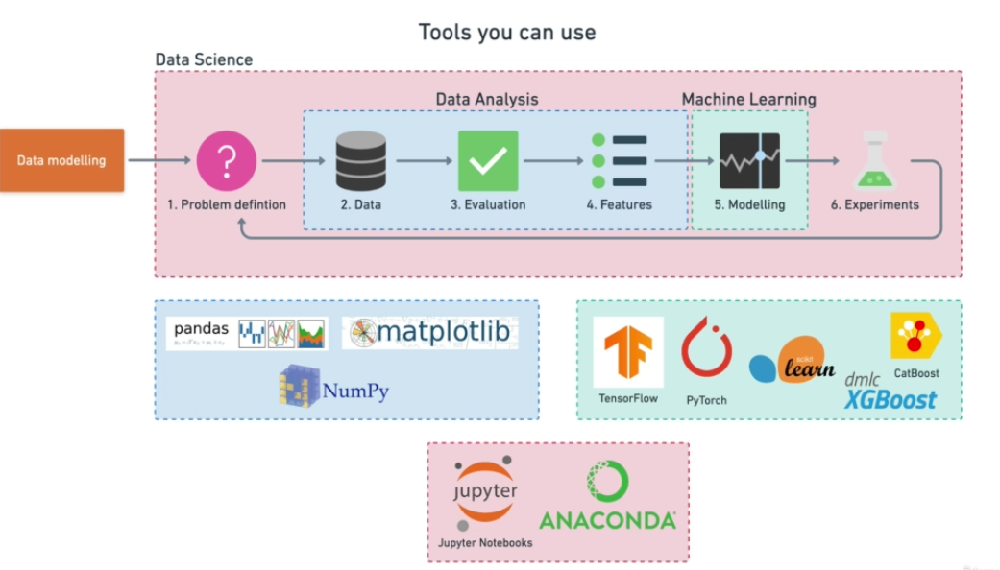
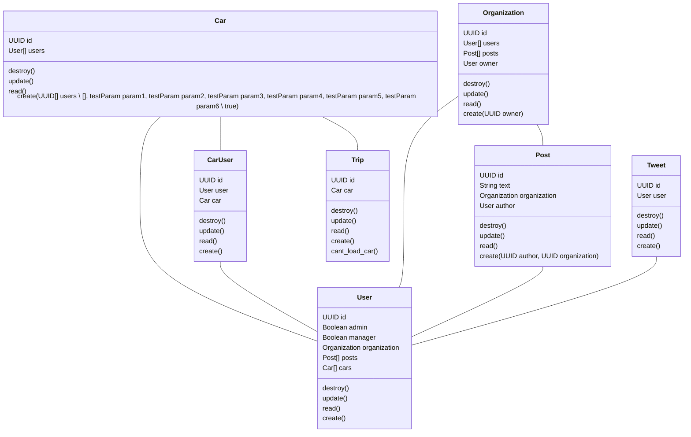

# Tools for ML

Python based

```mermaid
classDiagram
    class User {
        UUID id
        Boolean admin
        Boolean manager
        Organization organization
        Post[] posts
        Car[] cars
        destroy()
        update()
        read()
        create()
    }
    class Organization {
        UUID id
        User[] users
        Post[] posts
        User owner
        destroy()
        update()
        read()
        create(UUID owner)
    }
    class Post {
        UUID id
        String text
        Organization organization
        User author
        destroy()
        update()
        read()
        create(UUID author, UUID organization)
    }
    class Car {
        UUID id
        User[] users
        destroy()
        update()
        read()
        create(UUID[] users \\ [], testParam param1, testParam param2, testParam param3, testParam param4, testParam param5, testParam param6 \\ true)
    }
    class CarUser {
        UUID id
        User user
        Car car
        destroy()
        update()
        read()
        create()
    }
    class Trip {
        UUID id
        Car car
        destroy()
        update()
        read()
        create()
        cant_load_car()
    }
    class Tweet {
        UUID id
        User user
        destroy()
        update()
        read()
        create()
    }

    Car -- CarUser
    Car -- Trip
    Car -- User
    CarUser -- User
    Organization -- Post
    Organization -- User
    Post -- User
    Tweet -- User
```
