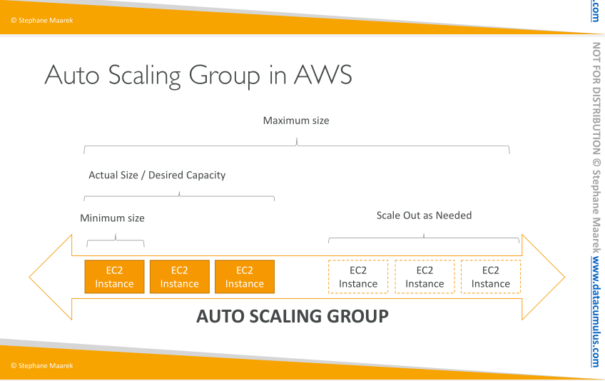

# Auto Scaling Groups 

The goal of an Auto Scaling Group (ASG) is to:
- Scale out (add EC2 instances) to match an increased load
- Scale in (remove EC2 instances) to match a decreased load
- Ensure we have a minimum and a maximum number of machines running
- Automatically Register new instances to a load balance

## ASG Attributes 

A launch configuration
    - AMI + Instance Type
    - EC2 User Data
    - EBS Volumes
    - Security Groups
    - SSH Key Pair
• Min Size / Max Size / Initial Capacity
• Network + Subnets Information
• Load Balancer Information
• Scaling Policies

## Auto Scaling Alarms 

It is possible to scale an ASG based on CloudWatch alarms
• An Alarm monitors a metric (such as Average CPU)
• Metrics are computed for the overall ASG instances
• Based on the alarm:
    • We can create scale-out policies (increase the number of instances)
    • We can create scale-in policies (decrease the number of instances)
    
    
 ASG are free. You pay for the underlying resources being launched
 
 
If an ASG has been configured to leverage the ALB health checks, unhealthy instances will be terminated.
 
## Scaling Policies 
 
 - Target Tracking Scaling
    • Most simple and easy to set-up
    • Example: I want the average ASG CPU to stay at around 40%
    - Example 2: ensure that average number of connectes to each EC2 instance remain around 1000
- Simple / Step Scaling
    • When a CloudWatch alarm is triggered (example CPU > 70%), then add 2 units
    • When a CloudWatch alarm is triggered (example CPU < 30%), then remove 1
- Scheduled Actions
    • Anticipate a scaling based on known usage patterns
    • Example: increase the min capacity to 10 at 5 pm on Fridays
    
### Scaling Cooldowns

The cooldown period helps to ensure that your Auto Scaling group doesn't launch or terminate additional instances before the previous scaling activity takes effect.

One common use for scaling-specific cooldowns is with a scale-in policy—a policy that terminates instances based on a specific criteria or metric. Because this policy
terminates instances, Amazon EC2 Auto Scaling needs less time to determine whether to terminate additional instances.

## Termination Policy

The Default Termination policy tries to balance across AZ first, and then delete based on the age of launch configuration. 

Example: 

An ASG spawns across 2 AZ, AZ-a has 3 EC2, while AZ-b has 4 EC2 instances. In case of scale-in event, AZ-b will terminate the instance with the oldest launch configuration.