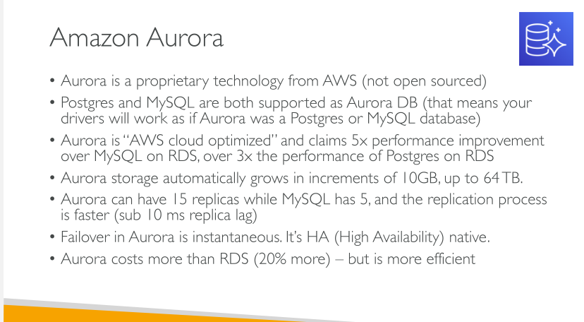

# Aurora

## Features

- Automatic Fail-over
- Backup and Recovery
- Isolation & Security
- Industy Compliance
- Push-button scaling 
- Automated Patching with Zero downtime 
- Advanced Monitoring 
- Routing Maintenance 
- Backtrack: restore data at any point of time without using backups

### Security

Similar to RDS because they use the same engines

- Encryption at rest using KMS 
- Automated backups, snapshots and replicas are also encrypted
- Encryption in flight using SSL (same process as MySQL or Postgres)
- Possibility to authenticate using IAM token (same method as RDS)
- You are responsible for protecting the instance with Security groups.
- You can't SSH

## Aurora Serverless

Aurora Serverless can be used by a development team to minimize costs.

## Aurora Multi-Master

## Aurora Global Database

Global Databases allow you to have cross region (note: cross-region, not cross AZ) replication