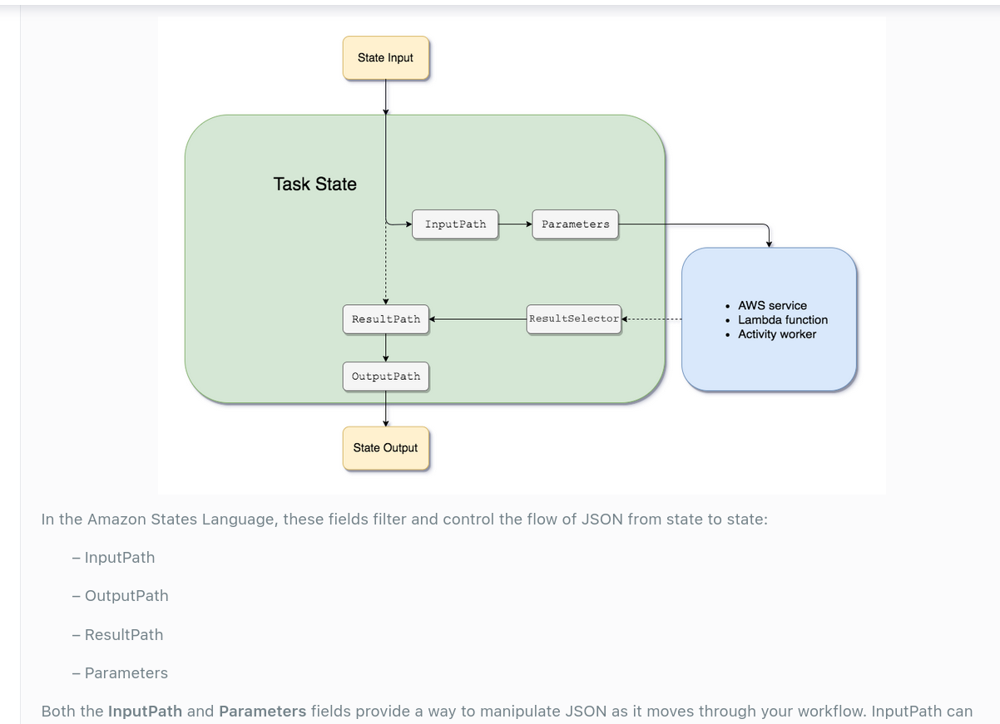

# Step Functions

Orchestrate the components of a microservices app of any process into a serverless workflow

Step function allows us to represent workflows as a State machine, which we can visually inspect.

Amazon uses Amazon States Language (ASL) for writing state machine, but we can also use drag-and-drop interface

## Step function state types

1. Task
    - Single unit of work
2. Choice
    - if else logic
3. Parallel
    - begin parallel branches of execution
4. Wait
    - add delay
5. Fail
    - stop execution and mark as failure
6. Succeed
    - stop execution and mark as success
7. Pass
    - pass input from previous state to the next state
8. Map
    - map the current state with a function, iterate on it

## Use Cases

1. Built-in retry and error handling capabilities
    - we can split multiple Lambda calls into multiple states and handle errors happening in any individual lambda function
2. Suitable for handling long running jobs
    - Lambda functions have an execution limit of 15 minutes
    - We can break down a lambda into multiple states each of which can execute for 15 minute and pass its result to the next state

### Question

A transcoding media service is being developed on Amazon Cloud. Photos uploaded to Amazon S3 will trigger a Lambda function. The Lambda function will cause the Step Functions to coordinate a series of processes that will do the image analysis tasks. The input of each function should be preserved on the result to conform to the application’s logic flow.

What should the developer do?

Answer: Declare a `ResultPath` field filter on the Amazon States Language specification.

