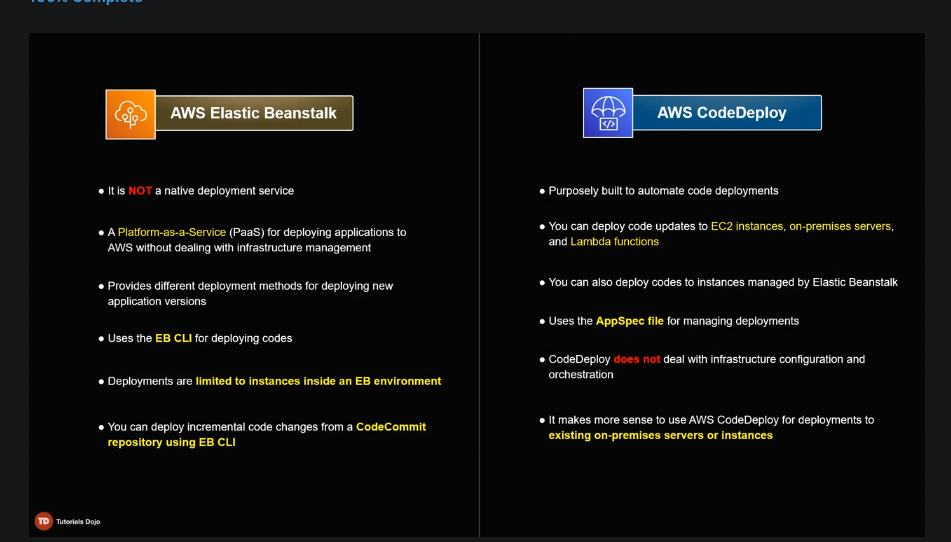

# Elastic Beanstalk

AWS Elastic Beanstalk is a PaaS product

After you upload your code, Elastic Beanstalk takes care of
- resource provisioning
- load balancing
- db management
- patching
- and many more

Configuration setting in Elastic Beanstalk
- Auto Scaling Group
- Modify the root volume of your instance
- Configure DB (RDS)
- AWS X-Ray (used for debugging)
- AWS CloudWatch Logs (monitoring)
- Amazon SNS (notifications)

Elastic Beanstalk itself is a free service, but you still pay for the resources you create (e.g. instance, ALBs)

## Elastic Beanstalk Deployment Policies

Deployment policies govern how a new version of code is deployed to our EC2 instances running behind an ALB

1. All at Once
    - New code deployed to **ALL** instances at the same time
    - Deployment is **fast**
    - Suitable for quickly releasing changes in a dev/staging env
    - Your app is unavailable during deployment
    - Hence **not suitable for prod**
2. Rolling
    - New code is deployed in **batches**
    - You choose the batch size
    - Batch size is the number of instances to deploy in each batch
    - The impact of failed deployment is lower than ALL at once
    - the application is available at a **reduced capacity** during deployment
3. Rolling with additional batch
    - a variation of the Rolling deployment
    - ELB will deploy new version to new instances and register these new instances to ALB in batch sizes
    - the app runs at **full capacity** during deployment
    - If the deployment of first batch fails, the created instances are **terminated**
    - If the succeeding batches fail after a first few have succeeded, both versions of the app will be live at once, so you **need to redeploy** the old version to the successful batches to **revert** all instances back to old version
    - ELB will not be able to create new instances once you reach the max instance limit, so be mindful of the **instance limit** in your AWS account
4. Immutable
    - Existing instances are not changed.
    - Rather, whole separate Auto-Scaling group with the new app version is created, and once successfully created, ALB is pointed to the new ASG, discarding the old ASG.
    - Rollbacks **do not involve downtime**
    - Rollbacks are **faster**
    - Your application runs at **full capacity** during the deployment
    - **Costly**
    - EC2 **instance limit**
5. Traffic Splitting
    - Suitable for A/B testing or Canary Testing
        - A Canary test allows you to gradually release changes to a small percentage of your users.
    - ELB deploys updates to a **separate ASG and shifts a percentage of traffic** towards it
    - Deployment is successful if the **new instances pass the health check** within the defined evaluation period.
    - 100% of the traffic is shifted once the deployment is successful
    - In case the health checks fail, the traffic is rerouted to the old instances

## Lifecycle Policies

There is a limit to how many total versions of all applications can be created in a region. 
- This version quota could result in problems if not properly tackled
- Lifecycle policies help deal with version quotas.

Lifecycle policies determine how old versions should stay before Elastic beanstalk removes them from your account
- tells EB to delete versions if the total number of application versions exceeds a specified number
- The policy will only apply if the application version creation is successful

You must manually delete versions if you've reached the version quota

Let's say we set application version limit to total count to 100
- what happens if we create a new version but have not reached the quota yet?
- EB deletes the oldest version to keep the count at 100

In addition to total count, there is an option to limit versions by age, e.g. 180 days

## EB CLI

There is a CLI for EB, separate from AWS CLI

Every EB functionality can be tweaked from the console, but the CLI helps in simplifying the creation, update and monitoring EB environments from your local environment

`eb deploy` commands deploys the application from your local

EB CLI can also be used to deploy code from CodeCommit repository

Quiz: Where should the file `myconfig.config` be placed inside an EB app?

Answer: You can add AWS Elastic Beanstalk configuration files (.ebextensions) to your web application’s source code to configure your environment and customize the AWS resources that it contains. Configuration files are YAML- or JSON-formatted documents with a .config file extension that you place in a folder named .ebextensions and deploy in your application source bundle.

### EB vs AWS CodeDeploy

