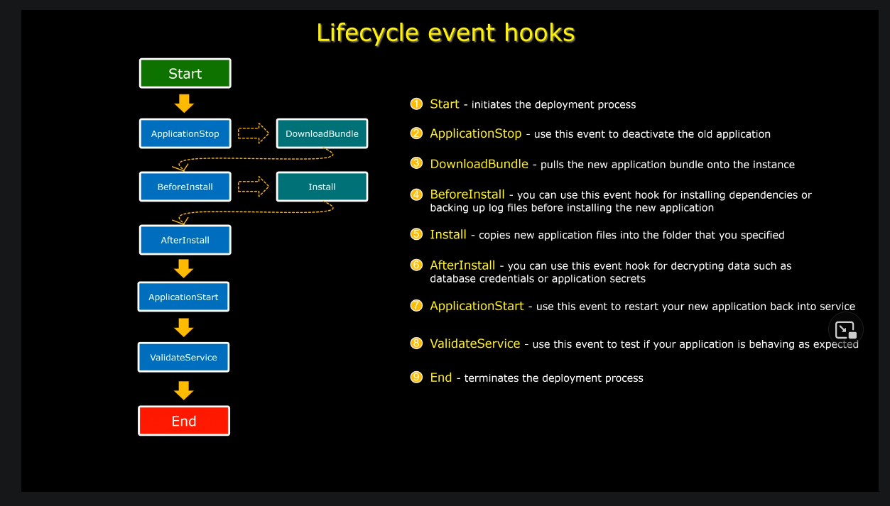

# AWS CodeCommit

A fully managed source-control service that hosts secure Git-based repos, similar to Github

Uses HTTPS or SSH

Uses Amazon S3 and DynamoDB under the hood

CodeCommit makes integration with other AWS services easier

CodeCommit repos are not publicly accessible

Connections to CodeCommit repos can be done over:
- HTTPS
    - IAM has an option to generate Git credentials for AWS CodeCommit for users
- SSH
- HTTPS (GRC) - Git remote codecommit
    - recommended for supporting connections made with federated identity, identity providers, and temporary credentials

# AWS CodeBuild

A fully managed CI service

Compiles source code, runs tests and produces a build artifact of that code that is ready to deploy

CodeBuild eliminates the need to set up, patch, update and manage your own build servers and software

It provides pre-packaged build environments as Docker images
- A build environment is the combination of the OS, programming language, and tools used by CodeBuild to run a build

Instead of using the CodeBuild environments, you can use AWS CodeBuild agent to build and test apps locally

CodeBuild scales automatically according to build requests

You dont pay for idle time, only for time it takes to complete the build

Uses a `buildpspec.yml` file in the project root, and runs the build commands mentioned in it

# CodeDeploy

A managed Continuous Deployment Service

Supports deployment to EC2, Lambda, ECS, Fargate and on-prem servers

You need to install the AWS CodeDeplkoy agent for EC2/on-prem deployments

Also supports variety of different application assets such as Lambda functions, configuration files, executables, packages, scripts or even multimedia files.

CodeDeploy is platform agnostic

It can also perform auto rollbacks, or you can do manual rollbacks

## Primary Components

- Application
    - think of it as a container that holds the rest of the components
    - identifies application version that you want to deploy
    - must have a unique name
- Deployment Group
    - refers to the set of instances or Lambda functions where you deploy the code revision
    - You can create multiple deployment groups within an application
    - e.g QA, staging and prod deployment groups
- Deployment configuration
    - set of conditions and deployment rules that CodeDeploy applies during a deployment
    - varies for each compute type available
- AppSpec file
    - like `buildspec.yml` for CodeDeploy
    - written in YAML or JSON
    - manages deployment stages as lifecycle event hooks

## Deployment Types

- In-place
    - Uses the currently deployed infa to deploy new versions
    - It is an example of all-at-once deployment strategy
    - only available for EC2 and on-prem envs
    - Pros
        - Cheaper
        - need to maintain a single env
    - Cons
        - some downtime
        - slow rollback compared to Blue/Green
- Blue/Green Deployment
    - creates two independent infra env. 
    - The blue env contains the old code
    - while the green contains the new code
    - Traffic is then shifted to the newest environment (green) and diverted away from the blue one by redirecting the DNS record to green's load balancer using Route 53.
    - Pros
        - no downtime
        - faster rollback
        - can perform tests on the green env w/o affecting the blue env
    - Cons
        - Expensive implementation cost

## Available Deployment configurations

All at once
- deploys app to all instances at the same time
- the app must be deployedto at least one  instance for the deployment to be considered successful
- Not recommended for prod
- Typically used for quickly pushing changes to test envs

One at a time
- The app is deployed to each instance one at a time
- Deployment is considered successful
    - if the new app version is deployed to all of the instances
    - even if deployment to the final instance fails
    - deployment is considered failure when deployment any of the first n-1 instances fails

Half at a time
- the app is deployed to at leat 50% of your instances at once (with fractions rounded down)
- Deployment succeeds if the app revision is deployed to at least half of the instances (with fractions rounded up)

Canary
- only applicable to Blue/Green deployment type
- Traffic is shiften in 2 increments
- you specify how much traffic will be shiften to the green env at first increment
- You specify how many minutes CodeDeploy waits before shifting the remaining traffic
- Example: `LambdaCanary10Percent5Minutes` -> deploy 10% first, wait 5 minutes, deploy 90%

Linear
- Only applicable to Blue/Green deployment type
- Traffic is shifted in equal increments
- example: `CodeDeployDefault.LambdaLinear10PercentEvery1Minute`

Note: Only All-at-once, Canary and Linear can be applied to AWS Lambda and ECS deployments
- EC2 and on-prem deployments support all deployment configs

## Lifecycle event hooks in AppSpec file

The hooks section contains a set of logical groupings called lifecyle event hooks that allow us to execute scripts during various phases of the deployment process

# Code Pipeline

A fully managed CD service that can help you easily build your own CI/CD pipeline:

Sample pipeline:
- Source Stage (AWS CodeCommit)
- Deploy Stage - staging (AWS CodeDeploy)
- Manual approval stage - (wait for manual approval before proceeding)
- Deploy stage - prod (AWS CodeDeploy)