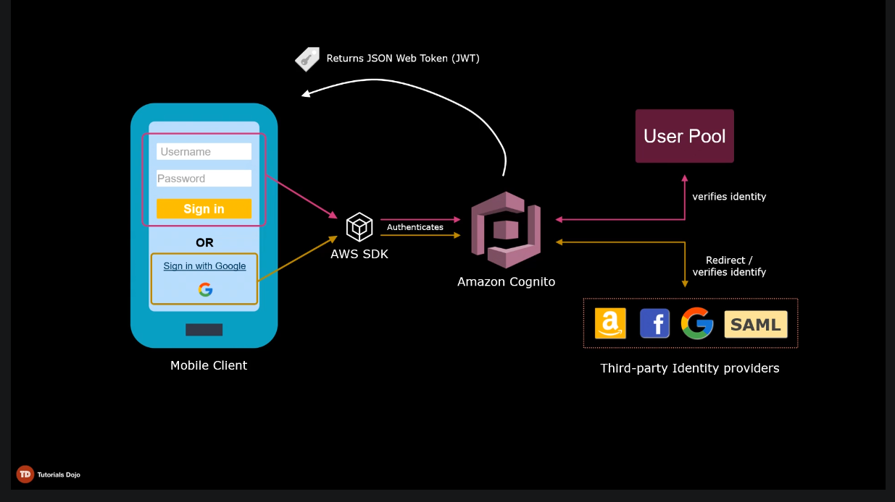

# Amazon Cognito

There are 2 components that make up Amazon Cognito
- User Pools
- Identity Pools

## User Pools

Managed user directory service

Provides sign-up and sign-in functionalities to your web/mobile app

Built-in UI for sign-up and sign-in

Security features:
- Multi-factor Auth
- checks for compromised creds
- account takeover protection
- phone and email verification
- enforce strong password requirements

Has integrations with IdPs (Amazon, FB, Google, SAML) for user auth

Users can directly sign-in using their existing accounts (external IdPs) rather than creating one in your User Pool

Cognito manages the interaction with the external IdPs

## Identity Pools

Used for Authorization (compared to User Pools which is used for Authentication)

Identity pools provide temporary AWS creds that can be used to access other AWS services (e.g S3, DynamoDB)

The JWT returned by User Pool above is used by Identity Pool to exchange it for temporary AWS creds

Identity pool can work without using Amazon User Pool (e.g. get JWT from another source like Google)

Supports 2 types of Identities:
1. Authenticated
    - users who are authenticated by a trusted identity provider
    - permissions are defined by the policy associated with authenticated identities' role
2. Unauthenticated (guest users)
    - users who do not have to be logged in to access your application
    - as best practice, guest users must be given limited permissions
    - permissions are defined by the policy associated with unauthenticated identities' role