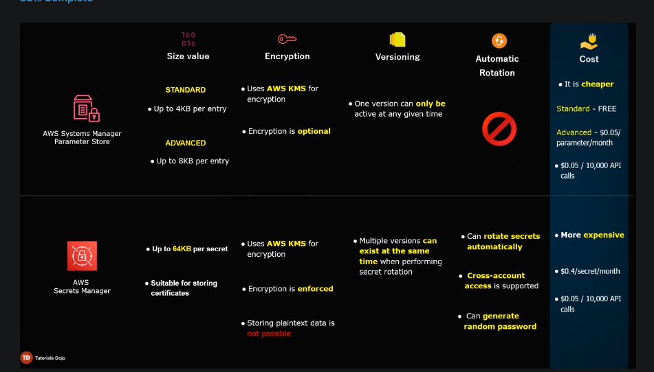

# AWS Secrets Manager

A secret mgmt service that enables you to easily rotate, manage, and retrieve database creds, API keys and other secrets throughout their lifecycle.

A secret can be a DB username and password, KV pair, JSON doc, and TLS cert

Secrets Manager supports auto rotation of DB creds for Amazon RDS, Amazon Redshift, Amazon DocumentDB w/o writing your own rotation function
- for external DBs and secrets, you'd have to author a custom Lambda function to auto-rotate creds

Secrets Manager uses AWS KMS to enforce encryption at rest
- storing of data in plaintext is not possible

You can use Dynamic reference e.g. `{{resolve:secretsmanager:mySecret:SecretString:username}}` to fetch your secrets

# AWS SSM Parameter Store

SSM = Systems Management Service

Parameter store is part of Application Mgmt tools offered by SSM

Parameter store allows you to create KV params where you can store you app config, custom env vars, product keys and creds

Parameter Store is suitable for storing params that do not require encryption (AMI ID, security group ID, URL, etc)

_Parameter Hierarchy_ is a method of grouping parameters to make mgmt easier
- Parameter hierarchy is helpful in determining the right para for a job, preventing you from accidentally using the wrong param.
- e.g. `Prod/DB/endpoint` vs `/Dev/DB/endpoint`

3 types of parameters:
1. String
    - any block of test that you wish to store unencrypted
2. StringList
    - comma separated list of strings
3. SecureString
    - any sensitive data that needs to be encrypted

2 Parameter tiers
1. Standard
    - limit of 10k params
    - size per param <= 4kb
    - storing of params is _free_
2. Advanced
    - can have more than 10k params
    - size per param of <= 8kb
    - $0.05 per advanced param per month

### AWS Systems Manager Parameter Store vs AWS Secrets Manager

# Cloufront

AWS CloudFront is the CDN service by Amazon

Components
1.  Origin
    - Amazon S3 Bucket
    - Elastic Load Balancer
    - AWS Elemental MediaPackage Endpoint
    - AWS Elemental MediaStore Container
    - Amazon EC2 instance
    - on-prem server
2.  Distribution
3.  Viewer

Features:
- Access control using OAC (origin access control, OAI is now legacy
- Geo-restriction
- Customizing at the edge with CloudFront Functions and Lambda@Edge
- We can create Origin Groups and add multiple origins to allow failovers
- Signed URLs & Signed Cookies to restrict access to limited users e.g. paid customers
- Custom Domain Name and Custom SSL (SNI/Dedicated IP)