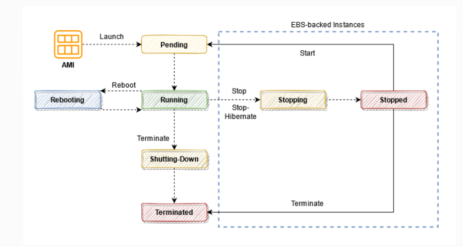

# Amazon EC2

Amazon's Virtual Machine service

## Amazon Machine Image (AMI)

User can launch a pre-configured EC2 Instance

AMIs are regional in scope and cannot be moved b/w regions, but can be copied to other regions

## User Data

Set of commands or script run at the launch of EC2 instance

Helpful when we have multiple EC2 instances connected to Amazon EFS or Auto-Scaling Group

User data must be in base-64 encoded, limited to 16 KB

can be retrieved using ttp://169.254.169.254/latest/user-data

## Instance metadata

For each EC2 instance AWS adds manifest-like metadata that contains all the related technical info about the instance

- AMI
- Hostname
- Public IP
- Private IP
- Instance Type
- MAC Address
- Security groups
- Security Credentials
- IAM Roles of your instance

Instance metadata service:
`http://169.254.169.254/latest/meta-data`

`169.254.169.254` is a link-local IP address

We can attach futher string to above URL to fetch specific info
- e.g.: `{instance-metadata-linkaddress}/local-ipv4`
- `/mac`
- `security-groups`

## Spot instance vs on-demand instance

Spot instance is **not** an instance type but rather a purchasing option that is a lot cheaper than On-demand.

## Instance states

When you launch an instance, it enters the PENDING state. The instance type that you specified at launch determines the hardware of the host computer for your instance. We use the Amazon Machine Image (AMI) you specified at launch to boot the instance. After the instance is ready for you, it enters the RUNNING state. You can connect to your running instance and use it the way that you’d use a computer sitting in front of you.

As soon as your instance transitions to the RUNNING state, you’re billed for each second, with a one-minute minimum, that you keep the instance running, even if the instance remains idle and you don’t connect to it.

When you **STOP** an instance, AWS shuts it down. AWS doesn’t charge users for a stopped instance, or data transfer fees, but AWS does charge for the storage for any Amazon EBS volumes. Each time you start a stopped instance, AWS charges a minimum of one minute for usage. After one minute, AWS charges only for the seconds you use.

By default, Amazon EBS root device volumes are automatically deleted when the instance terminates. However, by default, any additional EBS volumes that you attach at launch, or any EBS volumes that you attach to an existing instance persist even after the instance terminates. This behavior is controlled by the volume’s `DeleteOnTermination` attribute, which you can modify.

Q: A company is planning to launch an Amazon EC2 instance with an attached EBS volume in a default configuration. You will be charged for your EBS storage only when your instance is in which instance state?

the correct answer in this scenario is: **Stopped.**

**Running** is incorrect because in this state, you are billed for the compute, memory, storage, and network of an EC2 instance. Take note that the scenario asks for the instance state where you’ll only be charged for the EBS storage.

**Terminated** is incorrect because you won’t be charged in this state and both the instance and EBS storage will be deleted by default. Remember that it was stated in the scenario that the Amazon EC2 instance with an attached EBS volume is using a default configuration.

**Pending** is incorrect because it is still preparing the instance to enter the running state. If the instance is not running, then you are not billed for the instance usage.