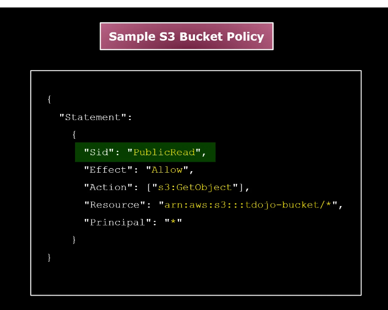

# AWS S3

Object vs Bucket
- object is a file with metadata
    - metadata is kv pair
    - metadata does not change once a file is uploaded
- bucket contains many objects
    - bucket names are globally unique

S3 has a flat structure, concept of a folder is not hierarchical, rather folders are just name prefixes
- S3 does not support POSIX
    - concurrent file modification
    - FS access symantics
    - file locking

S3 auto replicates objects to all AZs of a region

S3 has 99.99% Availability and 99.999999999% Durability (11 9s)
    - durability is the probability that the object remains intact after a period of 1 year

## S3 storage classes
- S3 Standard
    - For frequently accessed data
    - highly durable and highly available
    - Replicates to **3 or more** AZ
    - 99.99% availability
    - No minimum storage charge
    - no data retrieval fees
    - uses examples: web hosting OR temporary storage service
    - **Not** cost effective, most expensive
    - **Not** recommended for data archiving
- S3 Standard-IA (Infrequent Access)
    - for storing infrequently accessed data but provides a way to rapidly retrieve the stored files
    - Replicates to **3 or more** AZ
    - 99.99% availability
    - **30-day** min storage charge
    - Has a data retrieval fee per GB
    - uses examples: data backups, Disaster Recovery files, primary backup copies of on-prem dataset
- S3 One Zone-IA
    - 30-day min storage duration
    - cheaper than S3-Standard-IA
    - 1 AZ
    - 99.95% Availability (the lowest of all classes)
    - uses: secondary backup copies of rarely accessed on-prem dataset, for storing easily recreatable data
    - not recommended for primary backup copies or any ciritical business data
- S3 Intelligent-Tiering
    - for changing or unknown access patterns
    - automatic cost saving
    - 30-day min storage charge
    - no retrieval fees
    - moves data to the most cost-effective access tier w/o any operational overhead
    - stores in 4 access tiers:
        - 2 low-latency access tiers
        - 2 optional archive access tiers
    - uses: storage with no mgmt overhead; data accessed by users over variable periods of time; if you want to avoid lifecycle policies that are not consistently implemented or partially implemented
- S3 Glacier
    - For low cost long term storage and data archiving
    - replicates to 3 or more AZ
    - 99.99% availability
    - 90-day min storage duration
    - high data retrieval fees
    - has its own management console
    - auto moves the data from S3 standard or S3 Standard-IA to AWS S3 Glacier using a **lifecycle policy**
    - has a resource called **vault**: a container for storing your data archives
    - we can use a vault lock to access control and regulatory and compliance requirements
    - **Archival Retrieval Options**
        - Expedited
            - 1-5 min
            - < 250 MB file size
        - Standard
            - default option
            - 3-5 hours
        - Bulk
            - lowest-cost
            - 5-12 hours
- S3 Glacier Deep Archive
    - lower cost storage class
    - long-term retention & digital preservation
    - 7-10 years or longer to meet regulatory compliance requirements
    - replicates to 3 or more AZs
    - 99.99% availablity
    - 180-day min storage duration (~ 6 months)
    - data here should be rarely accessed
    - **Retrieval Options**
        - Standard
            - default
            - 12 hours to restore data
        - Bulk
            - cost lower than standard
            - 48 hours to restore data

## Resource-based policies

Two types:
- ACL
- Bucket policies

Before lifecycle policies there was ACL which is now a legacy feature, ACL granted basic read/write permissions.

Bucket policy is a JSON document that grants users access to an S3 bucket and the objects inside it

You can write more complex rules than ACL

Unlike Identity policies, the Principal field is required for a bucket policy

## Lifecycle Policies

S3 supports lifecycle policy where data can move to different stoage classes based on access patterns

We can set up
- S3 Versioning and MFA
    - to prevent accidental data deletion
- Access Control List
    - Secure access to your S3 buckets and objects
- Bucket Policy
    - Control external access to S3 Bucket

Cross-Region replication
- Auto replicate objects to a different AWS Region for backup purposes

## Encryption

- SSE (Server-side Encryption)
- Client-side encryption

SSE
- S3 encrypts object before saving it to disk storage (**encryption-at-rest**) and then decrypts it when you download the object
- 3 ways
    - SSE-KMS 
        - using AWS-managed CMK or customer managed CMK
        - encrypts using a data key generated from the CMK
        - `kms:GenerateDataKey` and `kms:Decrypt` permissions are required if using customer-managed CMK
        - set the header `x-amz-server-size-encryption: aws:kms` to use SSE-KMS
        - use the header `x-amz-server-side-encryption-aws-kms-key-id` to set your CMK id. (Skip this header if you want to use the Amazon S3-managed CMK)
    - SSE-S3
        - uses an AES-256 Amazon S3-owned CMK
        - set the header `x-amz-server-side-encryption: AES256`
    - SSE-C
        - using customer managed keys
        - only accepts AES-256 keys
        - rejects HTTP
        - you must provide the encryption key during encryption and decryption
        - if the key is lost, data is lost
        - requires 3 headers
            - `x-amz-server-side-encryption-customer-algorith`
            - `x-amz-server-side-encryption-customer-key`
            - `x-amz-server-side-encryption-customer-key-MD5`

Client-side Encryption
- Data is encrypted first before sending to Amazon
- Amazon does not handle encryption and decryption

## S3 Object Lock

S3 Object Lock helps prevent object versions from being deleted or overwritten for a fixed amount of time or indefinitely.

Object Lock offers two methods for managing object retention: 
- **Retention period** 
    - Object versions under **Retention period** are protected for a specified amount of time. 
     - 2 modes in Retention period
         1. Governance
             - users cannot delete or overwrite versions unless they have `s3:BypassGovernanceRetention` permission
         2. Compliance
             - no users, including root user, can delete or overwrite protected object versions
- **Legal Hold**
    - On the other hand, object versions under **Legal hold** remain locked until you explicitly lift the legal hold.