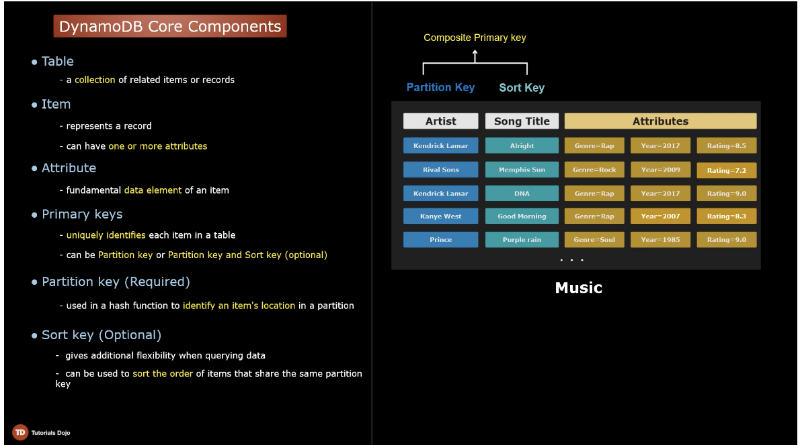

# Dynamo DB

- serverless, non-relational db
- a mix of KV and document database model
- provides high throughput and single-digit latency performance
- it scales automatically
- requires zero db admin.
- replicates across multiple AZs within a region
- built-in fault tolerance
- Can also be queried with SQL using `PartiQL` language

## Secondary Index

A data structure that contains a subset of attributes from a table, along with an alternate key to support query operations.

Using secondary index is faster than full table scans

Attribute Projection options
1. Only Keys - only the partition key and sort key if any
2. Include - attributes described in ONLY keys + other non-key attributes
3. ALL - all attributes of the base table are projected

### Global Secondary Index (GSI)

Related: [What are WCU & RCU in Amazon Dynamo DB](https://stackoverflow.com/questions/71544613/dynamodb-what-are-wcu-and-rcu)

The scope of queries that we can execute against the GSI is global, as the name suggests. It means the search can span all items in a base table, across all partitions.

GSI can be set up during creation of a table or later.

A table can have up to 20 GSIs (default limit)

a GSI table can have a different partition key and sort key

A GSI has its own provision WCU and RCU, they consume units from the index, and not from the base table.

Writes, however, can only happen to base table and are later asynchronously replicated to GSIs with eventual consistency

**Note**: queries on GSI support **eventual consistency** only

## Local Secondary Index

In an LSI, searches are limited to a single partition.

LSI allows us to create an index where we can use an NON KEY attribute as a sort key. Partition key is the same as the base key.

LSI can only be created at the time of creation of the table.

LSI shares throughput (RCU and WCU) with its base table.

Unlike GSI, LSI supports eventual and strongly consistent reads.

An attribute not projected in an LSI can still be fetched from the base table, although this defeats the purpose of the LSI. Avoid fetching non-projected attributes.

## Capacity Modes

Two types: 

1. **Provision Capacity mode**
    - you set a fixed amount of read and write throughput specified in terms of RCU and WCU
    - RCU and WCU are separate independent units and there is no ratio between them of some kind that we need to maintain
    - RCU >> WCU for read heavy workloads
    - Problem with this mode: Since capacity is static, a sudden burst of demand can result in requests being throttled.
    - To solve the above problem, we can enable the DynamoDB AutoScaling feature.
        - uses AWS Application Auto Scaling / Clound watch under the hood
        -  When we turn ON auto-scaling, we set min and max capacity of a table
        -  We can also choose target utilization %
    -  With Auto-scaling, capacity is allocated dynamically up to the max provisioned capacity
    -  Use cases: web apps with predictable and consistent traffic patterns.
    -  You pay a fix amount based on provisioned capacity
    -  You always pay for the minimum provisioned capacity (with auto-scaling)
2. **On-Demand Capacity mode**
    - DynamoDB scales out as needed
    - No capacity planning required
    - Throuhgput is measured in _request units_, RRU and WRU (Read Request and Write Request Units)
    - capacity is added until it reached your table's limit.
    - Use cases:
        - if you want a try pay per use billing mode
        - suitable for apps with unknown workloads
    - Can be more expensive

### Calculating RCU and WCU 

RCU: 
- 1 RCU = 1 **strongly consistent** read request per second for an item <= 4KB
        = 2 **eventually consistent** read request per second
- 2 RCU = 1 **transactional** read <= 4kb
- for items > 4kb, RCU = (total item size) / 4kb , rounded up

WCU: 
- 1 WCU = 1 **standard write** request per second for item <= 1kb
- 2 WCU = 1 **transcational** write <= 1kb
- for item < 1kb, WCU = (total item size) / 1kb, rounded up 

Examples: 

1. Given:
    - Average item size = 5kb
    - Items read each second = 10 eventually consistent reads
    - Item writes per second = 5 standard writes
Answer: 
    - RCU = 5kb / 4kb = 1.25 ~ 2
    - RCU (10 eventually consistent reads / s) = (2 / 2) = 1 * 10 = 10 RCUs
    - RCU (10 strongly consisten reads / s) = 2 * 10 RCUs = 20 RCUs
    - WCU = 5kb * 5 = 25 WCUs

2. Given:
    - Avg item size = 8kb
    - Item reads each second = 20 strongly consistent reads
    - Item writes each second = 2 transactional writes
Answer:
    - 1 RCU = read 4kb/s
    - Hence, it takes 2 RCUs for 8kb/s
    - Total RCU for 20 strong reads = 2 * 20 = 40 RCU
    - 1 WCU = Write 1kb/s
    - Hence it takes 8 WCU to write 8kb/s
    - 1 transactional write = 2 * standard write
    - 1 transactional write = 2 * 8 = 16 WCU
    - Total WCU = 16 * 2 = 32 WCUs

## DAX (DynamoDB Accelerator)

A highly available, **in-memory cache** purposely built for DynamoDB

DynamoDB w/o DAX already gives response times in milliseconds, but using DAX response times can improve to microseconds for millions of request per second

For high availability, it is recommended to have at least 3 nodes across AZs

DAX auto assigns which node is the primary node

The read throughput depends on the cluster size

A DAX cluster can be scaled vertically and horizontally

DAX runs in a VPC, thus not accessible over public internet

After creating DAX cluster, point your existing DynamoDB API calls to the DAX cluster endpoint

DAX uses: 
    - for **read intensive apps** that require response times in microseconds
    - to mitigate the affects of **hot partitions** by caching frequently read items
    - to cache large datasets that are repeatedly read by an application **to save RCU**

When NOT to use DAX
    - for apps that require strongly-consistent reads. DAX only serves **eventually consistent reads**
    - write intensive apps
    - If you have an already existing caching layer, or you wish to use your own custom caching logic 

## DynamoDB Streams

A feature that captures **item-level changes** that occur in a DynamoDB table

Write operations (PUT, UPDATE, DELETE) are detected as events and sent to DynamoDB stream, which can be consumed by e.g. AWS Lambda to perform calculations or agrregations
- Update or PUT operations that do not change any data are ignore, thus, duplicate events are avoided.

Example use cases: 
- Data replication for text searches
    - pass the stream to AWS Lambda which processes it and stores it in elastic search
- Data aggregation

A **StreamViewType** determines what kind of data is sent to the stream

Four StreamViewTypes:
1. KEYS_ONLY
    - only the key attributes (Parition key and Sort key) of the modified item are written to the stream
2. NEW_IMAGE
    - the modified version of the entire item is written to the stream
3. OLD_IMAGE
    - the entire item as it appeared prior to the update is written to the stream
4. NEW_AND_OLD_IMAGE
    - both old and modified versions of the item are written to the stream

Stream records older than 24 hours are removed

DynamoDB writes stream records in **near real-time** w/o impacting the performance of the source table

Stream records are ordered based on the sequence of item-level modifications

Each record appears **exactly once** in the stream

## DynamoDB TTL

TTL feature allows you to automatically expire an item based on a defined timestamp

To enabled, assign a TTL attribute name in TTL settings

TTL attribute should be the same for all items 

1 TTL attribute per table

Use a number data type with value in **Epoch time format**

Enabling TTL is **free of charge** and **does not consume any WCU**

Use cases:
- cleaning up old records (e.g. session data)
- Reducing table size to save on storage costs
- Expiring use subscription to services

Note:
- items are **not deleted immediately**
    - expired TTL items can still appear in queries
- The exact duration within which an item gets deleted after expiration depends on the table size
- DynamoDB deleted expired items **within 48 hours**

## DynamoDB Transactions

DynamoDB Transactions lets you perform **ACID** operations across one or more tables in an AWS region
- ACID (Atomicity, Consistency, Isolation, Durability)

DynamoDB allows Transaction operations
1. TransactWriteItems
    - group up to 25 write actions in a single all-or-nothing operation
    - you can add `PutItem`, `UpdateItem`, `DeleteItem` and `ConditionCheck`
2. TransactGetItems
    - group up to 25 `GetItem`s and `ConditionCheck` (should not exceed 4MB)

Transactions are 2x more expensive than Standard reads and writes

DynamoDB performs two underlying reads or writes of every item in the transaction

## DynamoDB Global Tables

Allows you to automatically replicate DynamoDB tables across AWS Regions.

DynamoDB fully manages the synchronization of tables via DynamoDB Streams.

To create a global table, enable DynamoDB Streams with `NEW_AND_OLD_IMAGES` StreamViewType

Across regions, change is propagated asynchronously

DynamoDB uses a LWW (Last Write Wins) reconciliation strategy to resolve conflicts between concurrent updates

**Note**: Failover to other regions is not done automatically. You need to implement this in your application.

Use Cases:
- Protection from regional failures
- Provides low-latency to applications with globally dispersed users

## Quiz

Q: You are designing the DynamoDB table that will be used by your Node.js application. It will have to handle 10 writes per second and then 20 eventually consistent reads per second where all the items have a size of 2 KB for both operations.

Which of the following are the most optimal WCU and RCU that you should provision to the table?

Answer: 10 RCU and 20 WCU