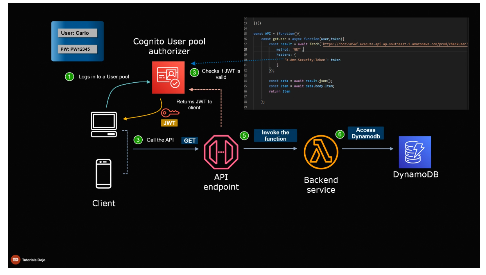
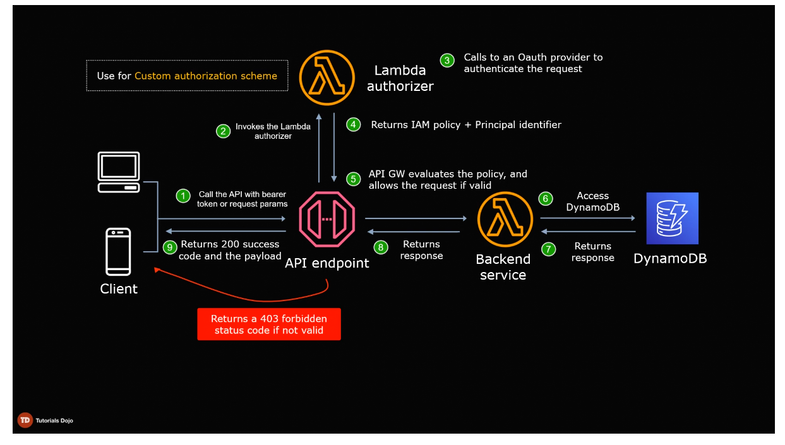

# API Gateway

API Management service that lets you create, publish, maintain, monitor and secure APIs at any scale.

Use Cases: 
1. Single point of entry for microservices, implementing Routing, Authorization, Rate-Limiting at one place instead of each service
2. Widely used in serverless architectures as APIU Gateway does not require any server management, especially with AWS Lambda
3. Modernize legacy application, e.g. API Gateway can translate between JSON and XML using mapping templates

## API Types

When creating an API, you can choose between: 
1. REST API
    - Gives you full access to API Gateway features like caching, creating API keys and usage plans
2. HTTP API
    - Cheap and designed for low latency apps
    - lacks other API Gateway features
3. WebSocket API 
    - Suitable for real-time apps

**Note**: API Gateway does not support unencrypted endpoints, e.g. HTTPS for REST and HTTP API, WSS for WebSockets

## Endpoint Types

We can choose from the following endpoint types:
1. Edge-optimized
    - requests are routed to the nearest CloudFront Point of Presence
    - best for geographically distributed clients
2. Regional
    - requests are routed in the same region where API is deployed
    - intended for clients in the same region
3. Private
    - APIs can only be accessed from a VPC using a VPC endpoint

## Lambda Proxy Integration

When choosing Lambda function as Integration type, there is an option to check "Use Lambda Proxy Integration".

By checking that option, requests will be proxied to Lambda with request details available in the `event` object of your handler function

If we uncheck it, we can write custom logic to discard certain information thus not passing it to our backend.

## CORS

CORS is disabled by default in API Gateway

## API Gateway Authorizer

Two methods for authorizing requests to an API endpoint

1. Congnito User Pool
2. Lambda Authorizer (a custom Lambda function, where we write our own authentication/authorization logic)

## Usage Plans

Usage plans allow us to restrict monthly/daily access to our APIs

We can enable Throttling with Rate of requests per second and Burst requests (max requests before a 429 too many requests is thrown)

We can enable monthly/daily/hourly quota for API calls

One we create a Usage plan, we associate it with an API Stage, and then an API Key

We can also sell our APIs on the Amazon SaaS marketplace