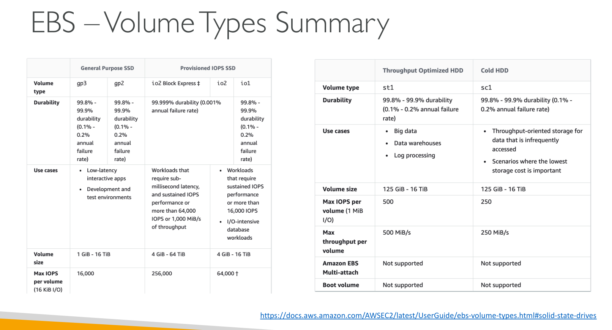
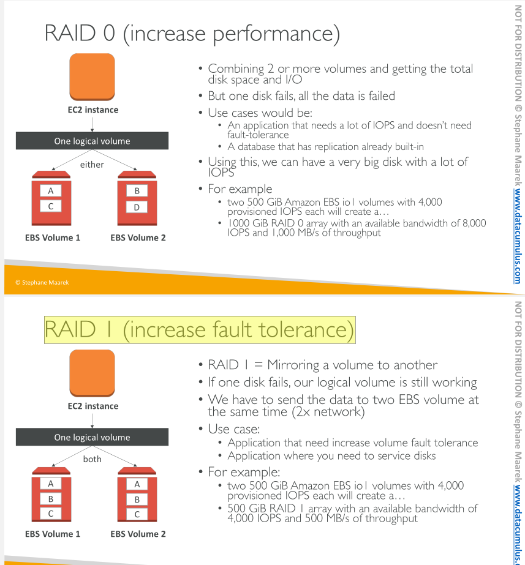

## EBS

Elastic Block store Volume is a network drive we can attach to EC2 instances

They can only be mounted to one instance at a time (multi attach is available)

They are bound to a specific Availability Zone 

### Snaphots

We can take backups/snapshots of our EBS volume at any point in time

We can copy those snapshots across regions or AZ

### EBS Volume Types

EBS Volumes come in 6 types
  - gp2 / gp3 (SSD): General purpose SSD volume that balances price and performance for a wide variety of workloads
  - io1 / io2 (SSD): Highest-performance SSD volume for mission-critical low-latency or high-throughput workloads
  - st1 (HDD): Low cost HDD volume designed for frequently accessed, throughput-intensive workloads
  - sc1 (HDD): Lowest cost HDD volume designed for less frequently accessed workloads

EBS Volumes are characterized in Size | Throughput | IOPS (I/O Ops Per Sec)

Only gp2/gp3 and io1/io2 can be used as boot volumes

### EBS Encryption 

When we create an encrypted EBS, we get 
  - Data at rest is encrypted inside the volume 
  - All the data in flight moving between the instance and the volume is encrypted 
  - All snapshots are encrypted 
  - All volumes created from the snapshot are encrypted

Encryption and decryption are handled transparently (you have nothing to do)

Encryption has a minimal impact on latency

EBS Encryption leverages keys from KMS (AES-256)

Copying an unencrypted snapshot allows encryption

Snapshots of encrypted volumes are encrypted

### EBS RAID options 

**RAID** ("Redundant Array of Inexpensive Disks" or "Redundant Array of Independent Disks") is a data storage virtualization technology that combines multiple physical disk drive components into one or more logical units for the purposes of data redundancy, performance improvement, or both.

EBS is already redundant storage (replicated within an AZ)

What if you want to mirror your EBS volumes?
  - You would mount volumes in parallel in RAID settings!

---

## EC2 Instance Store 

EBS are n/w drives with good but limited performance. 

If we need high performance hardware disk, use EC2 Instance Store. 

EC2 Instance Store 
    - have better I/O performance
    - lose their storage if they are stopped (Ephemeral)
    - Good for buffer / cache / scratch data / temporary content 
    - Risk of data loss if hardware fails 
    - Backups and replication are your responsibility

—
—

## EFS - Elastic File System

- Managed Network File System (NFS) that can be mounted on many EC2
- Highy Available
- scalable
- expensive (up to 3x gp2 price)
- pay per use

Use cases: content management, web serving, data sharing, Wordpress

Uses NFSv4.1 protocol

Uses security group to control access to EFS

Compatible with Linux based AMI (not Windows)

Encryption at rest using KMS

EFS Scale
- 1000s of concurrent NFS clients, 10 GB+ /s throughput
- Grow to Petabyte-scale network file system, automatically

—

## EBS vs EFS

| EBS                                                                                                                 | EFS                                                      |
|---------------------------------------------------------------------------------------------------------------------|----------------------------------------------------------|
| Can be attached to only one instance at a time                                                                      | Mounting 100s of instances across AZ                     |
| are locked at the AZ level                                                                                          | Only for Linux instances                                 |
| To migrate across AZ: take a snapshot, restore snapshot to another AZ, start an EBS using the snapshot              | EFS has a higher price point than EBS                    |
| Root EBS Volumes of instances get terminated by default if the EC2 instance gets terminated. (you can disable that) | Can leverage EFS-IA for cost savings (Infrequent Access) |
