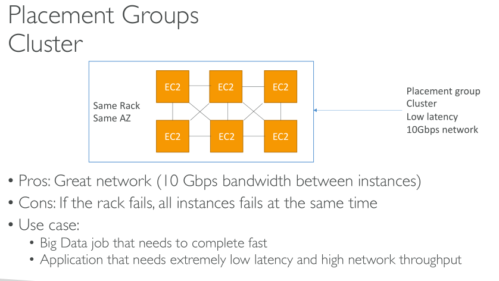

# EC2 - Elastic Compute Cloud 

EC2 is AWS's IaaS offering.

It is mainly used in combo of 
    - Renting Virtual Machines (EC2) 
    - Storing data on virtual drives (EBS)
    - Distributing loads across machines (ELB)
    - Scaling the services using an auto-scaling group (ASG)

### AMI

EC2 VMs are created using **Amazon Machine Images** (AMIs)

An AMI created for a region can only be seen in that region

### Instance MetaData & User Data Scripts

It is possible to bootstrap our instances using an EC2 User data script, that script is run only once at the instance's first start

EC2 User data is used to automate boot tasks such as 
    - Installing updates 
    - Installing software 
    - Downloading common files from the internet 
    - Anything you can think of

EC2 User Data Script runs with the root user

To retrieve user-data from within the instance: run `curl http://169.254.169.254/latest/user-data`

Instance Metadata provides details about the instance

To retrieve instance meta-data from within the instance: run `curl http://169.254.169.254/latest/meta-data`

### Instance types 

AWS has the following naming convention: 

`m5.2xlarge`

m: instance class 
5 : generation (AWS improves them over time)
2xlarge: size within the instance class

General Purpose - start with t
    - Balance b/w compute, memory and networking
Compute optimized - start with c
    - Batch processing workloads
    - Media transcoding
    - High performance web servers
    - High performance computing (HPC)
    - Scientific modeling & machine learning
    - Dedicated gaming servers
Memory Optimized - start with r
    - High performance SQL-noSQL DB
    - Distributed web scale cache stores 
Storage Optimized - start with i
    - High freq Online Transaction processing (OLTP) systems
    - SQL and no SQL DB
    - Caches (redis)
    - Data warehousing
    - distributed file systems

### Security groups 

Access to and from the EC2 instances is cotrolled using Security groups

Security groups are acting as a “firewall” on EC2 instances

They regulate:
    • Access to Ports
    • Authorised IP ranges – IPv4 and IPv6
    • Control of inbound network (from other to the instance)
    • Control of outbound network (from the instance to other)
    
- All inbound traffic is blocked by default
- All outbound traffic is authorised by default

Classic Ports to know
• 22 = SSH (Secure Shell) - log into a Linux instance
• 21 = FTP (File Transfer Protocol) – upload files into a file share
• 22 = SFTP (Secure File Transfer Protocol) – upload files using SSH
• 80 = HTTP – access unsecured websites
• 443 = HTTPS – access secured websites
• 3389 = RDP (Remote Desktop Protocol) – log into a Windows instance

### EC2 instances purchasing options

- On-Demand Instances: short workload, predictable pricing
- Reserved: (1 or 3 year reservations) - upto 72% discount compared to on-demand
    - Reserved Instances: long workloads
    - Convertible Reserved Instances: long workloads with flexible instances
    - Scheduled Reserved Instances: example – every Thursday between 3 and 6 pm
- Spot Instances: short workloads, cheap, can lose instances (less reliable), going to the highest bidder 
    - upto 90% discount
    - not suitable for critical jobs or DBs
- Dedicated Hosts: book an entire physical server, control instance placement 
    - 3 year period reservation
    - Useful for software that have complicated licensing model.
- Dedicated Instances: no other customers will share your hardware
- Capacity Reservations - reserve capacity in a specific AZ for any duration

### Elastic IPs 

- When you stop and then start an EC2 instance, it can change its public IP.
- If you need to have a fixed public IP for your instance, you need an Elastic IP
- An Elastic IP is a public IPv4 IP you own as long as you don’t delete it
- You can attach it to one instance at a time

Overall, try to avoid using Elastic IP:
• They often reflect poor architectural decisions
• Instead, use a random public IP and register a DNS name to it
• Or, as we’ll see later, use a Load Balancer and don’t use a public IP

### EC2 Spot Instance Requests

- Can get a discount of up to 90% compared to On-demand
- Define max spot price and get the instance while current spot price < max
    • The hourly spot price varies based on offer and capacity
    • If the current spot price > your max price you can choose to stop or terminate your instance with a 2 minutes grace period.
- Other strategy: Spot Block
    • “block” spot instance during a specified time frame (1 to 6 hours) without interruptions
    • In rare situations, the instance may be reclaimed
    

A Spot Instance request can be in one of the following states:

* `open`– The request is waiting to be fulfilled.
    
* `active`– The request is fulfilled and has an associated Spot Instance.
    
* `failed`– The request has one or more bad parameters.
    
* `closed`– The Spot Instance was interrupted or terminated.
    
* `disabled`– You stopped the Spot Instance.
    
* `cancelled`– You canceled the request, or the request expired.

A one-time Spot Instance request remains active until Amazon EC2 launches the Spot Instance, the request expires, or you cancel the request. If the Spot price exceeds your maximum price or capacity is not available, your Spot Instance is terminated and the Spot Instance request is closed.

A persistent Spot Instance request remains active until it expires or you cancel it, even if the request is fulfilled. If the Spot price exceeds your maximum price or capacity is not available, your Spot Instance is interrupted. After your instance is interrupted, when your maximum price exceeds the Spot price or capacity becomes available again, the Spot Instance is started if stopped or resumed if hibernated.
- You can stop a Spot Instance and start it again if capacity is available and your maximum price exceeds the current Spot price. If the Spot Instance is terminated (irrespective of whether the Spot Instance is in a stopped or running state), the Spot Instance request is opened again and Amazon EC2 launches a new Spot Instance.

#### Spot Fleets

Spot Fleets = set of Spot Instances + (optional) On-Demand Instances that is launched based on criteria that you specify.

Spot Fleets allow us to automatically request Spot Instances with the lowest price

• The Spot Fleet will try to meet the target capacity with price constraints

### Placement groups

When you launch a new EC2 instance, the EC2 service attempts to place the instance in such a way that all of your instances are spread out across underlying hardware to minimize correlated failures. You can use_placement groups_to influence the placement of a group of_interdependent_instances to meet the needs of your workload.

Depending on the type of workload, you can create a placement group using one of the following placement strategies:

* _Cluster_– packs instances close together inside an Availability Zone. This strategy enables workloads to achieve the low-latency network performance necessary for tightly-coupled node-to-node communication that is typical of HPC applications.
    
* _Partition_– spreads your instances across logical partitions such that groups of instances in one partition do not share the underlying hardware with groups of instances in different partitions. This strategy is typically used by large distributed and replicated workloads, such as Hadoop, Cassandra, and Kafka.
    
* _Spread_– strictly places a small group of instances across distinct underlying hardware to reduce correlated failures.
    

There is no charge for creating a placement group.

### Elastic Network Interfaces (ENI)

Logical component in a VPC that represents a virtual network card

The ENI can have the following attributes:
    • Primary private IPv4, one or more secondary IPv4
    • One Elastic IP (IPv4) per private IPv4
    • One Public IPv4
    • One or more security groups
    • A MAC address

You can create ENI independently and attach them on the fly (move them) on EC2 instances for failover

Bound to a specific availability zone (AZ)

### EC2 Hibernate

The in-memory (RAM) state is preserved

The instance boot is much faster! (the OS is not stopped / restarted)

Under the hood: the RAM state is written to a file in the root EBS volume

The root EBS volume must be encrypted

### EC2 Nitro 

- Underlying Platform for the next generation of EC2 instances
- New virtualization technology
- Allows for better performance:
- Better networking options (enhanced networking, HPC, IPv6)
- Higher Speed EBS (Nitro is necessary for 64,000 EBS IOPS – max 32,000 on non-Nitro)
- Better underlying security

### Scheduled Reserved Instances 

With Scheduled Reserved Instances, you can reserve capacity that is scheduled to recur daily, weekly, or monthly, with a specified start time and duration, for a one-year term. After you complete your purchase, the instances are available to launch during the time windows that you specified.
