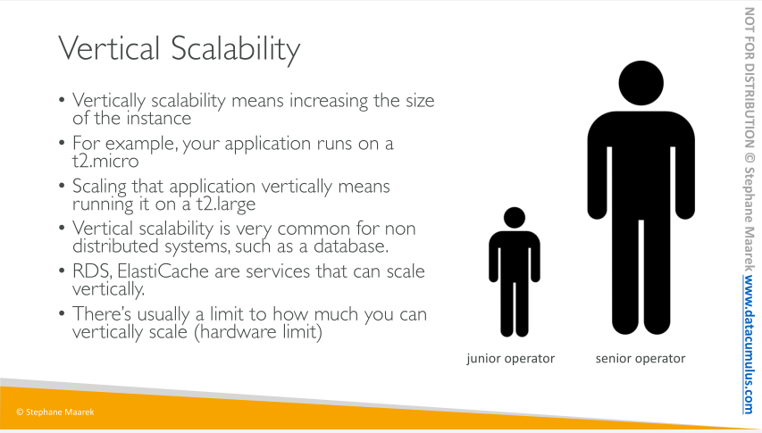
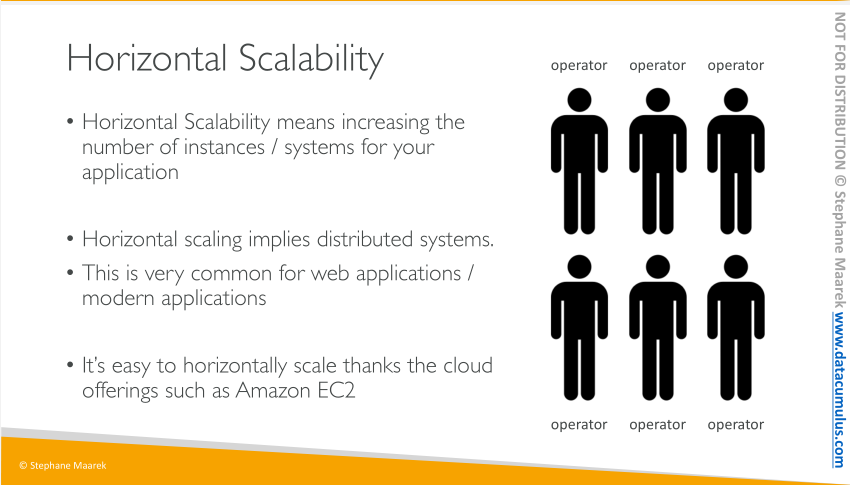
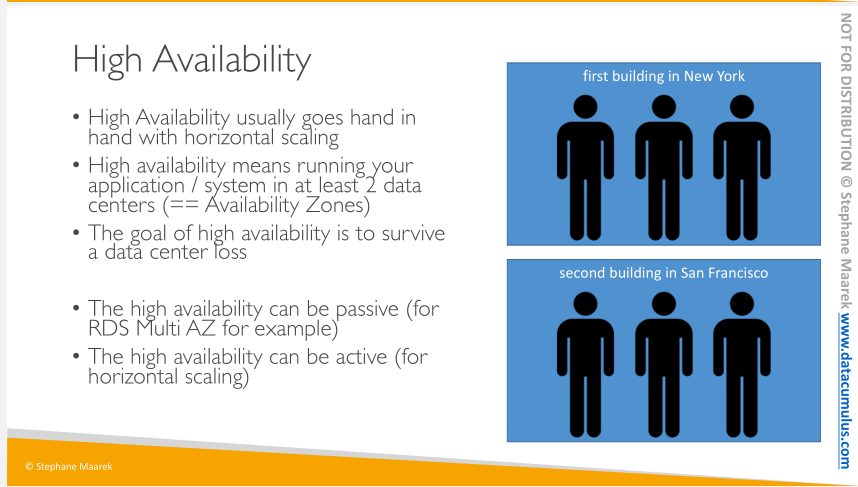
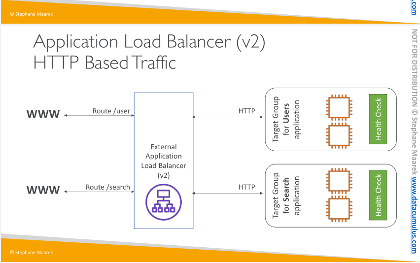
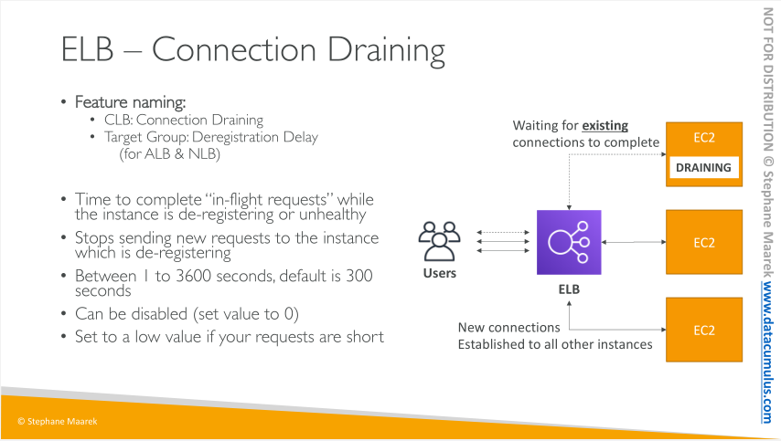

# Load Balancer

Load Balancers provide a static DNS name we can use in our application (the reason being that AWS wants your load balancer to be accessible using a static endpoint, even if the underlying infrastructure that AWS manages changes).

## Scalability & High Availability 

Scalability means that an application / system can handle greater loads by adapting.

• There are two kinds of scalability:
    • Vertical Scalability
    • Horizontal Scalability (= elasticity)
• Scalability is linked but different to High Availability

## Load Balancers 

Load balancers are servers that forward internet traffic to multiple servers (EC2 Instances) downstream.

Why use a load balancer?
• Spread load across multiple downstream instances
• Expose a single point of access (DNS) to your application
• Seamlessly handle failures of downstream instances
• Do regular health checks to your instances
• Provide SSL termination (HTTPS) for your websites
• Enforce stickiness with cookies
• High availability across zones
• Separate public traffic from private traffic

### EC2 Load Balancer 

An ELB (EC2 Load Balancer) is a **managed load balancer**
• AWS guarantees that it will be working
• AWS takes care of upgrades, maintenance, high availability
• AWS provides only a few configuration knobs

It costs less to setup your own load balancer but it will be a lot more effort on your end.

It is integrated with many AWS offerings / services

### Health Checks

Health Checks are crucial for Load Balancers

They enable the load balancer to know if instances it forwards traffic to are available to reply to requests

The health check is done on a port and a route (/health is common)

If the response is not 200 (OK), then the instance is unhealthy

### Types of Load Balancers on AWS

AWS has 3 kinds of managed Load Balancers
1. Classic Load Balancer (v1 - old generation) – 2009
    • HTTP, HTTPS, TCP
2. Application Load Balancer (v2 - new generation) – 2016
    • HTTP, HTTPS, WebSocket
3. Network Load Balancer (v2 - new generation) – 2017
    - TCP, TLS (secure TCP) & UDP
    - Provide the highest performance if the application needs it, eg (You are designing a high performance application that will require millions of connections to be handled, as well as low latency.)

Overall, it is recommended to use the newer / v2 generation load balancers as they provide more features

You can setup internal (private) or external (public) ELBs

**Network Load Balancers expose a public static IP, whereas an Application or Classic Load Balancer exposes a static DNS (URL)**

### Good to know stuff about LBs

LBs can scale but not instantaneously – contact AWS for a “warm-up”

• Troubleshooting
    • 4xx errors are client induced errors
    • 5xx errors are application induced errors
    • Load Balancer Errors 503 means at capacity or no registered target
    • If the LB can’t connect to your application, check your security groups!
• Monitoring
    • ELB access logs will log all access requests (so you can debug per request)
    • CloudWatch Metrics will give you aggregate statistics (ex: connections count)
    
Application Load balancers can route to different target groups based on 
    - Hostname 
    - Request Path 
    - Source IP
        but NOT Geography
    

### Application Load Balancers

Application load balancers is Layer 7 (HTTP)

- Load balancing to multiple HTTP applications across machines (target groups)
- Load balancing to multiple applications on the same machine (ex: containers)
- Support for HTTP/2 and WebSocket
- Support redirects (from HTTP to HTTPS for example)

ALB are a great fit for micro services & container-based application (example: Docker & Amazon ECS)

Has a port mapping feature to redirect to a dynamic port in ECS

The application servers don’t see the IP of the client directly
• The true IP of the client is inserted in the header X-Forwarded-For
• We can also get Port (X-Forwarded-Port) and proto (X-Forwarded-Proto)

### Load Balancer Stickiness

It is possible to implement stickiness so that the same client is always redirected to the same instance behind a load balancer

• This works for Classic Load Balancers & Application Load Balancers

• The “cookie” used for stickiness has an expiration date you control
• Use case: make sure the user doesn’t lose his session data, so that when users go to a different route they are not logged out.
• Enabling stickiness may bring imbalance to the load over the backend EC2 instances

### SSL/TLS

An SSL Certificate allows traffic between your clients and your load balancer to be encrypted in transit (in-flight encryption)

- The load balancer uses an X.509 certificate (SSL/TLS server certificate)
- You can manage certificates using ACM (AWS Certificate Manager)
- You can create upload your own certificates alternatively

#### SSL – Server Name Indication (SNI)

SNI solves the problem of loading multiple SSL certificates onto one web server (to serve
multiple websites)

It’s a “newer” protocol, and requires the client to indicate the hostname of the target server in the initial SSL handshake

The server will then find the correct certificate, or return the default one

Note:
• Only works for ALB & NLB (newer generation), CloudFront
• Does not work for CLB (older gen)

Application Load Balancer (v2) & Network Load Balancer both
• Supports multiple listeners with multiple SSL certificates (Classic LB only supports one SSL cert)
• Uses Server Name Indication (SNI) to make it work

### ELB - Connection Draining

