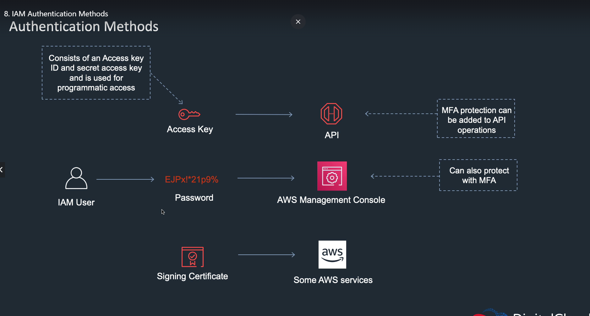
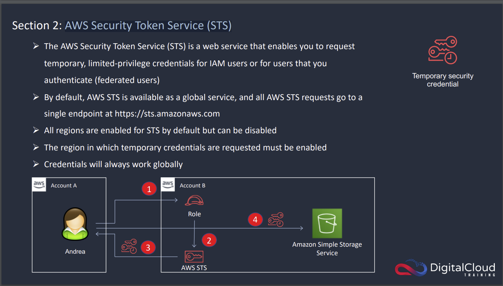

# Identity and Access Management 

## User

A user is an entity that represents a person or a service. 

A group is a collection of users and have policies attached to them. 

Roles are "assumed" by the trusted entities and can be used for delegation.

## Users, Groups and Permissions

There is only one root user. It is recommended to NOT use the root user unless absolutely necessary.

It is recommended to create separate Users and split them into Groups. 

Permissions can both be assigned directly to a User, or they can be assigned to a Group.

With Permissions, use the Least Previlige rule.

## IAM Policies 

An IAM policy is an entity that, when attached to an identity or resource, defines their permissions.

They are defined as JSON document to define Users, Groups, Roles or Permissions.

## Roles 

an IAM entity that defines a set of Permissions for making AWS service requests, that will be used by AWS services. E.g. a Role specific to a Lambda function to access and read-only certain resources.

## IAM Security Tools - IAM Credentials Report & IAM Access Advisors

IAM Credentials report lists all your account's users and the status of their various credentials. The other IAM Security Tool is IAM Access Advisor. It shows the service permissions granted to a user and when those services were last accessed.

## IAM Authentication methods

## AWS Security Token Service (STS)

