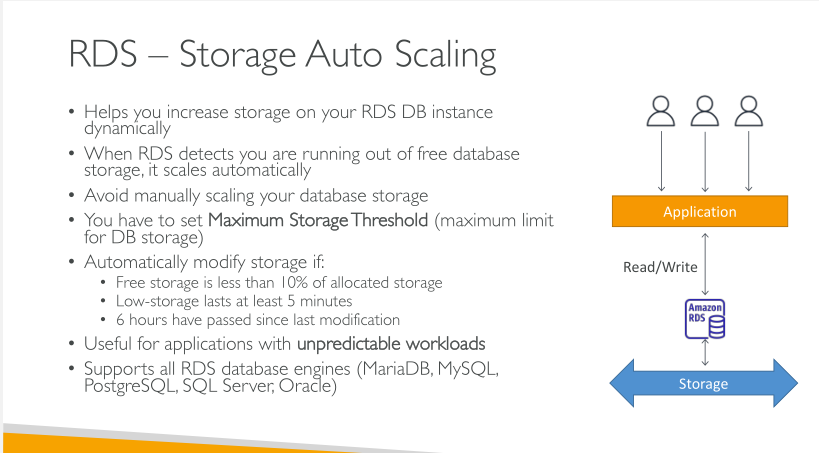
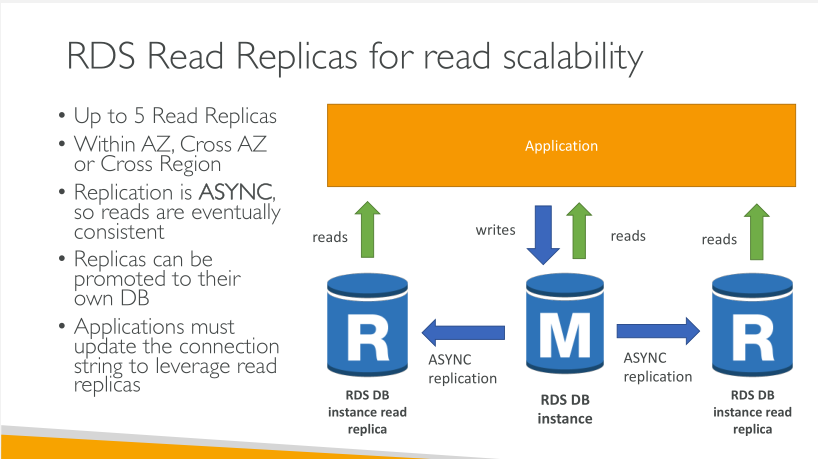
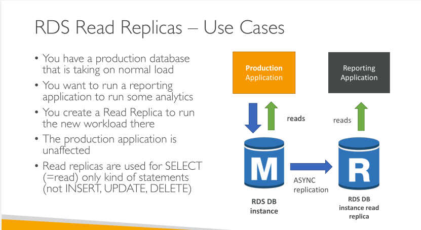
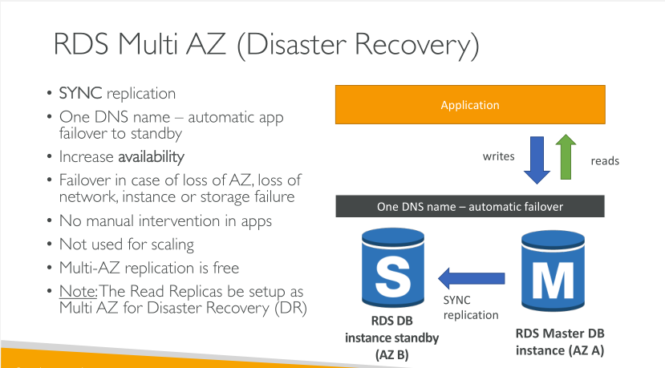

# RDS

- stands for Relational Database

- It's a managed DB service for DB which use SQL as a query language
- It allows us to create dbs in the cloub managed by AWS 
    - Postgres
    - MySql 
    - MariaDB
    - Oracle 
    - MS SQL Server
    - Aurora (AWS Proprietery db)
    
### Advantage over using RDS versus deploying DB on EC2 

• RDS is a managed service:
    • Automated provisioning, OS patching
    • Continuous backups and restore to specific timestamp (Point in Time Restore)!
    • Monitoring dashboards
    • Read replicas for improved read performance
    • Multi AZ setup for DR (Disaster Recovery)
    • Maintenance windows for upgrades
    • Scaling capability (vertical and horizontal)
    • Storage backed by EBS (gp2 or io1)
• BUT you can’t SSH into your instances

Backups are auto enabled in RDS. 
• Daily full backup of the database (during the maintenance window)
• Transaction logs are backed-up by RDS every 5 minutes
• => ability to restore to any point in time (from oldest backup to 5 minutes ago)
• 7 days retention (can be increased to 35 days)

### RDS - Storage Auto Scaling 

### RDS - Read Replicas (RR) for read scalability

### RDS Multi AZ (Disaster Recovery)

NOTE: 

Multi AZ keeps the same connection string regardless of which database is up. Read Replicas imply we need to reference them individually in our application as each read replica will have its own DNS name

Multi AZ ensures Availability, while Read Replicas ensure Scalability.

## RDS Security - Encryption 

At rest encryption
- Possible to encrypt the master and RRs with AWS KMS - AES-256 encryption
- If the master is not encrypted, RRs cannot be encrypted

In-flight encryption
- SSL certs to encrypt data to RDS in flight 

### RDS Security - Network & IAM 

Network Security 
- RDS DBs are usually deployed within a private subnet, not in a public one
- RDS security works by leveraging Security Groups.

Access Management 
- IAM policies help control who can manage AWS RDS (through the RDS API)
- Traditional username and password can be used to login into the db 
- IAM based Auth can be used to login to RDS MySQL & Postgres

