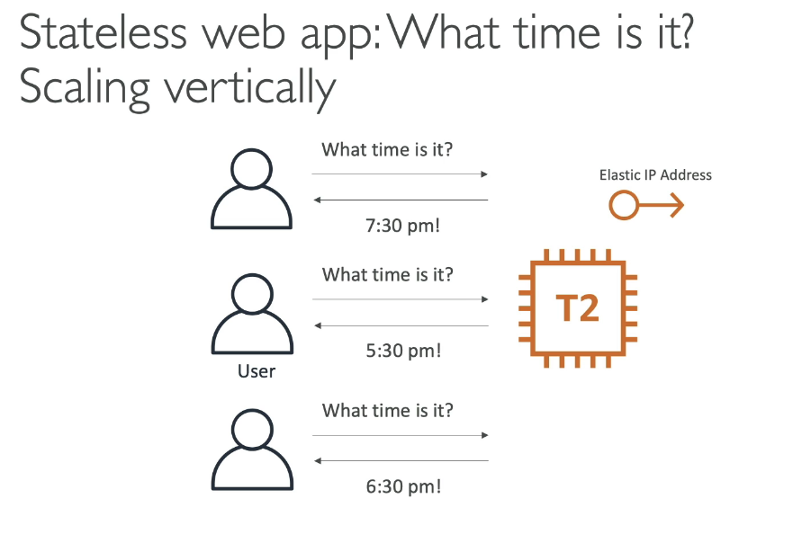
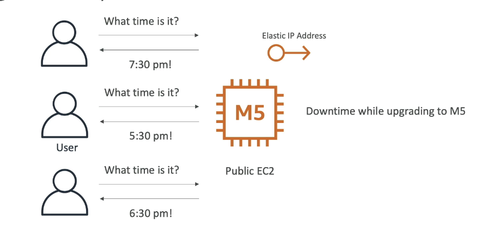
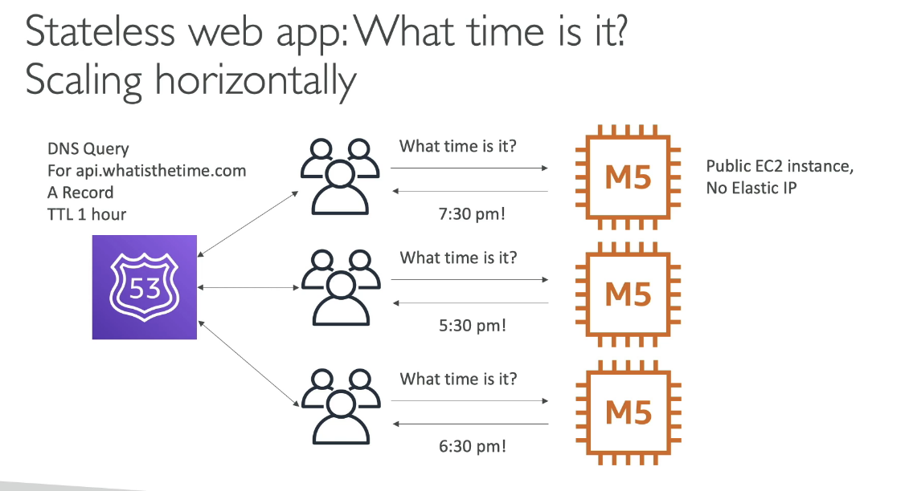
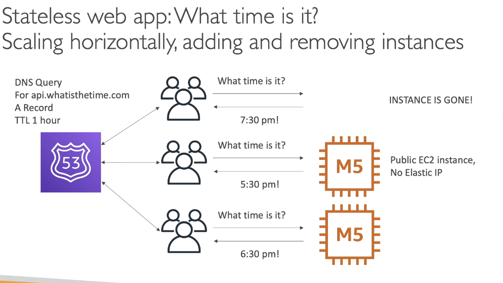
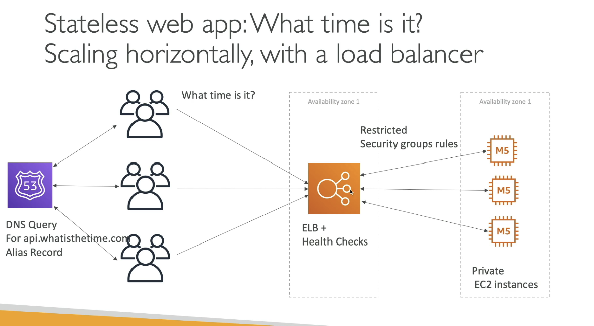
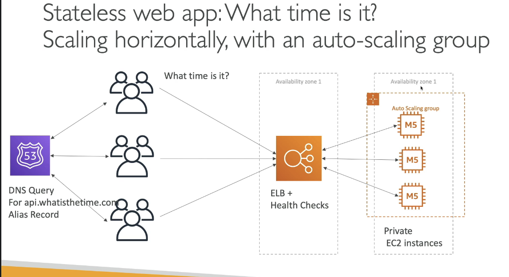
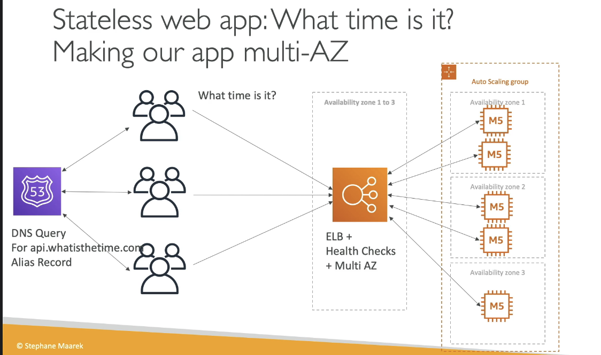
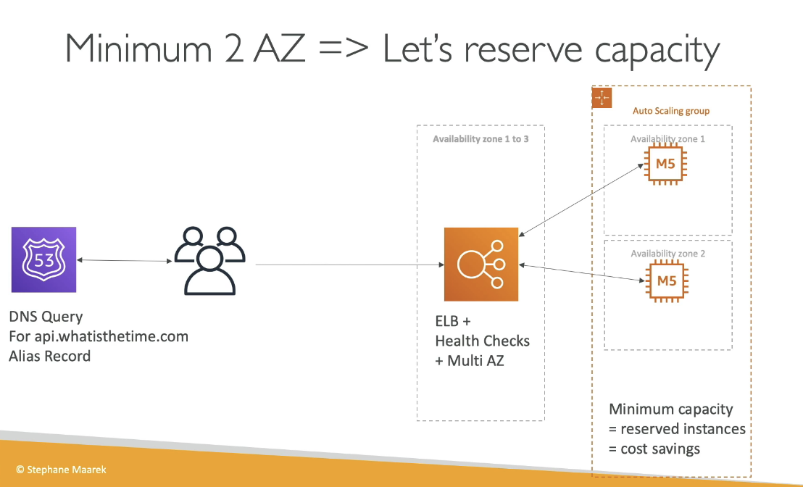

Remember 5 pillars of good architecture:
1. Costs
2. Performance
3. Reliability
4. Security
5. Operational Excellence

# Desiging WhatsTheTime.com

Scenario:
- allows people to know what time it is
- We don't need a DB
- We want to start small and can accept downtime
- We eventually want to scale fully, no downtime

## Solution

1. Start

Single t2.micro instance with Elastic IP

First step we can do is to upgrade to a Bigger instance (M5), but there is a downtime while upgrading

    
  
  
  
  
  
  
  
 
 Instead of allowing users to connect directly to instances and risk breaking for some of them when an instance is down, we can front our instances by an ALB. 
 
 **Note**: When using an ALB we cannot use an A record, rather we have to use an Alias record to point our URL to ALB's DNS name
 
 
 
 
 In the above diagram, 1 problem is that we have to add/remove instances manually. 
 
 Solution is to add an Auto-scaling group
 
 
 
 
 To achieve High Availability, we enable Multi AZ on the ALB and ASG
 
 
 
 
 We can also save on costs by using reserved instances
 
 
 