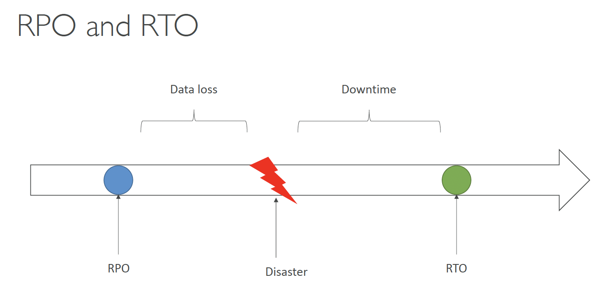
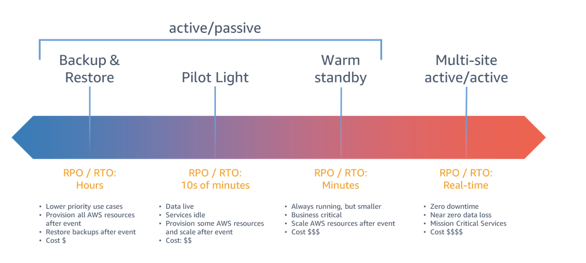
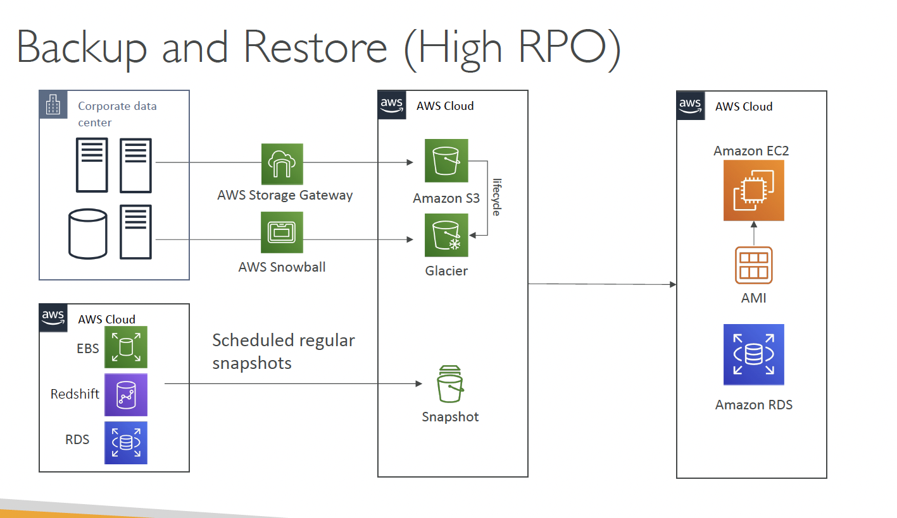
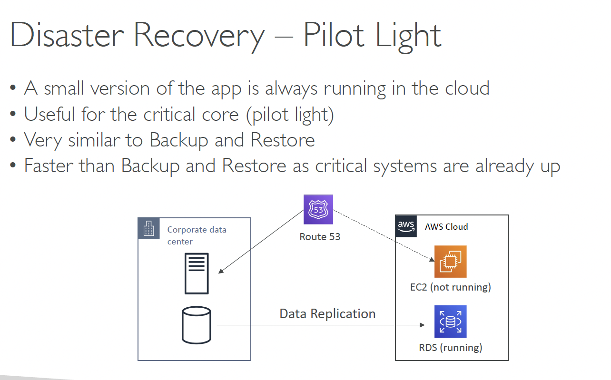
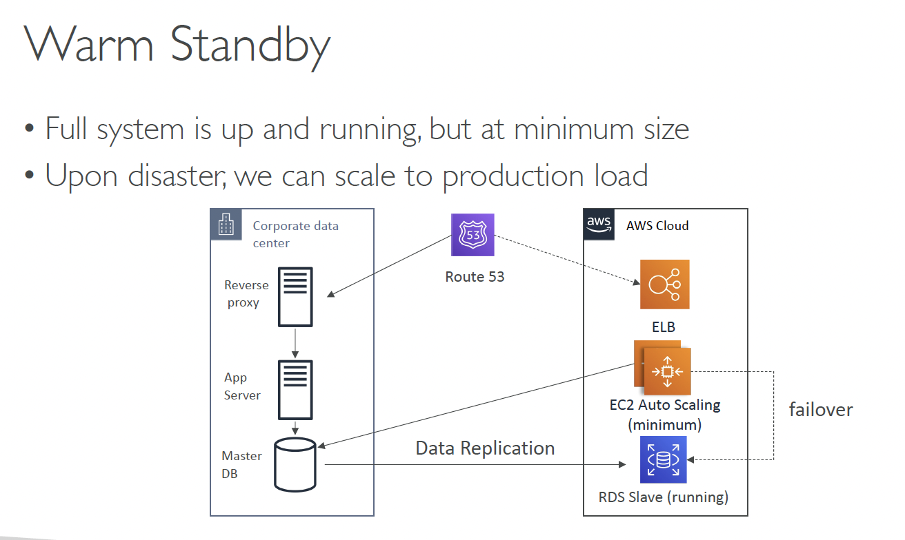
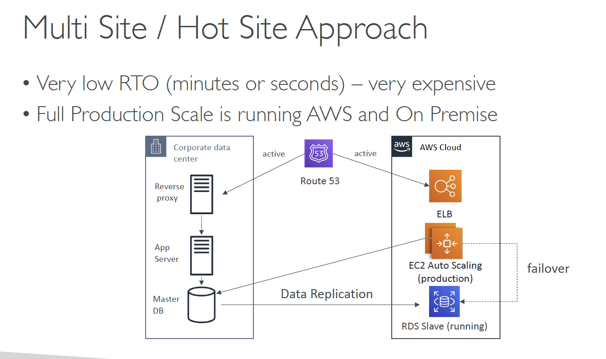
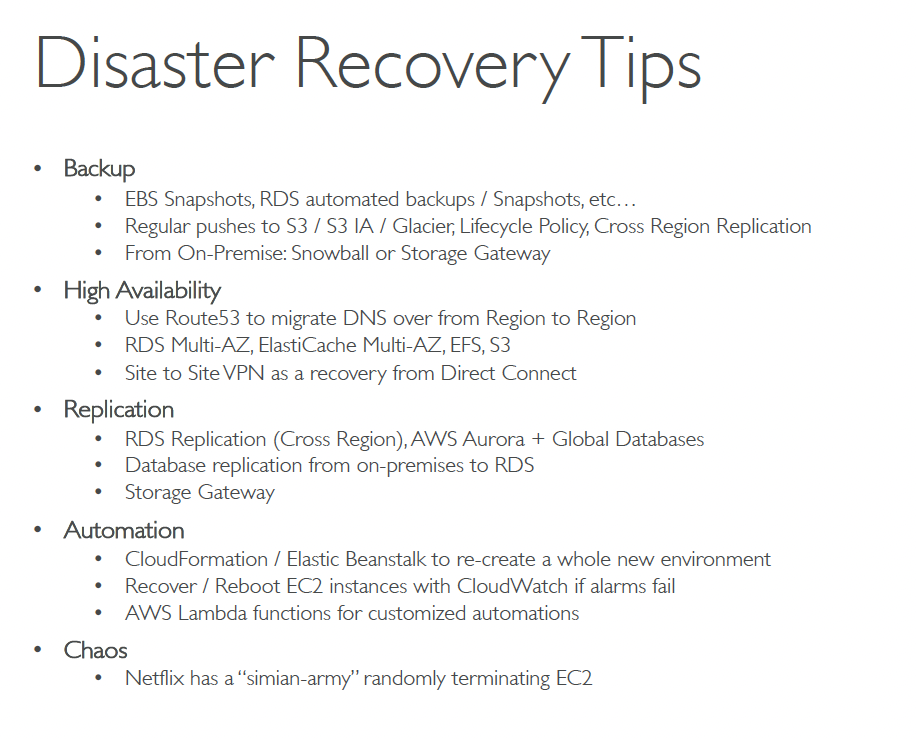
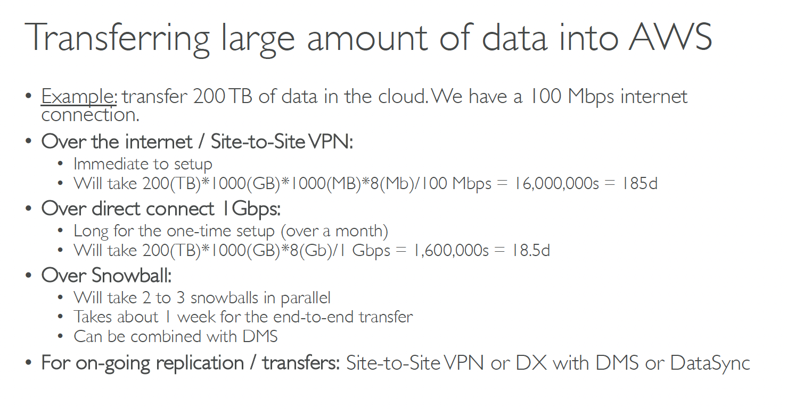

# Disaster Recovery in AWS

## RPO & RTO

**Recovery Point Objective (RPO)** is a measure of how frequently you take backups. If a disaster occurs between backups, can you afford to lose five minutes’ worth of data updates? Or five hours? Or a full day? RPO represents how fresh recovered data will be. In practice, the RPO indicates the amount of data (updated or created) that will be lost or need to be reentered after an outage.

**Recovery Time Objective (RTO) **is the amount of downtime a business can tolerate. In a high-frequency transaction environment, seconds of being offline can represent thousands of dollars in lost revenue, while other systems (such as HR databases) can be down for hours without adversely impacting the business. The RTO answers the question, “How long can it take for our system to recover after we were notified of a business disruption?”

## Disaster Recovery Strategies

1. Backup And Restore
2. Pilot Light
3. Warm Standby
4. Hot Site / Multi Site Approach

### Backup & Restore

We take regular backups of our on-prem data, (e.g. every 24 hours), thus high RPO (meaning more data loss till recovery), and high RTO (will take time to restore all the backups)

### Pilot Light

### Warm Standby

### Multi-site / Hot site approach

## Disaster Recovery Tips

---

# Transferring large amounts of data into AWS

