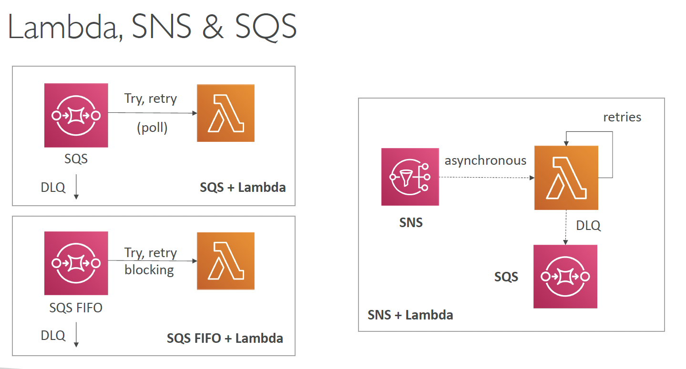

# Event Processing in AWS

## Lambda, SNS & SQS

1. SQS + Lambda
    - Lambda pulls the SQS queue
    - Lambda retries failed messages, and after multiple tries (e.g. 5), sends it to DLQ (Dead Letter Queue)
2. SQS Fifo + Lambda
    - Messages will be processed in order
    - Without DLQ, there is a risk of a failed message blocking the whole queue
3. SNS + Lambda
    - Message sent async to Lambda
    - because of async, DLQ needs to be set up on the Lambda side (rather than SNS)

## Fan out Patterns

## S3 Event Notifications

## S3 Event Notifications using EventBridge

## Amazon EventBridge - Alert on API Calls

