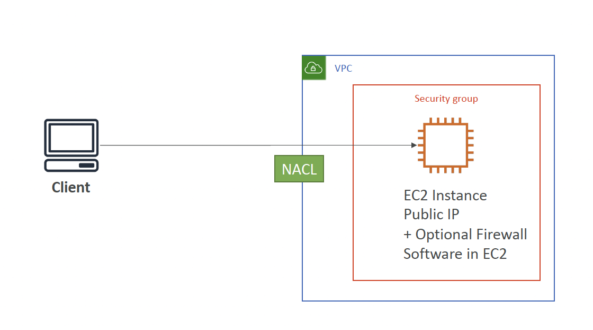
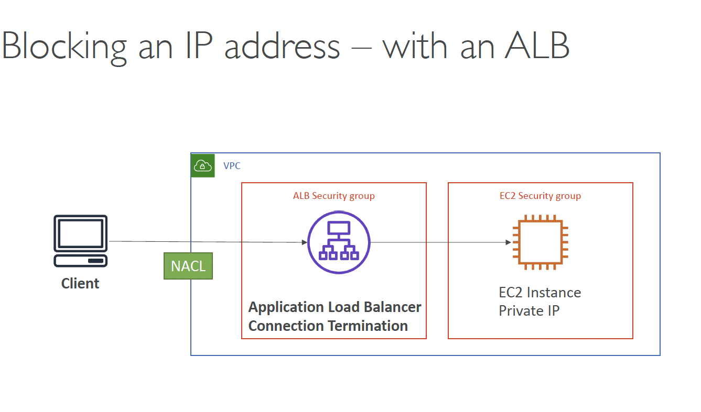
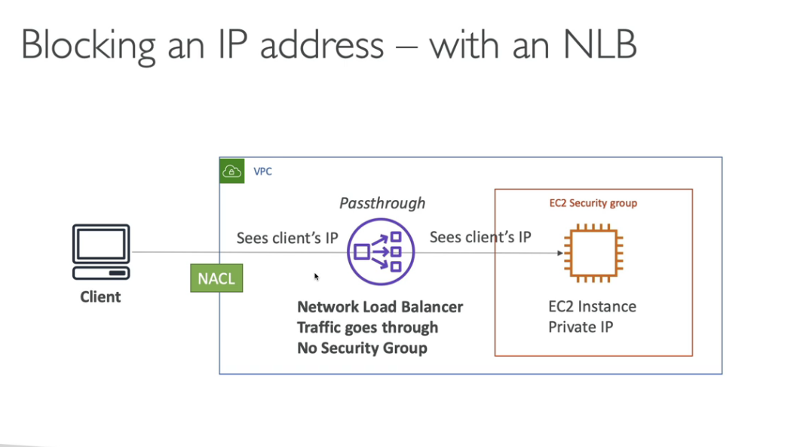
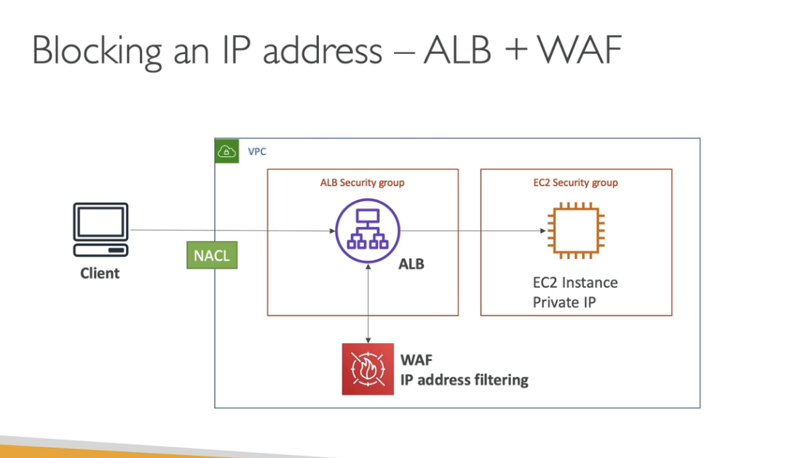
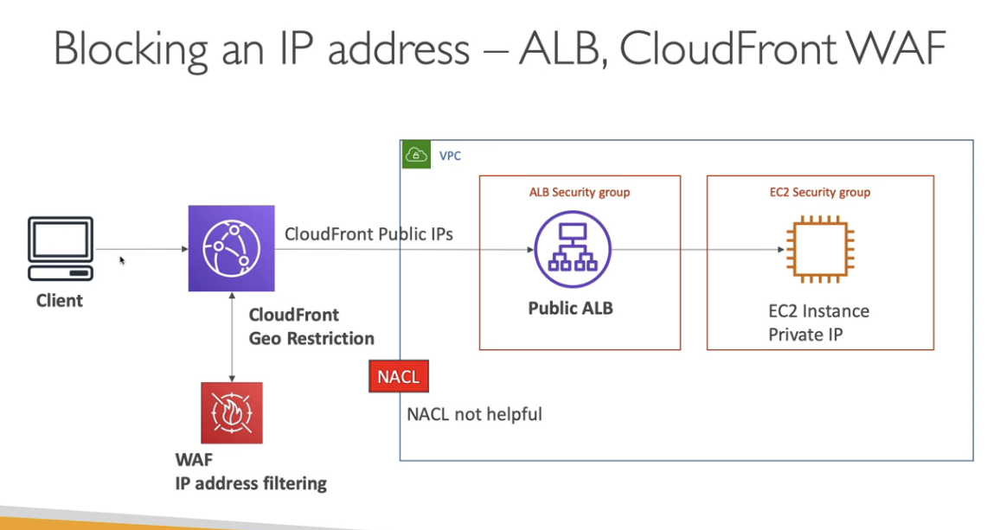

# Blocking an IP Address

In the above diagram, blocking can happen at either NACL or the Software Firewall in EC2
- SG do not have DENY rules thus no blocking at SG level

With an ALB, we can only block at NACL level
- Since instances are behind ALB and they do not directly see client ip
- We can block with Ec2 firewall as well 

NLB does not have Security Groups, thus traffic goes through them

Again, blocking at NACL level

ALB + WAF can be used to block IPs

Withh ALB + CloudFront, we must use either Geo-Restriction or WAF, NACL is no longer able to block IPs since it only sees cloudFront IP rather than client's