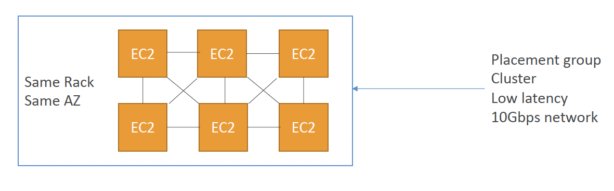

# High Performance Computing

- The cloud is the perfect place for HPC
- You can create a very high number of resources in no time
- You can speed up time to results by adding more resources
- You can pay only for the systems you have used

HPC includes:
- genomics
- Computational Chemistry
- Financial Rist Modelling
- Weather Prediction
- ML
- Deep Learning
- Autonomous Driving

## Services which help perform HPC

### Data Mgmt and Transfer

1. AWS Direct Connect
    - Move Gb/s of data to the cloud, over a private secure n/w
2. Snowball and Snowmobile
    - Move PB of data to the cloud
3. AWS DataSync
    - Move large amount of data b/w on=pre and S3, EFS, FSx for Windows

### Compute & Networking

1. EC2 Instances
    - CPU optimized, GPU Optimized
    - Spot instances / Splot fleets for cost savings
    - Auto Scaling
2. EC2 Placement Groups: **Cluster** for good n/w performance

3. Ec2 Enhanced Networking (SR-IOV)
    - Higher b/w, higher PPS (packets per second), lower latency
    - Option 1
        - Elastic Network Adapter (ENA) up to 100 Gbps
    - Option 2
        - Intel 82599VF up to 10 Gbps - LEGACY

4. Elastic Fiber Adapter (EFA)
    - Improved ENA for HPC, works only for Linux
    - Great for inter-node comms, tightly coupled workloads
    - Leverages Message Passing Interface (MPI) standard
    - Bypasses the underlying Linux OS to provide low-latency, reliable transport

### Storage

1. Instance-attaced Storage
    - EBS: scale up to 256k IOPs with io2 Block Express
    - Instance Store: scale to millions of IOPs, linked to EC2 instance, low latency

2. Network Storage
    - Amazon S3: large blob, not a file system
    - Amazon EFS: scale IOPs based on total size, or use privisioned IOPs
    - Amazon FSx for Lustre:
        - HPC optimized distributed FS, millions of IOPs
        - Backed by S3

### Automation and Orchestration
1. AWS Batch
    - supports multi-node parallel jobs, which enables you to run single jobs that span multiple EC2 instances
    - Easily schedule jobs and launch EC2 instance accordingly
2. AWS ParallelCluster
    - Open-source cluster mgmt tool to deploy HPC on AWS
    - Configure with text files
    - Auto creation of VPC, Subnet, cluster type and instance types
    - **Ability to enable EFA on the cluster (improves n/w performace)**