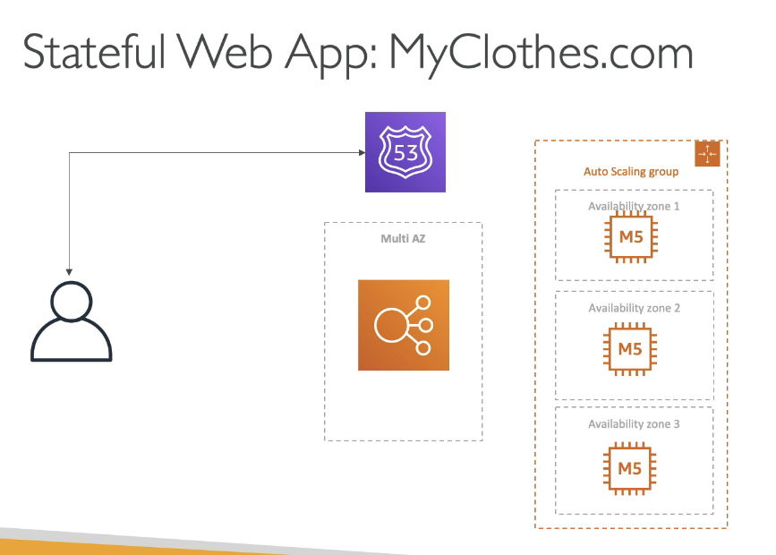
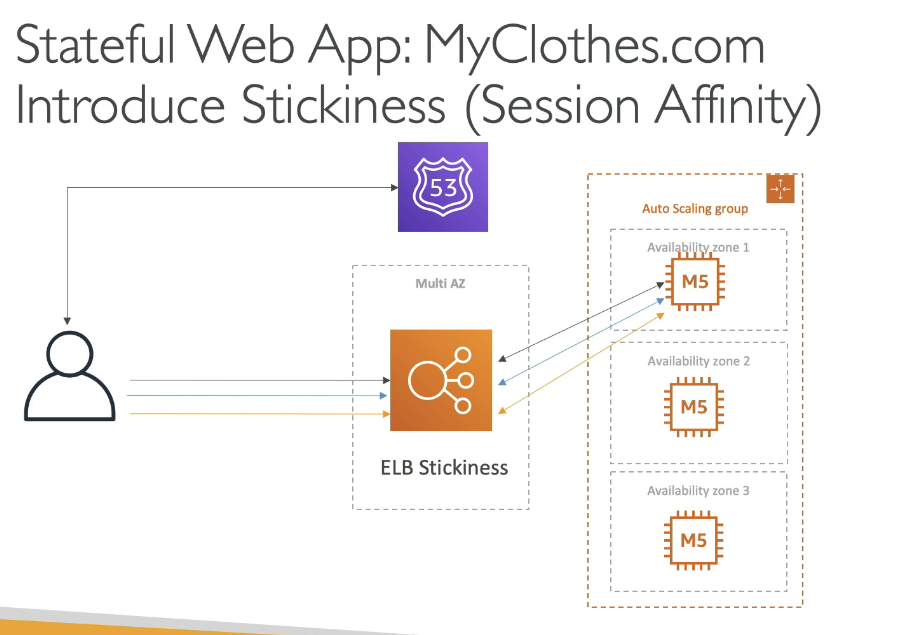
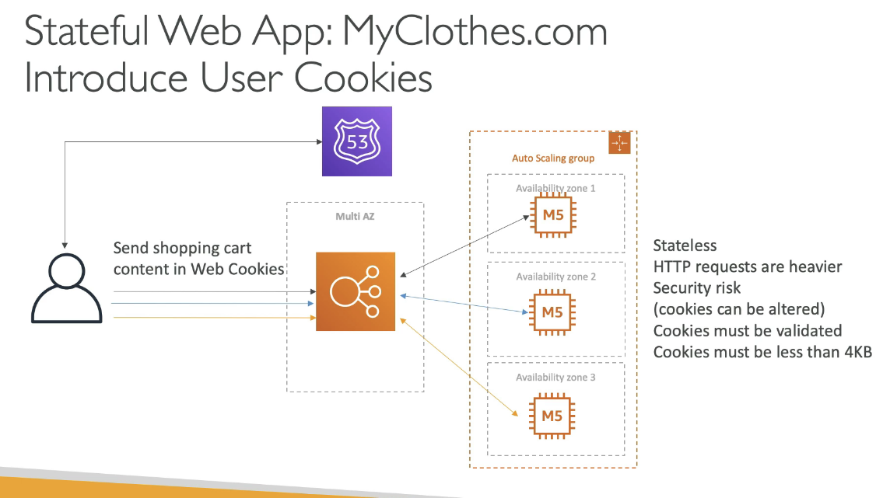
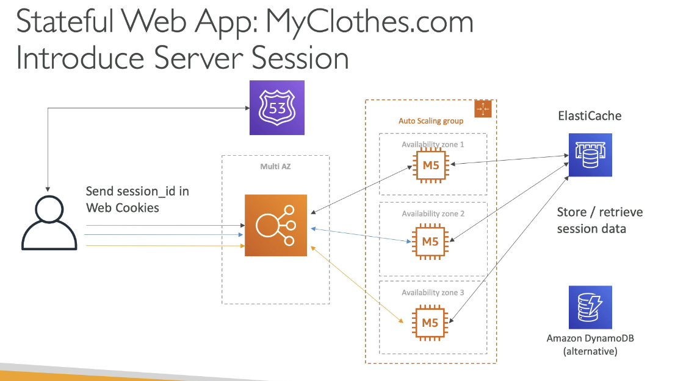
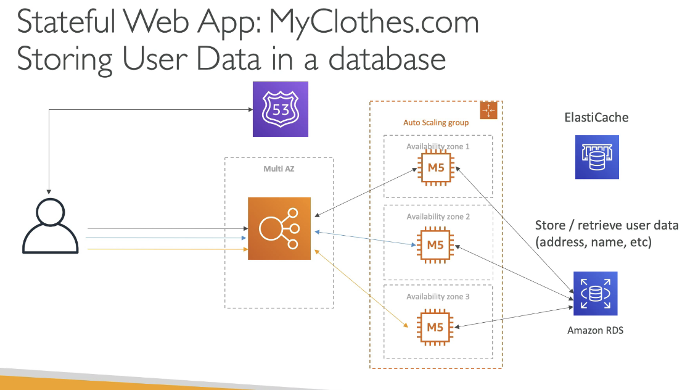
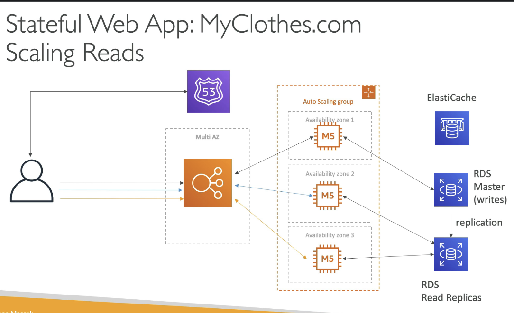
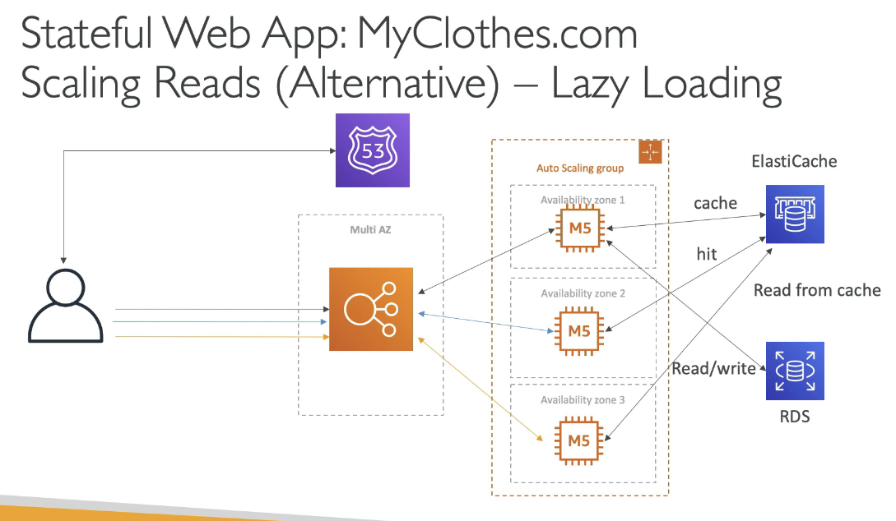
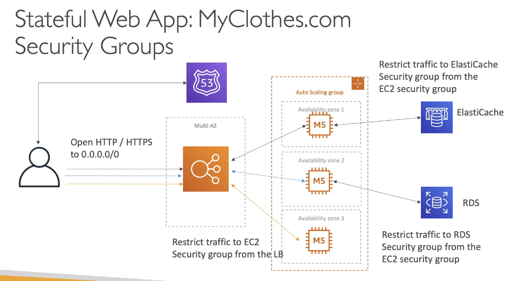

# Designing MyClothes.com

- MyClothes.com allows people to buy clothes online
- There's a shopping cart
- Our website is having hundreds of users at a time
- We need to scale, maintain horizontal scalability and keep our web app as stateless as possible
- Users should not lose their shopping carts
- Users should have their details (address etc) in a DB

## Solution

Start

Introduce stateful sessions using Stickiness (Session affinity), an ALB feature

Another way to keep state is to keep it in user cookies

Instead we can use a `session_id` in cookies, and then use ElastiCache or DynamoDB to store user's cart

We could also use Amazon RDS to store user info

We can scale reads with Read replicas

Alternative - lazy loading i.e. check data in cache first

We can use MultiAZ feature and Security groups for Disaster Recover and Security respectively

