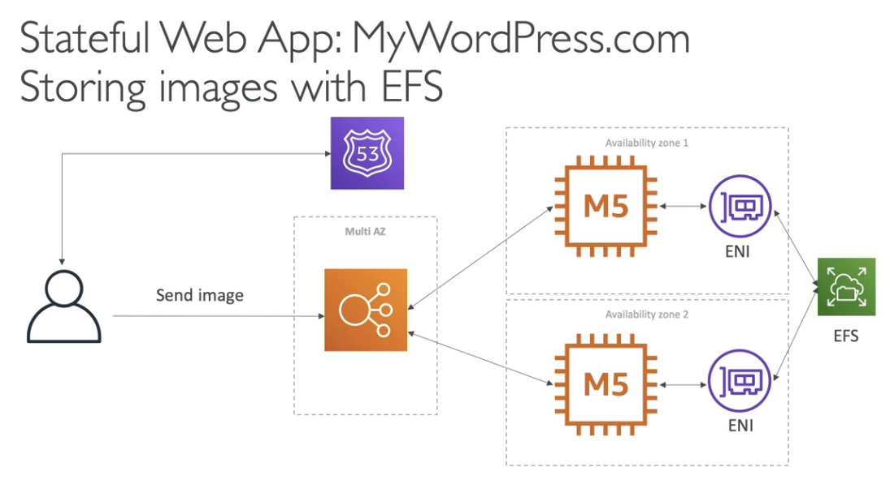

# MyWordPress.com

- We are trying to create a fully scalable WordPress website
- We want that website to access and correctly display picture uploads
- Our user data, and the blog content should be stored in a MySQL DB

## Solution

We can also use an EFS (Elastic File Storage), and not EBS (instance specific storage) to store files

