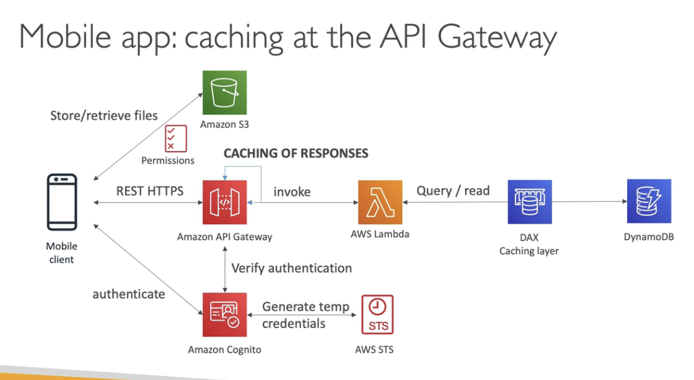

# Design MyTodoList

- A Mobile app
- Serverless
- Users should be able to directly interact with their own S3 folder
- Users should authenticate through a managed serverless service
- The users can write and read to-dos, but they mostly read them
- The DB should scale, and have some high read throughput

## Solution

AWS STS (Security Token Service) that enables you to request temporary, limited-privilege creds for users

Using Cognito to generate temporary creds with STS to access S3 bucket with restricted policy.

We can cache REST requests at API Gateway layer

We can cache the reads on DynamoDB using DAX

