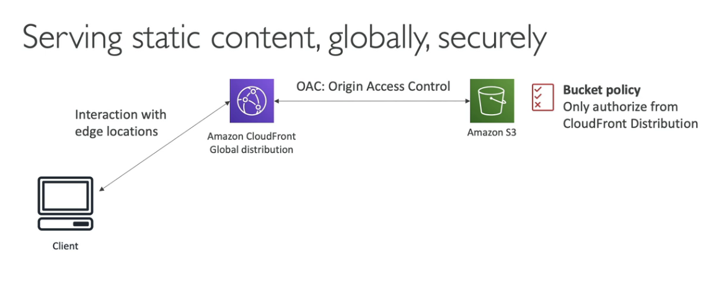

# Design MyBlog.com

1. The website should scale globally
2. Blogs are rarely written, but often read
3. Some of the website is purely static files, the rest is a dynamic REST API
4. Caching must be implemented where posssible
5. Any new users that subscribes should receive a welcome email
6. Any photo uploaded to the blog should have a thumbnail generated

## Solution

^ In the above we are using DynamoDB Global tables

- serve static content using CloudFront with S3
- the REST API was serverless, did not need Cognito because public
- We leveraged a Global DynamoDB table to serve the data globally
    - we could also have used Aurora Global Database, but that is not serverless
- We enabled DynamoDB streams to trigger a Lambda function
- the lambda function had an IAM role which could use SES
- SES (Simple Email service) was used to send emails in a serverless way
- S3 can trigger SQS/SNS/Lambda to notify of events