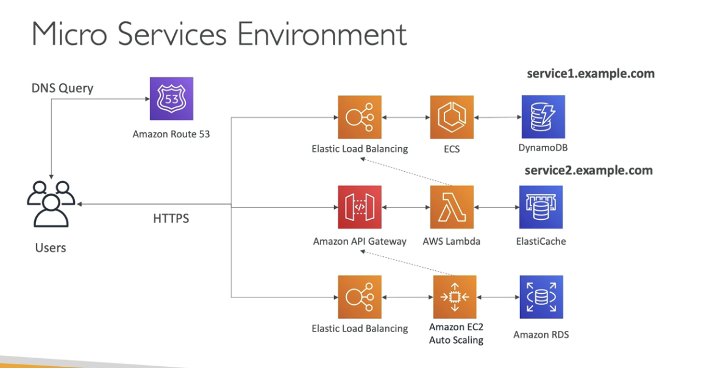

# Microservices Architecture

Shown below is a Synchronous Microservices architecture where services talk to each other directly (instead of using events with SQS, Kinesis, SNS, Lambda Triggers on S3)

