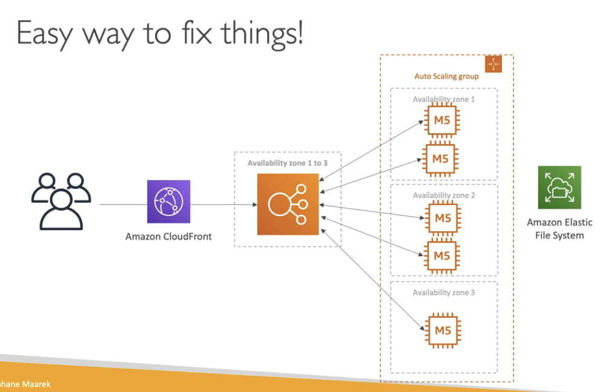

# Software Updates Offloading

- We have an app running on EC2 that distributes software updates once ina while
- When a new software update is out, we get a lot of request and thhe content is distributed in mass over the network. It's getting costly
- We do not want to change our application, but want to optimize our cost and CPU, how can we do it?

## Solution

Since software updates are not dynamic (they are static), we can utilize EFS to store software update files and use CloudFront to cache them on edge locations

CloudFront is serverless and will scale for us

Because of CloudFront, our ASG need not scale that much, hence saving costs

