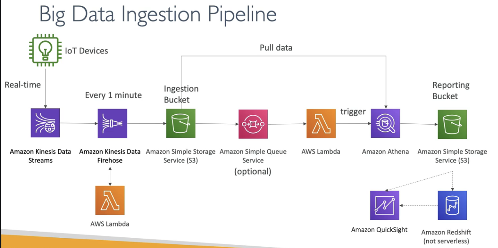

# Big Data Ingestion Pipeline

- We want the ingestion pipeline to be fully serverless
- We want to collect data in real time
- We want to transform the data
- We want to query the transformed data using SQL
- The reports created using the queries should be in S3
- We want to load the data into a warehouse and create dashboards

## Solution

- IoT Core allows you to harvest data from IoT devices
- Kinesis is gr8 for real-time data collection
- Firehose helps with data delivery to S3 in near real-time (1 minute intervals)
- Lambda can help Firehose with data transformations
- Amazon S3 can trigger notifications to SQS (SQS is optional, S3 can directly trigger Lambda as well)
- Lambda can subscribe to SQS (we could have connector S3 to Lambda)
- Athena is serverless SQL service and results are stored in S3
- The repoting bucket contains analyzed data and can be used by reporting tool such as AWS QuickSight, Redshift (not serverless) etc.