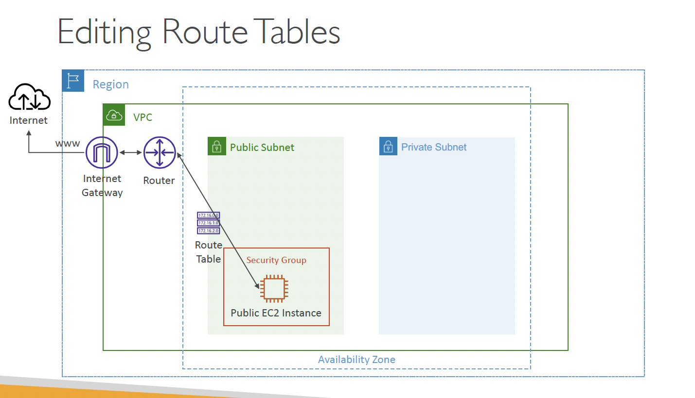
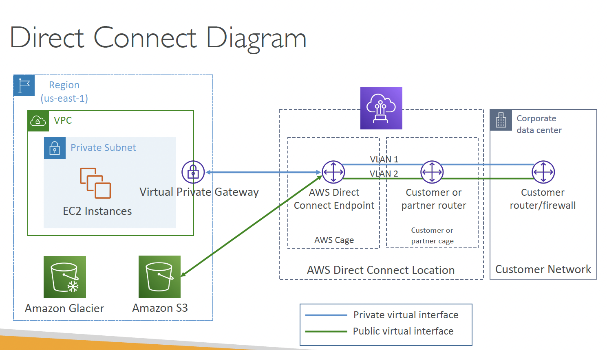

# VPC

### CIDR

### Public vs Private IPs

The IANA (Internet Assigned Number Authority) established certain blocks of IPv4 address for use of private (LAN) and public addresses

Private IP can only be certain values:
- 10.0.0.0/8 (i.e. up to 10.255.255.255) -> in big networks
- 172.16.0.0/12 (i.e up to 172.31.255.255) -> AWS default VPC in that range
- 192.168.0.0/16 (up to 192.168.255.255) -> e.g. home networks

All the remaining IP addresses are public

## VPC

### Default VPC

All new AWS accounts have a default VPC

New instances are launched in default VPC if none specified

Default VPC has internet connectivity 

All EC2 inside default VPC have public IPv4 addresses
- we also get a public and private IPv4 DNS name

### VPC in AWS

Max 5 VPC allowed per region (soft limit)

Max CIDR per VPC is 5, for each CIDR:
- Min size is /28 (i.e. 16 IP addresses)
- Max size is /16 (65536 IP addresses)

Because VPC is private, only the Private IPv4 ranges are allowed:
- 10.0.0.0 – 10.255.255.255 (10.0.0.0/8)
- 172.16.0.0 – 172.31.255.255 (172.16.0.0/12)
- 192.168.0.0 – 192.168.255.255 (192.168.0.0/16)

Your VPC CIDR should NOT overlap with your other networks (e.g., corporate)

### AWS Reserved IP addresses

AWS reserves 5 IP addresses (first 4 and last)

for a CIDR 10.0.0.0/24, these will be
1. 10.0.0.0 - Network Address
2. 10.0.0.1 - reserved by AWS for VPC router
3. 10.0.0.2 - reserved by AWS for mapping to Amazon-provided DNS
4. 10.0.0.3 - reserved by AWS for future use
5. 10.0.0.255 - Network Broadcast address

**Exam Tip**: if you need 29 IP addresses for EC2 instances:
• You can’t choose a subnet of size /27 (32 IP addresses, 32 – 5 = 27 < 29)
• You need to choose a subnet of size /26 (64 IP addresses, 64 – 5 = 59 > 29)

—

## Internet Gateway

Allows resources in a VPC to connect to internet

1 VPC ↔ 1 IGW

**NOTE:** IGW on their own do not allow internet access - their Route Tables must be edited

## Bastion Hosts

We use Bastion Hosts to SSH into our private instances

We can declare any instance in a public subnet to be a Bastion Host

For Communication
- Bastion Host SG must allow inbound from internet on port 22
    - preferrably from restricted CIDR e.g. public CIDR of your company
- SG of private EC2 instances must allow the SG of Bastion Host 
    - OR the private IP of BH
    - but former is preferred

## [NAT Gateway](https://docs.aws.amazon.com/vpc/latest/userguide/vpc-nat-gateway.html)

AWS managed NAT
- A NAT gateway is a Network Address Translation (NAT) service. You can use a NAT gateway so that instances in a private subnet can connect to services outside your VPC but external services cannot initiate a connection with those instances.

NATGW is created in a specific AZ

Uses an Elastic IP

Can't be used by EC2 instance in the same subnet (only from other subnets)

Requires an IGW (Private Subnet => NATGW => IGW)

5Gbps of bandwidth with auto scaling up to 45 Gbps

No SGs to manage

We must create multiple NATGWs in multiple AZs for fault-tolerance

in addition to above:

port forwarding | not supported | Manually customize the config to support pf

https://docs.aws.amazon.com/vpc/latest/userguide/vpc-nat-comparison.html

## NACL (N/w Access Control List)

NACLs are like firewalls for **subnets**

1 NACL per subnet, new subnets are assigend the default NACL

You define NACL Rules:
- Rules have a number (1-32766), higher precedence with a lower number
- First rule match will drive the decision
- Example: if you define #100 ALLOW 10.0.0.10/32 and #200 DENY 10.0.0.10/32, the IP
address will be allowed because 100 has a higher precedence over 200
- The last rule is an asterisk (*) and denies a request in case of no rule match
- AWS recommends adding rules by increment of 100

Newly created NACLs will deny everything

NACL are a great way of blocking a specific IP address at the subnet level

## VPC Peering

Good to know:
- VPC Peering can happen between VPCs in **different AWS regions**
- You can reference an SG in the peered VPC (works across accounts but same region)

## VPC Endpoints (AWS PrivateLink)

VPC Endpoints (powered by AWS PrivateLink) allows you to connect to AWS services using a private network instead of public internet

They remove the need for IGW, NATGW etc to access AWS services

In case of issues:
• Check DNS Setting Resolution in your VPC
• Check Route Tables

### Interface vs Gateway Endpoints

## VPC Flow Logs

## AWS Site-to-Site VPN

## AWS VPN CloudHub

## Direct Connect (DX)

## Direct Connect Gateway

### Connection Types

#### Dedicated Connections

1Gbps, 10 Gbps and 100Gbps

Physical ethernet port dedicated to a customer
• Request made to AWS first, then completed by AWS Direct Connect Partners

#### Hosted Connections

50Mbps, 500 Mbps, to 10 Gbps

• Connection requests are made via AWS Direct Connect Partners
• Capacity can be added or removed on demand
• 1, 2, 5, 10 Gbps available at select AWS Direct Connect Partners

**Note** - Lead times are often longer than 1 month to establish a new connection

## Transit Gateway

## VPC Traffic Mirroring

## Egress-only Internet Gateway

## AWS Network Firewall

# Networking Costs

