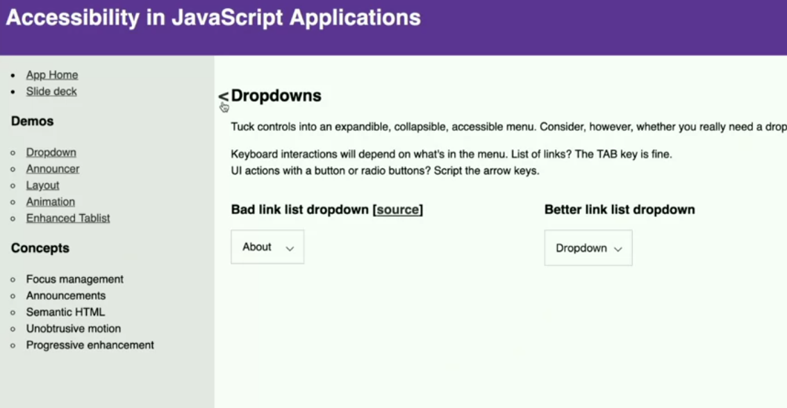

## Client Side Routing

User Testing results: https://www.gatsbyjs.com/blog/2019-07-11-user-testing-accessible-client-routing/

### Skip Links

Skip Links are used to direct user's focus to important areas of the page, e.g. Skip to main. They are just regular internal fragment `a` tags

In Client-rendered apps, since there is no page reload, we need some way for Assistive Techs to retain focus / re-focus on the important area. Traditionally, the focus would go back to the start of the page, but with skip links, we can automate the focus to fall on the first `h2` for example on every link click. 

In the screenshot below, whenever a link is clicked in the left-tab, the skip link is auto focused, so that keyboard users can continue to navigate the app, instead of refinding their focus all the time.




Example implementation: https://github.com/marcysutton/js-a11y-workshop/blob/solutions/src/components/better/route-target-heading.js

```javascript
const styles = css`
    .routeSkipHeading {
        position: relative;
    }
    
    a.routeSkipLink {
        display: inline-block;
        margin-left: -0.75em;
        opacity: 0;
        position: absolute;
        text-decoration: none;
        
        &:before {
            content: '⇽';
            display: block;
        }
    }
    .routeSkipLink:focus, 
    .routeSkipLink:hover {
        opacity: 1;
    }
`;

const RouteHeading = ({ level = 1, targetID, children }) => {
    const Heading = `h${level}`;
    return (
        <Heading css={styles} className="routeSkipHeading">
            <a 
                href={`#${targetID}`}
                id="skip-link"
                className="routeSkipLink"
                aria-label={`skip to ${targetID}`}
            >
            </a>
            {children}
        </Heading>
    )
}
```

---
