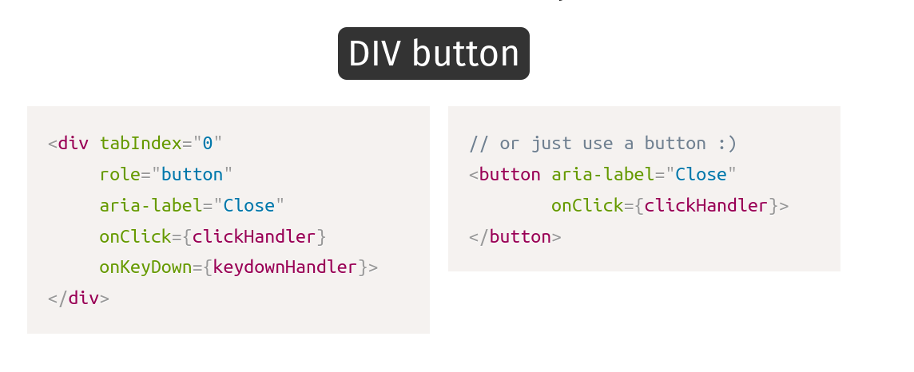
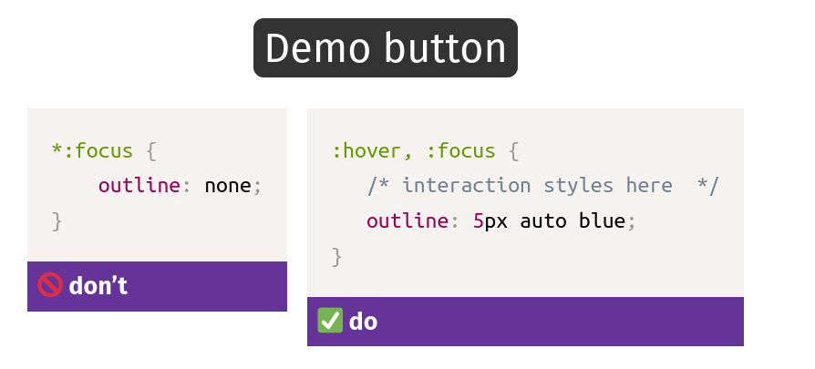

# Focus Management

Moving the user's focus as part of an interaction to alert them to new content. (So that keyboard users are in teh right part of the application (not stuck in a modal, e.g.))

Also: handling focus in disabled and mutated parts of the page.

Building blocks: 
    - Reachable and operable elements 
    - TAB, Escape and Arrow keys
        - Arrow keys are usually used for tab switchers and menus
        - TAB is used to focus on different UI elements, then ARROW keys to move around that interactive widget.
    - Visible focus styles
    - Hidden/inert content

### `tabindex` in HTML 

`tabindex` makes non-interactive elements focusable and puts them in the tab-order depending on its value.

The `tabindex` [global attribute](https://developer.mozilla.org/en-US/docs/Web/HTML/Global_attributes) indicates that its element can be focused, and where it participates in sequential keyboard navigation (usually with the Tab key, hence the name).
 
 Values: 
     - `tabindex="0"` - In the normal tab-order
     - `tabindex="-1"` - focusable by script, but not reachable by TAB button. removed from tab order
     - `tabindex="1" or "99651"` - A _positive value_ means the element should be focusable in sequential keyboard navigation, with its order defined by the value of the number.
         - Anything with a +ve value comes before the elements with the default tabindex values

As per MDN

Avoid using `tabindex` values greater than 0. Doing so makes it difficult for people who rely on assistive technology to navigate and operate page content. Instead, write the document with the elements in a logical sequence.

Always better to use Semantic elements, instead of forcing non-interactive elements into interactive. It's much simpler. Consider: 

### `role` and `aria-label`

`role` is a WAI-ARIA role for clickable elements that trigger a response when activated by the user.

This role can be used in combination with the `aria-pressed` attribute to create toggle buttons.

The [`aria-label`](https://www.w3.org/TR/wai-aria/#aria-label) attribute is used to define a string that labels the current element. Use it in cases where a text label is _not_ visible on the screen. If there is visible text labeling the element, use [aria-labelledby](https://developer.mozilla.org/en-US/docs/Web/Accessibility/ARIA/ARIA_Techniques/Using_the_aria-labelledby_attribute) instead.

---

## ARIA - Accessible Rich Internet Applications

Accessible Rich Internet Applications **(ARIA)** is a set of attributes that define ways to make web content and web applications (especially those developed with JavaScript) more accessible to people with disabilities.

It supplements HTML so that interactions and widgets commonly used in applications can be passed to assistive technologies when there is not otherwise a mechanism

Many of these widgets were later incorporated into HTML5, and **developers should prefer using the correct semantic HTML element over using ARIA**, if such an element exists.

3 building blocks: 
- **role**: What is it? e.g. `role="button"`
- **state**: what's happening to it
    - e.g. aria-disabled, aria-selected
- **property**: what's the nature of it (catchall for all other properties)
    - e.g. `aria-label`

**First rule of ARIA**

If you can avoid using ARIA, avoid it.

It is always better to use semantic HTML elements wherever possible, and to avoid ARIA, unless we are developing a use case for which no HTML version exists.

---

## Modal Layers: disabling background content

Adding `aria-hidden="true"` to an element removes that element and all of its children from the accessibility tree. This can improve the experience for assistive technology users by hiding:

* purely decorative content, such as icons or images
* duplicated content, such as repeated text
* offscreen or collapsed content, such as menus

This attribute will hide an element (or group of elements) to screen readers. It has however no effect on the display.

`aria-label="hidden"` does not prevent focusing on the element, so use of `tabindex="-1"` is suggested to also remove the focus. (this avoids "ghost" controls, TABbing on things not announced by the screen reader)

**Fourth rule of ARIA**
Do not use `role="presentation"` or `aria-hidden="true"` on a **focusable** element .

Using either of these on a **focusable** element will result in some users focusing on 'nothing'.

Do **not** do this:

<button aria-hidden="true">press me</button>

### `inert`

A new attribute that is being proposed to have the same effect as above. 

The [`HTMLElement`](https://developer.mozilla.org/en-US/docs/Web/API/HTMLElement) property **inert** is a boolean value that, when present, makes the browser "ignore" user input events for the element, including focus events and events from assistive technologies. The browser may also ignore page search and text selection in the element. This can be useful when building UIs such as modals where you would want to "trap" the focus inside the modal when it's visible.

NOTE: not supported in many browsers yet.

--- 

## Visible focus styles 

Useful for so many people and situations, but often turned off for everyone. Don't

`:focus-visible` is a proposed CSS selected that is similar to `:focus` CSS selector, but adds additional heuristics to see if the focus is really needed (e.g. mouse user vs keyboard user)
