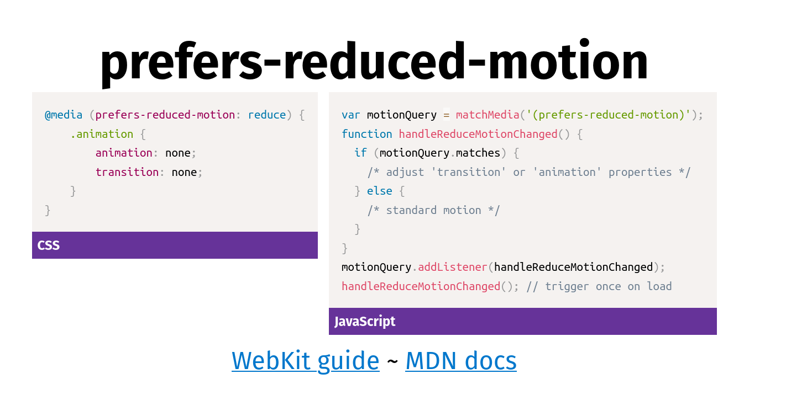

## Unobtrusive motion

The aim is to build safe and delighful interfaces.

`prefers-reduced-motion` CSS media query we can use to change our animation using OS level user preferences.

Example of optional animation: https://codepen.io/marcysutton/pen/yqVVeY

Docs: https://developer.mozilla.org/en-US/docs/Web/CSS/@media/prefers-reduced-motion

Full Example: https://github.com/marcysutton/js-a11y-workshop/tree/master/examples/reduced-motion

---