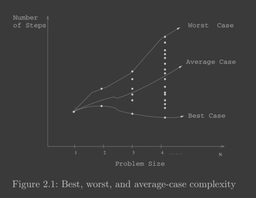
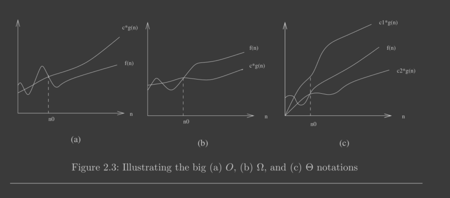
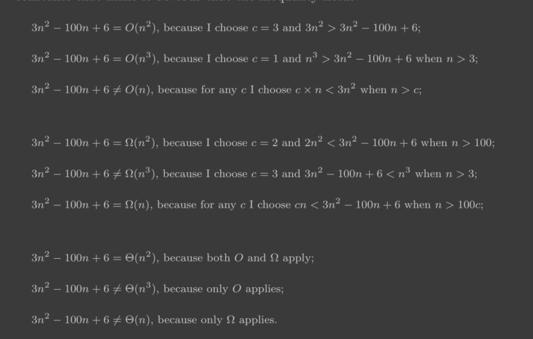

# Algorithm Design Manual

## Chapter 1: Introduction

- An algorithm is a procedure to accomplish a specific task.
- An algorithm is a procedure that takes any of the possible input instances
  and transforms it to the desired output
  - To be interesting, an algo must solve a general, well-speicifed problem.
  - An algorithmic problem is specified by describing the complete set of instances it must
    work on and of its output after running on one of these instances.
- There are three desirable properties for a good algorithm.
  - We seek algorithms that are
    - correct
    - efficient
    - being easy to implement.
- There is a fundamental difference between **algorithms**, which always produce a correct result, and **heuristics**, which may usually do a good job but without providing any guarantee.
- Reasonable-looking algorithms can easily be incorrect. Algorithm correctness is a property that must be carefully demonstrated.
- An important and honorable technique in algorithm design is to narrow the set of allowable instances until there is a correct and efficient algorithm. For example, we can restrict a graph problem from general graphs down to trees, or a geometric problem from two dimensions down to one.

### Counter-examples

- The best way to prove that an algorithm is incorrect is to produce an instance in
  which it yields an incorrect answer. Such instances are called **counter-examples**.
- _Hunting for counter-examples_
  - Think small:
    - Amateur algorists tend to draw a big messy instance and then stare at it helplessly. The pros look carefully at several small examples, because they are easier to verify and reason about.
  - Think exhaustively
  - Hunt for the weakness – If a proposed algorithm is of the form “always take the biggest” (better known as the greedy algorithm), think about why that might prove to be the wrong thing to do. In particular, ...
  - Go for a tie – A devious way to break a greedy heuristic is to provide instances
    where everything is the same size. Suddenly the heuristic has nothing to base
    its decision on, and perhaps has the freedom to return something suboptimal
    as the answer.
  - Seek extremes – Many counter-examples are mixtures of huge and tiny, left
    and right, few and many, near and far. It is usually easier to verify or rea-
    son about extreme examples than more muddled ones

### Summations

- Arithmetic progression:
  - e.g. $1 + 2 + 3 + ... + n = n (n + 1) / 2$
  - Arithmetic progressions of degree $n^p$ are $O(n^p+1)$, hence, sum of squares is cubic (example above), sum of cubes is quadratic, sum of cubes is quartic.
  - For p < -1, the sum converges to a constant, even as $n \rarr \infin$
- Geometric Series
  - e.g. $a^0 + a^1 + a^2 + ... + a^n = a.(a ^{n+1} - 1)/(a-1)$
  - In Geometric series, the index of the loop effects the exponent
  - How we interpret this sum depends upon the base of the progression i.e. a
    - When a < 1, the series converges to a constant even when $n \rarr \infin$
      - e.g. $1+ 1/2 + 1/3 + 1/4 + ... <= 2$
    - When a > 1, the series diverges

### Combinatorial Objects

- To expoint algo literature, we must learn to describe out problem abstractly, in terms of procedures on fundamental structures.
  - Permutations
  - Subsets
  - Trees
  - Graphs
  - Points
  - Polygons
  - Strings
- Modeling your application in terms of well-defined structures and algorithms is the most important single step towards a solution.
- All the above structures are recursive in nature, which means we can compose big ones by combining smaller ones.

---

## Chapter 2: Algorithm Analysis

- Two most important tools here are

1. RAM Model of Computation
   - Each simple operation (+,\*,- =, if, function call) is one step.
   - Loops are not simple operations, they are a composition of simple operations
   - Each memory access takes one time step.
2. Asymptotic analysis of worst-case complexity
   - Asymptotic analysis means checking the "behaviour" of a function when input gets very large, possibly approaching infinity.

### Best, Worst and Average Case complexity

The important thing to realize is that each of these time complexities define a
numerical function, representing time versus problem size. These functions are as
well defined as any other numerical function, be it $y = x^2 − 2x + 1$ or the price
of Google stock as a function of time.

### Big-Oh Notation

- The Big Oh notation and worst-case analysis are tools that greatly simplify our ability to compare the efficiency of algorithms.

- Formal definitions are

  - **Upper bound** $f(n) = O(g(n))$ means $c . g(n)$ is an upper bound on $f(n)$
    - In words, there exists some constant $c$ such that $f(n)$ is always $<=c.g(n)$, for large enough $n$ > $n_0$, so once $n$ crosses $n_0$, the upper bound function always remains above $f(n)$.
  - **Lower bound** $f(n) = \Omega (g(n))$ means $c.g(n)$ is a lower bound on $ f(n) $
    - Thus, there exists some constant c such that f(n) is always >= c.g(n) for all $n > n_0$
  - **Tight bound** $f(n) = \Theta (g(n))$ is a tight bound when c1 and c2 for upper and lower bounds exist.

- Each of these definitions assumes a constant n 0 beyond which they are always satisfied. We are not concerned
  about small values of n (i.e. , anything to the left of n 0 ).

### Logarithms

Remember:

$log_b x = y \implies b^y = x$

And

$y = a^x \implies log_a y = x$

Rule:

$log_a(xy) = log_a x + log_a y$

And

$log_a n^b = b . log_a n$

And

$a^b = e^{\ln a^{b}} = e ^ {b \ln a}$

Converting from one log base to another

$\log_a b = \log_c{b} / \log_c{a}$

Thus, changing the base of $\log b$ from base-a to base-c simply involves dividing by
$\log_c a$

#### Logarithms and Summations of Harmonic Series

$H(n) = \sum_{i=1}^n 1/i == \ln n$ (This shows up in Quicksort)

#### Limits and Dominance Relations

a function `g(n)` dominates `f(n)` is $g(n)/f(n)$ approaches 0 as $n \rightarrow \infin$

if $f(n)/g(n)$ approaches $\infin$, then we can say that $f(n)=\Omega(g(n))$, that is, $g(n)$ is a lower bound of $f(n)$
