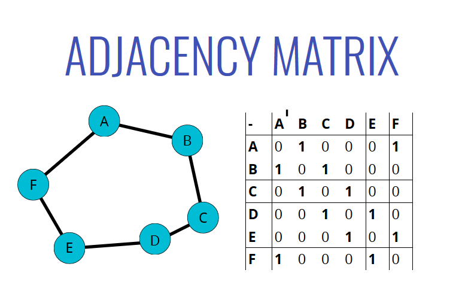

# Data Structures

### Abstract Data Types vs Data Structures

**Abstract Data Type (ADT)** is the mathematical model for data types (e.g. stack, hashmap).

**Data Structure** is a collection of data values, the relationships among them, and the functions or operations that can be applied to the data.

**ADT** is an abstract description of how a specific set of data can be organization and which operations can be performed on that set of data.

while **Data Structure** is a specific and concrete implementation of the ADT, e.g. using JS arrays to represent stack.

---

#### Singly Linked List

**insertion** - O(1)

_Note_: Insertion and Indexing are considered a separate operation, hence when we talk about insertion is O(1) for linked-lists, we already assume that we are in the middle of iterating though the list. For linked list, indexing is O(n), but once we have the index, insertion itself is O(1) since we do not have to move the remaining elements. For arrays, indexing is O(1), but, insertion itself is O(n), since all the elements after the index must be re-indexed.

**Removal** - O(1) assuming that the index is known and node has already been identified
**Searching** - O(n)
**Accessing** - O(n)

---

#### Doubly Linked List

**insertion** - O(1)
**Removal** - O(1)
**Searching** - O(n / 2) === O(n)
**Access** - O(n)

A Web browser's back and forward buttons are implemented with a doubly-linked list.

DLL are better than SLL for finding nodes and can be done in half the time.
However, they do take up more memory considering an additional pointer.

---

#### Stack

- Stacks are a LIFO data structure where the last value in is always the first one out.
- Stacks are used to handle function invocations (the call stack), for operations like undo/redo, and for routing (as in browser history)
- we cant use a linked list directly because for stacks, push and pop is O(1), whereas for linked list pop() is O(n)

Big O of stack

- insertion - `O(1)`
- Removal - `O(1)`
- Searching - `O(n)`
- Access - `O(n)`

---

#### Queues

- FIFO data structure
- Used is: Background tasks, uploading resources, printing / task processing
- Big O - Insertion $O(1)$ - Removal $O(1)$ - Searching $O(N)$ - Access $O(N)$

---

#### Trees

Trees are a non-linear DS that contain a root and child nodes

A Tree cannot contain cycles. 

The nodes may or may not be in a particular order, they could have any data type as values, and they may or may not have links back to their parent nodes.

A node is called a Leaf node if it has no children.

#### Binary Tree 

At most two children per node.

In a perfect tree (fully filled tree)
    - The number of nodes double as we move down the tree
    - The number of nodes on the last level = sum of the number of nodes on all other levels + 1

The relationship between $n$ (the total number of nodes) and $h$  the number of levels in a tree 
    $n = 2^h - 1$ 
Or 
    $h = log_2(n + 1)$ 

#### Binary Search Trees

A Binary Seatch Tree is a Binary Tree in which every node fits a specific ordering property: all left descendants <= n < all right descendents. This must be true of each node n.

BSTs are more specific version of Binary Trees, where there are only two children of each node, and every node to the left of a parent is less than its value, and every node to the right is greater than its value.

- Insertion - `O(log n)`
- Searching - `O(log n)`

Both above are best and average cases, in the worst case (like a completely lop-sided BST), both get worse to `O(n)`

#### Complete Binary Trees

A complete Binary Tree is a binary tree in which every level of the tree is fully filled, except for perhaps the last level. To the extend that the last level is filled, it is filled left to right.

#### Full Binary Trees 

A full binary tree is a binary tree in which every node has either zero or two children. That is, no nodes have only one child.

#### Perfect Binary Trees 

A perfect binary tree is one that is both full and complete. All lead nodes will be at the same level, and this level has the maximum number of nodes.

Note that perfect trees are rare in interviews and in real life, as a perfect tree must have exactly $2^k - 1$ nodes (where k is the number of levels). In an interview, do not assume a binary tree is perfect.

---

### Tree Traversal

#### Breadth-First Search vs Depth First Search

In BFS, We go through all the children of a node before proceeding to the children of children.

In DFS, We traverse all the way to the bottom of the tree, and then work our way back up.
DFS can be done in 3 orders:

1. Pre-Order - In pre-order, we visit the node first, then we traverse its left, then we traverse its right.
2. Post-Order - In post-order, we traverse the left first, then the right, then the node itself is visited.
3. In-order - in in-order, we traverse the left first, then we visit the node then we traverse the right.

Both BFS and DFS have `O(n)` time complexity, as all the values on the tree must be visited.

If the tree is wide, meaning it has a lot of branches which themselves have a lot of branches, then BFS results in huge space complexity, as a "queue" of elements to be visited has to be maintained, which is a huge memory cost.

If a tree has a lot of depth, then DFS can end up taking alot of space.

###### Use cases

DFS-In-order for Binary Search Tree results in an ordered, sorted list of values.
DFS-Pre-order results in the list of values being in the same order as the tree, meaning, from the values array we can easily re-create the whole array. Hence, pre-order results in easy storage and re-creation of that tree.

---

### Binary Heap

- A Binary Tree where
  - every number is either less than the root i.e. root is the largest element (called max heaps)
  - every nunmber is greater than the root i.e. root is the smallest element (called min heaps)

A binary heap is defined as a binary tree with two additional constraints:

- Shape property: a binary heap is a _complete binary tree_; that is, all levels of the tree, except possibly the last one (deepest) are fully filled, and, if the last level of the tree is not complete, the nodes of that level are filled from left to right.
- Heap property: the key stored in each node is either greater than or equal to (≥) or less than or equal to (≤) the keys in the node's children, according to some total order.
- (Where parent >= children)(>=) are called max-heaps, (where parent <= children) (<=) are called min-heaps.

 a min heap

### Another definition

 The heap is a binary tree that maintains the following conditions:
• The value of each node must be greater (or lesser for min-heaps) than each of its descendant nodes. This rule is known as the _heap condition_.
• The tree must be complete.

#### Binary Heap Insert 

#### Extract Minimum Element 

---

### Priority Queues

- Min Binary Heaps are used to represent a Priority Queue when lower number means higher priority.

#### Time Complexity of Binary Heaps

- insert: $O(\log n)$
- extractMin/extractMax: $O(\log n)$
- delete a key: $(\log n)$
- getMin/getMax (return the root of the tree): $O(1)$

---

### Hash Tables

- Hash Tables ares used to store Key Value pairs
- Like arrays, but the keys are not ordered
- They are found in all programming languages of the world, as objects (JS), Dictionary (python), Map (JS, Haskell, Java).
- A function that performs the conversion of a key and maps it into a value, for storage inside the Hash table is called the **hash function**.
  - What makes a good hash function?
    - Fast (constant time)
    - Uniform output (does not cluster the outputs at specific indices, but distributes uniformly)
    - Pure (deterministic)
- **Collisions** - when the output of the hash function is same for two or more keys, meaning that we need to store both keys at one hash index
  - Two strategies to deal with Collisions
    - **Separate Chaining** - at each index in the array (the main array), we store multiple values inside another array or a linked list, allowing us to store multiple keys at the same index.
    - **Linear Probing** - when we find a collision, we search through the main array to find the next empty slot, and insert the duplicate KVP there

### Time Complexity

- Insert: $O(1)$
- Deletion: $O(1)$
- Access: $O(1)$

However, a bad hash function, which does not distrbiute the KVPs uniformly (e.g. one that accumulates all the values at one index), may result in degradation of above.

---

## Graphs

- A graph DS consists of finite (& possibly mutable) set of **vertices** (nodes or points, along with a set of (edges) which are either
  - unordered pairs of these vetices for an undirected graph
  - or ordered pairs for directed graphs

The graph might consist of multiple isolated subgraphs. If there is a path between every pair of vertices, it is called a "connected graph:'
    - thus, a tree is a connected graph wihout cycles

The graph can also have cycles (or not). An "acyclic graph" is one without cycles.

### Uses

- Social networks
- Location / Mapping
- Routing Algos
- Visual Hierarchy
- File System Optimizations

### Terms

- Vertex: a node
- Edge: lines connecting nodes
- Weighted/Unweighted: values assigned to the "lines" or distance between vertices
- Directed/Undirected: directions of the lines between vertices
- Legal Coloring: When all nodes are assigned a color, no adjacent nodes have the same color.

### How to store graphs

#### Edge List 

A list of all the edges in the graph

e.g.: `const graph = [[0,1], [1, 2], [1, 3], [2, 3]];`

#### Adjacency Matrix

#### Adjacency List

### Big O

### Pros and Cons of each

## Graph Traversal

### Depth First Travesal

- visit one node, then visit its first child, then visit the fist child of that child, and so on
- So, DFT, just keeps going to next child, and visits the siblings only after all childs have been visited
- can be implemented recursively or iteratively

### Breadth First Traversal

- In BFS, the siblings or neighbors are visted first before we start to visit any children

#### BFS and DFS uses 

Q: Is there a path between two nodes in an undirected graph?
    - Run DFS or BFS from one node and see if we reach the other one.

Q: What's the shortest path between two nodes in an undirected, unweighted graph?
    - Run BFS from one node, keep track of the path and then backtrack once we reach the second.
    - BFS always finds the shortest path, in an undirected unweighted graph
    - DFS does not always find the shortest path

Q: Can an undirected graph be colored with two colors?
    - run BFS, assigning colors as nodes are visited.
    - Abort if we ever try to assign a node a color different from the one it was assigned earlier.

Q: Does an undirected graph have a cycle?
    - run BFS, keeping track of the number of times we are visiting each node.
    - If we ever visit a node twice, then we have a cycle.

### Graph Coloring

_Degree_ of a graph is the number of edges connected to a node. Maximum degree is thus a node which has the max number of neighbours

We can find a graph coloring using at most D+1 colors.

The lowest number of colors we can use to legally color a graph is called the **chromatic number**

Finding the chromatic number is an NP problem

***

## Dynamic Programming 

### Overlapping subproblems

A problem has overlapping subproblems if finding its solution involves solving the same subproblem multiple times. Calculating fibonacci terms using recursion is an overlapping subproblem. 

We can use memoization to speed up such problems.

Going top-down (using recursion) vs Going bottoms-up (using loops) are common strategies in dynamic programming.