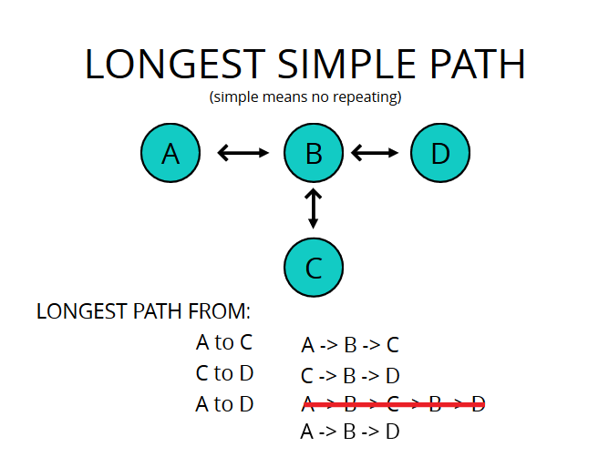

# Dynamic Programming

A method for solving a complex problem by breaking it down into a collection of simpler subproblems, solving each of those subproblems just once, by storing their solutions.

Dynamic Programming has a misleading name. (Like Linear Programming, which is in no way related to code)

Dynamic Programming works on problems which have these two characteristics

1. Optimal Sub-structure

- A problem is said to have optimal sub-structure if an optimal solution can be constructed from optimal solutions of its sub-problems (i.e. sum of individual/local optimal solutions yields global optimal solution)
- One example is the shortest path problem, where if the shortest path from `A` to `D` is `A -> B -> C -> D`, then each of the constituent parts (i.e. `A -> B`, `B -> C`, `C -> D`) are also shortest paths.
- Counter example is longest simple path (where each node is allowed to be visited only once).
- Another way of thinking about it is that in Optimal sub-structures, smaller solutions can be "composed" to form bigger solutions
- Another counter example may be the ticket pricing system, where cheapest ticket from `A` to `C`, may not be equal to cheapest tickets from first `A` to `B` and then `B` to `C` (because of airlines pricing policy and strategy)



2. Overlapping sub-problems

- A problem is said to have overlapping subproblems if it can be broken down into subproblems which are resused several times.
- For example, in `fib(n) = fib(n - 1) + fib(n - 2)`, calculating `fib(n - 2)` would involve calculating `fib(n - 1)` again.
- Thus, solving the `fib` function involves solving a lot of sub problems, most of which are solved multiple times while solving the main problem.
- Counter example is merge sort, which does not have overlapping sub problems, each time we break down an array into half to sort those halves individually, we are sorting two different arrays.

### Example using Fibonacci function

- Plain recursion

```js
const fib = (n) => (n <= 2 ? 1 : fib(n - 1) + fib(n - 2));
```

This function has time complexity of $O(2^n)$

- Using Top down approach (with memoization to store results)

```js
function fib(n, memo = []) {
	if (memo[n] !== undefined) return memo[n];
	if (n <= 2) return 1;
	const res = fib(n - 1, memo) + fib(n - 2, memo);
	memo[n] = res;
	return res;
}
```

This technique makes the runtime $O(n)$

- Using the bottom up approach

This technique is also called **Tabulation**, and is usually done using iteration

This technique often gives better space complexity than top down (memoization)

```js
function fin(n) {
	if (n <= 2) return 1;
	const fibNums = [0, 1, 1];
	for (let i = 3; i <= n; i++) {
		fibNums[i] = fibNums[i - 1] + fibNums[i - 2]; // building up the result as we go
	}

	return fibNums[n];
}
```
