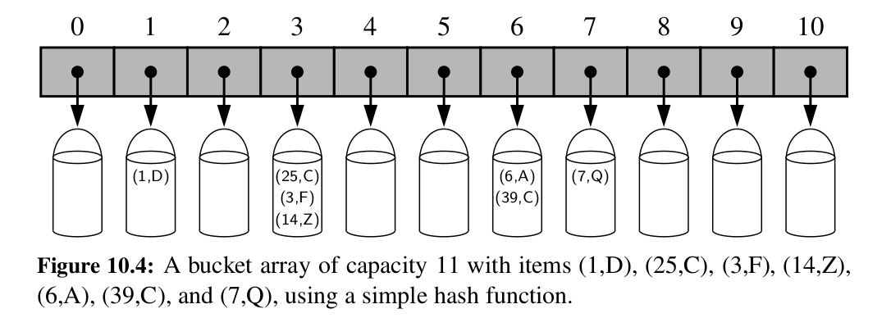
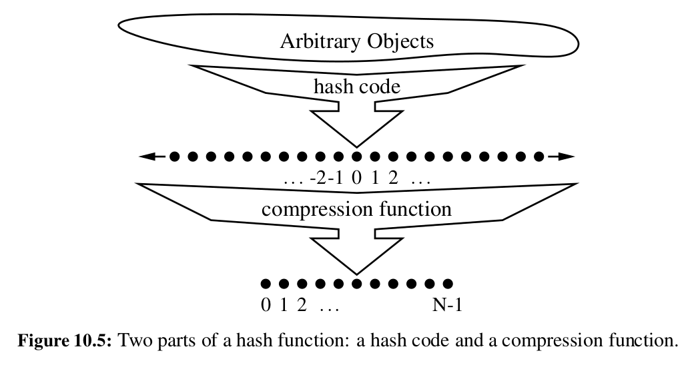
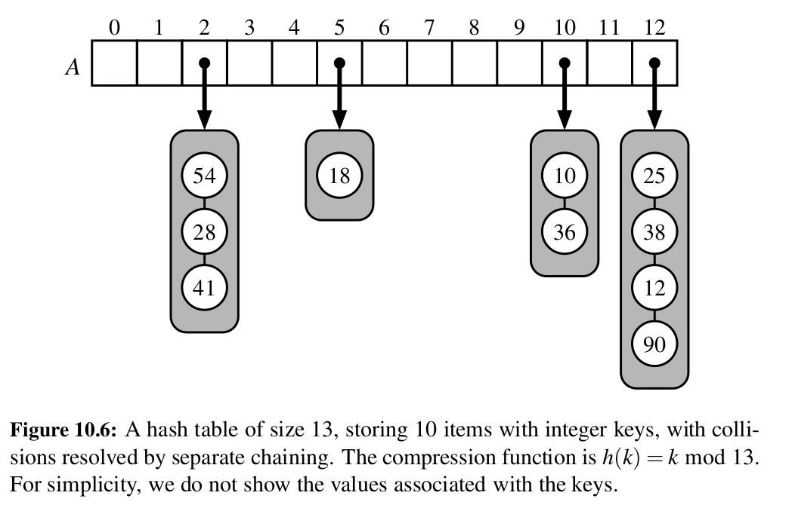
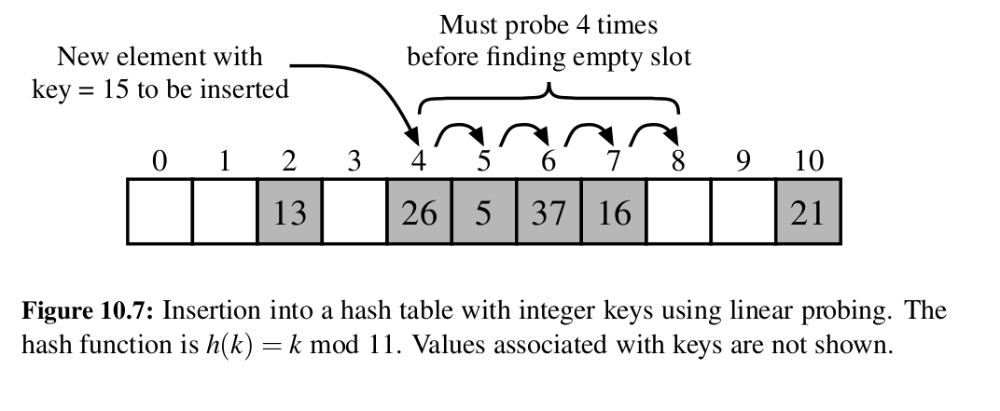

# Hash Tables

The novel concept for a hash table is the use of a **hash function** to map general keys to corresponding indices in a table.

Ideally, keys will be well distributed in the range from 0 to N − 1 by a hash function, but in practice there may be two or more distinct keys that get mapped to the same index. As a result, we will conceptualize our table as a bucket array, as shown in Figure below, in which each bucket may manage a collection of items that are sent to a specific index by the hash function.
(To save space, an empty bucket may be replaced by None.)



## Hash Functions

The goal of a hash function, h, is to map each key k to an integer in the range
[0, N − 1], where N is the capacity of the bucket array for a hash table. 

Equipped with such a hash function, h, the main idea of this approach is to use the hash function value, h(k), as an index into our bucket array, A, instead of the key k (which may not be appropriate for direct use as an index). That is, we store the item (k, v) in the bucket A[h(k)].

It is common to view the evaluation of a hash function, h(k), as consisting of
two portions—a hash code that maps a key k to an integer, and a compression
function that maps the hash code to an integer within a range of indices, [0, N − 1] for a bucket array.



### Hash Codes

The first action that a hash function performs is to take an arbitrary key k in our map and compute an integer that is called the hash code for k; this integer need not be in the range [0, N − 1], and may even be negative. 

We desire that the set of hash codes assigned to our keys should avoid collisions as much as possible. For if the hash codes of our keys cause collisions, then there is no hope for our compression function to avoid them.

#### Polynomial Hash codes

Instead of using common techniques for generating hashcodes like treating binary value of a key as its decimal value, taking the first 32 bits of the binary representation, sum of unicode values of its characters, there's **polynomial hash code** for some non-zero `a`

$x_0a^{n-1}+ x_1a^{n-2} + ... + x_{n-2}a + x_{n-1}$ 

and by Horner's rule

$x_{n-1} + a(x_{n-2} + a(x_{n-3} + ... + a(x_2 + a(x_1 + ax_0))...))$ 

Some experimental studies that suggest that 33, 37, 39, and 41 are particularly good choices for a when working with character strings that are English words. In fact, in a list of over 50,000 English words formed as the union of the word lists provided in two variants of Unix, we found that taking a to be 33, 37, 39, or 41 produced less than 7 collisions in each case!

#### Cyclic-Shift Hash Codes

A variant of the polynomial hash code replaces multiplication by a with a cyclic shift of a partial sum by a certain number of bits. For example, a 5-bit cyclic shift of the 32-bit value 00111101100101101010100010101000 is achieved by taking the leftmost five bits and placing those on the rightmost side of the representation, resulting in 10110010110101010001010100000111. 

While this operation has little natural meaning in terms of arithmetic, it accomplishes the goal of varying the bits of the calculation. In Python, a cyclic shift of bits can be accomplished through careful use of the bitwise operators << and >>, taking care to truncate results to 32-bit integers.

```python
def hash code(s):
    mask = (1 << 32) − 1
    h=0
    for character in s:
        h = (h << 5 & mask) | (h >> 27)
        h += ord(character)
    return h
# limit to 32-bit integers
# 5-bit cyclic shift of running sum
# add in value o
```

In practice, 5-bit shifts avoid the most collisions.

#### Hash Codes in Python

The standard mechanism for computing hash codes in Python is a built-in function with signature `hash(x)` that returns an integer value that serves as the hash code for object x. 

However, only immutable data types are deemed hashable in Python. This restriction is meant to ensure that a particular object’s hash code remains constant during that object’s lifespan.

Among Python’s built-in data types, the immutable int, float, str, tuple, and
frozenset classes produce robust hash codes


### Compression Functions


The hash code for a key k will typically not be suitable for immediate use with a bucket array, because the integer hash code may be negative or may exceed the capacity of the bucket array. Thus, once we have determined an integer hash code for a key object k, there is still the issue of mapping that integer into the range [0, N −1]. This computation, known as a compression function, is the second action performed as part of an overall hash function. A good compression function is one that minimizes the number of collisions for a given set of distinct hash codes.

#### The Division Method

A simple compression function is the division method, which maps an integer i to `i mod N`

where N, the size of the bucket array, is a fixed positive integer. 

Additionally, if we take N to be a prime number, then this compression function helps “spread out” the distribution of hashed values.

However, this is not a good compression function

####  The MAD Method

A more sophisticated compression function, which helps eliminate repeated pat-
terns in a set of integer keys, is the Multiply-Add-and-Divide (or “MAD”) method.

This method maps an integer i to `[(ai + b) mod p] mod N`

where N is the size of the bucket array, p is a prime number larger than N, and a and b are integers chosen at random from the interval [0, p − 1], with a > 0. 

This compression function is chosen in order to eliminate repeated patterns in the set of hash codes and get us closer to having a “good” hash function, that is, one such that the probability any two different keys collide is 1/N. This good behavior would be the same as we would have if these keys were “thrown” into A uniformly at random.

## Collision-Handling Schemes

### Separate Chaining

A simple and efficient way for dealing with collisions is to have each bucket A[j] store its own secondary container, holding items (k, v) such that h(k) = j. 

A natural choice for the secondary container is a small map instance implemented using a list. This collision resolution rule is known as separate
chaining, and is illustrated in Figure below.




In the worst case, operations on an individual bucket take time proportional to
the size of the bucket. Assuming we use a good hash function to index the n items of our map in a bucket array of capacity N, the expected size of a bucket is n/N.

Therefore, if given a good hash function, the core map operations run in O(n/N). The ratio λ = n/N, called the **load factor** of the hash table, should be bounded by a small constant, preferably below 1. As long as λ is O(1), the core operations on the hash table run in O(1) expected time.

### Open Addressing schemes

One disadvantage of separate chaining is it requires an additional DS to store the buckets, and when space is at a premium, this is not good.

we can use the alternative approach of always storing each item directly in a table slot. This approach saves space because no auxiliary structures are employed, but it requires a bit more complexity to deal with collisions. There are several variants of this approach, collectively referred to as open
addressing schemes


#### Linear Probing and Its Variants

A simple method for collision handling with open addressing is linear probing.
With this approach, if we try to insert an item (k, v) into a bucket A[j] that is already occupied, where j = h(k), then we next try A[( j + 1) mod N]. If A[( j + 1) mod N] is also occupied, then we try A[( j + 2) mod N], and so on, until we find an empty bucket that can accept the new item. Once this bucket is located, we simply insert the item there.



To implement a deletion, we cannot simply remove a found item from its slot
in the array. For example, after the insertion of key 15 portrayed in Figure above, if the item with key 37 were trivially deleted, a subsequent search for 15 would fail because that search would start by probing at index 4, then index 5, and then index 6, at which an empty cell is found. A typical way to get around this difficulty is to replace a deleted item with a special “available” marker object. 

With this special marker possibly occupying spaces in our hash table, we modify our search algorithm so that the search for a key k will skip over cells containing the available marker and continue probing until reaching the desired item or an empty bucket (or returning back to where we started from). Additionally, our algorithm for setitem should remember an available cell encountered during the search for k, since this is a valid place to put a new item (k, v), if no existing item is found.

Although use of an open addressing scheme can save space, linear probing
suffers from an additional disadvantage. It tends to **cluster** the items of a map into contiguous runs, which may even overlap (particularly if more than half of the cells in the hash table are occupied). Such contiguous runs of occupied hash cells cause searches to slow down considerably.

##### Quadratic Probing
Another open addressing strategy, known as **quadratic probing**, iteratively tries the buckets A[(h(k) + f (i)) mod N], for i = 0, 1, 2, . . ., where $f(i) = i^2$ , until finding
an empty bucket. 

As with linear probing, the quadratic probing strategy complicates the removal operation, but it does avoid the kinds of clustering patterns that occur with linear probing. Nevertheless, it creates its own kind of clustering, called
secondary clustering, where the set of filled array cells still has a non-uniform pattern, even if we assume that the original hash codes are distributed uniformly. When N is prime and the bucket array is less than half full, the quadratic probing strategy is guaranteed to find an empty slot. However, this guarantee is not valid once the table becomes at least half full, or if N is not chosen as a prime number.

##### Double Hashing Strategy
An open addressing strategy that does not cause clustering of the kind produced
by linear probing or the kind produced by quadratic probing is the **double hashing strategy**. In this approach, we choose a secondary hash function, h', and if h maps some key k to a bucket A[h(k)] that is already occupied, then we iteratively try the buckets A[(h(k) + f (i)) mod N] next, for i = 1, 2, 3, . . ., where $f(i) = i · h'(k)$.
In this scheme, the secondary hash function is not allowed to evaluate to zero; a common choice is h'(k) = q − (k mod q), for some prime number q < N. Also, N
should be a prime.

##### Pseudo-random generator
Another approach to avoid clustering with open addressing is to iteratively try
buckets A[(h(k) + f (i)) mod N] where f (i) is based on a **pseudo-random number generator**, providing a repeatable, but somewhat arbitrary, sequence of subsequent probes that depends upon bits of the original hash code. This is the approach currently used by Python’s dictionary class.

## Load Factors, Rehashing, and Efficiency

In the hash table schemes described thus far, it is important that the load factor, λ = n/N, be kept below 1. With separate chaining, as λ gets very close to 1, the probability of a collision greatly increases, which adds overhead to our operations, since we must revert to linear-time list-based methods in buckets that have collisions. Experiments and average-case analyses suggest that we should maintain λ < 0.9 for hash tables with separate chaining.

With open addressing, on the other hand, as the load factor λ grows beyond 0.5
and starts approaching 1, clusters of entries in the bucket array start to grow as well. These clusters cause the probing strategies to “bounce around” the bucket array for a considerable amount of time before they find an empty slot.
Experiments suggest that we should maintain λ < 0.5 for an open addressing scheme with linear probing, and perhaps only a bit higher for other open addressing schemes (for example, Python’s implementation of open addressing enforces that λ < 2/3).

If an insertion causes the load factor of a hash table to go above the specified
threshold, then it is common to resize the table (to regain the specified load factor) and to reinsert all objects into this new table. Although we need not define a new hash code for each object, we do need to reapply a new compression function that takes into consideration the size of the new table. Each rehashing will generally scatter the items throughout the new bucket array. When rehashing to a new table, it is a good requirement for the new array’s size to be at least double the previous size.
Indeed, if we always double the size of the table with each rehashing operation, then we can amortize the cost of rehashing all the entries in the table against the time used to insert them in the first place (as with dynamic arrays)