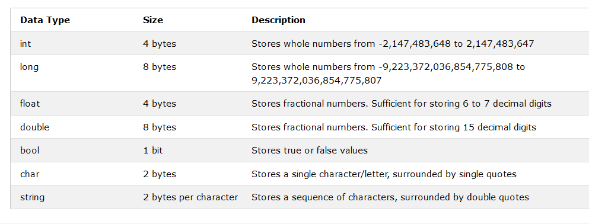
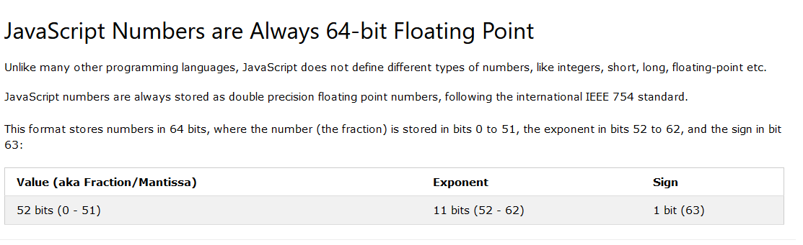
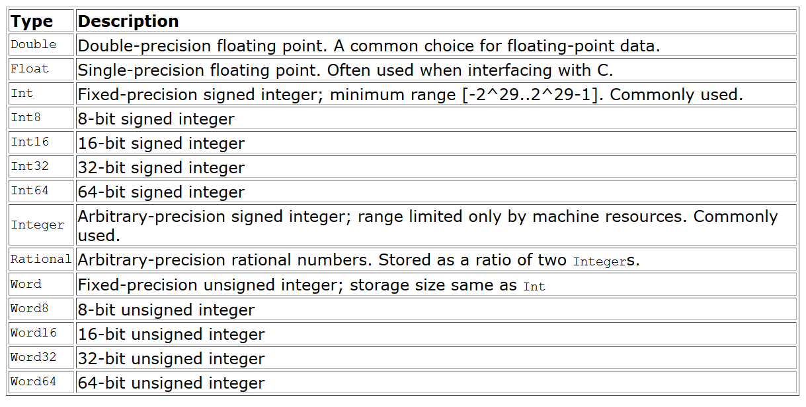

# General information during leetcoding

## Numbers

### CSharp

C#'s `int` type is a 32 bit number



### JS



Max value in JS in `Number.MIN_SAFE_INTEGER` to `Number.MAX_SAFE_INTEGER` which is `-(2^53 - 1)` to `(2^53 - 1)`

### Haskell



---

## Comparing Strings to check Dictionary order

### CSharp

use `string.Compare(string1, string2, StringComparison)` function [msdn](https://docs.microsoft.com/en-us/dotnet/api/system.string.compare?view=netcore-3.1#System_String_Compare_System_String_System_String_System_StringComparison_)

where `StringComparison` is an enum which specifies culture, case sensitivity and order. [msdn](https://docs.microsoft.com/en-us/dotnet/api/system.stringcomparison?view=netcore-3.1)

### JS

Strings are by default compared letter by letter in alphabetical order by directly using `>` or `<` operators.

Some points to note though

- lowercase letter is always greater than uppercase letter (so `'a' > 'Z' > 'A'`)
- Letters with Diacritical marks are out of order (e.g. `'Österreich' > 'Zealand'`) [javascript.info](https://javascript.info/string#comparing-strings)
- All Strings are encoded using `UTF-16`, which means each character has a corresponding code point. The characters are compared by their numeric code. The greater code means that the character is greater. The code for a (97) is greater than the code for Z (90).
- The “right” algorithm to do string comparisons is more complex than it may seem, because alphabets are different for different languages.
- So, the browser needs to know the language to compare.
- Luckily, all modern browsers (IE10- requires the additional library Intl.js) support the internationalization standard `ECMA-402`.
- The call `str.localeCompare(str2)` returns an integer indicating whether str is less, equal or greater than str2 according to the language rules

### Haskell

- we can compare strings directly using the `compare` function which returns the type `Ordering` (`EQ`, `LT`, `GT`)
  - `compare "abc" "abd"` -> LT
  - `compare "A" "a"` -> LT

---

## UTF-8 vs UTF-16

[reading](http://www.differencebetween.net/technology/difference-between-utf-8-and-utf-16/)

- UTF-8 and UTF-16 are both used for encoding characters, (encoding unicode to bytes).
- UTF-8 uses One byte at the minimum in encoding the characters while UTF-16 uses Two.
- UTF-8 is compatible with ASCII while UTF-16 is incompatible with ASCII
- UTF-8 is byte oriented format and therefore has no problems with byte oriented networks or file. UTF-16, on the other hand, is not byte oriented and needs to establish a byte order in order to work with byte oriented networks.
- UTF-8 is also better in recovering from errors that corrupt portions of the file or stream as it can still decode the next uncorrupted byte. UTF-16 does the exact same thing if some bytes are corrupted but the problem lies when some bytes are lost. The lost byte can mix up the following byte combinations and the end result would be garbled.

---

### Tips

#### Getting the last digit

```js
pop = x % 10; // this gives us the last digit
x = x / 10; // this removes the last digit

// push a digit to the end of another number rev
rev = rev * 10 + pop;
```

#### Check number Palindrome without conversion to string

- we can pop and fetch the last digits of the input by the above method, till the resulting number <= the original number. (that is, the number of digits in the resulting number are less than or equal to the original number modified)
- then in the end we check if `rev == x || rev == x / 10`
- for JS, `/` gives back a float, while it gives an `int` in C# for two ints, so we need to drop the floating point numbers in JS by either `Math.floor` or `parseInt`
