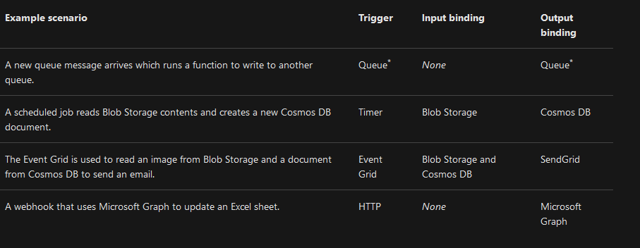
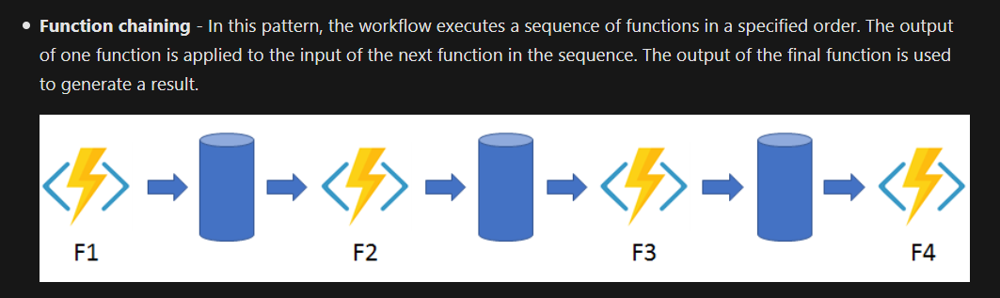
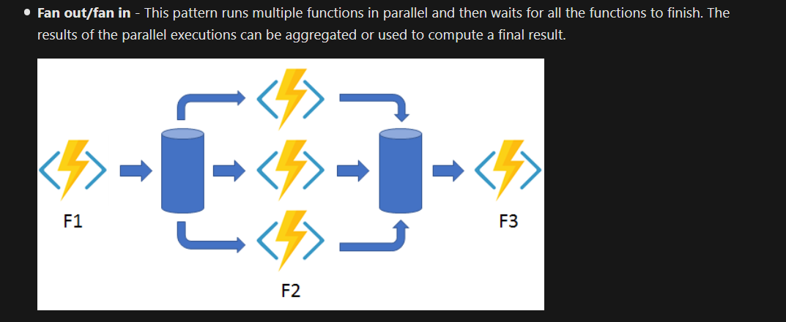
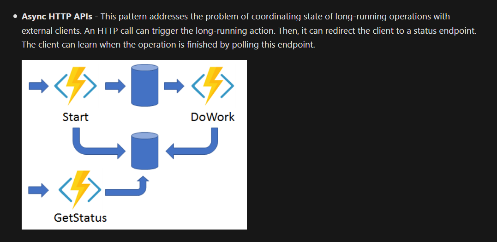
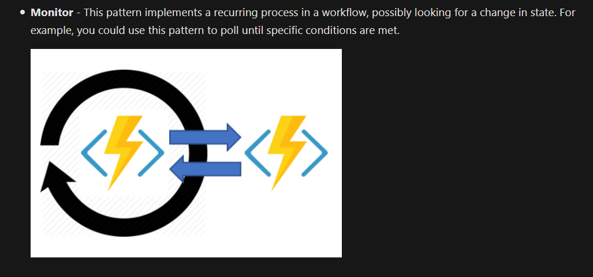
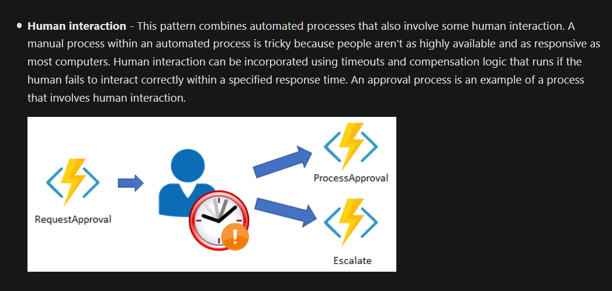
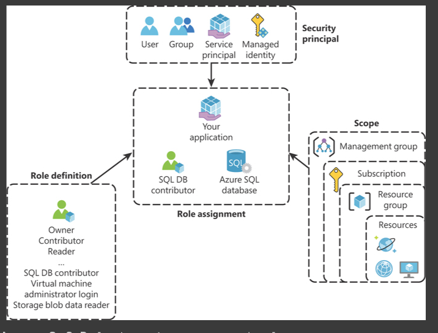
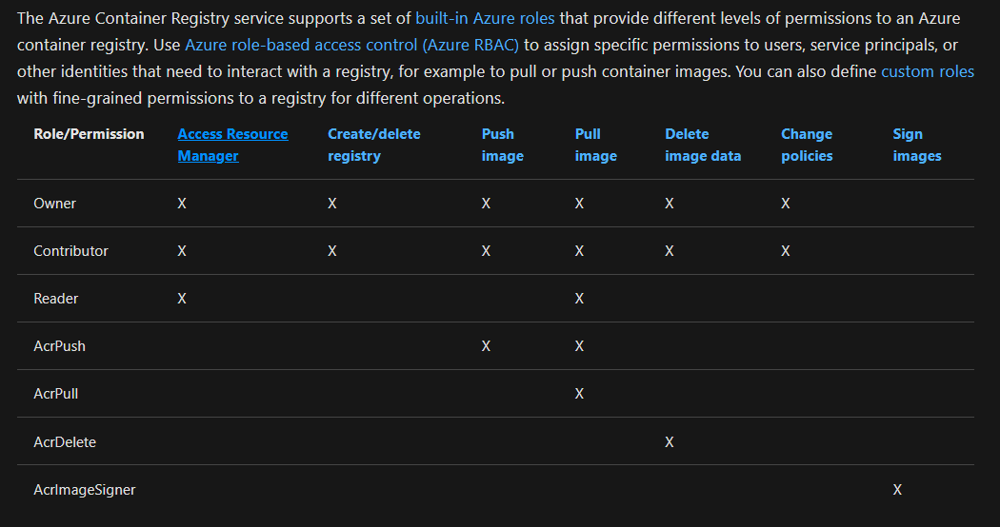

## 1 - Azure Functions

Business processes modeled in software are often called **workflows**. Azure includes four different technologies that you can use to build and implement workflows that integrate multiple systems:

The first two are **Design-First** Technologies, while the latter are **Code-first**.

- Logic Apps
  - for devs and IT Pros
  - GUI based
  - can also edit workflows in JSON
  - 200 connectors are available
  - A connector is a Logic Apps component that provides an interface to an external service.
  - For example, the Twitter connector
- Microsoft Power Automate

  - for office workers and business analysts
  - Build on top of logic app
  - fully GUI based
  - handles the following four different types of flows
    - Automated: A flow that is started by a trigger from some event. For example, the event could be the arrival of a new tweet or a new file being uploaded.
    - Button: Use a button flow to run a repetitive task with a single click from your mobile device.
    - Scheduled: A flow that executes on a regular basis such as once a week, on a specific date, or after 10 hours.
    - Business process: A flow that models a business process such as the stock ordering process or the complaints procedure.

- WebJobs

  - WebJobs are a part of the Azure App Service that you can use to run a program or script automatically. There are two kinds of WebJob:
  - Continuous. These WebJobs run in a continuous loop. For example, you could use a continuous WebJob to check a shared folder for a new photo.
  - Triggered. These WebJobs run when you manually start them or on a schedule.
  - You may choose WebJobs for the following reasons:
    - You want the code to be a part of an existing App Service application and to be managed as part of that application, for example in the same Azure DevOps environment.
    - You need close control over the object that listens for events that trigger the code. This object in question is the `JobHost` class, and you have more flexibility to modify its behavior in WebJobs.

- Azure Functions
  - The diff with WebJobs is that they do not provide close control of the `JobHost` class
  - `JobHost` class is the object that listens for events that trigger the code

**Notes**:

1. Microsoft Power Automate permit the creative team, who are not developers, to manage a process
2. WebJobs are the only technology that permits developers to control retry policies. So, they are useful in uncertain conditions where we want to ensure success.
3. Azure Logic Apps is the only one of the four technologies that provides a design-first approach intended for developers.
4. Webjobs can be made part of the existing app service, but...
5. Its not necessary to write a WebJob as part of the existing Azure App Service application, because you want to manage the procedure code separately.

### Azure Functions

- Azure Functions are Event triggered. The type of event that starts the function is called a **trigger**.

- **Note:** Every Azure Function must have exactly one trigger associated with it. If you want to use multiple triggers, you must create multiple functions.

#### Bindings

Bindings are a declarative way to connect data and services to your function. Bindings know how to talk to different services, which means you don't have to write code in your function to connect to data sources and manage connections.

#### Timer Trigger

- A timer trigger is a trigger that executes a function at a consistent interval. To create a timer trigger, you need to supply two pieces of information.

  - A Timestamp parameter name, which is simply an identifier to access the trigger in code.
  - A Schedule, which is a CRON expression that sets the interval for the timer.

##### CRON Expression

- A CRON expression is a string that consists of six fields that represent a set of times.

- The order of the six fields in Azure is: `{second}` `{minute}` `{hour}` `{day}` `{month}` `{day of the week}`.

- For example: A Trigger that executes every five minutes `"0 */5 * * * *"`

  - `*` Selects every value in a field. An asterisk `"*"` in the day of the week field means every day.
  - `,` Separates items in a list. A comma "1,3" in the day of the week field means just Mondays (day 1) and Wednesdays (day 3).
  - `-` Specifies a range. A hyphen "10-12" in the hour field means a range that includes the hours 10, 11, and 12.
  - `/` Specifies an increment A slash `"/10"` in the minutes field means an increment of every 10 minutes.

#### Http Trigger

- An HTTP trigger Authorization level is a flag that indicates if an incoming HTTP request needs an API key for authentication reasons.

- There are three Authorization levels:

  - Function
  - Anonymous
  - Admin

The Function and Admin levels are "key" based. To send an HTTP request, you must supply a key for authentication.

There are two types of keys: function and host. The difference between the two keys is their scope. Function keys are specific to a function.

Host keys apply to all functions inside the function app. If your Authorization level is set to Function, you can use either a function or a host key. If your Authorization level is set to Admin, you must supply a host key.

The Anonymous level means that there's no authentication required.

### Triggers vs Bindings

Triggers are what cause a function to run. A trigger defines how a function is invoked and a function must have exactly one trigger. Triggers have associated data, which is often provided as the payload of the function.

Binding to a function is a way of declaratively connecting another resource to the function; bindings may be connected as input bindings, output bindings, or both. Data from bindings is provided to the function as parameters.

You can mix and match different bindings to suit your needs. Bindings are optional and a function might have one or multiple input and/or output bindings.

Triggers and bindings let you avoid hardcoding access to other services. Your function receives data (for example, the content of a queue message) in function parameters. You send data (for example, to create a queue message) by using the return value of the function.



#### What is a binding expression?

A binding expression is specialized text in function.json, function parameters, or code that is evaluated when the function is invoked to yield a value. For example, if you have a Service Bus Queue binding, you could use a binding expression to get the name of the queue from App Settings.
Types of binding expressions

- App settings
- Trigger file name
- Trigger metadata
- JSON payloads
- New GUID
- Current date and time

### Best Practices on protecting Azure Function

Protecting your endpoints using the authorization keys is not a recommended practice for production environments. You should only use authorization keys on testing or development environments for controlling the access to your API. For a production environment, you should use one of the following approaches:

- **Enable Function App Authorization/Authentication** This integrates your API with Azure Active Directory or other third-party identity providers to authenticate clients.
- **Use Azure API Management (APIM)** This secures the incoming request to your API, such as filtering by IP address or using authentication based on certificates.
- **Deploy your function in an App Service Environment (ASE)** - ASEs provides dedicated hosting environments that allow you to configure a single front-end gateway that can authenticate all incoming requests.

### Configuring Logging

Logging is configured in `host.json` file

### `host.json` vs `function.json`

The `host.json` metadata file contains global configuration options that affect all functions for a function app. Things like

- Application Insights and logging
- retry policy (fixedDelay or exponentialBackOff)
- watch Directories
- singleton?

We define bindings in `function.json`

---

## Durable Azure Functions

Durable Functions is an extension of Azure Functions that enables you to perform long-lasting, stateful operations in Azure.

Some benefits of using Durable Functions include:

- They enable you to write event driven code. A durable function can wait asynchronously for one or more external events, and then perform a series of tasks in response to these events.
- You can chain functions together. You can implement common patterns such as fan-out/fan-in, which uses one function to invoke others in parallel, and then accumulate the results.
- You can orchestrate and coordinate functions, and specify the order in which functions should execute.
- The state is managed for you. You don't have to write your own code to save state information for a long-running function.

#### Durable Function Types

You can use three durable function types: Client, Orchestrator, and Activity.

**Client functions** are the entry point for creating an instance of a Durable Functions orchestration. They can run in response to an event from many sources, such as a new HTTP request arriving, a message being posted to a message queue, an event arriving in an event stream. You can write them in any of the supported languages.

**Activity functions** are the basic units of work in a durable function orchestration. An activity function contains the actual work performed by the tasks being orchestrated.

These are the functions that do the real work. An activity is a job that you need your workflow to do. For example, you may need your code to send a document to a content reviewer before other activity can publish the document, or you need to create a shipment order to send products to a client.

**Orchestrator functions** describe how actions are executed, and the order in which they are run. You write the orchestration logic in code (C# or JavaScript).

#### Application Patterns for Durable Functions







#### Durable Functions vs Logic Apps

With Azure Durable Functions, you develop orchestrations by writing code and using the Durable Functions extension.

With Logic Apps, you create orchestrations by using the design surface or editing configuration files.

## Azure CLI commands to create web app service and web app

```
az appservice plan create \
--resource-group azuremolchapter11 \
--name appserviceeastus \
--location eastus \
--sku S1

az webapp create \
--resource-group azuremolchapter11 \
--name azuremoleastus \
--plan appserviceeastus \
--deployment-local-git

```

---

## Azure Storage Queues, Azure Event Hubs, Azure Event Grid, Azure Service Bus

#### Messages vs Events

##### Messages

- A message contains raw data, produced by one component, that will be consumed by another component.
- A message contains the data itself, not just a reference to that data.
- The sending component expects the message content to be processed in a certain way by the destination component. The integrity of the overall system may depend on both sender and receiver doing a specific job.

##### Events

Events are the data messages passing through Event Grid that describe what has taken place. Each event is self-contained, can be up to 64 KB, and contains several pieces of information based on a schema defined by Event Grid

- Events are lighter weight than messages, and are most often used for broadcast communications. The components sending the event are known as publishers, and receivers are known as subscribers.
- With events, receiving components will generally decide in which communications they are interested, and will "subscribe" to those events.
- The subscription is managed by an intermediary, like Azure Event Grid or Azure Event Hubs.

Characteristics:

- An event is a lightweight notification that indicates that something happened.
- The event may be sent to multiple receivers, or to none at all.
- Events are often intended to "fan out," or have a large number of subscribers for each publisher.
- The publisher of the event has no expectation about the action a receiving component takes.
- Some events are discrete units and unrelated to other events.
- Some events are part of a related and ordered series.

#### Azure Queue Storage

- Queue storage is a service that uses Azure Storage to store large numbers of messages that can be securely accessed from anywhere in the world using a simple REST-based interface. Queues can contain millions of messages, limited only by the capacity of the storage account that owns it.

NOTE: The delete request for each Azure Queue Storage message is generated by the consumer. When the Queue sends a message to a client, it waits 30 seconds for a succes response from the client, during which time the message is temporarily hidden from other clients. If a success response is received within 30 seconds, the message is deleted from the Queue, else the message comes back to the Queue and is sent to a different client.

##### Message Delivery gaurantees

- **At-Least-Once Delivery**: In this approach, each message is guaranteed to be delivered to at least one of the components that retrieve messages from the queue. Note, however, that in certain circumstances, it is possible that the same message may be delivered more than once.
- **At-Most-Once Delivery**: In this approach, each message is not guaranteed to be delivered, and there is a very small chance that it may not arrive. However, unlike At-Least-Once delivery, there is no chance that the message will be delivered twice. This is sometimes referred to as "automatic duplicate detection".
- **First-In-First-Out (FIFO)**: In most messaging systems, messages usually leave the queue in the same order in which they were added, but you should consider whether this order is guaranteed. If your distributed application requires that messages are processed in precisely the correct order, you must choose a queue system that includes a FIFO guarantee.

##### Transaction Support

Messages in a Queue can be grouped into a transaction, so that all messages succeed or fail as a single unit.

#### Azure Service Bus Queues

- Service Bus is a message broker system intended for enterprise applications. These apps often utilize multiple communication protocols, have different data contracts, higher security requirements, and can include both cloud and on-premises services. Service Bus is built on top of a dedicated messaging infrastructure designed for exactly these scenarios.

Service Bus enables clients to send and receive messages via one of three protocols:

- Advanced Message Queuing Protocol (AMQP)
- Service Bus Messaging Protocol (SBMP)
- Hypertext Transfer Protocol (HTTP)

AMQP is the most efficient, because it maintains the connection to Service Bus. It also implements batching and prefetching.

#### Service Bus Performance imporvements

Service Bus client objects, such as implementations of `IQueueClient` or `IMessageSender`, should be registered for dependency injection as singletons (or instantiated once and shared)

Use Storage queues when you want a simple and easy-to-code queue system. For more advanced needs, use Service Bus queues. If you have multiple destinations for a single message, but need queue-like behavior, use topics.

Client-side batching enables a queue or topic client to delay the sending of a message for a certain period of time. If the client sends additional messages during this time period, it transmits the messages in a single batch.

To increase the throughput of a queue, topic, or subscription, Service Bus batches multiple messages when it writes to its internal store. If enabled on a queue or topic, writing messages into the store will be batched. If enabled on a queue or subscription, deleting messages from the store will be batched. If batched store access is enabled for an entity, Service Bus delays a store write operation regarding that entity by up to 20 ms.

There is no risk of losing messages with batching, even if there is a Service Bus failure at the end of a 20ms batching interval.

Prefetching enables the queue or subscription client to load additional messages from the service when it performs a receive operation. The client stores these messages in a local cache. The size of the cache is determined by the QueueClient.PrefetchCount or SubscriptionClient.PrefetchCount properties.

When a message is prefetched, the service locks the prefetched message. With the lock, the prefetched message cannot be received by a different receiver. If the receiver cannot complete the message before the lock expires, the message becomes available to other receivers.

#### Azure Service Bus Topics

- Azure Service Bus topics are like queues, but can have multiple subscribers. When a message is sent to a topic instead of a queue multiple components can be triggered to do their work.

#### Choose Service Bus Topics if

- you need multiple receivers to handle each message

#### Choose Service Bus queues if

- You need an At-Most-Once delivery guarantee.
- You need a FIFO guarantee.
- You need to group messages into transactions.
- You want to receive messages without polling the queue.
- You need to provide a role-based access model to the queues.
- You need to handle messages larger than 64 KB but less than 256 KB.
- Your queue size will not grow larger than 80 GB.
- You would like to be able to publish and consume batches of messages.

#### Choose Queue storage if:

- You need an audit trail of all messages that pass through the queue.
- You expect the queue to exceed 80 GB in size.
- You want to track progress for processing a message inside of the queue.

## Azure Event Grid

Azure Event Grid is a fully-managed event routing service running on top of Azure Service Fabric. Event Grid distributes events from different sources, such as Azure Blob storage accounts or Azure Media Services, to different handlers, such as Azure Functions or Webhooks.

There are several concepts in Azure Event Grid that connect a source to a subscriber:

- Events: What happened.
- Event sources: Where the event took place.
- Topics: The endpoint where publishers send events.
- Event subscriptions: The endpoint or built-in mechanism to route events, sometimes to multiple handlers. Subscriptions are also used b- handlers to filter incoming events intelligently.
- Event handlers: The app or service reacting to the event.

### Use Event Grid when you need these features:

- Simplicity: It is straightforward to connect sources to subscribers in Event Grid.
- Advanced filtering: Subscriptions have close control over the events they receive from a topic.
- Fan-out: You can subscribe to an unlimited number of endpoints to the same events and topics.
- Reliability: Event Grid retries event delivery for up to 24 hours for each subscription.
- Pay-per-event: Pay only for the number of events that you transmit.

what if we want to deliver a large stream of events? In this scenario, Event Grid isn't a great solution because it's designed for one-event-at-a-time delivery. Instead, we need to turn to another Azure service: Event Hubs.

## Azure Event Hub

Event Hubs is an intermediary for the publish-subscribe communication pattern. Unlike Event Grid, however, it is optimized for extremely high throughput, a large number of publishers, security, and resiliency.

Event Hubs lets you build a big data pipeline capable of processing millions of events per second with low latency. It can handle data from concurrent sources and route it to a variety of stream-processing infrastructures and analytics services. It enables real-time processing and supports repeated replay of stored raw data.

Publishers can use either HTTPS or AMQP (Advanced Message Queuing Protocol). AMQP opens a socket and can send multiple messages over that socket.

Event Hubs default to 4 partitions. Partitions are the buckets within an Event Hub. Each publication will go into only one partition. Each consumer group may read from one or more than one partition.

The maximum size for a single publication (individual or batch) that is allowed by Azure Event Hub is 1 MB.

Some used of Event Hub

- Anomaly Detection (fraud/outliers)
- Application Logging
- Analytics pipelines, such as click streams.
- Live dashboarding
- Archiving data
- Transaction processing
- user telemetry processing
- device telemetry streaming

### Choose Event Hubs if:

- You need to support authenticating a large number of publishers.
- You need to save a stream of events to Data Lake or Blob storage. (Enabled by Azure Event Hub Capture), the data is stored in Apache Avro Format.
- You need aggregation or analytics on your event stream.
- You need reliable messaging or resiliency.

Otherwise, if you need a simple event publish-subscribe infrastructure, with trusted publishers (for instance, your own web server), you should choose Event Grid.

---

## How to choose a communications technology

### Consider the following questions:

- Is the communication an event? If so, consider using Event Grid or Event Hubs.

- Should a single message be delivered to more than one destination? If so, use a Service Bus topic. Otherwise, use a queue.

#### If you decide that you need a queue:

Choose Service Bus queues if:

- You need an at-most-once delivery guarantee
- You need a FIFO guarantee
- You need to group messages into transactions
- You want to receive messages without polling the queue
- You need to provide role-based access to the queues
- You need to handle messages larger than 64 KB but smaller than 256 KB
- Your queue size will not grow larger than 80 GB
- You would like to be able to publish and consume batches of messages

#### Choose queue storage if:

- You need a simple queue with no particular additional requirements
- You need an audit trail of all messages that pass through the queue
- You expect the queue to exceed 80 GB in size
- You want to track progress for processing a message inside of the queue

Although the components of a distributed application can communicate directly, you can often increase the reliability of that communication by using an intermediate communication platform such as Azure Service Bus or Azure Event Grid.

Event Grid is designed for events, which notify recipients only of an event and do not contain the raw data associated with that event. Azure Event Hubs is designed for high-flow analytics types of events. Azure Service Bus and storage queues are for messages, which can be used for binding the core pieces of any application workflow.

If your requirements are simple, if you want to send each message to only one destination, or if you want to write code as quickly as possible, a storage queue may be the best option. Otherwise, Service Bus queues provide many more options and flexibility.

---

Questions:

1. Which of the following queues should you use if you need first-in-first-out order and support for transactions?

- Azure Service Bus queues
- Azure Storage queues

Answer: Even though a queue is a first-in-first-out data structure, Azure Storage queues do not guarantee it. Azure Service Bus queues handle messages in the same order they're added and also support transactions. This means that if one message in a transaction fails to be added to the queue, all messages in the transaction will not be added.

2. Suppose you're sending a message with Azure Service Bus and you want multiple components to receive it. Which Azure Service Bus exchange feature should you use?

- Queue
- Topic
- Relay

Answer: A queue can only have one destination component at a time, which means that each message in the queue is delivered to only one receiver. A relay is used for two-way communication and it provides bidirectional connections across network boundaries. A topic allows multiple destination components to subscribe. This means that each message can be delivered to multiple receivers.

- An Azure Service Bus queue message must be larger than 64 KB but smaller than 256 KB.

---

## Azure Cosmos DB

- Cosmos DB allows us to store our data using Key-Value, Column-Family, Documents or Graph approaches

- APIs : SQL, Table, Cassandra, MongoDB, Gremlin

### Partitioning Schemes

Azure places the data in cosmos DB in different server to accommodate performance and throughput, which is dones using partitions.

Two different types of Partitions

- Logical - partition on our custom partition criteria (partition key)
- Physical - group of replicas of our data physically stored on the servers.

Logical Partition has a limit of 20GB for storing data.

Logical Partition also have an upper throuhput limit.

Choosing the correct partition key is critical for achieving the best performance. The reason choosing the proper partition key is so important is because Azure creates a logical partition for each distinct value of your partition key.

Using the id property as the partition key means that you end with a logical partition with a single document on each partition. This configuration can be beneficial when your application usually performs read workloads and uses parallelization techniques for getting the data.

On the other hand, if you select a partition key with just a few possible values, you can end with “hot” partitions. A “hot” partition is a partition that receives most of the requests when working with your data. The main implication for these “hot” partitions is that they usually reach the throughput limit for the partition, which means you need to provision more throughput.

The minimum throughput limit is different from databases to containers. The minimum throughput for databases is 100 request units per second (RU/s). The minimum throughput for containers is 400 RU/s.

Choose partition keys with a wide range of values and access patterns that can evenly distribute requests across logical partitions. This allows you to achieve the right balance between being able to execute cross-document transactions and scalability. Using timestamp-based partition keys is usually a lousy choice for a partition key.

#### Choosing the right Partition Key

The choice should balance the need to enable the use of EGTs aka Entity Group Transactions (to ensure consistency) against the requirement to distribute your entities across multiple partitions (to ensure a scalabale solution)

At one extreme, you can store all your entities in a single partition. But this might limit the scalability of your solution, and would prevent Table storage from being able to load-balance requests.

At the other extreme, you can store one entity per partition. This is highly scalable and enables Table storage to load-balance requests, but prevents you from using entity group transactions.

An ideal PartitionKey enables you to use efficient queries, and has sufficient partitions to ensure your solution is scalable. Typically, you'll find that your entities will have a suitable property that distributes your entities across sufficient partitions.

In Cosmos DB, the second part of a Primary Key is **RowKey** property, a unique identifier for an entity within a given partition. Together, `PartitionKey` and `RowKey` uniquely identify every enttity within a table.

#### EGTs

In Table storage, entity group transactions (EGTs) are the only built-in mechanism for performing atomic updates across multiple entities. EGTs are also referred to as batch transactions. EGTs can only operate on entities stored in the same partition (sharing the same partition key in a particular table), so anytime you need atomic transactional behavior across multiple entities, ensure that those entities are in the same partition. This is often a reason for keeping multiple entity types in the same table (and partition), and not using multiple tables for different entity types. A single EGT can operate on at most 100 entities. If you submit multiple concurrent EGTs for processing, it's important to ensure that those EGTs don't operate on entities that are common across EGTs. Otherwise, you risk delaying processing.

### Consistency Levels

Replication of Data across regions (one of the advantage of Cosmos DB) has a drawback - the consistency of our data.

To avoid corruption, your data needs to be consistent between all copies of your database. Fortunately, the Cosmos DB protocol offers five levels of consistency replication.

Going from consistency to performance, you can select how the replication protocol behaves when copying your data between all the replicas that are configured across the globe.

- **Strong** - The read operations are guaranteed to return the most recently committed version of an element; that is, the user always reads the latest committed write. This consistency level is the only one that offers a linearizability guarantee. This guarantee comes at a price. It has higher latency because of the time needed to write operation confirmations, and the availability can be affected during failures.

- **Bounded Staleness** - The reads are guaranteed to be consistent within a preconfigured lag. This lag can consist of a number of the most recent (K) versions or a time interval (T). This means that if you make write operations, the read of these operations happens in the same order but with a maximum delay of K versions of the written data or T seconds since you wrote the data in the database. For reading operations that happen within a region that accepts writes, the consistency level is identical to the Strong consistency level. This level is also known as “time-delayed linearizability guarantee.”

- **Session Scoped** - to a client session, this consistency level offers the best balance between a strong consistency level and the performance provided by the eventual consistency level. It best fits applications in which write operations occur in the context of a user session.

- **Consistent Prefix** - This level guarantees that you always read data in the same order that you wrote the data, but there’s no guarantee that you can read all the data. This means that if you write “A, B, C” you can read “A”, “A, B” or “A, B, C” but never “A, C” or “B, A, C.”

- **Eventual** - There is no guarantee for the order in which you read the data. In the absence of a write operation, the replicas eventually converge. This consistency level offers better performance at the cost of the complexity of the programming. Use this consistency level if the order of the data is not essential for your application.

The recommended option for most applications is the level of session consistency.

If you are considering the strong consistency level, we recommend that you use the bonded staleness consistency level because it provides a linearizability guarantee with a configurable delay.

If you are considering the eventual consistency level, we recommend that you use the consistent prefix consistency level because it provides comparable levels of availability and latency with the advantage of guaranteed read orders.

Carefully evaluate the strong and eventual consistency levels because they are the most extreme options. In most situations, other consistency levels can provide a better balance between performance, latency, and data consistency.

---

## Azure Blob Storage

### Soft Delete

The soft delete feature allows us to recover deleted blobs and their snapshots as well.

This protection extends to blob data that is erased as the results of an overwrite.

When data is deleted and soft delete is enabled, the data transitions into a soft delete state instead of being permanently deleted.

The amount of time soft delete data is recoverable is configurable.

### Moving Blob items between containers

1. Create a BlobServiceClient instance for each Storage Account that is involved in the blob item movement.
2. Create a reference for each container. If you need to move a blob item between containers in a different Storage Account, you need to use the BlobServiceClient object that represents each Storage Account.
3. Create a reference for each blob item. You need a reference to the source blob item because this is the item that you are going to move. You use the destination blob item reference for performing the actual copy operation.
4. Once you are done with the copy, you can delete the source blob item by using the DeleteAsync() method.

NOTE: When you need to move a blob to any destination, container, or Storage Account, remember that you need first to perform a copy operation and then delete the source blob. There is no such move method in the CloudBlockBlob class.

### Concurrency issues in Blob Storage and Leasing Blobs

When you are working with the Blob Storage service — in which several users or processes can simultaneously access the same Storage Account — you can face a problem when two users or processes are trying to access the same blob.

Azure provides a leasing mechanism for solving this kind of situation.

A lease is a short block that the blob service sets on a blob or container item for granting exclusive access to that item. When you acquire a lease to a blob, you get exclusive write and delete access to that blob. If you acquire a lease in a container, you get exclusive delete access to the container.

Leasing is the mechanism that you need to use to ensure that no other users or processes can access a blob while you are working with it. You can create timed or infinite leases. Remember that you need to release infinite leases manually.

When you acquire a lease for a storage item, you need to include the active lease ID on each write operation that you want to perform on the blob with the lease. You can choose the duration for the lease time when you request it. This duration can last from 15 to 60 seconds or forever.

Each lease can be in one of the following five states:
• **Available** The lease is unlocked, and you can acquire a new lease.
• **Leased** There is a lease granted to the resource, and the lease is locked. You can acquire a new lease if you use the same ID that you got when you created the lease. You can also release, change, renew, or break the lease when it is in this status.
• **Expired** The duration configured for the lease has expired. When you have a lease on this status, you can acquire, renew, release, or break the lease.
• **Breaking** You have broken the lease, but it’s still locked until the break period expires. In this status, you can release or break the lease.
• **Broken** The break period has expired, and the lease has been broken. In this status, you can acquire, release, and break a lease. You need to break a lease when the process that acquired the lease finishes suddenly, such as when network connectivity issues or any other condition results in the lease not being released correctly. In these situations, you may end up with an orphaned lease, and you cannot write or delete the blob with the orphaned lease. In this situation, the only solution is to break the lease. You may also want to break a lease when you need to force the release of the lease manually.

if some other process or user modifies the blob while our process is copying the data, we get an error. You can avoid that situation by acquiring a lease for the blob that you want to move.

An infinite lease is created by using a value of -1 for TimeSpan

### Blob Storage Tiers, data archiving and retention

These different access levels, or tiers, provide different levels of performance when accessing the data. Each different access level has a different price.

- **Hot** - You use this tier for data that you need to access more frequently. This is the default tier that you use when you create a new Storage Account.
- **Cool** - You can use this tier for data that is less frequently accessed and is stored for at least 30 days.
- **Archive** You use this tier for storing data that is rarely accessed and is stored for at least 180 days. This access tier is available only at the blob level. You cannot configure a Storage Account with this access tier.

* Archive storage is offline storage. It has the lowest storage cost rates but has higher access costs.
* The lower the storage costs, the higher the access costs.
* You can use storage tiering only on General Purpose v2 (GPv2) Storage Accounts.

Moving between the different access tiers is a transparent process for the user, but it has some implications in terms of pricing.

In general, when you are moving from a warmer tier to a cooler tier—hot to cool or hot to archive—you are charged for the write operations to the destination tier.

When you move from a cooler tier to a warmer tier—from the archive to cold or from cold to hot—you are charged for the read operations from the source tier.

Another essential thing to bear in mind is how the data is moved when you change your data tier from archive to any other access tier. Because data in the archive tier is saved into offline storage, when you move data out of the access tier, the storage service needs to move the data back to online storage. This process is known as blob rehydration and can take up to 15 hours.

Instead of manually monitoring the different criteria for moving a blob from one tier to another, you can implement **policies** that make that movement based on the criteria that you define.

A **lifecycle management policy** is a JSON document in which you define several rules that you want to apply to the different containers or blob types. Each rule consists of a filter set and an action set.

- **Filter set** The filter set limits the actions to only a group of items that match the filter criteria.
- **Action set** You use this set to define the actions that are performed on the items that matched the filter.

### Copying data between storage accounts

- AzCopy is a command-line utility that you can use to copy blobs or files to or from a storage account.

Two ways to Authenticate with AzCopy

- Azure AD:

  - If you just want to download files, then verify that the **Storage Blob Data Reader** has been assigned to your user identity, managed identity, or service principal.
  - If you want to upload files, then verify that one of these roles has been assigned to your security principal:
    - Storage Blob Data Contributor
    - Storage Blob Data Owner

- Azure Managed Identity (used to w/o user interactions)

---

## OAuth2 Roles

- **Resource owner**: This is the person or entity that can grant access to the resources. If the resource owner is a person, it can also be referred to as the user.
- **Resource server** This is the server that hosts the resources that you want to share. This server needs to be able to accept and respond to the access codes used for accessing the resource.
- **Client** This is the third-party application that needs to access the resource. The client makes the needed requests to the resource server on behalf of the resource owner. The term “client” does not necessarily imply any specific implementation, like a server, a desktop, or any other kind of device.
- **Authorization server** This is the server that issues the access token to the client for accessing the resources. The client needs to be authenticated before it can get the correct token.
- **Authentication request** The client requests access to the protected resource. The resource owner, based on the privileges of the client, grants access to the client for accessing the resource. The authentication of the client can be directly done by the resource owner or preferably by the authentication server.
- **Protected resource** This is the resource that the client wants to access. The resource server protects the resource. The client needs to send the access token to the resource server every time it needs to access the resource.
- **Authentication grant** When the resource owner grants the client access to the resource, the client sends an authentication grant, which is a code or credential that represents the permission to access the resource, which has been granted by the resource owner. The client uses this authentication grant credential to request an access token to the authorization server. There are four different mechanisms for handling this authentication:
  - **Authorization code** The client instructs the resource owner to request authentication to the authentication server. Once the resource owner is authenticated, the authentication server creates an authorization code that the resource owner sends back to the client. The client uses this authorization code as the grant for requesting the access token.
  - **Implicit** Using this authentication grant flow, the authentication server does not authenticate the client. Instead, the client gets the access token without needing to authenticate to the resource server using an authentication grant. This implicit flow is a simplified authorization code flow. To improve security in this flow, the resource server uses the redirect URI provided by the client.
  - **Resource owner credentials** Instead of using an authorization code or implicit authentication, the client uses the credentials of the resource owner for authenticating against the resource server. This type of authentication grant should be used only when there is a high level of trust between the client and the resource owner.
  - **Client credentials** The client provides his or her credentials for accessing the resource. This authentication grant is useful for scenarios in which the client needs access to resources that are protected by the same authorization server as the client and are under 135the control of the client. This type of authentication grant is also useful if the resource server and the client arranged the same authorization for the resources and the client.
  - **Access token** The client requests an access token from the authorization server that allows the client to access the resource on the resource server. The client sends this access token to the resource server with each request to access the resource. This access token has an expiration date. Once the access token is expired, the token is invalid, and the client needs to request another access token. To ease the process of renewing the access token, the authentication server provides two different tokens—the actual access token and a refresh token. The client uses the refresh token when it needs to renew an expired access token.

---

## Shared Access Signatures (SAS) & Shared Key Authorization

- These two are used for authorization on Azure Storage

- **Shared Key Authorization**:

  - You use one of the two access keys configured at the Azure Storage account level to construct the correct request for accessing the Azure Storage account resources.
  - You need to use the Authorization Header for using the access key in your request.
  - The access key provides access to the entire Azure Storage account and all its containers, such as blobs, files, queues, and tables.
  - You can consider Azure Storage account keys to be like the root password of the Azure Storage account.
  - The drawback of using shared access keys is that if either of the two access keys is exposed, the Azure Storage account and all the containers and data in the Azure Storage account are also exposed. The access keys also allow us to create or delete elements in the Azure Storage account.

- **Shared Access Signatures**:

  - You use Shared Access Signatures (SAS) for narrowing the access to specific containers inside the Storage Account.
  - The advantage of using SAS is that you don’t need to share the Azure Storage account’s access key.
  - You can also configure a higher level of granularity when setting access to your data.

Shared access signatures provide you with a mechanism for sharing access with clients or applications to your Azure Storage account without exposing the entire account. You can configure each SAS with a different level of access to each of the following:

- **Services** You can configure SAS for granting access only to the services that you require, such as blob, file, queue, or table.
- **Resource types** You can configure access to a service, container, or object. For the Blob service, this means that you can configure the access to API calls at the service level, such as list containers.
- **Permissions** Configure the action or actions that the user is allowed to perform in the configured resources and services.
- **Date expiration** You can configure the period for which the configured SAS is valid for accessing the data.
- **IP addresses** You can configure a single IP address or range of IP addresses that are allowed to access your storage.
- **Protocols** HTTPS only or both HTTP and HTTPS

Azure Storage uses the values of previous parameters for constructing the signature that grants access to your storage. You can configure three different types of SAS:

- **User delegation SAS** This type of SAS applies only to Blob Storage. You use an Azure Active Directory user account for securing the SAS token. A user delegation SAS is secured with Azure AD credentials.
- **Account SAS** Account SAS controls access to the entire Storage Account. You can also control access to operations at the service level, like getting service stats or getting or setting service properties. You need to use the storage account key for securing this kind of SAS.
- **Service SAS** Service SAS delegates access to only specific services inside the Storage Account. You need to use the storage account key for securing this kind of SAS.

Regardless of the SAS type, you need to construct a SAS token for access. You append this SAS token to the URL that you use for accessing your storage resource. One of the parameters of a SAS token is the signature. The Azure Storage Account service uses this signature to authorize access to the storage resources. The way you create this signature depends on the SAS type that you are using.

For user delegation SAS, you need to use a user delegation key created using Azure Active Directory (Azure AD) credentials.
The user used for creating this delegation key needs to have granted the `Microsoft.Storage/storageAccounts/blobServices/generateUserDelegationKey/action` Role-Base Access Control permission.

For service or account SAS, you need to use the Azure Storage Account key for creating the signature that you have to include in the SAS token.

One drawback of using this approach is that anyone who has access to the SAS URL can access the information protected by that SAS. You can improve the security of the SAS tokens by creating a **Stored Access Policy** and attaching the policy to the SAS token. Stored Access Policies allows you to define access policies that are associated and stored with the table that you want to protect. When you define a Stored Access Policy, you provide an identifier to the policy. Then you use this identifier when you construct the Service SAS token. You need to include this identifier when you construct the signature that authenticates the token and is part of the SAS itself.

The advantage of using a Stored Access Policy is that you define and control the validity and expiration of the policy without needing to modify the Service SAS token. Using a Stored Access Policy also improves security by hiding the details of the Access Policy from the user, as you just provide the name of the Stored Access Policy. You can associate up to five different stored access policies.

If you plan to work with user delegation SAS, you need to consider that this type of SAS is available only for Azure Blob Storage and Azure Data Lake Storage Gen2. You cannot use either Stored Access Policies when working with user delegation SAS.

---

## Azure Active Directory

Microsoft provides OAuth2 authentication through its Azure Active Directory identity service.

Before your application can use the Azure Active Directory service for authenticating your application’s users, you need to register the application in your Azure Active Directory tenant.

When you are registering your application, there are some points that you need to consider before proceeding to the registration:

- **Supported account types** You need to consider whether the users of your application would be
  - Users from your organization
  - Users from any organization
  - Users from any organization or Microsoft
- **Platform**: The OAuth2 authentication is not limited to web applications. You can also use this type of authentication with mobile platforms, like iOS or Android, or desktop platforms, like macOS, Console, IoT, Windows, or UWP.

When registering an app, `redirect Url`, `Certifcates and Secrets` & API permissions are critical settings we need to consider.

When you are registering a new application in your Azure Active Directory tenant, you need to consider which will be your target user. If you need for any user from any Azure Active Directory organization to be able to log into your application, you need to configure a multitenant app. In those multitenant scenarios, the app registration and management is always performed in your tenant and not in any other external tenant.

---

## Role Based Access Control (RBAC)

Built on top of the Azure Resource Manager, RBAC provides fine-grained access control to the different resources in an Azure subscription.

When working with RBAC, you need to consider the following concepts:

- **Security principal** This is the entity that requests permission for doing an action. A security principal can be one of the following:
  - **User** This is an individual who has a profile in an Azure Active Directory tenant. You are not limited to your own tenant. You can assign a role to users in other tenants as well.
  - **Group** This is a set of users.
  - **Service principal** This is like a user for an application. A service principal represents an application inside the tenant.
  - **Managed identity** This kind of identity represents cloud applications that need to access resources in your Azure tenant. Azure automatically manages this kind of identity.
- **Permission** This is the action that you can perform with a resource. An example of an action would be requesting a user delegation key for creating a SAS token. Another example of an action is listing the content of a container. You cannot directly assign a role to a security principal. You always need to use a role or role definition.
- **Role definition** Usually known as just role for short, a role definition is a collection of permissions. You assign a role to a security principal. There are a lot of predefined roles in Azure that you can use for managing access to the resources.
  - There are four fundamental roles:
    - **Owner** Grants full access to all resources in the scope.
    - **Contributor** Grants modify access to all resources in the scope. You can perform all modification operations, including deleting, with the resources in the scope. You cannot grant roles to other security principals.
    - **Reader** Grants read access to all resources in the scope.
    - **User** Access Administrator Useful only for managing user access to Azure resources.
    - Aside from these four fundamental built-in roles, there are roles specific to each service, like Virtual Machine Contributor or Cosmos DB Account Reader.
- **Scope** This is the group of resources where you assign the role. You can set a role at four different levels: _management group_ (a group of subscriptions), _subscription_, _resource group_, and _resource_. These four levels are organized in a parent-child relationship where the management group is the highest level and resource is the lowest. When you assign a role to level, those permission are inherited by the lower levels. That means that if you grant the Owner role to a user at the subscription level, that user has the Owner privileges in all the resource groups and resources in that subscription.
- **Role assignment** This is the junction between the different pieces of RBAC. A role assignment connects a security principal with a role and a scope.



When you are assigning specific service roles, carefully review the permissions granted by the role. In general, granting access to a resource doesn’t grant access to the data managed by that resource. For example, the Storage Account Contributor grants access for managing Storage Accounts but doesn’t grant access to the data itself.

---

## Azure App Configuration and Azure Key Vault and Managed Identities

**Azure App Configuration** is the appropriate service for securely storing your app configuration settings in centralized storage. Although the Azure App Configuration store provides secure storage by encrypting the value of the key-value pairs representing your settings, you should use Key Vault references in your Azure App Configuration store for that sensitive information that requires a higher level of security. Azure Key Vault uses hardware-based encryption for storing keys, secrets, and certificates.

App Configuration provides two options for organizing keys:

- Key prefixes
- Labels

You can use either one or both options to group your keys.

Key prefixes are the beginning parts of keys. You can logically group a set of keys by using the same prefix in their names. Prefixes can contain multiple components connected by a delimiter, such as /, similar to a URL path, to form a namespace. Such hierarchies are useful when you're storing keys for many applications, component services, and environments in one App Configuration store.

An important thing to keep in mind is that keys are what your application code references to retrieve the values of the corresponding settings. Keys shouldn't change, or else you'll have to modify your code each time that happens.

Labels are an attribute on keys. They're used to create variants of a key. For example, you can assign labels to multiple versions of a key. A version might be an iteration, an environment, or some other contextual information. Your application can request an entirely different set of key values by specifying another label. As a result, all key references remain unchanged in your code.

**Azure Key Vault** is the service provided by Microsoft for securely storing secret keys and certificates in a centralized, secure store.

By using Azure Key Vault, your developers no longer need to store this sensitive information on their computers while they are developing an application.

Thanks to the identity-based access control, you only need to configure a policy for granting access to the needed service or user principals to the secure store. Another advantage is that you can apply fine-grained access control, allowing access to specific secrets only to the needed application or user.

Azure Key Vault allows you to store three types of objects: keys, secrets, and certificates.
• You should use managed identities authentication for accessing the Azure Key Vault.
• You need to define a certificate policy before creating a certificate in the Azure Key Vault.
• If you import a certificate into the Azure Key Vault, a default certificate policy is automatically created for you.

#### Managed Identities

Azure Active Directory (Azure AD) provides the **Managed Identities** for Azure resources (formerly known as Managed Service Identity) that removes the need to use credentials for authenticating your application to any Azure service that supports Azure AD authentication. This feature automatically creates a managed identity that you can use for authenticating to any service that supports Azure AD authentication without needing to provide any credential.

- **System-assigned managed identities** These are identities that Azure automatically enables when you create an Azure service instance, like an Azure virtual machine (VM) or an Azure data lake store. Azure creates an identity associated with the new instance and stores it to the Azure AD tenant associated with the subscription where you created the service instance. If you decide to delete the service instance, then Azure automatically deletes the managed instance associated with the service instance stored in the Azure AD tenant.

- **User-assigned managed identities** You can create your managed identities in the Azure AD tenant associated with your Azure subscription. You can associate this type of managed identity to one or more service instances. The lifecycle of the managed identity is independent of the service instance. This means that if you delete the service instance, the user-assigned managed identity remains in the Azure AD tenant. You need to remove the managed identity manually.

When you work with managed identities, you need to bear in mind three concepts:

- _Client ID_ This is a unique identifier generated by Azure AD. This ID associates the application and the service principal during its initial provisioning.
- _Principal ID_ This is the ID of the service principal associated with the managed identity. A service principal and a managed identity are tightly coupled, but they are different objects. The service principal is the object that you use to grant role-based access to an Azure resource.
- _Azure Instance Metadata Service (IMDS)_ When you use managed identities in an Azure VM, you can use the IMDS for requesting an OAuth Access Token from your application deployed within the VM. The IMDS is a REST endpoint that you can access from your VM using a nonroutable IP address (169.254.169.254).

You can configure two different types of managed identities: system- and user-assigned. System-assigned managed identities are tied to the service instance. If you delete the service instance, the system-assigned managed identity is automatically deleted as well. You can assign the same user-assigned managed identities to several service instances.

---

## Content Delivery Networks (CDN)

The main advantage of using Azure CDN with your application is that Azure CDN caches your application’s static content.

You can use third-party CDN solutions such as Verizon or Akamai with Azure CDN.

To use Azure CDN with your solution, you need to configure a profile. This profile contains the list of endpoints in your application that would be included in the CDN.

The profile also configures the behavior of content delivery and access of each configured endpoint. When you configure an Azure CDN profile, you need to choose between using Microsoft’s CDN or using CDNs from Verizon or Akamai.

You can configure as many profiles as you need for grouping your endpoints based on different criteria, such as internet domain, web application, or any other criteria.

Bear in mind that Azure CDN pricing tiers are applied at the profile level, so you can configure different profiles with different pricing characteristics.

The propagation of the content through the CDN depends on the type of CDN that you configured. For Standard Microsoft CDN, the propagation usually completes in 10 minutes.

CDN Options:

- **Custom DNS domain** By default, when using the CDN, your users access your application by using the URL `https://<your_endpoint’s_name>.azureedge.net`, we can change it to our custom domain.
- **Compression** You can configure the CDN endpoint to compress some MIME types. This compression is made on the fly by the CDN when the content is delivered from the cache. Compressing the content allows you to deliver smaller files, improving the overall performance of the application.
- **Caching rules** You can control how the content is stored in the cache by setting different rules for different paths or content types. By configuring a cache rule, you can modify the cache expiration time, depending on the conditions you configure. Caching rules are only available for profiles from Verizon’s Azure CDN Standard and Akamai’s Azure CDN Standard.
- **Geo-filtering** You can block or allow a web application’s content to specific countries across the globe.
- **Optimization** You can configure the CDN for optimizing the delivery of different types of content. Depending on the type of profile, you can optimize your endpoint for
  - General web delivery
  - Dynamic site acceleration
  - General media streaming
  - Video-on-demand media streaming
  - Large file downloads

NOTE: Although Dynamic Site Acceleration is part of the features provided by the Azure CDN, this is not strictly a cache solution. If you need to use Dynamic Site Acceleration with Microsoft Azure services, you should use Azure Front Door Service instead of Azure CDN .

Tip: Content Delivery Networks (CDN) are appropriate for caching **static content** that changes infrequently. Although Azure CDN from Akamai and Azure CDN from Verizon include Dynamic Site Acceleration (DSA), this feature is not the same as a cache system. You should not confuse Azure CDN DSA optimization with Azure CDN cache.

**Dynamic resources** that change frequently or are unique to an individual user cannot be cached. Those types of resources, however, can take advantage of **dynamic site acceleration** (DSA) optimization on the Azure Content Delivery Network for performance improvements.

When you add content to a CDN cache, the system automatically assigns a **TimeToLive (TTL)** value to the content file instead of continuously comparing the file in the cache with the original content on the web server. The cache system checks whether the TTL is lower than the current time. If the TTL is lower than the current time, the CDN considers the content to be fresh and keeps the content in the cache. If the TTL expires, the CDN marks the content as stale or invalid.

You can configure the default TTL associated with a site by using the `Cache-Control` HTTP Header. You set the value for this header in different ways:

- Default CDN configuration: Set by azure by default if none set
- Caching rules You can configure TTL values globally or by using custom matching rules. Global caching rules affect all content in the CDN. Custom caching rules control the TTL for different paths or files in your web application. You can even disable the caching for some parts of your web application.
- Web.config files
- Programatically by setting the `HttpResponse.Cache` property

#### Caching Rules

Azure Content Delivery Network (CDN) offers two ways to control how your files are cached:

- Caching rules: This article describes how you can use content delivery network (CDN) caching rules to set or modify default cache expiration behavior both globally and with custom conditions, such as a URL path and file extension. Azure CDN provides two types of caching rules:

  - Global caching rules: You can set one global caching rule for each endpoint in your profile, which affects all requests to the endpoint. The global caching rule overrides any HTTP cache-directive headers, if set.

  - Custom caching rules: You can set one or more custom caching rules for each endpoint in your profile. Custom caching rules match specific paths and file extensions, are processed in order, and override the global caching rule, if set.

- Query string caching: You can adjust how the Azure CDN treats caching for requests with query strings. For information, see Control Azure CDN caching behavior with query strings. If the file is not cacheable, the query string caching setting has no effect, based on caching rules and CDN default behaviors.

For global and custom caching rules, you can specify the following Caching behavior settings:

- **Bypass cache**: Do not cache and ignore origin-provided cache-directive headers.
- **Override**: Ignore origin-provided cache duration; use the provided cache duration instead. This will not override cache-control: no-cache.
- **Set if missing**: Honor origin-provided cache-directive headers, if they exist; otherwise, use the provided cache duration.

### Azure Front Door Service

Azure CDN is not the only service that Microsoft provides for caching content. The **Azure Front Door service** allows you to route the traffic efficiently to the closest location to the user. As part of the features offered by the Azure Front Door service, it also allows you to cache content by providing a CDN. As with Azure CDN, you can configure the cache and expiration time for the elements in the cache.

Front Door is a modern Content Delivery Network (CDN) with **dynamic site acceleration** and **load balancing**, it also supports caching behaviors just like any other CDN.

Azure Front Door delivers large files without a cap on file size. Front Door uses a technique called **_object chunking_**. When a large file is requested, Front Door retrieves smaller pieces of the file from the backend. After receiving a full or byte-range file request, the Front Door environment requests the file from the backend in chunks of 8 MB.

After the chunk arrives at the Front Door environment, it's cached and immediately served to the user. Front Door then pre-fetches the next chunk in parallel. This pre-fetch ensures that the content stays one chunk ahead of the user, which reduces latency. This process continues until the entire file gets downloaded (if requested) or the client closes the connection.

Front Door can dynamically compress content on the edge, resulting in a smaller and faster response time to your clients. All files are eligible for compression. However, a file must be of a MIME type to be eligible for compression.

Common MIME types are json, xml, ttf, otf, dont, eot, svg+xml, text/css, text/html, text/javascript...

Additionally, the file must also be between 1 KB and 8 MB in size, inclusive.

These profiles support the following compression encodings:

- Gzip (GNU zip)
- Brotli (takes precedence)

**Redis** is an open-source cache system that allows you to work like in an in-memory data structure store, database cache, or message broker. The **Azure Redis Cache** or **Azure Cache for Redis** is a Redis implementation managed by Microsoft.

Azure Redis Cache has three pricing layers that provide you with different levels of features:
• _Basic_ This is the tier with the fewest features and less throughput and higher latency. You should use this tier only for development or testing purposes. There is no Service Level Agreement (SLA) associated with the Basic tier.
• _Standard_ This tier offers a two-node, primary-secondary replicated Redis cache that is managed by Microsoft. This tier has associated a high-availability SLA of 99.9 percent.
• _Premium_ This is an enterprise-grade Redis cluster managed by Microsoft. This tier offers the complete group of features with the highest throughput and lower latencies. The Redis cluster is also deployed on more powerful hardware. This tier has a high-availability SLA of 99.9 percent.

You can scale up your existing Azure Redis cache service to a higher tier, but you cannot scale down your current tier to a lower one.

When you are working with Azure Cache for Redis, you can use different implementation patterns that solve different issues, depending on the architecture of your application:

- **Cache-Aside** In most situations, your application stores the data that it manages in a database. But DB access is slow, and we cannot store the whole DB in memory, so One solution to improve the performance of your application in these scenarios is to store the most-accessed data in the cache. When the back-end system changes the data in the database, the same system can also update the data in the cache, which makes the change available to all clients.
- **Content caching** some common web page elements such as headers, footers, toolbars, menus, stylesheets, images, and so on are static elements (or at least don’t change often). Storing these elements in Azure Cache for Redis relieves your web servers from serving these elements and improves the time your servers need to generate dynamic content.
- **User session** caching This pattern is a good idea if your application needs to register too much information about the user history or data that you need to associate with cookies. Storing too much information in a session cookie hurts the performance of your application. You can save part of that information in your database and store a pointer or index in the session cookie that points that user to the information in the database. If you use an in-memory database, such as Azure Cache for Redis, instead of a traditional database, your application benefits from the faster access times to the data stored in memory.
- **Job and message queuing**
- **Distributed transactions** A transaction is a group of commands that need to complete or fail together. Any transaction needs to ensure that the data is always in a stable state. If your application needs to execute transactions, you can use Azure Cache for Redis for implementing these transactions.

TIP: You can use Azure Cache for Redis for static content and the most-accessed dynamic data. You can use it for in-memory databases or message queues using a publication/subscription pattern.

#### What are Redis databases?

Redis Databases are just a logical separation of data within the same Redis instance. The cache memory is shared between all the databases and actual memory consumption of a given database depends on the keys/values stored in that database.

NOTE: If we want to invalidate the cache, we must delete the KEY, not the VALUE.

Cache items can be stored and retrieved by using the `StringSet` and `StringGet` methods.

Redis stores most data as Redis strings, but these strings can contain many types of data, including serialized binary data, which can be used when storing .NET objects in the cache.

---

## Application Insights

instrumentation in your application, it monitors the following points:

- **Request rates, response times, and failure rates**
- **Dependency rates, response times, and failure rates**
- **Exceptions** raised by servers and browsers while your application is executing.
- **Page views and load performance**
- **AJAX calls** This measures the time taken by AJAX calls made from your application’s web pages. It also measures the failure rates and response time.
- **User and session counts**
- **Performance counters** of the server machine (CPU, memory, and network usage) from which your code is executing.
- **Hosts diagnostics** can get information from your application if it is deployed in a Docker or Azure environment.
- **Diagnostic trace logs** Trace log messages can be used to correlate trace events with the requests made to the application by your users.
- **Custom events and metrics**

### Sampling

Sampling is a feature in Azure Application Insights. It is the recommended way to reduce telemetry traffic, data costs, and storage costs, while preserving a statistically correct analysis of application data. Sampling also helps you avoid Application Insights throttling your telemetry. The sampling filter selects items that are related, so that you can navigate between items when you are doing diagnostic investigations.

There are three different types of sampling: adaptive sampling, fixed-rate sampling, and ingestion sampling.

1. Adaptive sampling is enabled by default
2. Fixed-rate sampling is available in recent versions of the Application Insights SDKs
3. Ingestion sampling works on the Application Insights service endpoint. It only applies when no other sampling is in effect. If the SDK samples your telemetry, ingestion sampling is disabled.

### Azure Monitor

Azure Monitor is a tool composed of several elements that help you monitor and better understand the behavior of your solutions.

Depending on the information that you need to analyze, you can use **Metric Analytics** or **Log Analytics**.

You can use **Metric Analytics** for reviewing the standard and custom metrics sent from your application. A metric is a numeric value that is related to some aspect at a particular point in time of your solution. CPU usage, free memory, and the number of requests are all examples of metrics; also, you can create your own custom metrics.

You use **Log Analytics** for analyzing the trace, logs, events, exceptions, and any other message sent from your application. Log messages are more complex than metrics because they can contain much more information than a simple numeric value.

Log Analytics for Azure Monitor uses a version of the **Kusto query language**.

NOTE: When you try to query logs from the Azure Monitor, remember that you need to enable the _diagnostics logs for the Azure App Services_. If you get the message, We didn’t find any logs when you try to query the logs for your Azure App Service, that could mean that you need to configure the diagnostic settings in your App Service.

---

## Logic Apps

By using the App Service Logic App, you can create workflows that interconnect different systems based on conditions and rules and easing the process of sharing information between them.

Azure provides the App Service Logic Apps that allows interconnecting two or more services sharing information between them.

A business process defines this interconnection between different services. Azure Logic Apps allows you to build complex interconnection scenarios by using some elements that ease the work:

- **Workflows** Define the source and destination of the information. It connects to different services by using connectors. A workflow defines the steps or actions that the information needs to make to deliver the information from the source to the correct destination.
- **Managed Connectors** A connector is an object that allows your workflow to access data, services, and systems.
- **Triggers** Triggers are events that fire when certain conditions are met. You use a trigger as the entry or starting point of a workflow.
- **Actions** Actions are each of the steps that you configure in your workflow. Actions happen only when the workflow is executed. The workflow starts executing when a new trigger fires.
- **Enterprise Integration Pack** If you need to perform more advanced integrations, the Enterprise Integration Pack provides you with BizTalk Server capabilities.

The most obvious application for Azure Logic Apps would be implementing business processes.

**NOTE**: In Azure Logic Apps, there is a template that is available that can automatically transfer blobs onto Archive Storage.

You also can use Azure Logic Apps for sending notifications when certain events happen or creating the folder and permission structure in a SharePoint Online document library when a project manager of your company creates a new project.

You can configure two different types of schedules:

- **Recurrence** In this type of trigger, you configure a regular time interval. You can configure a start date and time, and you can also configure the time zone for your schedule. When you configure the time interval, you can choose from seconds to months as the frequency.
- **Sliding Window** This type of trigger is similar to the Recurrence trigger, except you cannot configure advance scheduling settings, such as specific days in the week or hours or minutes in a day. Another essential difference is that with the Sliding Window trigger, if a recurrence is missing, the Sliding Window trigger goes back and processes the missing recurrence.
- **Polling** The trigger queries the configured system or service periodically for new data or if a new event happened. Depending on the specific trigger, you can configure the polling schedule. Once the new data or event happens, the trigger creates a new instance of your workflow, collects the information from the system, and passes the information to the newly created workflow instance.
- **Push** The trigger listens for new events or data to arrive at the configured system or service. As soon as the new data or event happens, the trigger creates a new instance of your workflow, passing the data to the newly created instance.

Triggers and actions are packaged together into connectors. You use the connectors for accessing data, events, and actions available from other applications or services.

Azure Logic Apps offers thousands of **connectors**, but all of them fit in one of the following categories:

- **Built-in** This type of connector contains the fundamental triggers and actions available in Azure Logic Apps.
- **Managed** These connectors are developed, deployed, and maintained by Microsoft.
- **On-Premises** You use this kind of connector when you need your Azure Logic App to work with systems deployed in your on-premises infrastructure. you can access data from File Systems, Oracle, MySQL, PostgreSQL, Microsoft SQL Server, IBM DB2, IBM Informix, or Teradata databases.
- **Integration Account** Allows you to connect your Azure Logic App with third-party business partners for creating Business-to-Business (B2B) solutions. Integrations Accounts are available only through the Enterprise Integration Pack (EIP) in Azure. You use this kind of connector for transforming the messages between the different B2B systems. You can apply AS2, EDIFACT, X12, or Flat files decoding or encoding, Liquid and XML transformations, or XML validations.
- **ISE** These are the connectors that you need to use when your Azure Logic App needs to run in an **Integration Service Environment (ISE)**.

**ISE** is a dedicated environment where you execute your Azure Logic Apps. There are special connectors designed for working in an ISE.

There are special connectors designed for working in an ISE. Those connectors are marked with the label `CORE` if they are built-in connectors that you can use in an ISE or if they are managed connectors that you can use in an ISE, you will see the `ISE label` below the name of the connector. When using an ISE you are not limited to ISE connectors; you can also use regular connectors in an Integration Service Environment.

Connectors can also be classified as:

**Standard** or **Enterprise**

This classification is essential because it directly affects the costs associated with running your Azure Logic App workflow. When you run a workflow, you are charged when you use the workflow, except when your workflow is running inside an ISE.

There are three pricing levels for Azure Logic Apps:

- Basic: This level includes built-in connectors, triggers, and control workflow actions.
- Standard: This includes the actions defined in managed connectors. Any custom connector that you create also fits into this category.
- Enterprise: These are specialized connectors for integrating B2B applications with your Azure Logic App. Some examples of enterprise connectors are SAP, IBM 3270, or IBM MQ.

### Custom Connectors

You can create custom connectors for Microsoft PowerAutomate (formerly known as Flow), PowerApps, and Azure Logic Apps. Although you cannot share Azure Logic Apps connectors with Microsoft PowerAutomate and PowerApps connectors, the principle for creating custom connectors are the same for the three platforms.

A custom connector is basically a wrapper for a REST or SOAP API.

This wrapper allows Azure Logic Apps to interact with the API of the application. The application that you want to include in the custom connector can be a public application, like Amazon Web Services, Google Calendar, or the API of your application published to the Internet. Using the on-premises data gateway, you can also connect the custom connector with an on-premises application deployed in your data center.

Every Custom Connector has the following life cycle:

- Build your API
- Secure your API
- Describe the API: Logic Apps support two formats (1) OpenAPI (Swagger) (2) Postman Collections
- User the connector in an Azure logic Apps
- Share your connector
- Certify your connector (submit to Microsoft for review)

### Custom Template for Logic Apps

When you create a template, you are converting the definition of your Azure Logic App into an Azure Resource Manager (ARM) template.

A Logic App template is a JSON file comprised of three main areas:

- **Logic App** resource This section contains basic information about the Logic App itself. This information is the location of the resource, the pricing plans, and the workflow definition.
- **Workflow definition** This section contains the description of the workflow, including the triggers and actions in your workflow. This section also contains how the Logic App runs these triggers and actions.
- **Connections** This section stores the information about the connectors that you use in the workflow.

### Monitor VM changes using Azure Event Grid and Logic Apps

VM can publish events to an Azure event grid. In turn, the event grid pushes those events to subscribers that have queues, webhooks, or event hubs as endpoints. As a subscriber, your logic app can wait for those events from the event grid before running automated workflows to perform tasks.

If you want to your logic app to run only when a specific event or operation happens, add a condition that checks for the `Microsoft.Compute/virtualMachines/write` operation. When this condition is true, your logic app sends you email with details about the updated virtual machine.

---

## Azure API Management (APIM) service

This service allows you to create an enterprise-grade API for your existing back-end services. Using APIM, you can securely publish your back-end applications, providing your customers with a platform protected against DOS attacks or JWT token validations.

By using the APIM service, you can unify all your back-end APIs in a common interface that you can offer to external users, such as clients or partners, and internal or external developers. In general, the APIM service is a façade of the APIs that you configure in your APIM instance.

You need to create subscriptions in the APIM service for authenticating the access to the API.

You need to create a product for publishing a back-end API.
You can publish only some operations of your back-end APIs.
APIM Policies allow you to modify the behavior of the APIM gateway.

#### APIM Policies

A policy is a mechanism that you can use to change the default behavior of the APIM gateway. Policies are XML documents that describe a sequence of inbound and outbound steps or statements.

Each policy is made of four sections:

1. InBound
2. Back End
3. Outbound
4. OnError

APIM Policy different Scopes:

1. Global - applies to all APIs
2. Product - Applies to all APIs associated with a product
3. API
4. Operation

---

## Event Based Solutions

### Using Azure Event Grid

You can use Azure Event Grid for connecting to several types of data sources, like Azure Blob Storage, Azure Subscription, Event Hubs, IoT Hubs, and others; Azure Even Grid also allows you to use different event handlers to manage these events. You can also create your custom events for integrating your application with the Azure Event Grid.

Terminology:

- **Event**: This is a change of state in the source (for example, in an Azure Blob Storage or when an event happens when a new blob is added to the Azure Blob Storage).
- **Event Source**: This is the service or application when the event happens. There is an event source for every event type.
- **Event handler** This is the app or service that reacts to the event.
- **Topics** These are the endpoints where the event source can send the events. You can use topics for grouping several related events.
- **Event subscriptions** When a new event is added to a topic, that event can be processed by one or more event handlers. The event subscription is an endpoint or built-in mechanism to distribute the events between the different event handlers. Also, you can use subscriptions to filter incoming events.

Event are lightweight that do not themselves contain raw data (In fact, they only point to the raw data).

When you need to work with events, you configure an event source to send events to a topic. Any system, or event handler, that needs to process those events subscribes to that topic.

When new events arise, the event source pushes the event into the topic configured in the Azure Event Grids service.

Any event handler subscribed to that topic reads the event and processes it according to its internal programming.

There is no need for the event source to have event handlers subscribed to the topic; the event source pushes the event to the topic and forgets it.

Another important consideration that you need to deal with when you add a handler to an Azure Event Grid subscription is the handler validation. Depending on the type of handler that you use, this validation process is performed automatically by the SDK, or you need to implement it manually. When you use an HTTP endpoint as an event handler, you need to deal with the subscription verification. This verification process consists of a verification code sent by the Event Grid service to the webhook endpoint. Your application needs to reply to the Event Grid service by using the same verification code.

Failed events are stored in Dead-Letter location, which needs storage account for holding events.

Retry Policy: When creating an Event Grid subscription, you can set values for how long Event Grid should try to deliver the event. By default, Event Grid tries for 24 hours (1440 minutes), or 30 times. You can set either of these values for your event grid subscription. The value for event time-to-live must be an integer from 1 to 1440.

#### Event Filtering

Ways to filter which events are sent to your endpoint. When creating an event subscription, you have three options for filtering:

- Event types
- Subject begins with or ends with
- Advanced fields and operators

### Notifications Hub

- The mobile app client: This is your actual mobile app, which runs on your user’s device. The user must register with the **Platform Notification System (PNS)** to receive notifications. This generates a PNS handler that is stored in the mobile app back end for sending notifications.
- The mobile app back end This is the back end for your app client, and it stores the PNS handler that the client received from the PNS. Using this handler, your back-end service can send push notifications to all registered users.
- A **Platform Notification System (PNS)** These platforms deliver the actual notification to the user’s device. PNSes are platform-dependent, and each vendor has its own PNS. Apple has the Apple Push Notification Service, Google uses the Firebase Cloud Messaging, and Microsoft uses the Windows Notification Service.

### Azure Event Hub

Azure Event Hub is a more suitable solution when you require a service that can receive and process millions of events per second and provide low-latency event processing.

When you work with event hubs, you send events to the hub.

The entity that sends events to the event hub is known as an event **publisher**. An event publisher can send events to the event hub by using any of these protocols: AMQP 1.0, Kafka 1.0 (or later), or HTTPS.

You can publish events to the event hub by sending a single event or grouping several events in a batch operation.

Data can be persisted from Azure Event Hubs Capture onto Azure Blob Storage with the help of Azure Event Hubs Capture. The data is stored in a format known as Apache Avro.

Independently if you publish a single event or a batch of them, you are limited to a maximum size of 1 MB of data per publication.

When Azure Event Hub stores an event, it distributes the different events in different partitions based on the partition key provided as one of the data of the event. Using this pattern, Azure Event Hub ensures that all events sharing the same partition key are delivered in order to the same partition.

A partition stores the events as they arrive at the partition. This way, the newer events are added to the end of the partition. You cannot delete events from a partition. Instead, you need to wait for the event to expire to be removed from the partition.

As each partition is independent of other partitions in the event hub, the growth rates are different from partition to partition.

You can define the number of partitions that your event hub contains during the creation of the event hub. You can create between 2 and 32 partitions, although you can extend the limit of 32 by contacting the Azure Event Hub team.

Bear in mind that once you create the event hub and set the number of the partitions, you cannot change this number later. When planning the number of partitions to assign to the event hub, consider the maximum number of parallels downstream that need to connect to the event hub.

You can connect event receiver applications to an event hub by using **consumer groups**. A consumer group is equivalent to a downstream in a stream processing architecture.

Using consumer groups, you can have different event receivers or consumers, accessing different views (state, position, or offset) of the partitions in the event hub. Event consumers connect to the event hub by using the AMQP protocol that sends the event to the client as soon as new data is available.

---

## Message based solutions

### Azure Service Bus

Azure Service Bus is an enterprise-level integration message broker that allows different applications to communicate with each other in a reliable way.

- **Namespace** Is a container for all the components of the messaging. A single namespace can contain multiple queues and topics. You can use namespaces as application containers associating a single solution to a single namespace. The different components of your solution connect to the topics and queues in the namespace.
- **Queue** A queue is the container of messages. The queue stores the message until the receiving application retrieves and processes the message. The message queue works as a FIFO (First-In, First-Out) stack. As a new message arrives at the queue, the Service Bus service assigns a timestamp to the message. Once the message is processed, the message is held in redundant storage.
- **Topic** You use topics for sending and receiving messages. The difference between queues and topics is that topics can have several applications receiving messages used in publish/subscribe scenarios. A topic can have multiple subscriptions in which each subscription in a topic receives a copy of the message sent to the topic.

Message size here is < 256 KB

Can do At-least-Once and At-most-once

### Azure Queue Storage queues

Azure Queue Storage is the first service that Microsoft released for managing message queues. Although Azure Service Bus and Azure Queue Storage share some features, such as providing message queue services, Azure Queue Storage is more appropriate when your application needs to store more than 80 GB of messages in a queue. Another important feature of the Azure Queue Storage service that you need to consider is although the queues in the service work as a FIFO (First-In, First-Out) stack, the order of the message is not guaranteed.

The maximum size of a single message that you can send to an Azure Queue is 64KB, although the total size of the queue can grow to over 80GB.

At-Least-Once

---

## Azure Container Instance and Azure Container Registry

Azure Container Instance loads and runs Docker images on demand. The Azure Container Instance service can retrieve the image from a registry such as Docker Hub or Azure Container Registry.

Your organization wants to use Azure to run its web apps. For this reason, it makes sense to store the images in Azure Container Registry, and run them using the Azure Container Instance service.

Geo-replication enables an Azure container registry to function as a single registry, serving several regions with multi-master regional registries.

A geo-replicated registry provides the following benefits:

- Single registry/image/tag names can be used across multiple regions
- Network-close registry access from regional deployments
- No additional egress fees, as images are pulled from a local, replicated registry in the same region as your container host
- Single management of a registry across multiple regions

#### Roles in Az Registry



**Azure Container Instances** is useful for scenarios that can operate in isolated containers, including simple applications, task automation, and build jobs. Here are some of the benefits:

- Fast startup: Launch containers in seconds.
- Per second billing: Incur costs only while the container is running.
- Hypervisor-level security: Isolate your application as completely as it would be in a VM.
- Custom sizes: Specify exact values for CPU cores and memory.
- Persistent storage: Mount Azure Files shares directly to a container to retrieve and persist state.
- Linux and Windows: Schedule both Windows and Linux containers using the same API.

**Azure Container Registry** is an Azure service that you can use to create your own **_private_** Docker registries.

Security is an important reason to choose Container Registry instead of Docker Hub:

- You have much more control over who can see and use your images.
- You can sign images to increase trust and reduce the chances of an image becoming accidentally (or intentionally) corrupted or otherwise- infected.
- All images stored in a container registry are encrypted at rest.

Working with images in Container Registry is like working with Docker Hub, but offers a few unique benefits:

- Container Registry runs in Azure. The registry can be replicated to store images near where they're likely to be deployed.
- Container Registry is highly scalable, providing enhanced throughput for Docker pulls that can span many nodes concurrently. The Premiu- SKU of Container Registry includes 500 GiB of storage.

You use the **tasks** feature of Container Registry to rebuild your image whenever its source code changes automatically. You configure a Container Registry task to monitor the GitHub repository that contains your code and trigger a build each time it changes. If the build finishes successfully, Container Registry can store the image in the repository. If your web app is set up for continuous integration in App Service, it receives a notification via the webhook and updates the app.

- We can upload a Docker file to ACR and it will use that file to create our image, it can also run container based on the image and run powershell commands, e.g.

```
FROM mcr.microsoft.com/dotnet/core/aspnet:3.1
ARG source
WORKDIR /app
EXPOSE 80
COPY ${source:-obj/Docker/publish} .
ENTRYPOINT ["dotnet", " MySingleContainerWebApp.dll "]
```
