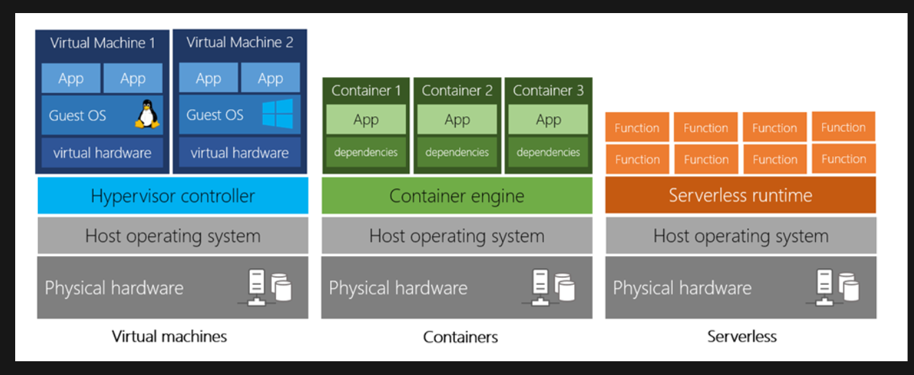
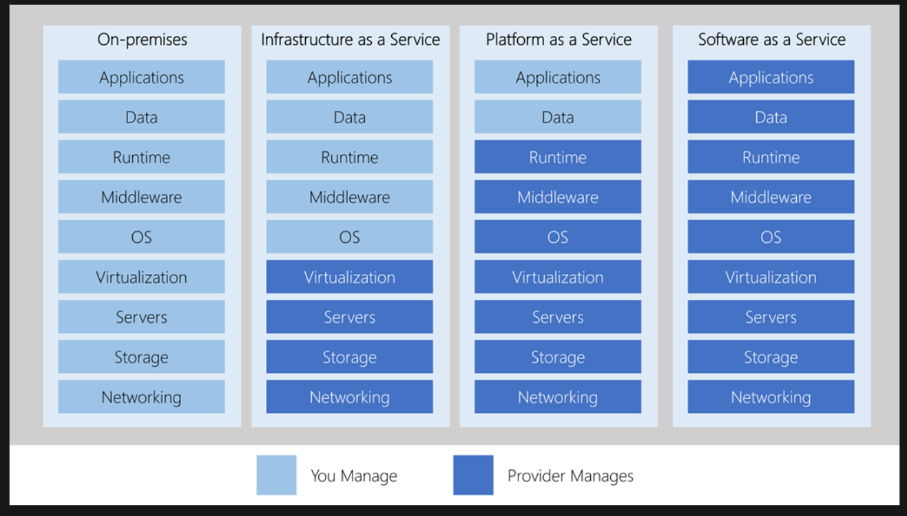
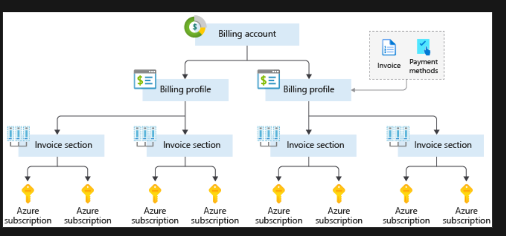
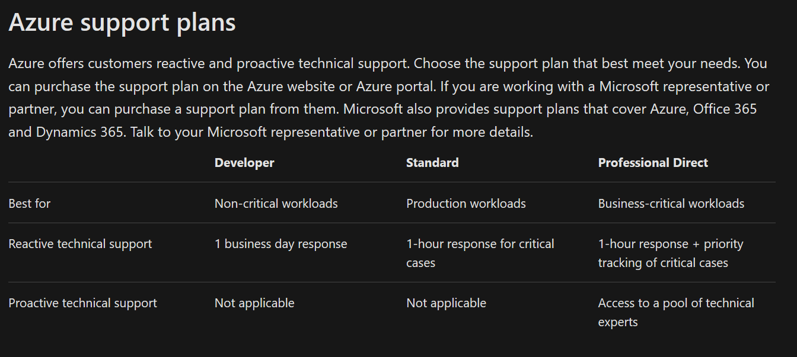
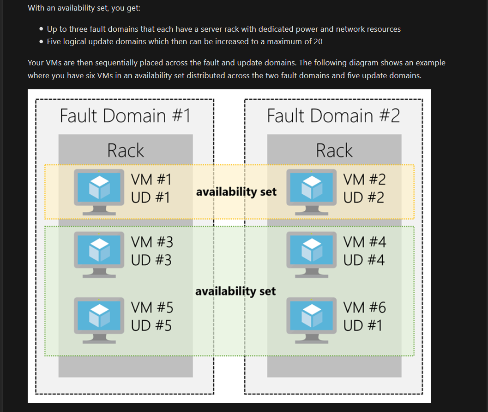
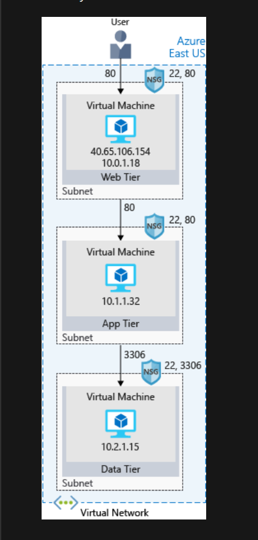

# Azure

## Module 1

### Cloud Computing

- Cloud computing is renting resources, like storage space or CPU cycles, on another company's computers. You only pay for what you use. The company providing these services is referred to as a cloud provider. Some example providers are Microsoft, Amazon, and Google.

- The cloud provider is responsible for the physical hardware required to execute your work, and for keeping it up-to-date. The computing services offered tend to vary by cloud provider. However, typically they include:

  - Compute power - such as Linux servers or web applications
  - Storage - such as files and databases
  - Networking - such as secure connections between the cloud provider and your company
  - Analytics - such as visualizing telemetry and performance data

### Benefits of Clouds Computing

- Cost Effective
  - Pay as you go OR consumption based
  - No upfront indrastructure costs
- Scalable

  - Vertical Scaling - is the process of adding resources to increase the power of an existing server. Some examples of vertical scaling are: adding more CPUs, or adding more memory.
  - Horizontal scaling, also known as "scaling out", is the process of adding more servers that function together as one unit. For example, you have more than one server processing incoming requests.
  - Scaling can be done manually or automatically based on specific triggers such as CPU utilization or the number of requests and resources that can be allocated or de-allocated in minutes.

- Elastic
  - As your workload changes due to a spike or drop in demand, a cloud computing system can compensate by automatically adding or removing resources.
- Current
- Reliable
- Global
- Secure

### Compliance Terms

When selecting a cloud provider to host your solutions, you should understand how that provider can help you comply with regulations and standards. Some questions to ask about a potential provider include:

- How compliant is the cloud provider when it comes to handling sensitive data?
- How compliant are the services offered by the cloud provider?
- How can I deploy my own cloud-based solutions to scenarios that have accreditation or compliance requirements?
- What terms are part of the privacy statement for the provider?

#### Compliance Offerings

- Criminal Justice Information Services (CJIS)
- Cloud Security Alliance (CSA) STAR Certification.
- General Data Protection Regulation (GDPR)
- EU Model Clauses
- Health Insurance Portability and Accountability Act (HIPAA)
- International Organization for Standardization (ISO) and the International Electrotechnical Commission (IEC)
- Multi-Tier Cloud Security (MTCS) Singapore
- Service Organization Controls (SOC) 1, 2, and 3.
- National Institute of Standards and Technology (NIST) Cybersecurity Framework (CSF).
- UK Government G-Cloud

### CapEx vs OpEx Computing Costs

Capex

- Server Costs (Hardware)
- Storage Costs
- Network Costs
- Backup and Archive Costs
- Organization continuity and disaster recovery costs
- Datacenter infrastructure costs
- Technical Personals

OpEx

- Leasing software cost and customized features
- Scaling charges based on usage
- Billing at the user or org level

### Cloud Deployment models

#### Public

- In this case, you have no local hardware to manage or keep up-to-date – everything runs on your cloud provider's hardware. In some cases, you can save additional costs by sharing computing resources with other cloud users.
- Businesses can use multiple public cloud providers of varying scale. Microsoft Azure is an example of a public cloud provider.
- Advantages

  - High scalability/agility – you don't have to buy a new server in order to scale
  - Pay-as-you-go pricing – you pay only for what you use, no CapEx costs
  - You're not responsible for maintenance or updates of the hardware
  - Minimal technical knowledge to set updates and use - you can leverage the skills and expertise of the cloud provider to ensure workloads are secure, safe, and highly available

- Disadvantages

  Not all scenarios fit the public cloud. Here are some disadvantages to think about:

  - There may be specific security requirements that cannot be met by using public cloud
  - There may be government policies, industry standards, or legal requirements which public clouds cannot meet
  - You don't own the hardware or services and cannot manage them as you may want to
  - Unique business requirements, such as having to maintain a legacy application might be hard to meet

#### Private Cloud

- In a private cloud, you create a cloud environment in your own datacenter and provide self-service access to compute resources to users in your organization. This offers a simulation of a public cloud to your users, but you remain completely responsible for the purchase and maintenance of the hardware and software services you provide.

- Advantages

This approach has several advantages:

- You can ensure the configuration can support any scenario or legacy application
- You have control (and responsibility) over security
- Private clouds can meet strict security, compliance, or legal requirements

- Disadvantages

Some reasons teams move away from the private cloud are:

- You have some initial CapEx costs and must purchase the hardware for startup and maintenance
- Owning the equipment limits the agility - to scale you must buy, install, and setup new hardware
- Private clouds require IT skills and expertise that's hard to come by

#### Hybrid Cloud

- A hybrid cloud combines public and private clouds, allowing you to run your applications in the most appropriate location. For example, you could host a website in the public cloud and link it to a highly secure database hosted in your private cloud (or on-premises datacenter).
- This is helpful when you have some things that cannot be put in the cloud, maybe for legal reasons. For example, you may have some specific pieces of data that cannot be exposed publicly (such as medical data) which needs to be held in your private datacenter. Another example is one or more applications that run on old hardware that can't be updated. In this case, you can keep the old system running locally, and connect it to the public cloud for authorization or storage.

- Advantages

Some advantages of a hybrid cloud are:

- You can keep any systems running and accessible that use out-of-date hardware or an out-of-date operating system
- You have flexibility with what you run locally versus in the cloud
- You can take advantage of economies of scale from public cloud providers for services and resources where it's- cheaper, and then supplement with your own equipment when it's not
- You can use your own equipment to meet security, compliance, or legacy scenarios where you need to completely control the environment

Disadvantages

Some concerns you'll need to watch out for are:

- It can be more expensive than selecting one deployment model since it involves some CapEx cost up front
- It can be more complicated to set up and manage

### Types of Cloud Services

#### IaaS

- Infrastructure as a Service is the most flexible category of cloud services. It aims to give you the most control over the provided hardware that runs your application (IT infrastructure servers and virtual machines (VMs), storage, and operating systems). Instead of buying hardware, with IaaS, you rent it. It's an instant computing infrastructure, provisioned and managed over the internet.
- When using IaaS, ensuring that a service is up and running is a shared responsibility: the cloud provider is responsible for ensuring the cloud infrastructure is functioning correctly; the cloud customer is responsible for ensuring the service they are using is configured correctly, is up to date, and is available to their customers. This is referred to as the **shared responsibility model**.

#### PaaS

- PaaS provides an environment for building, testing, and deploying software applications. The goal of PaaS is to help you create an application quickly without managing the underlying infrastructure. For example, when deploying a web application using PaaS, you don't have to install an operating system, web server, or even system updates.

#### SaaS

- SaaS is software that is centrally hosted and managed for the end customer. It is usually based on an architecture where one version of the application is used for all customers, and licensed through a monthly or annual subscription. Office 365, Skype, and Dynamics CRM Online are perfect examples of SaaS software.

---

## Module 2

### Azure Billing

- With Azure, you only pay for what you use. You'll receive a monthly invoice with payment instructions provided. You may organize your invoice into line items that make sense to you and meet your budget and cost tracking needs. You also can get set up for multiple invoices.

#### Azure subscription

- When you sign up, an Azure subscription is created by default.
- An Azure subscription is a logical container used to provision resources in Azure. It holds the details of all your resources like virtual machines (VMs), databases, and more.
- When you create an Azure resource like a VM, you identify the subscription it belongs to. - As you use the VM, the usage of the VM is aggregated and billed monthly.

#### Create additional Azure subscriptions

- Environments: When managing your resources, you can choose to create subscriptions to set up separate environments for development and testing, security, or to isolate data for compliance reasons. This is particularly useful because resource access control occurs at the subscription level.
- Organizational structures: You can create subscriptions to reflect different organizational structures. For example, you could limit a team to lower-cost resources, while allowing the IT department a full range. This design allows you to manage and control access to the resources that users provision within each subscription.
- Billing: You might want to also create additional subscriptions for billing purposes. Because costs are first aggregated at the subscription level, you might want to create subscriptions to manage and track costs based on your needs. For instance, you might want to create a subscription for your production workloads and another subscription for your development and testing workloads.
- Subscription limits: Subscriptions are bound to some hard limitations. For example, the maximum number of Express Route circuits per subscription is 10. Those limits should be considered as you create subscriptions on your account. If there is a need to go over those limits in particular scenarios, then you might need additional subscriptions.

### Azure Support Plans

---

## Module 4

### Data Centers

- Microsoft Azure is made up of datacenters located around the globe. When you leverage a service or create a resource such as a SQL database or virtual machine, you are using physical equipment in one or more of these locations.

- The specific datacenters aren't exposed to end users directly; instead, Azure organizes them into regions.

### Regions

- A region is a geographical area on the planet containing at least one, but potentially multiple datacenters that are nearby and networked together with a low-latency network. Azure intelligently assigns and controls the resources within each region to ensure workloads are appropriately balanced.

### Geographies

- Azure divides the world into geographies that are defined by geopolitical boundaries or country borders.
- An Azure geography is a discrete market typically containing two or more regions that preserve data residency and compliance boundaries.

Geographies are broken up into the following areas:

- Americas
- Europe
- Asia Pacific
- Middle East and Africa

### Availability Zones

Availability Zones are physically separate datacenters within an Azure region.

Each Availability Zone is made up of one or more datacenters equipped with independent power, cooling, and networking. It is set up to be an isolation boundary. If one zone goes down, the other continues working. Availability Zones are connected through high-speed, private fiber-optic networks.

You can use Availability Zones to run mission-critical applications and build high-availability into your application architecture by co-locating your compute, storage, networking, and data resources within a zone and replicating in other zones. Keep in mind that there could be a cost to duplicating your services and transferring data between zones.

Availability Zones are primarily for VMs, managed disks, load balancers, and SQL databases. Azure services that support Availability Zones fall into two categories:

- Zonal services – you pin the resource to a specific zone (for example - virtual machines, managed disks, IP addresses)
- Zone-redundant services – platform replicates automatically across zones (for example, zone-redundant storage, SQL Database).

### Region Pairs

- Availability zones are created using one or more datacenters, and there is a minimum of three zones within a single region. However, it's possible that a large enough disaster could cause an outage large enough to affect even two datacenters. That's why Azure also creates region pairs.

- Each Azure region is always paired with another region within the same geography (such as US, Europe, or Asia) at least 300 miles away. This approach allows for the replication of resources (such as virtual machine storage) across a geography that helps reduce the likelihood of interruptions due to events such as natural disasters, civil unrest, power outages, or physical network outages affecting both regions at once. If a region in a pair was affected by a natural disaster, for instance, services would automatically fail over to the other region in its region pair.

= Additional advantages of region pairs include:

- If there's an extensive Azure outage, one region out of every pair is prioritized to make sure at least one is restored as quick as possible for applications hosted in that region pair.
- Planned Azure updates are rolled out to paired regions one region at a time to minimize downtime and risk of application outage.
- Data continues to reside within the same geography as its pair (except for Brazil South) for tax and law enforcement jurisdiction purposes.

### Service Level Agreements (SLAs)

Formal documents called Service-Level Agreements (SLAs) capture the specific terms that define the performance standards that apply to Azure.

- SLAs describe Microsoft's commitment to providing Azure customers with specific performance standards.
- There are SLAs for individual Azure products and services.
- SLAs also specify what happens if a service or product fails to perform to a governing SLA's specification.

There are three key characteristics of SLAs for Azure products and services:

- Performance Targets
- Uptime and Connectivity Guarantees
- Service credits

A typical SLA specifies performance-target commitments that range from 99.9 percent ("three nines") to 99.999 percent ("five nines"), for each corresponding Azure product or service. These targets can apply to such performance criteria as uptime or response times for services.

Service credits (discounts) is given if a performance taget is not met.

### Composite SLAs

- When combining SLAs across different service offerings, the resultant SLA is called a Composite SLA. The resulting composite SLA can provide higher or lower uptime values, depending on your application architecture.

- Consider a web app (99.95% SLA) which talks to a SQL db (99.99% SLA)
- Composite SLA for this application will be
  - 99.95% x 99.99% = 99.94 %
    -This means the **combined probability** of failure is higher than the individual SLA values. This isn't surprising, because an application that relies on multiple services has more potential failure points.
- We can improve the composite SLA by using, for example, a queue (99.95%) for tasks when the DB is not available
- now the application will fail when both db and queue fail (let say the probability of that is 0.0001 x 0.001)
- The composite SLA for DB + QUEUE will be
  - 1.0 - (0.0001 x 0.001) = 99.99999 %
- The composite SLA for the app would become
  - 99.95% x 99.99999 % = ~99.95 %
- Notice we've improved our SLA behavior. However, there are trade-offs to using this approach: the application logic is more complicated, you are paying more to add the queue support, and there may be data-consistency issues you'll have to deal with due to retry behavior.

### Application SLAs

By creating your own SLAs, you can set performance targets to suit your specific Azure application. This approach is known as an Application SLA.

#### Resiliency

Resiliency is the ability of a system to recover from failures and continue to function. It's not about avoiding failures, but responding to failures in a way that avoids downtime or data loss. The goal of resiliency is to return the application to a fully functioning state following a failure. High availability and disaster recovery are two crucial components of resiliency.

#### Failure Mode Analysis (FMA)

When designing your architecture you need to design for resiliency, and you should perform a **Failure Mode Analysis (FMA)**. The goal of an FMA is to identify possible points of failure and to define how the application will respond to those failures.

#### Availability

Availability refers to the time that a system is functional and working.

Tip: For example: A workload that requires 99.99 percent uptime shouldn't depend upon a service with a 99.9 percent SLA.

Most providers prefer to maximize the availability of their Azure solutions by minimizing downtime. However, as you increase availability, you also increase the cost and complexity of your solution.

#### Considerations for defining application SLAs

- If your application SLA defines four 9's (99.99%) performance targets, recovering from failures by manual intervention may not be enough to fulfill your SLA. Your Azure solution must be self-diagnosing and self-healing instead.
- It is difficult to respond to failures quickly enough to meet SLA performance targets above four 9's.
- Carefully consider the time window against which your application SLA performance targets are measured. The smaller the time window, the tighter the tolerances. If you define your application SLA as hourly or daily uptime, you need to understand these tighter tolerances might not allow for achievable performance targets.

---

## Module 5

- There are Four common techniques for performing compute in Azure:
  1. Virtual Machines
  2. Containers
  3. Azure App Service
  4. Serverless Computing

### Virtual Machines

- Virtual machines, or VMs, are software emulations of physical computers.
- They provide infrastructure as a service (IaaS) in the form of a virtualized server and can be used in many ways. Just like a physical computer, you can customize all of the software running on the VM.

- You can run single VMs for testing, development, or minor tasks; or you can group VMs together to provide high availability, scalability, and redundancy.

#### Availability Sets

- An availability set is a logical grouping of two or more VMs that help keep your application available during planned or unplanned maintenance.
- A **_planned maintenance_** event is when the underlying Azure fabric that hosts VMs is updated by Microsoft.
- When the VM is part of an availability set, the Azure fabric updates are sequenced so not all of the associated VMs are rebooted at the same time. VMs are put into different update domains.
- **_Update domains_** indicate groups of VMs and underlying physical hardware that can be rebooted at the same time. Update domains are a logical part of each data center and are implemented with software and logic.
- **_Unplanned maintenance_** events involve a hardware failure in the data center, such as a power outage or disk failure.
- VMs that are part of an availability set automatically switch to a working physical server so the VM continues to run.
- The group of virtual machines that share common hardware are in the same **_fault domain_**.
- A fault domain is essentially a rack of servers.

- Azure **_Virtual Machine Scale Sets_** let you create and manage a group of identical, load balanced VMs.
- Azure Batch enables large-scale job scheduling and compute management with the ability to scale to tens, hundreds, or thousands of VMs.

### Containers

A container is a modified runtime environment built on top of a host OS that executes your application. A container doesn't use virtualization, so it doesn't waste resources simulating virtual hardware with a redundant OS. This environment typically makes containers more lightweight than VMs.

- Azure Supports Docker Containers
- Several Ways to manager containers in Azure
  - Azure Container Instances (ACI)
    - Azure Container Instances (ACI) offers the fastest and simplest way to run a container in Azure. You don't have to manage any virtual machines or configure any additional services. It is a PaaS offering that allows you to upload your containers and execute them directly with automatic elastic scale.
  - Azure Kubernetes Service (AKS)
    - The task of automating, managing, and interacting with a large number of containers is known as orchestration. Azure Kubernetes Service (AKS) is a complete orchestration service for containers with distributed architectures with multiple containers.

#### MicroService Architecture

- Containers are often used to create solutions using a microservice architecture. This architecture is where you break solutions into smaller, independent pieces. For example, you may split a website into a container hosting your front end, another hosting your back end, and a third for storage. This split allows you to separate portions of your app into logical sections that can be maintained, scaled, or updated independently.

### App Service

- This platform as a service (PaaS) allows you to focus on the website and API logic while Azure handles the infrastructure to run and scale your web applications.
- You pay for the Azure compute resources your app uses while it processes requests based on the App Service Plan you choose.
- With Azure App Service, you can host most common web app styles including:
  - Web Apps
  - API Apps
  - WebJobs
    - WebJobs allows you to run a program (.exe, Java, PHP, Python, or Node.js) or script (.cmd, .bat, PowerShell, or Bash) in the same context as a web app, API app, or mobile app. They can be scheduled, or run by a trigger. WebJobs are often used to run background tasks as part of your application logic
  - Mobile Apps

### Serverless Computing

- Serverless computing encompasses three ideas:
  - the abstraction of servers
  - an event-driven scale
  - and micro-billing:
- Two implementations of Serverless
  - Azure Functions
    - Azure Functions scale automatically based on demand, so they're a solid choice when demand is variable.
    - Using a VM-based approach, you'd incur costs even when the VM is idle. With functions, Azure runs your code when it's triggered and automatically deallocates resources when the function is finished.
    - Azure Functions can be either stateless (the default), where they behave as if they're restarted every time they respond to an event, or stateful (called "Durable Functions"), where a context is passed through the function to track prior activity.
  - Azure Logic Apps - Where Functions execute code, Logic Apps execute workflows designed to automate business scenarios and built from predefined logic blocks.

**NOTE**: Azure Functions are best suited for variable high demands, as containers and VMs are not as responsive as Functions. Functions are event-based and can scale instantly to process spikes in traffic. They are cost effective as well.

---

## Module 6

### Type of Data

- Structured or Relational: Usually with a schema and in tabular form
- Semi-Structured: Key Value pairs, or NoSQL
- UnStructured: Blobs

### Various Storage Options in Azure

- Azure SQL: relational Db as a service (DaaS)
- Azure Cosmos DB: supports schema less data
- Azure Blob Storage
- Azure Data Lake Storage: The Data Lake feature allows you to perform analytics on your data usage and prepare reports. Data Lake is a large repository that stores both structured and unstructured data.
- Azure Files: Azure Files offers fully managed file shares in the cloud that are accessible via the industry standard Server Message Block (SMB) protocol.
- Azure Queue
  - Create a backlog of work and to pass messages between different Azure web servers.
  - Distribute load among different web servers/infrastructure and to manage bursts of traffic.
  - Build resilience against component failure when multiple users access your data at the same time.
- Disk Storage: Disk storage provides disks for virtual machines, applications, and other services to access and use as they need, similar to how they would in on-premises scenarios.

#### Storage Tiers

1. Hot Storage Tiers: for data that is accessed frequently.
2. Cool Storage tier: infrequently accessed and stored for at least 30 days
3. Archive storage tier: rarely accessed & stored for 180 days

#### Encryption for storage services

1. Azure Storage Service Encryption (SSE) for data at rest. It encrypts the data before storing it and decrypts the data before retrieving it
2. Client side encryption: is where the data is already encrypted by the client libraries. Azure stores the data in the encrypted state at rest, which is then decrypted during retrieval.

### On premises vs Azure Storage

- Cost Effectiveness: Azure data storage provides a pay-as-you-go pricing model, which is often appealing to businesses as an operating expense instead of an upfront capital cost.
- Reliability: Azure data storage provides data backup, load balancing, disaster recovery, and data replication
- Agility

---

## Module 7

### Networking options in Azure

#### N-tier architecture

An N-tier architecture divides an application into two or more logical tiers. Architecturally, a higher tier can access services from a lower tier, but a lower tier should never access a higher tier.

Tiers help separate concerns and are ideally designed to be reusable. Using a tiered architecture also simplifies maintenance. Tiers can be updated or replaced independently, and new tiers can be inserted if needed.

The following is a 3-tier application, running on 3 VMs

In the above diagram:

- Azure Region: East US above
  - A Region is one or more Azure data centers within a specific geographical location.
- Virtual Network:
  - A virtual network is a logically isolated network on Azure
  - A virtual network is scoped to a single region; however, multiple virtual networks from different regions can be connected together using virtual network peering.
  - Virtual networks can be segmented into one or more **subnets**. Subnets help you organize and secure your resources in discrete sections. The web, application, and data tiers each have a single VM. All three VMs are in the same virtual network but are in separate subnets.
  - Users interact with the web tier directly, so that VM has a public IP address along with a private IP address. Users don't interact with the application or data tiers, so these VMs each have a private IP address only.
  - You can also keep your service or data tiers in your on-premises network, placing your web tier into the cloud, but keeping tight control over other aspects of your application. A **VPN gateway (or virtual network gateway)**, enables this scenario.
  - Azure manages the physical hardware for you. You configure virtual networks and gateways through software, which enables you to treat a virtual network just like your own network.
- Network Security Group
  - A network security group, or NSG, allows or denies inbound network traffic to your Azure resources. Think of a network security group as a cloud-level firewall for your network.
  - For example, notice that the VM in the web tier allows inbound traffic on ports 22 (SSH) and 80 (HTTP). This VM's network security group allows inbound traffic over these ports from all sources. You can configure a network security group to accept traffic only from known sources, such as IP addresses that you trust.

### Availability and Load Balancers

#### Availability

- Availability refers to how long your service is up and running without interruption. High availability, or highly available, refers to a service that's up and running for a long period of time.
- Five nines availability means that the service is guaranteed to be running 99.999 percent of the time.

#### Resiliency

- Resiliency refers to a system's ability to stay operational during abnormal conditions.
- e.g
  - Natural Disasters
  - Planned or Unplanned System Maintenance
  - Spikes in traffic
  - threats and attacks (e.g DDoS)

#### Load Balancer

- A load balancer distributes traffic evenly among each system in a pool. A load balancer can help you achieve both high availability and resiliency.
- If because of load, we start to add VMs, the problem is that each of those VMs have their own IP Address.
- The answer is to use a load balancer to distribute traffic. The load balancer becomes the entry point to the user. The user doesn't know (or need to know) which system the load balancer chooses to receive the request.

Azure Load Balancer distributes traffic among similar systems, making your services more highly available.

If one system is unavailable, Azure Load Balancer stops sending traffic to it. It then directs traffic to one of the responsive servers.

#### Azure Load Balancer

- Azure Load Balancer is a load balancer service that Microsoft provides that helps take care of the maintenance for you.
- Load Balancer supports inbound and outbound scenarios, provides low latency and high throughput, and scales up to millions of flows for all Transmission Control Protocol (TCP) and User Datagram Protocol (UDP) applications.
- You can use Load Balancer with incoming internet traffic, internal traffic across Azure services, port forwarding for specific traffic, or outbound connectivity for VMs in your virtual network.

#### Azure Application Gateway

- If all your traffic is HTTP, a potentially better option is to use Azure Application Gateway. Application Gateway is a load balancer designed for web applications. It uses Azure Load Balancer at the transport level (TCP) and applies sophisticated URL-based routing rules to support several advanced scenarios.
- This type of routing is known as application layer (OSI layer 7) load balancing since it understands the structure of the HTTP message.
- Benefits
  - **Cookie affinity**. Useful when you want to keep a user session on the same backend server.
  - **SSL termination**. Application Gateway can manage your SSL certificates and pass unencrypted traffic to the backend servers to avoid encryption/decryption overhead. It also supports full end-to-end encryption for applications that require that.
  - **Web application firewall**. Application gateway supports a sophisticated firewall (WAF) with detailed monitoring and logging to detect malicious attacks against your network infrastructure.
  - **URL rule-based routes**. Application Gateway allows you to route traffic based on URL patterns, source IP address and port to destination IP address and port. This is helpful when setting up a content delivery network.
  - **Rewrite HTTP headers**. You can add or remove information from the inbound and outbound HTTP headers of each request to enable important security scenarios, or scrub sensitive information such as server names.

#### Content Delivery Network (CDN)

- A content delivery network (CDN) is a distributed network of servers that can efficiently deliver web content to users.
- It is a way to get content to users in their local region to minimize latency.
- CDN can be hosted in Azure or any other location. You can cache content at strategically placed physical nodes across the world and provide better performance to end users.
- Typical usage scenarios include web applications containing multimedia content, a product launch event in a particular region, or any event where you expect a high-bandwidth requirement in a region.

#### DNS

- You can bring your own DNS server or use Azure DNS, a hosting service for DNS domains that runs on Azure infrastructure.

### Network Latency

Latency refers to the time it takes for data to travel over the network. Latency is typically measured in milliseconds.

Compare latency to bandwidth. Bandwidth refers to the amount of data that can fit on the connection. Latency refers to the time it takes for that data to reach its destination.

Factors such as the type of connection you use and how your application is designed can affect latency. But perhaps the biggest factor is distance.

#### Azure Traffic Manager

Azure Traffic Manager. Traffic Manager uses the DNS server that's closest to the user to direct user traffic to a globally distributed endpoint.

Traffic Manager doesn't see the traffic that's passed between the client and server. Rather, it directs the client web browser to a preferred endpoint. Traffic Manager can route traffic in a few different ways, such as to the endpoint with the lowest latency.

#### Load Balancer vs Traffic Manager

- Azure Load Balancer distributes traffic within the same region to make your services more highly available and resilient. Traffic Manager works at the DNS level, and directs the client to a preferred endpoint. This endpoint can be to the region that's closest to your user.

- Load Balancer and Traffic Manager both help make your services more resilient, but in slightly different ways. When Load Balancer detects an unresponsive VM, it directs traffic to other VMs in the pool. Traffic Manager monitors the health of your endpoints. When Traffic Manager finds an unresponsive endpoint, it directs traffic to the next closest endpoint that is responsive.
