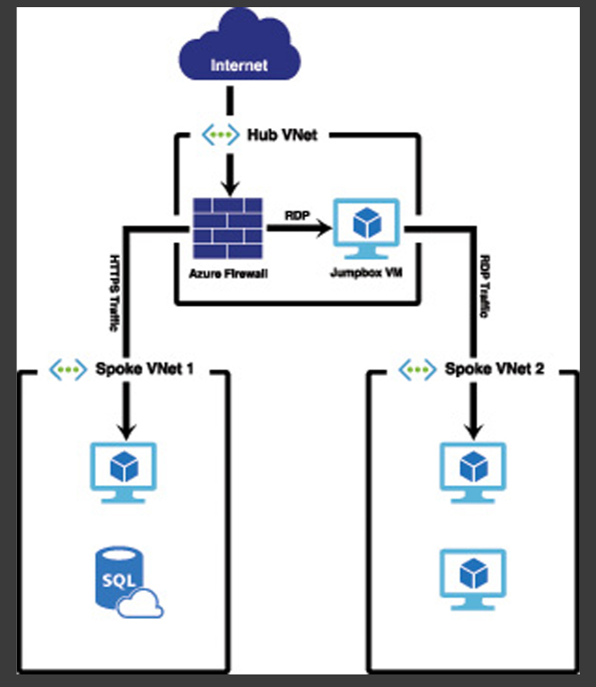

# Azure

## Module 1

### Cloud Computing

- Cloud computing is renting resources, like storage space or CPU cycles, on another company's computers. You only pay for what you use. The company providing these services is referred to as a cloud provider. Some example providers are Microsoft, Amazon, and Google.

- The cloud provider is responsible for the physical hardware required to execute your work, and for keeping it up-to-date. The computing services offered tend to vary by cloud provider. However, typically they include:

  - Compute power - such as Linux servers or web applications
  - Storage - such as files and databases
  - Networking - such as secure connections between the cloud provider and your company
  - Analytics - such as visualizing telemetry and performance data

### Benefits of Clouds Computing

- Cost Effective
  - Pay as you go OR consumption based
  - No upfront indrastructure costs
- Scalable

  - Vertical Scaling - is the process of adding resources to increase the power of an existing server. Some examples of vertical scaling are: adding more CPUs, or adding more memory.
  - Horizontal scaling, also known as "scaling out", is the process of adding more servers that function together as one unit. For example, you have more than one server processing incoming requests.
  - Scaling can be done manually or automatically based on specific triggers such as CPU utilization or the number of requests and resources that can be allocated or de-allocated in minutes.

- Elastic
  - As your workload changes due to a spike or drop in demand, a cloud computing system can compensate by automatically adding or removing resources.
- Current
- Reliable
- Global
- Secure

### Compliance Terms

When selecting a cloud provider to host your solutions, you should understand how that provider can help you comply with regulations and standards. Some questions to ask about a potential provider include:

- How compliant is the cloud provider when it comes to handling sensitive data?
- How compliant are the services offered by the cloud provider?
- How can I deploy my own cloud-based solutions to scenarios that have accreditation or compliance requirements?
- What terms are part of the privacy statement for the provider?

#### Compliance Offerings

- Criminal Justice Information Services (CJIS)
- Cloud Security Alliance (CSA) STAR Certification.
- General Data Protection Regulation (GDPR)
- EU Model Clauses
- Health Insurance Portability and Accountability Act (HIPAA)
- International Organization for Standardization (ISO) and the International Electrotechnical Commission (IEC)
- Multi-Tier Cloud Security (MTCS) Singapore
- Service Organization Controls (SOC) 1, 2, and 3.
- National Institute of Standards and Technology (NIST) Cybersecurity Framework (CSF).
- UK Government G-Cloud

### CapEx vs OpEx Computing Costs

Capex

- Server Costs (Hardware)
- Storage Costs
- Network Costs
- Backup and Archive Costs
- Organization continuity and disaster recovery costs
- Datacenter infrastructure costs
- Technical Personals

OpEx

- Leasing software cost and customized features
- Scaling charges based on usage
- Billing at the user or org level

### Cloud Deployment models

#### Public

- In this case, you have no local hardware to manage or keep up-to-date – everything runs on your cloud provider's hardware. In some cases, you can save additional costs by sharing computing resources with other cloud users.
- Businesses can use multiple public cloud providers of varying scale. Microsoft Azure is an example of a public cloud provider.
- Advantages

  - High scalability/agility – you don't have to buy a new server in order to scale
  - Pay-as-you-go pricing – you pay only for what you use, no CapEx costs
  - You're not responsible for maintenance or updates of the hardware
  - Minimal technical knowledge to set updates and use - you can leverage the skills and expertise of the cloud provider to ensure workloads are secure, safe, and highly available

- Disadvantages

  Not all scenarios fit the public cloud. Here are some disadvantages to think about:

  - There may be specific security requirements that cannot be met by using public cloud
  - There may be government policies, industry standards, or legal requirements which public clouds cannot meet
  - You don't own the hardware or services and cannot manage them as you may want to
  - Unique business requirements, such as having to maintain a legacy application might be hard to meet

#### Private Cloud

- In a private cloud, you create a cloud environment in your own datacenter and provide self-service access to compute resources to users in your organization. This offers a simulation of a public cloud to your users, but you remain completely responsible for the purchase and maintenance of the hardware and software services you provide.

- Advantages

This approach has several advantages:

- You can ensure the configuration can support any scenario or legacy application
- You have control (and responsibility) over security
- Private clouds can meet strict security, compliance, or legal requirements

- Disadvantages

Some reasons teams move away from the private cloud are:

- You have some initial CapEx costs and must purchase the hardware for startup and maintenance
- Owning the equipment limits the agility - to scale you must buy, install, and setup new hardware
- Private clouds require IT skills and expertise that's hard to come by

#### Hybrid Cloud

- A hybrid cloud combines public and private clouds, allowing you to run your applications in the most appropriate location. For example, you could host a website in the public cloud and link it to a highly secure database hosted in your private cloud (or on-premises datacenter).
- This is helpful when you have some things that cannot be put in the cloud, maybe for legal reasons. For example, you may have some specific pieces of data that cannot be exposed publicly (such as medical data) which needs to be held in your private datacenter. Another example is one or more applications that run on old hardware that can't be updated. In this case, you can keep the old system running locally, and connect it to the public cloud for authorization or storage.

- Advantages

Some advantages of a hybrid cloud are:

- You can keep any systems running and accessible that use out-of-date hardware or an out-of-date operating system
- You have flexibility with what you run locally versus in the cloud
- You can take advantage of economies of scale from public cloud providers for services and resources where it's- cheaper, and then supplement with your own equipment when it's not
- You can use your own equipment to meet security, compliance, or legacy scenarios where you need to completely control the environment

Disadvantages

Some concerns you'll need to watch out for are:

- It can be more expensive than selecting one deployment model since it involves some CapEx cost up front
- It can be more complicated to set up and manage

### Types of Cloud Services

#### IaaS

- Infrastructure as a Service is the most flexible category of cloud services. It aims to give you the most control over the provided hardware that runs your application (IT infrastructure servers and virtual machines (VMs), storage, and operating systems). Instead of buying hardware, with IaaS, you rent it. It's an instant computing infrastructure, provisioned and managed over the internet.
- When using IaaS, ensuring that a service is up and running is a shared responsibility: the cloud provider is responsible for ensuring the cloud infrastructure is functioning correctly; the cloud customer is responsible for ensuring the service they are using is configured correctly, is up to date, and is available to their customers. This is referred to as the **shared responsibility model**.

#### PaaS

- PaaS provides an environment for building, testing, and deploying software applications. The goal of PaaS is to help you create an application quickly without managing the underlying infrastructure. For example, when deploying a web application using PaaS, you don't have to install an operating system, web server, or even system updates.

#### SaaS

- SaaS is software that is centrally hosted and managed for the end customer. It is usually based on an architecture where one version of the application is used for all customers, and licensed through a monthly or annual subscription. Office 365, Skype, and Dynamics CRM Online are perfect examples of SaaS software.

### Summary

- Cloud providers offer **service-level agreements (SLAs)** that guarantee a certain level of availability, but only for those systems that are controlled by them.

- Moving to the cloud can help **avoid downtime** caused by network outages, system outages, and power outages. It can also help you if you need to diagnose problems with an application or problems with an external system that your application uses.

- You can scale up (or vertically) when you want to add additional CPUs or more memory using a more powerful VM.

- You can scale out (or horizontally) if you want to add more VMs to handle additional load.

- Cloud providers give you ways to automatically scale based on usage patterns, resource utilization, and times of day. This is referred to as **elasticity**.

- Cloud providers monitor the health of the infrastructure. When a VM becomes unhealthy, the cloud provider can automatically move you to a healthy VM without you having to do anything. This is called **fault tolerance**.

- Cloud providers also operate across multiple data centers that are in different regions of the world. If a natural disaster (or any other disaster) happens in one region, you can switch over to another region, assuming you have replicated your environment in multiple regions. This kind of planning is called **Business Continuity and Disaster Recovery planning**, and cloud providers often have features in place to make implementing a plan easy. This is often referred to as disaster recovery.

- Because you are using infrastructure owned by the cloud provider, moving to the cloud reduces your **capital expenses**, the major expenses that are incurred for infrastructure and other major purchases. Cloud providers take advantage of the principle of economies of scale by purchasing large amounts of infrastructure to be used by cloudconsumers.

- Day-to-day expenses ( **operational expenses** ) can also be reduced in the cloud because you pay only for those resources you are using at any particular time. This consumption-based model is a key benefit of the cloud.

- **Infrastructure-as-a-Service** (IaaS) offers infrastructure running in the cloud, but you have to maintain the operating system and what’s installed on that infrastructure. IaaS services offer you the most control in the cloud, but they also carry the largest management burden.

- **Platform-as-a-Service** (PaaS) offloads the management of the infrastructure, and it also offloads the operating system and components installed on the VMs to the cloud provider. You are responsible for your application. PaaS services also offer many additional features that make it easy to add functionality to an application without having to write complex code. Development teams also have a wide variety of deployment methods available, and the cloud provider often automates much of that process.

- **Software-as-a-Service** (SaaS) provides a hosted application in the cloud that is most commonly accessed using a web browser. In a SaaS service, the cloud provider manages everything for you. You are essentially renting the use of the software from the cloud provider. A big benefit of SaaS is that it makes applications easily-accessible by employees in the field on any device.

- **The public cloud model is sometimes referred to as a multi-tenant environment**. Multiple companies and users share the same infrastructure. VMs and other infrastructure are allocated to users as they need them, and when they no longer need them, they are returned to the pool to be used by other users. The network is available publicly over the Internet, but you do have the ability to put security methods in place to control access to your resources.

- **The private cloud model is sometimes referred to as a single-tenant environment**. All infrastructure is private to an individual or a company, and the network is only available within the private cloud itself. It is not exposed to the Internet. In many cases, the infrastructure used in a private cloud is owned by the company, but not always. It’s possible to host a private cloud in a third-party data

---

## Module 2

### Azure Billing

- With Azure, you only pay for what you use. You'll receive a monthly invoice with payment instructions provided. You may organize your invoice into line items that make sense to you and meet your budget and cost tracking needs. You also can get set up for multiple invoices.

#### Azure subscription

- When you sign up, an Azure subscription is created by default.
- An Azure subscription is a logical container used to provision resources in Azure. It holds the details of all your resources like virtual machines (VMs), databases, and more.
- When you create an Azure resource like a VM, you identify the subscription it belongs to. - As you use the VM, the usage of the VM is aggregated and billed monthly.

#### Create additional Azure subscriptions

- Environments: When managing your resources, you can choose to create subscriptions to set up separate environments for development and testing, security, or to isolate data for compliance reasons. This is particularly useful because resource access control occurs at the subscription level.
- Organizational structures: You can create subscriptions to reflect different organizational structures. For example, you could limit a team to lower-cost resources, while allowing the IT department a full range. This design allows you to manage and control access to the resources that users provision within each subscription.
- Billing: You might want to also create additional subscriptions for billing purposes. Because costs are first aggregated at the subscription level, you might want to create subscriptions to manage and track costs based on your needs. For instance, you might want to create a subscription for your production workloads and another subscription for your development and testing workloads.
- Subscription limits: Subscriptions are bound to some hard limitations. For example, the maximum number of Express Route circuits per subscription is 10. Those limits should be considered as you create subscriptions on your account. If there is a need to go over those limits in particular scenarios, then you might need additional subscriptions.

### Azure Support Plans

---

## Module 4

### Data Centers

- Microsoft Azure is made up of datacenters located around the globe. When you leverage a service or create a resource such as a SQL database or virtual machine, you are using physical equipment in one or more of these locations.

- The specific datacenters aren't exposed to end users directly; instead, Azure organizes them into regions.

### Regions

- A region is a geographical area on the planet containing at least one, but potentially multiple datacenters that are nearby and networked together with a low-latency network. Azure intelligently assigns and controls the resources within each region to ensure workloads are appropriately balanced.

At each region, Microsoft has built datacenters (physical buildings) that contain the physical hardware that Azure uses. These datacenters contain climate-controlled buildings that house the server racks containing physical computer hardware. They also have complex and reliable network infrastructure to provide the networking power.

To ensure that data in Azure is safe from disasters and failures due to possible problems in a particular region, customers are encouraged to replicate data in multiple regions. If, for example, the South Central US region is hit by a devastating tornado (not out of the question in Texas), data that is also replicated to the North Central US region in Illinois is still safe and available.

In order to ensure that applications are still performing as quickly as possible, Microsoft guarantees round-trip network performance of 2-milliseconds or less between regions.

### Geographies

- In order to provide Azure services to people around the world, Microsoft has created boundaries called geographies. A geography boundary is oftentimes the border of a country.
- Azure divides the world into geographies that are defined by geopolitical boundaries or country borders.
- An Azure geography is a discrete market typically containing two or more regions that preserve data residency and compliance boundaries.
- **Exam Tip**: The fact that each geography contains at least two regions separated by a large physical distance is important. That’s how Azure maintains disaster recovery, and it’s likely this concept will be included on the exam.

Geographies are broken up into the following areas:

- Americas
- Europe
- Asia Pacific
- Middle East and Africa

### Availability Zones

Availability Zones are physically separate datacenters within an Azure region.

Each Availability Zone is made up of one or more datacenters equipped with independent power, cooling, and networking. It is set up to be an isolation boundary. If one zone goes down, the other continues working. Availability Zones are connected through high-speed, private fiber-optic networks.

There are at least three availability zones within each enabled region, and because each availability zone exists within its own datacenter in that region, each has a water supply, cooling system, network, and power supply that is isolated from other zones. By deploying an Azure service in two or more availability zones, you can achieve high-availability in a situation where there is a problem in one zone.

You can use Availability Zones to run mission-critical applications and build high-availability into your application architecture by co-locating your compute, storage, networking, and data resources within a zone and replicating in other zones. Keep in mind that there could be a cost to duplicating your services and transferring data between zones.

Availability Zones are primarily for VMs, managed disks, load balancers, and SQL databases. Azure services that support Availability Zones fall into two categories:

- Zonal services
  - you pin the resource to a specific zone (for example - virtual machines, managed disks, IP addresses)
  - Zonal services are services such as virtual machines, managed disks used in a virtual machine, and public IP addresses used in virtual machines.
  - In order to achieve high-availability, you must explicitly deploy zonal services into two or more zones.
- Zone-redundant services
  - platform replicates automatically across zones (for example, zone-redundant storage, SQL Database).
  - Zone-redundant services are services such as zone-redundant storage and SQL Databases. To use availability zones with these services, you specify the option to make them zone-redundant when you create them. (For storage, the feature is called ZRS or zone-redundant storage. For SQL Database, there is an option to make the database zone-redundant.)
  - Azure takes care of the rest for you by replicating data to automatically multiple availability zones.

**Exam Tip**: Availability zones provide high-availability and fault tolerance, but they may not help you with disaster recovery. If there is a localized disaster, such as a fire in a datacenter housing one zone, you will benefit from availability zones. Because availability zones are located in the same Azure region, if there is a large-scale natural disaster such as a tornado, you may not be protected. In other words, availability zones are just one facet to an overall disaster recovery and fault tolerant design.

By deploying your service to two or more availability zones, you ensure the maximum availability for that resource. In fact, Microsoft guarantees a service level agreement (SLA) of 99.99% uptime for Azure Virtual Machines only if two or more VMs are deployed into two or more zones.

**Exam Tip**: Don’t confuse availability zones with availability sets.

- Availability sets allow you to create two or more virtual machines in different physical server racks in an Azure datacenter. Microsoft guarantees a 99.95% SLA with an availability set.
- An availability zone allows you to deploy two or more Azure services into two distinct datacenters within a region. Microsoft guarantees a 99.99% SLA with availability zones.

### Region Pairs

- Availability zones are created using one or more datacenters, and there is a minimum of three zones within a single region. However, it's possible that a large enough disaster could cause an outage large enough to affect even two datacenters. That's why Azure also creates region pairs.

- Each Azure region is always paired with another region within the same geography (such as US, Europe, or Asia) at least 300 miles away. This approach allows for the replication of resources (such as virtual machine storage) across a geography that helps reduce the likelihood of interruptions due to events such as natural disasters, civil unrest, power outages, or physical network outages affecting both regions at once. If a region in a pair was affected by a natural disaster, for instance, services would automatically fail over to the other region in its region pair.

= Additional advantages of region pairs include:

- If there's an extensive Azure outage, one region out of every pair is prioritized to make sure at least one is restored as quick as possible for applications hosted in that region pair.
- Planned Azure updates are rolled out to paired regions one region at a time to minimize downtime and risk of application outage.
- Data continues to reside within the same geography as its pair (except for Brazil South) for tax and law enforcement jurisdiction purposes.

### Azure Resource Manager (ARM)

In order to make it easier to deploy and manage Azure services, Microsoft developed Azure Resource Manager, or ARM.

ARM is a service that runs in Azure, and it’s responsible for all interaction with Azure services. When you create a new Azure service, ARM authenticates you to make sure you have the right access to create that resource, and then it talks to a resource provider for the service you’re creating.

For example, if you’re creating a new web app in Azure App Service, ARM will pass your request on to the Microsoft.Web resource provider, because it knows all about web apps and how to create them.

**Exam Tip**: There are resource providers for every Azure service, but the names might not always make sense. For example, the Microsoft. Compute resource provider is responsible for creating virtual machine resources.

#### ARM Templates

an ARM template contains a list of resources that you want to either create or modify. Each resource is accompanied by properties such as the name of the resource and properties that are specific to that resource.

ARM has many benefits, and you should be aware of these for your exam:

- ARM allows you to easily deploy multiple Azure resources at once.
- ARM makes it possible to reproduce any deployment with consistent results at any point in the future.
- ARM allows you to create declarative templates for deployment instead of requiring you to write and maintain complex deployment scripts.
- ARM makes it possible to set up dependencies so that your resources are deployed in the right order every time.

### Resource Groups

A resource group is a logical container for Azure services.

By creating all Azure services associated with a particular application in a single resource group, you can then deploy and manage all of those services as a single entity.

**Exam Tip**: An Azure resource can only exist in one resource group. You can move Azure resources from one resource group to another.

### Azure Tags

A tag consists of a name and a value

**Exam Tips**: Tags can also help you organize your Azure billing expenses. When you download your Azure invoice, resource tags will appear in one of the columns, and because Azure invoices can be downloaded as comma-separated values, you can use tools like Microsoft Excel to filter based on tags.

### Service Level Agreements (SLAs)

Formal documents called Service-Level Agreements (SLAs) capture the specific terms that define the performance standards that apply to Azure.

- SLAs describe Microsoft's commitment to providing Azure customers with specific performance standards.
- There are SLAs for individual Azure products and services.
- SLAs also specify what happens if a service or product fails to perform to a governing SLA's specification.

There are three key characteristics of SLAs for Azure products and services:

- Performance Targets
- Uptime and Connectivity Guarantees
- Service credits

A typical SLA specifies performance-target commitments that range from 99.9 percent ("three nines") to 99.999 percent ("five nines"), for each corresponding Azure product or service. These targets can apply to such performance criteria as uptime or response times for services.

Service credits (discounts) is given if a performance taget is not met.

### Composite SLAs

- When combining SLAs across different service offerings, the resultant SLA is called a Composite SLA. The resulting composite SLA can provide higher or lower uptime values, depending on your application architecture.

- Consider a web app (99.95% SLA) which talks to a SQL db (99.99% SLA)
- Composite SLA for this application will be
  - 99.95% x 99.99% = 99.94 %
    -This means the **combined probability** of failure is higher than the individual SLA values. This isn't surprising, because an application that relies on multiple services has more potential failure points.
- We can improve the composite SLA by using, for example, a queue (99.95%) for tasks when the DB is not available
- now the application will fail when both db and queue fail (let say the probability of that is 0.0001 x 0.001)
- The composite SLA for DB + QUEUE will be
  - 1.0 - (0.0001 x 0.001) = 99.99999 %
- The composite SLA for the app would become
  - 99.95% x 99.99999 % = ~99.95 %
- Notice we've improved our SLA behavior. However, there are trade-offs to using this approach: the application logic is more complicated, you are paying more to add the queue support, and there may be data-consistency issues you'll have to deal with due to retry behavior.

### Application SLAs

By creating your own SLAs, you can set performance targets to suit your specific Azure application. This approach is known as an Application SLA.

#### Resiliency

Resiliency is the ability of a system to recover from failures and continue to function. It's not about avoiding failures, but responding to failures in a way that avoids downtime or data loss. The goal of resiliency is to return the application to a fully functioning state following a failure. High availability and disaster recovery are two crucial components of resiliency.

#### Failure Mode Analysis (FMA)

When designing your architecture you need to design for resiliency, and you should perform a **Failure Mode Analysis (FMA)**. The goal of an FMA is to identify possible points of failure and to define how the application will respond to those failures.

#### Availability

Availability refers to the time that a system is functional and working.

Tip: For example: A workload that requires 99.99 percent uptime shouldn't depend upon a service with a 99.9 percent SLA.

Most providers prefer to maximize the availability of their Azure solutions by minimizing downtime. However, as you increase availability, you also increase the cost and complexity of your solution.

#### Considerations for defining application SLAs

- If your application SLA defines four 9's (99.99%) performance targets, recovering from failures by manual intervention may not be enough to fulfill your SLA. Your Azure solution must be self-diagnosing and self-healing instead.
- It is difficult to respond to failures quickly enough to meet SLA performance targets above four 9's.
- Carefully consider the time window against which your application SLA performance targets are measured. The smaller the time window, the tighter the tolerances. If you define your application SLA as hourly or daily uptime, you need to understand these tighter tolerances might not allow for achievable performance targets.

---

## Module 5

- There are Four common techniques for performing compute in Azure:
  1. Virtual Machines
  2. Containers
  3. Azure App Service
  4. Serverless Computing

### Virtual Machines

- Virtual machines, or VMs, are software emulations of physical computers.
- They provide infrastructure as a service (IaaS) in the form of a virtualized server and can be used in many ways. Just like a physical computer, you can customize all of the software running on the VM.

- You can run single VMs for testing, development, or minor tasks; or you can group VMs together to provide high availability, scalability, and redundancy.
- You are charged for Azure VMs as long as they are running.

#### Availability Sets

- An availability set is a logical grouping of two or more VMs that help keep your application available during planned or unplanned maintenance.
- A **_planned maintenance_** event is when the underlying Azure fabric that hosts VMs is updated by Microsoft.
- When the VM is part of an availability set, the Azure fabric updates are sequenced so not all of the associated VMs are rebooted at the same time. VMs are put into different update domains.
- **_Update domains_** indicate groups of VMs and underlying physical hardware that can be rebooted at the same time. Update domains are a logical part of each data center and are implemented with software and logic.
  - Update domains are designed to protect you from a situation where the host computer is being rebooted. When you create an availability set, Azure creates five update domains by default. \
  - These update domains are spread across the fault domains in the availability set. If a reboot is required on computers in the availability set (whether host computers or VMs within the availability set), Azure will only reboot computers in one update domain at a time and it will wait 30 minutes for computers to recover from the reboot before it moves on to the next update domain. Update domains protect you from planned maintenance events.
- **_Unplanned maintenance_** events involve a hardware failure in the data center, such as a power outage or disk failure.
- VMs that are part of an availability set automatically switch to a working physical server so the VM continues to run.
- The group of virtual machines that share common hardware are in the same **_fault domain_**.
- A fault domain is essentially a rack of servers. Fault domains are a logical representation of the physical rack in which a host computer is installed.

- Azure **_Virtual Machine Scale Sets_** let you create and manage a group of identical, load balanced VMs.
- Azure Batch enables large-scale job scheduling and compute management with the ability to scale to tens, hundreds, or thousands of VMs.

**Some disadvantages**

- Every machine in an availability set has to be explicitly created. While you can use an ARM template to deploy multiple virtual machines in one deployment, you still have to configure those machines with the software and configuration necessary to support your application.
- An availability set also requires that you configure something in front of your VMs that will handle the distribution of traffic to those VMs. (load balancer)
- Another disadvantage to availability sets relates to cost. In a situation where your VM needs changed often based on things like load on the application, you might find yourself paying for many more VMs than you need.

#### Scale Sets

Azure offers another feature for VMs called scale sets that solves these problems nicely. When you create a scale set, you tell Azure what operating system you want to run and then you tell Azure how many VMs you want in your scale set. You have many other options such as creating a load balancer or gateway and so forth. Azure will create as many VMs as you specified (up to 1,000) in one easy step.

you can also scale a scale set in a situation where you need more or fewer VMs. You might start with only one VM in a scale set, but as load on that VM increases, you might want to automatically add additional VMs. Scale sets provide that functionality by using Azure’s auto-scale feature. You define scaling rules that use metrics like CPU, disk usage, network usage, and so forth. You can configure when Azure should add additional instances and when it should scale back and deallocate instances. This is a great way to ensure availability while reducing costs by taking advantage of the elasticity that auto-scale provides.

### Containers

A container is a modified runtime environment built on top of a host OS that executes your application. A container doesn't use virtualization, so it doesn't waste resources simulating virtual hardware with a redundant OS. This environment typically makes containers more lightweight than VMs.

A container is created using a zipped version of an application called an image , and it includes everything the application needs to run.

- Azure Supports Docker Containers
- Several Ways to manager containers in Azure
  - Azure Container Instances (ACI)
    - Azure Container Instances (ACI) is a PaaS service offers the fastest and simplest way to run a container in Azure. You don't have to manage any virtual machines or configure any additional services. It is a PaaS offering that allows you to upload your containers and execute them directly with automatic elastic scale.
  - Azure Kubernetes Service (AKS)
    - The task of automating, managing, and interacting with a large number of containers is known as orchestration. Azure Kubernetes Service (AKS) is a complete orchestration service for containers with distributed architectures with multiple containers.

#### MicroService Architecture

- Containers are often used to create solutions using a microservice architecture. This architecture is where you break solutions into smaller, independent pieces. For example, you may split a website into a container hosting your front end, another hosting your back end, and a third for storage. This split allows you to separate portions of your app into logical sections that can be maintained, scaled, or updated independently.

### App Service

- This platform as a service (PaaS) allows you to focus on the website and API logic while Azure handles the infrastructure to run and scale your web applications.
- You pay for the Azure compute resources your app uses while it processes requests based on the App Service Plan you choose.
- With Azure App Service, you can host most common web app styles including:
  - Web Apps
  - API Apps
  - WebJobs
    - WebJobs allows you to run a program (.exe, Java, PHP, Python, or Node.js) or script (.cmd, .bat, PowerShell, or Bash) in the same context as a web app, API app, or mobile app. They can be scheduled, or run by a trigger. WebJobs are often used to run background tasks as part of your application logic
  - Mobile Apps

### Serverless Computing

- Serverless computing encompasses three ideas:
  - the abstraction of servers
  - an event-driven scale
  - and micro-billing:
- Two implementations of Serverless
  - Azure Functions
    - Azure Functions scale automatically based on demand, so they're a solid choice when demand is variable.
    - Using a VM-based approach, you'd incur costs even when the VM is idle. With functions, Azure runs your code when it's triggered and automatically deallocates resources when the function is finished.
    - Azure Functions can be either stateless (the default), where they behave as if they're restarted every time they respond to an event, or stateful (called "Durable Functions"), where a context is passed through the function to track prior activity.
  - Azure Logic Apps - Where Functions execute code, Logic Apps execute workflows designed to automate business scenarios and built from predefined logic blocks.

**NOTE**: Azure Functions are best suited for variable high demands, as containers and VMs are not as responsive as Functions. Functions are event-based and can scale instantly to process spikes in traffic. They are cost effective as well.

---

## Module 6

### Type of Data

- Structured or Relational: Usually with a schema and in tabular form
- Semi-Structured: Key Value pairs, or NoSQL
- UnStructured: Blobs

### Various Storage Options in Azure

- Azure SQL: relational Db as a service (DaaS)
- Azure Cosmos DB: supports schema less data
- Azure Blob Storage
- Azure Data Lake Storage: The Data Lake feature allows you to perform analytics on your data usage and prepare reports. Data Lake is a large repository that stores both structured and unstructured data.
- Azure Files: Azure Files offers fully managed file shares in the cloud that are accessible via the industry standard Server Message Block (SMB) protocol.
- Azure Queue
  - Create a backlog of work and to pass messages between different Azure web servers.
  - Distribute load among different web servers/infrastructure and to manage bursts of traffic.
  - Build resilience against component failure when multiple users access your data at the same time.
- Disk Storage: Disk storage provides disks for virtual machines, applications, and other services to access and use as they need, similar to how they would in on-premises scenarios.

#### Storage Tiers

1. Hot Storage Tiers: for data that is accessed frequently.
2. Cool Storage tier: infrequently accessed and stored for at least 30 days
3. Archive storage tier: rarely accessed & stored for 180 days

#### Encryption for storage services

1. Azure Storage Service Encryption (SSE) for data at rest. It encrypts the data before storing it and decrypts the data before retrieving it
2. Client side encryption: is where the data is already encrypted by the client libraries. Azure stores the data in the encrypted state at rest, which is then decrypted during retrieval.

### On premises vs Azure Storage

- Cost Effectiveness: Azure data storage provides a pay-as-you-go pricing model, which is often appealing to businesses as an operating expense instead of an upfront capital cost.
- Reliability: Azure data storage provides data backup, load balancing, disaster recovery, and data replication
- Agility

---

## Module 7

### Networking options in Azure

#### N-tier architecture

An N-tier architecture divides an application into two or more logical tiers. Architecturally, a higher tier can access services from a lower tier, but a lower tier should never access a higher tier.

Tiers help separate concerns and are ideally designed to be reusable. Using a tiered architecture also simplifies maintenance. Tiers can be updated or replaced independently, and new tiers can be inserted if needed.

The following is a 3-tier application, running on 3 VMs

In the above diagram:

- Azure Region: East US above
  - A Region is one or more Azure data centers within a specific geographical location.
- Virtual Network:
  - A virtual network is a logically isolated network on Azure
  - A virtual network is scoped to a single region; however, multiple virtual networks from different regions can be connected together using virtual network peering.
  - Virtual networks can be segmented into one or more **subnets**. Subnets help you organize and secure your resources in discrete sections. The web, application, and data tiers each have a single VM. All three VMs are in the same virtual network but are in separate subnets.
  - Users interact with the web tier directly, so that VM has a public IP address along with a private IP address. Users don't interact with the application or data tiers, so these VMs each have a private IP address only.
  - You can also keep your service or data tiers in your on-premises network, placing your web tier into the cloud, but keeping tight control over other aspects of your application. A **VPN gateway (or virtual network gateway)**, enables this scenario.
  - Azure manages the physical hardware for you. You configure virtual networks and gateways through software, which enables you to treat a virtual network just like your own network.
- Network Security Group
  - A network security group, or NSG, allows or denies inbound network traffic to your Azure resources. Think of a network security group as a cloud-level firewall for your network.
  - For example, notice that the VM in the web tier allows inbound traffic on ports 22 (SSH) and 80 (HTTP). This VM's network security group allows inbound traffic over these ports from all sources. You can configure a network security group to accept traffic only from known sources, such as IP addresses that you trust.

### Availability and Load Balancers

#### Availability

- Availability refers to how long your service is up and running without interruption. High availability, or highly available, refers to a service that's up and running for a long period of time.
- Five nines availability means that the service is guaranteed to be running 99.999 percent of the time.

#### Resiliency

- Resiliency refers to a system's ability to stay operational during abnormal conditions.
- e.g
  - Natural Disasters
  - Planned or Unplanned System Maintenance
  - Spikes in traffic
  - threats and attacks (e.g DDoS)

#### Load Balancer

- A load balancer distributes traffic evenly among each system in a pool. A load balancer can help you achieve both high availability and resiliency.
- If because of load, we start to add VMs, the problem is that each of those VMs have their own IP Address.
- The answer is to use a load balancer to distribute traffic. The load balancer becomes the entry point to the user. The user doesn't know (or need to know) which system the load balancer chooses to receive the request.

Azure Load Balancer distributes traffic among similar systems, making your services more highly available.

If one system is unavailable, Azure Load Balancer stops sending traffic to it. It then directs traffic to one of the responsive servers.

#### Azure Load Balancer

- Azure Load Balancer is a load balancer service that Microsoft provides that helps take care of the maintenance for you.
- Load Balancer supports inbound and outbound scenarios, provides low latency and high throughput, and scales up to millions of flows for all Transmission Control Protocol (TCP) and User Datagram Protocol (UDP) applications.
- You can use Load Balancer with incoming internet traffic, internal traffic across Azure services, port forwarding for specific traffic, or outbound connectivity for VMs in your virtual network.

#### Azure Application Gateway

- If all your traffic is HTTP, a potentially better option is to use Azure Application Gateway. Application Gateway is a load balancer designed for web applications. It uses Azure Load Balancer at the transport level (TCP) and applies sophisticated URL-based routing rules to support several advanced scenarios.
- This type of routing is known as application layer (OSI layer 7) load balancing since it understands the structure of the HTTP message.
- Benefits
  - **Cookie affinity**. Useful when you want to keep a user session on the same backend server.
  - **SSL termination**. Application Gateway can manage your SSL certificates and pass unencrypted traffic to the backend servers to avoid encryption/decryption overhead. It also supports full end-to-end encryption for applications that require that.
  - **Web application firewall**. Application gateway supports a sophisticated firewall (WAF) with detailed monitoring and logging to detect malicious attacks against your network infrastructure.
  - **URL rule-based routes**. Application Gateway allows you to route traffic based on URL patterns, source IP address and port to destination IP address and port. This is helpful when setting up a content delivery network.
  - **Rewrite HTTP headers**. You can add or remove information from the inbound and outbound HTTP headers of each request to enable important security scenarios, or scrub sensitive information such as server names.

#### Content Delivery Network (CDN)

- A content delivery network (CDN) is a distributed network of servers that can efficiently deliver web content to users.
- It is a way to get content to users in their local region to minimize latency.
- CDN can be hosted in Azure or any other location. You can cache content at strategically placed physical nodes across the world and provide better performance to end users.
- Typical usage scenarios include web applications containing multimedia content, a product launch event in a particular region, or any event where you expect a high-bandwidth requirement in a region.
- Azure Content Delivery Network (CDN) is an effective way of delivering large files or streaming content over the Internet. It makes the downloading of large files much faster by caching the files in multiple geographical locations so that users can get the files from a server as close to them as possible. CDNs are typically used with images, videos, and other similarly large files.
- A CDN works by storing a cached version of files on a point-of-presence (POP) server that is located on the outside edge of a network. These servers (called edge servers) are able to serve content without having to go through the entire network, a process which adds time to a request.
- The content on an edge server has a time-to-live (TTL) property associated with it that tells the edge server how long it should keep the cached copy. If a TTL isn’t specified, the default TTL time is seven days.

#### DNS

- You can bring your own DNS server or use Azure DNS, a hosting service for DNS domains that runs on Azure infrastructure.

### Network Latency

Latency refers to the time it takes for data to travel over the network. Latency is typically measured in milliseconds.

Compare latency to bandwidth. Bandwidth refers to the amount of data that can fit on the connection. Latency refers to the time it takes for that data to reach its destination.

Factors such as the type of connection you use and how your application is designed can affect latency. But perhaps the biggest factor is distance.

#### Azure Traffic Manager

Azure Traffic Manager uses the DNS server that's closest to the user to direct user traffic to a globally distributed endpoint.

Traffic Manager doesn't see the traffic that's passed between the client and server. Rather, it directs the client web browser to a preferred endpoint. Traffic Manager can route traffic in a few different ways, such as to the endpoint with the lowest latency.

#### Load Balancer vs Traffic Manager

- Azure Traffic Manager is a domain name system (DNS) -based system that’s designed to enhance the speed and reliability of your application.
- To use Traffic Manager, you configure endpoints within Traffic Manager.
- An endpoint is simply a resource that you want users to connect to. Traffic Manager supports public IP addresses connected to Azure VMs, web apps running in App Service, and cloud services hosted in Azure. An endpoint can also be a resource located on-premises or even at another hosting provider. Once you’ve configured your endpoints, you specify routing rules that you want Traffic Manager to apply to them.

- Azure Load Balancer distributes traffic within the same region to make your services more highly available and resilient. Traffic Manager works at the DNS level, and directs the client to a preferred endpoint. This endpoint can be to the region that's closest to your user.

- Load Balancer and Traffic Manager both help make your services more resilient, but in slightly different ways. When Load Balancer detects an unresponsive VM, it directs traffic to other VMs in the pool. Traffic Manager monitors the health of your endpoints. When Traffic Manager finds an unresponsive endpoint, it directs traffic to the next closest endpoint that is responsive.

### Azure Blob Storage

- **Block blobs** Used to store files used by an application.
- **Append blobs** They are like block blobs, but append blobs are specialized for append operations. For that reason, they are often used to store constantly updated data like diagnostic logs.
- **Page blobs** They are used to store virtual hard drive (.vhd) files that are used in Azure virtual machines.

Microsoft offers numerous storage tiers that are priced according to how often the data is accessed, how long you intend to store the data, and so on.

- **The Hot storage** tier is for data you need to access often. It has the highest cost of storage, but the cost for accessing the data is low.
- **The Cool storage** tier is for data that you intend to store for a longer period and not access quite as often. It has a lower storage cost than the Hot tier, but access costs are higher. You’re also required to keep data in storage for at least 30 days.
- **Archive storage tier** for long-term data storage. Data stored in the Archive tier enjoys the lowest storage costs available, but the access costs are the highest. You must keep data in storage for a minimum of 180 days in the Archive tier.

Azure disks are available as either **Managed Disks or unmanaged disks**.

- All Azure disks are backed by page blobs in Azure Storage. When you use unmanaged disks, they use an Azure Storage account in your Azure subscription, and you have to manage that account. This is particularly troublesome because there are limitations in Azure Storage, and if you have heavy disk usage, you may end up experiencing downtime due to throttling.
- When you move to Managed Disks, Microsoft handles the storage account, and all storage limitations are removed. All you have to worry about is your disk. You can leave the Storage account in Microsoft’s hands.

**Exam Tip**: Azure Blob Storage can also be used as a data store for big data. However, SQL Data Warehouse and Data Lake Storage are explicitly designed for this purpose. Microsoft has also recently released Data Lake Storage Gen2, which combines the features of Blob Storage with Data Lake Storage, so the usage of Blob Storage for data warehousing is becoming unnecessary.

### Azure SQL Database

Azure SQL Database lets you easily purchase a fully managed platform as a service (PaaS) database engine that fits your performance and cost needs. Depending on the deployment model you've chosen for Azure SQL Database, you can select the purchasing model that works for you:

Virtual core (vCore)-based purchasing model (recommended) VS Database transaction unit (DTU)-based purchasing model.

We can deploy our SQL DB as a "Single DB" vs "Elastic Pool"

- An elastic pool consists of more than one database (and often many databases) all managed by the same SQL Database server. This solution is geared towards SaaS offerings where you may want to have multiple users (or maybe even each user) to be assigned their own database. You can easily move databases into and out of an elastic pool, making it ideal for SaaS.

**Exam Tip:** While you can scale up and down easily with Azure SQL Database by moving to a higher tier or adding compute, memory, and storage resources, relational databases don’t scale horizontally. There are some options available for scaling out a read-only copy of your database, but in general, relational databases don’t offer the capability of scaling out to provide additional copies of your data in multiple regions.

### Azure No-SQL DB (Azure Cosmos DB)

Microsoft offers a hosted NoSQL database system in Azure called Cosmos DB, and Cosmos DB supports all of the NoSQL database types.

No-SQL DB Types

- **Key-value** Stores data that is tied to a unique key. Pass in the key and the database returns the data. Since the value can be just about anything, key-value databases have many uses.
- **Column** NoSQL databases are called keyspaces , and a keyspace contains column families. A column contains rows and columns like a relational table, but each row can have its own set of columns. You aren’t locked into a schema. Storing user-profile data for a website. Also, because column databases scale well and are extremely fast, they are well-suited to storing large amounts of data.
- **Document**: Document Data is stored as a structured string of text called a document. This can be HTML, JSON, and so forth. Ths is similar to a key-value database except that the document is a structured value. Same as key-value, but document databases have advantages. They scale well horizontally, and they allow you to query against the value and return portions of the value. A key-value database query returns the entire value associated with the key.
- **Graph** Stores data and the relationships between each piece of data. Data is stored in nodes, and relationships are drawn between nodes. Many systems use graph databases because they are extremely fast. A social network might use a graph database because it would be easy to store relationships between people and also things those people like, and so forth.

Another huge advantage to Cosmos DB is a feature Microsoft calls turnkey global distribution. This feature takes advantage of the horizontal scalability of NoSQL databases and allows you to replicate your data globally with a few clicks.

### Azure SQL Data Warehouse

is designed for storing big data that’s in the form of relational data. Data stored in SQL Data Warehouse is in a form quite similar to tables in a SQL Server data base.

### Azure Data Lake Storage

Like SQL Data Warehouse, Azure Data Lake Storage is designed for storing large amounts of data that you’d like to analyze, but Data Lake Storage is designed for a wide array of data instead of relational data.

**Exam Tip**: The terms data lake and data warehouse aren’t specific to Azure. They are generic terms. A data lake refers to a repository of unordered data, and a data warehouse refers to a repository of ordered data.

### Summary

- An Azure region is an area within a specific geographical boundary, and each region is typically hundreds of miles apart.
- A geography is usually a country, and each geography contains at least two regions.
- A datacenter is a physical building within a region, and each datacenter has its own power, cooling supply, water support, generators, and network. • Round-trip latency between two regions must be no greater than 2ms, and this is why regions are sometimes defined as a “latency boundary.”
- Customers should deploy Azure resources to multiple regions to ensure availability.
- Availability zones ensure that your resources are deployed into separate datacenters in a region. There are at least three availability zones in every region.
- Azure Resource Manager (ARM) is how Azure management tools create and manage Azure resources.
- ARM uses resource providers to create and manage resources.
- An ARM template allows you to ensure consistency of large Azure deployments.
- Resource groups allow you to separate Azure resources in a logical way, and you can tag resources for easier management.
- Azure Virtual Machines are an IaaS offering where you manage the operating system and configuration.
- Availability sets protect your VMs with fault domains and update domains. Fault domains protect your VM from a hardware failure in a hardware rack. You are protected from VM reboots by update domains.
- Scale sets allow you to set up auto-scale rules to scale horizontally when needed.
- Containers allow you to create an image of an application and everything needed to run it. You can then deploy this image to Azure Container Instances, Azure Kubernetes Service, or Web App for Containers.
- An Azure virtual network (VNET) allows Azure services to communicate with each other and the Internet.
- You can add a public IP address to a VNET for inbound Internet connectivity. This is useful if a website is running in your VNET and you want to allow people to access it.
- Azure Load Balancer can distribute traffic from the Internet across multiple VMs in your VNET.
- Azure Application Gateway is a load balancer well-suited to HTTP traffic and is a good choice for websites.
- VPN Gateway allows you to configure secure VPN tunnels in your VNET. This can be used to connect across Azure regions or even to on-premises machines/
- Azure Content Delivery Network caches resources so that users can get a faster experience across the globe.
- Azure Traffic Manager is a DNS-based solution that can help to load balance web requests, send traffic to a new region in an outage, or send users to a particular region that’s closest to them.
- Azure Blob Storage is a good storage option for unstructured data such as binary files.
- If you need to move a large amount of data to Blob Storage, Azure Data Box is a good option. You can have hard drives of numerous sizes shipped to you. Add your data to them and ship them back to Microsoft where they’ll be added to your storage account.
- Azure Queue Storage stores messages from applications in a queue so they can be processed securely.
- Azure Disk Storage is virtual disk storage for Azure VMs. Managed Disks allow you to remove the management burden of disks.
- Azure Files allows you to have disk space in the cloud that you can map to a drive on-premises.
- Azure SQL Database is a relational database system in the cloud that is completely managed by Microsoft.
- Azure Cosmos DB is a NoSQL database in the cloud for unstructured data.
- The Azure Marketplace is a source of templates for creating Azure resources. Some are provided by Microsoft and some are provided by third-parties.
- The Internet of Things (IoT) refers to devices with sensors that communicate with each other and with the Internet.
- Azure IoT Hub allows you to manage IoT devices and route message to and from those devices.
- Azure IoT Hub Provisioning Service makes it easy to provision a large number of devices into IoT Hub.
- Azure IoT Central is a SaaS offering for monitoring IoT devices.
- Big data refers to more data that you can analyze through conventional means within a desired time-frame.
- Big data is stored in a data warehouse. In Azure, that can be Azure SQL Data Warehouse or Azure Data Lake Storage. SQL Data Warehouse is good for relational data. Data Lake Storage is good for any type of data.
- HDInsight is Microsoft’s solution for clustered Hadoop processing of big data.
- The process of AI decision making at several points along the neural network is referred to as the ML pipeline.
- Azure Databricks is a good solution for modeling data from a data warehouse so that it can be effectively used in ML modeling.
- Databricks clusters are made up of notebooks that can store all types of information.
- Azure Machine Learning Service uses cloud-based resources to train ML models much faster.
- Azure Machine Learning Studio allows you to build, train, and score ML models in a drag-and-drop interface.
- Serverless computing refers to using surplus VMs in Azure to run your code on-demand. You pay only for when your code runs.
- Azure Functions is the compute component of serverless in Azure.
- Azure Logic Apps is a workflow serverless solution that uses connectors, triggers, and actions.
- Azure Event Grid makes it possible to raise and handle events as you interact with your Azure resources.
- The Azure portal is a web-based interface for interacting with your Azure services. It uses ARM API calls under the hood to talk to Azure Resource Manager.
- Azure PowerShell Az is a cross-platform PowerShell module that makes it easy to manage Azure resources in PowerShell.
- The Azure CLI is a command-line tool that is cross-platform and can be scripted in multiple languages.
- Azure Advisor provides best practice recommendations in the area of high-availability, security, performance, and cost.

---

## Module 8

### Defense in Depth

Defense in depth is a strategy that employs a series of mechanisms to slow the advance of an attack aimed at acquiring unauthorized access to information. Each layer provides protection so that if one layer is breached, a subsequent layer is already in place to prevent further exposure. Microsoft applies a layered approach to security, both in physical data centers and across Azure services. The objective of defense in depth is to protect and prevent information from being stolen by individuals who are not authorized to access it.

### Security is a shared responsibility

The responsibility of the user increases as we move from SaaS to PaaS to IaaS.

### Azure Security Center

Security Center is a monitoring service that provides threat protection across all of your services both in Azure, and on-premises.

You can reduce the chances of a significant security event by configuring a security policy, and then implementing the recommendations provided by Azure Security Center.

A security policy defines the set of controls that are recommended for resources within that specified subscription or resource group. In Security Center, you define policies according to your company's security requirements.

Security Center analyzes the security state of your Azure resources. When Security Center identifies potential security vulnerabilities, it creates recommendations based on the controls set in the security policy.

### Azure Active Directory

- Cloud based Id service
- provides services such as
  - Authentication
  - Single-Sign-On (SSO)
    - SSO enables users to remember only one ID and one password to access multiple applications. A single identity is tied to a user, simplifying the security model. As users change roles or leave an organization, access modifications are tied to that identity, greatly reducing the effort needed to change or disable accounts.
  - Application Mgmt
  - B2B Id Services
  - B2C
  - Device Management

Azure AD offers a feature called Azure AD B2B (business-to-business) collaboration that allows you to add users who don’t belong to your company. So, you can invite other users from outside of your company to be members of your Azure AD. Those users can then be given access to your resources. Users who are not part of your company are called guest users.

**Exam Tip:** Azure AD B2B allows you to invite guest users to your Azure AD from other businesses. Another AD feature called Azure AD B2C allows you to give users access to Azure AD applications by signing in with existing accounts such as a Facebook or Google account.

#### Multi Factor Auth

is done based on 3 things

- something you know
- something you possess
- something you are

#### Providing Identities to services

##### Identity

- An identity is just a thing that can be authenticated. Obviously, this includes users with a user name and password, but it can also include applications or other servers, which might authenticate with secret keys or certificates.

##### Principal

- A principal is an identity acting with certain roles or claims.

- Usually, it is not useful to consider identity and principal separately, but think of using 'sudo' on a Bash prompt in Linux or on Windows using "run as Administrator.".

- In both those cases, you are still logged in as the same identity as before, but you've changed the role under which you are executing.

- Groups are often also considered principals because they can have rights assigned.

##### Service Principal

- A service principal is an identity that is used by a service or application. And like other identities, it can be assigned roles.

##### Managed identities for Azure services

The creation of service principals can be a tedious process, and there are a lot of touch points that can make maintaining them difficult. Managed identities for Azure services are much easier and will do most of the work for you.

A managed identity can be instantly created for any Azure service that supports it—and the list is constantly growing. When you create a managed identity for a service, you are creating an account on your organization's Active Directory (a specific organization's Active Directory instance is known as an **"Active Directory Tenant"**). The Azure infrastructure will automatically take care of authenticating the service and managing the account. You can then use that account like any other Azure AD account, including allowing the authenticated service secure access of other Azure resources.

#### Role Based Access Control

- Roles are sets of permissions, like "Read-only" or "Contributor", that users can be granted to access an Azure service instance.

- Identities are mapped to roles directly or through group membership. Separating security principals, access permissions, and resources provides simple access management and fine-grained control. Administrators are able to ensure the minimum necessary permissions are granted.

- Roles can be granted at the individual service instance level, but they also flow down the Azure Resource Manager hierarchy.

- Roles assigned at a higher scope, like an entire subscription, are inherited by child scopes, like service instances.

Role-based access control (RBAC) is a generic term that refers to the concept of authorizing users to a system based on defined roles to which the user belongs. Azure implements RBAC across all Azure resources so that you can control how users and applications can interact with your Azure resources.

There are four elements to RBAC.

- **Security principal**
  - The security principal represents an identity.
  - It can be a user, a group, an application (which is called a service principal), or a special AAD entity called a managed identity.
  - A managed identity is how you authorize another Azure service to access your Azure resource.
- **Role**
  - A role (sometimes called a role definition) is what defines how the security principal can interact with an Azure resource.
  - For example a role might define that a security principal can read the properties of a resource but cannot create new resources or delete existing resources.
- **Scope**
  - The scope defines the level at which the role is applied, and it controls how much control the security principal has.
  - For example, if the scope is to a resource group, the role defines activities that can be performed on all matching resources in the resource group.
- **Role assignments**
  - Roles are assigned to a security principal at a particular scope, and that’s what ultimately defines the level of access for the security principal.

RBAC includes many built-in roles. Three of these built-in roles apply to all Azure resources.

- **Owner**
  - Members of this role have full access to the resources.
- **Contributor**
  - Members of this role can create resources and manage resources, but they cannot delegate that right to anyone else.
- **Reader**
  - Members of this role can see Azure resources, but they cannot create, delete, or manage those resources. All of the other built-in roles are specific to certain types of Azure resources.

RBAC roles can be scoped to the management group, subscription, resource group, or resource level.

**Exam Tip** The scope of RBAC is defined by where the RBAC role is assigned. For example, if you open a resource group in the portal and assign an RBAC role to a user, the scope is at the resource group level. On the other hand, if you open a web app within that resource group and assign the role, the scope is to that web app only. That user will not have access to other apps in the resource group unless you apply other role assignments to the user.

**Exam Tip** It’s important to understand that role assignments are additive. Your RBAC abilities at any particular scope are the result of all role assignment up to that level. In other words, if I have the Owner role on a resource group and you assign me the Website Contributor role on a web app within that resource group, the Website Contributor assignment will have no effect because I already have the Owner role on the entire resource group.

RBAC is enforced by Azure Resource Manager (ARM). When you attempt to interact with an Azure resource, whether in the Azure portal or by using a command line tool, you are authenticated by ARM and a token is generated for you. That token is a representation of your identity and all of your role assignments, and it’s included with all operations you perform on the resource. ARM is able to determine if the action you are performing is allowed by the roles to which you are assigned. If it is, the call succeeds. If not, you are denied access.

##### Locks

RBAC is a great way to control access to an Azure resource, but in cases where you just want to prevent changes to a resource, or prevent that resource from being deleted, locks are a simpler solution. Unlike RBAC, locks apply to everyone with access to the resource.

**Exam Tip** In order to create a lock, you must either be in the Owner or the User Access Administrator role in RBAC. Alternatively, an administrator can create a custom role that grants the right to create a lock. Locks can be applied at the resource level, the resource group level, or at the subscription level.

**Exam Tip** Locks are also inherited by newly-created resources. If you apply a delete lock to a resource group, and add a new resource to the resource group at a later time, the new resource will automatically inherit the delete lock.

#### Privileged Identity Management

In addition to managing Azure resource access with role-based access control (RBAC), a comprehensive approach to infrastructure protection should consider including the ongoing auditing of role members as their organization changes and evolves.

Azure AD Privileged Identity Management (PIM) is an additional, paid-for offering that provides oversight of role assignments, self-service, and just-in-time role activation and Azure AD and Azure resource access reviews.

### Encryption

Encryption is the process of making data unreadable and unusable to unauthorized viewers.

#### Symmetric encryption

uses the same key to encrypt and decrypt the data.

#### Asymmetric encryption

uses a public key and private key pair. Either key can encrypt but a single key can't decrypt its own encrypted data. To decrypt, you need the paired key. Asymmetric encryption is used for things like Transport Layer Security (TLS) (used in HTTPS) and data signing.

Encryption is typically approached in two ways:

- Encryption at rest
  - Data at rest is the data that has been stored on a physical medium. This data could be stored on the disk of a server, data stored in a database, or data stored in a storage account.
  - Regardless of the storage mechanism, encryption of data at rest ensures that the stored data is unreadable without the keys and secrets needed to decrypt it.
  - If an attacker was to obtain a hard drive with encrypted data and did not have access to the encryption keys, the attacker would not compromise the data without great difficulty.
- Encryption in transit
  - Data in transit is the data actively moving from one location to another, such as across the internet or through a private network.
  - Secure transfer can be handled by several different layers. It could be done by encrypting the data at the application layer prior to sending it over a network. HTTPS is an example of application layer in transit encryption.

#### Encryption in Azure

- Encrypt raw storage: **Azure Storage Service Encryption** for data at rest in Azure Managed Disks, Azure Blob storage, Azure Files, or Azure Queue storage
- Encrypt virtual machine disks: **Azure Disk Encryption** is a capability that helps you encrypt your Windows and Linux IaaS virtual machine disks.
  - Azure Disk Encryption leverages the industry-standard BitLocker feature of Windows and the dm-crypt feature of Linux to provide volume encryption for the OS and data disks. The solution is integrated with Azure Key Vault
- Encrypt databases: **Transparent data encryption (TDE)** helps protect Azure SQL Database and Azure Data Warehouse
  - TDE encrypts the storage of an entire database by using a symmetric key called the database encryption key. By default, Azure provides a unique encryption key per logical SQL Server instance and handles all the details. Bring your own key (BYOK) is also supported with keys stored in Azure Key Vault
- Encrypt secrets
  - **Azure Key Vault** is a centralized cloud service for storing your application secrets.
  - Secrets Mgmt
  - Key Management
  - Certificate Management: like SSL/TLS (Secure Sockets Layer)

**Exam Tip:** Keeping encryption keys in an HSM boundary is required for Federal Information Processing Standard (FIPS) 140-2, so companies that need to maintain compliance with FIPS 140-2 can do so by using the Premium tier of Key Vault.

**Exam Tip** A key stored in Azure Key Vault would typically be accessed programmatically by an application. To protect the key, the application developers can retrieve the key each time it’s needed instead of retrieving it once and storing it in memory. This ensures that the key remains secure.

### Azure Certificates

- Transport Layer Security (TLS) is the basis for encryption of website data in transit. TLS uses certificates to encrypt and decrypt data. However, these certificates have a lifecycle that requires administrator management. A common security problem with websites is having expired TLS certificates that open security vulnerabilities.

- Certificates used in Azure are x.509 v3 and can be signed by a trusted certificate authority, or they can be self-signed. A self-signed certificate is signed by its own creator; therefore, it is not trusted by default. Most browsers can ignore this problem. However, you should only use self-signed certificates when developing and testing your cloud services. These certificates can contain a private or a public key and have a thumbprint that provides a means to identify a certificate in an unambiguous way. This thumbprint is used in the Azure configuration file to identify which certificate a cloud service should use.

#### Types of Certificates

##### Service certificates

Service certificates are attached to cloud services and enable secure communication to and from the service. For example, if you deploy a web site, you would want to supply a certificate that can authenticate an exposed HTTPS endpoint.

You can upload service certificates to Azure either using the Azure portal or by using the classic deployment model. Service certificates are associated with a specific cloud service. They are assigned to a deployment in the service definition file.

##### Management certificates

Management certificates allow you to authenticate with the classic deployment model. Many programs and tools (such as Visual Studio or the Azure SDK) use these certificates to automate configuration and deployment of various Azure services. However, these types of certificates are not related to cloud services.

### Network Protection

#### Firewall

Firewall is a service that grants server access based on the originating IP address of each request.

In computing parlance, a firewall is an appliance through which network traffic into and out of a particular network travels. The purpose of a firewall is to allow only desired traffic on the network, and to reject any traffic that might be malicious or that comes from an unknown origin. A firewall imposes control on the network using rules that specify a source and destination IP address range and port combination.

In a typical firewall configuration, all traffic is denied by default. In order for the firewall to allow traffic to pass through it, a rule must match that traffic. For example, if you want to allow someone on the public Internet to access a web application you have running on a particular server, create a firewall rule that allows communication to ports 80 and 443 (the ports for HTTP and HTTPS traffic).You then configure the rule to send that traffic to your web server.

Multiple options for inbound protection in Azure

##### Azure Firewall

Azure Firewall is a PaaS offering in Azure, and it’s easily managed and offers a 99.95% SLA.

It is a fully stateful firewall as a service with built-in high availability and unrestricted cloud scalability. Azure Firewall provides inbound protection for non-HTTP/S protocols. Examples of non-HTTP/S protocols include: Remote Desktop Protocol (RDP), Secure Shell (SSH), and File Transfer Protocol (FTP). It also provides outbound, network-level protection for all ports and protocols, and application-level protection for outbound HTTP/S.

**NOTE:** Azure Firewall is a stateful firewall. That means that it stores data in its memory about the state of network connections that flow through it. When new network packets for an existing connection hit the firewall, it’s able to tell if the state of that connection represents a security threat.

For example, if someone spoofs your IP address and attempts to gain access to your virtual network in Azure, the firewall would recognize that the hardware address of the computer being used has changed and reject the connection.

###### Hub and Spoke configuration

A typical setup for Azure Firewall consists of the following:

- A centralized hub network that contains the Azure Firewall and a VM that operates as a jumpbox . The firewall exposes a public IP address, but the jumpbox VM does not.
- One or more additional networks (called spoke networks) that don’t expose a public IP address. These networks contain your various Azure resources.

The jumpbox is a VM that you can remote into in order to manage other VMs in your networks.

All other VMs are configured to only allow remote access from the jumpbox VM’s IP address. If you want to access a VM in a spoke network, you first remote into the jumpbox VM, and then you remote into the spoke network VM from the jumpbox.

This setup is referred to as a hub and spoke configuration, and it provides additional security for your network resources.

While the PaaS nature of Azure Firewall does remove much of the complexity, using a firewall isn’t as simple as enabling it in your virtual network.

You will also need to tell Azure to send traffic to the firewall, and then you’ll need to configure rules in the firewall so that it knows what to do with that traffic.

To send traffic to your firewall, you need to create a route table. A route table is an Azure resource that is associated with a subnet, and it contains rules (called routes ) that define how network traffic in the subnet is handled.

**Exam Tip:** It’s important to understand that a firewall can (and should) be used to filter traffic flowing into and out of a network. For example, you want the firewall to handle traffic into your jumpbox, but you also want to ensure that traffic flowing from the subnet where other servers are located is secure and not inappropriately sending data out of your network.

##### Azure Application Gateway

is a load balancer that includes a Web Application Firewall (WAF) that provides protection from common, known vulnerabilities in websites. It is designed to protect HTTP traffic.

##### Network Virtual appliances (NVAs)

are ideal options for non-HTTP services or advanced configurations, and are similar to hardware firewall appliances.

#### Azure DDoS Protection

Cloud applications that are accessible from the Internet over a public IP address are susceptible to distributed denial of service (DDoS) attacks.

DDoS attacks can overwhelm an application’s resources and can often make the application completely unavailable until the attack is mitigated.

DDoS attacks can also be used to exploit security flaws in an application and attack systems that an application connects to.

Azure can help protect against DDoS attacks with DDoS protection. DDoS protection is a feature of Azure Virtual Networks.

There are two tiers of DDoS protection; Basic and Standard.

Basic protects you from volume-based DDoS attacks by distributing large amounts of volume across all of Azure’s network infrastructure.

- Basic DDoS protection applies to both IPv4 and IPv6 public IP addresses.

- With the Basic tier, you have no logging or reporting of any DDoS mitigation, and there’s no way to configure alerts, so that you’re notified if a problem is detected. However, the Basic tier is free and provides basic protection.

The DDoS Standard tier offers protection not only from volume-based DDoS attacks, but when used in combination with Azure Application Gateway, it also protects from attacks designed to target the security of your applications. It offers logging and alerting of DDoS events and mitigations, and if you need help during a DDoS attack, Microsoft provides access to experts who can help you. The DDoS Standard tier applies only to IPv6 public IP addresses.

Virtual networks that use the DDoS protection plan aren’t required to be in the same subscription, so in most cases, an organization will only need a single DDoS protection plan to protect all of their virtual networks.

**Exam Tip:** The fact that you can add virtual networks from multiple Azure subscriptions to the same DDoS protection plan is an important concept. You are billed a large monthly charge for the DDoS protection plan, and if you create two DDoS protection plans, you have just doubled your costs.

#### Virtual Network Security

Once inside a virtual network (VNet), it's crucial that you limit communication between resources to only what is required.

For communication between virtual machines, Network Security Groups (NSGs) are a critical piece to restrict unnecessary communication.

**Exam Tip** An NSG that’s associated with a subnet impacts all VMs inside of that subnet, as well as traffic to and from the subnet. For example, if you configure an NSG to prevent all traffic except traffic from the Internet, and you then associate that NSG with a subnet containing two VMs, those two VMs will no longer be able to communicate with each other because only traffic from the Internet is allowed by the NSG.

You can completely remove public internet access to your services by restricting access to service endpoints. With service endpoints, Azure service access can be limited to your virtual network.

Virtual private network (VPN) connections are a common way of establishing secure communication channels between networks. Connections between Azure Virtual Network and an on-premises VPN device are a great way to provide secure communication between your network and your VNet on Azure.

To provide a dedicated, private connection between your network and Azure, you can use Azure ExpressRoute. ExpressRoute lets you extend your on-premises networks into the Microsoft cloud over a private connection facilitated by a connectivity provider

#### Microsoft Azure Information Protection

(sometimes referred to as AIP) is a cloud-based solution that helps organizations classify and optionally protect documents and emails by applying labels.

#### Azure Advanced Threat Protection (Azure ATP)

is a cloud-based security solution that identifies, detects, and helps you investigate advanced threats, compromised identities, and malicious insider actions directed at your organization.

#### The Microsoft Security Development Lifecycle (SDL)

introduces security and privacy considerations throughout all phases of the development process. It helps developers build highly secure software, address security compliance requirements, and reduce development costs.

---

## Module 9

### Azure Policy

Azure Policy allows you to define rules that are applied when Azure resources are created and managed. For example, you can create a policy that specifies that only a certain size VM can be created and that the VMs must be created in the South Central US region. Azure will take care of enforcing this policy so you remain in accordance with your corporate policies.

Azure Policy is an Azure service you use to create, assign and, manage policies. These policies enforce different rules and effects over your resources so that those resources stay compliant with your corporate standards and service level agreements.

Azure Policy meets this need by evaluating your resources for noncompliance with assigned policies. For example, you might have a policy that allows virtual machines of only a certain size in your environment. After this policy is implemented, new and existing resources are evaluated for compliance. With the right type of policy, existing resources can be brought into compliance.

Azure Policy makes it easy to impose a full suite of policies by combining them into a group called an **_initiative_** . By defining an initiative, you can easily define complex rules that ensure governance of your company’s policies.

#### How are Azure Policy and RBAC different?

At first glance, it might seem like Azure Policy is a way to restrict access to specific resource types similar to role-based access control (RBAC). However, they solve different problems. RBAC focuses on user actions at different scopes. You might be added to the contributor role for a resource group, allowing you to make changes to anything in that resource group. Azure Policy focuses on resource properties during deployment and for already-existing resources. Azure Policy controls properties such as the types or locations of resources. Unlike RBAC, Azure Policy is a default-allow-and-explicit-deny system.

To apply a policy, you will:

- Create a policy definition
- Assign a definition to a scope of resources
- View policy evaluation results

## What is a policy definition?

A policy definition expresses what to evaluate and what action to take. For example, you could ensure all public websites are secured with HTTPS, prevent a particular storage type from being created, or force a specific version of SQL Server to be used.

Examples

- Allowed Storage Account SKUs
- Allowed Resource Type
- Allowed Locations
- Allowed Virtual Machine SKUs
- Not allowed resource types

The policy definition itself is represented as a JSON file - you can use one of the pre-defined definitions in the portal or create your own (either modifying an existing one or starting from scratch).

Once you've defined one or more policy definitions, you'll need to assign them. A policy assignment is a policy definition that has been assigned to take place within a specific scope.

This scope could range from a full subscription down to a resource group. Policy assignments are inherited by all child resources. This inheritance means that if a policy is applied to a resource group, it is applied to all the resources within that resource group. However, you can exclude a subscope from the policy assignment. For example, we could enforce a policy for an entire subscription and then exclude a few select resource groups.

#### Policy effects

Requests to create or update a resource through Azure Resource Manager are evaluated by Azure Policy first.

Azure Policy can allow a resource to be created even if it doesn't pass validation. In these cases, you can have it trigger an audit event that can be viewed in the Azure Policy portal, or through command-line tools.

### Initiatives

Managing a few policy definitions is easy, but once you have more than a few, you will want to organize them. That's where initiatives come in.

An initiative definition is a set or group of policy definitions to help track your compliance state for a larger goal.

### Enterprise governance management

Access management occurs at the Azure subscription level. This control allows an organization to configure each division of the company in a specific fashion based on their responsibilities and requirements. Planning and keeping rules consistent across subscriptions can be challenging without a little help.

#### Azure Management Group

Azure Management Groups are containers for managing access, policies, and compliance across multiple Azure subscriptions.

### Azure BluePrints

Adhering to security or compliance requirements, whether government or industry requirements, can be difficult and time-consuming. To help you with auditing, traceability, and compliance of your deployments, use Azure Blueprint artifacts and tools.

Just as a blueprint allows an engineer or an architect to sketch a project's design parameters, Azure Blueprints enables cloud architects and central information technology groups to define a repeatable set of Azure resources that implements and adheres to an organization's standards, patterns, and requirements.

Azure Blueprints makes it possible for development teams to rapidly build and deploy new environments with the trust they're building within organizational compliance using a set of built-in components, such as networking, to speed up development and delivery.

Azure Blueprints is a declarative way to orchestrate the deployment of various resource templates and other artifacts, such as:

- Role assignments
- Policy assignments
- Azure Resource Manager templates
- Resource groups

The Azure Blueprints service is backed by the globally distributed Azure Cosmos database. Blueprint objects are replicated to multiple Azure regions. This replication provides low latency, high availability, and consistent access to your blueprint objects, regardless of which region Blueprints deploys your resources to.

#### How is it different from Resource Manager templates?

The Azure Blueprints service is designed to help with environment setup. This setup often consists of a set of resource groups, policies, role assignments, and Resource Manager template deployments. A blueprint is a package to bring each of these artifact types together and allow you to compose and version that package—including through a CI/CD pipeline. Ultimately, each setup is assigned to a subscription in a single operation that can be audited and tracked.

Nearly everything that you want to include for deployment in Blueprints can be accomplished with a Resource Manager template. However, a Resource Manager template is a document that doesn't exist natively in Azure. Resource Manager templates are stored either locally or in source control. The template gets used for deployments of one or more Azure resources, but once those resources deploy there's no active connection or relationship to the template.

With Blueprints, the relationship between the blueprint definition (what should be deployed) and the blueprint assignment (what was deployed) is preserved. This connection supports improved tracking and auditing of deployments. Blueprints can also upgrade several subscriptions at once that are governed by the same blueprint.

#### How it's different from Azure Policy

A blueprint is a package or container for composing focus-specific sets of standards, patterns, and requirements related to the implementation of Azure cloud services, security, and design that can be reused to maintain consistency and compliance.

A policy is a default-allow and explicit-deny system focused on resource properties during deployment and for already existing resources. It supports cloud governance by validating that resources within a subscription adhere to requirements and standards.

Including a policy in a blueprint enables the creation of the right pattern or design during assignment of the blueprint. The policy inclusion makes sure that only approved or expected changes can be made to the environment to protect ongoing compliance to the intent of the blueprint.

A policy can be included as one of many artifacts in a blueprint definition. Blueprints also support using parameters with policies and initiatives.

### Compliance Manager

Governing your own resources and how they are used is only part of the solution when using a cloud provider. You also have to understand how the provider manages the underlying resources you are building on.

Microsoft takes this management seriously and provides full transparency with four sources:

- Microsoft Privacy Statement
- Microsoft Trust Center
- Service Trust Portal
- Compliance Manager

The Microsoft privacy statement explains what personal data Microsoft processes, how Microsoft processes it, and for what purposes.

Trust Center is a website resource containing information and details about how Microsoft implements and supports security, privacy, compliance, and transparency in all Microsoft cloud products and services

The Service Trust Portal (STP) hosts the Compliance Manager service, and is the Microsoft public site for publishing audit reports and other compliance-related information relevant to Microsoft's cloud services.

Compliance Manager is a workflow-based risk assessment dashboard within the Service Trust Portal that enables you to track, assign, and verify your organization's regulatory compliance activities related to Microsoft professional services and Microsoft cloud services such as Office 365, Dynamics 365, and Azure.

### Monitor Service Health

Defining policy and access provides fine-grained control over resources in your cloud IT infrastructure. Once those resources are deployed, you will want to know about any issues or performance problems they might encounter.

Azure provides two primary services to monitor the health of your apps and resources.

- Azure Monitor
- Azure Service Health

#### Azure Monitor

Azure Monitor maximizes the availability and performance of your applications by delivering a comprehensive solution for collecting, analyzing, and acting on telemetry from your cloud and on-premises environments. It helps you understand how your applications are performing and proactively identifies issues affecting them and the resources they depend on.

#### Azure Service Health

is a suite of experiences that provide personalized guidance and support when issues with Azure services affect you. It can notify you, help you understand the impact of issues, and keep you updated as the issue is resolved. Azure Service Health can also help you prepare for planned maintenance and changes that could affect the availability of your resources.

### Questions

You can download published audit reports and other compliance-related information related to Microsoft’s cloud service from the Service Trust Portal (True)

Which Azure service allows you to configure fine-grained access management for Azure resources, enabling you to grant users only the rights they need to perform their jobs? (Role Based Access Control)

Which Azure service allows you to create, assign, and, manage policies to enforce different rules and effects over your resources and stay compliant with your corporate standards and service-level agreements (SLAs)? (Azure Policy)

Which of the following services provides up-to-date status information about the health of Azure services? (Azure Service Health)

Where can you obtain details about the personal data Microsoft processes, how Microsoft processes it, and for what purposes?

Trust Center provides you with information about security, compliance, privacy, and transparency options available from Microsoft.

---

## Module 10

### Usage Meters

When you provision an Azure resource, Azure creates one or more meter instances for that resource. The meters track the resources' usage, and generate a usage record that is used to calculate your bill.

For example, a single virtual machine that you provision in Azure might have the following meters tracking its usage:

- Compute Hours
- IP Address Hours
- Data Transfer In
- Data Transfer Out
- Standard Managed Disk
- Standard Managed Disk Operations
- Standard IO-Disk
- Standard IO-Block Blob Read
- Standard IO-Block Blob Write
- Standard IO-Block Blob Delete

### Factors affecting costs

#### Resource type

Costs are resource-specific, so the usage that a meter tracks and the number of meters associated with a resource depend on the resource type.

Each meter tracks a particular kind of usage. For example, a meter might track bandwidth usage (ingress or egress network traffic in bits-per-second), the number of operations, size (storage capacity in bytes), or similar items.

The usage that a meter tracks correlates to a number of billable units. The rate per billable unit depends on the resource type you are using. Those units are charged to your account for each billing period.

#### Services

Azure usage rates and billing periods can differ between Enterprise, Web Direct, and Cloud Solution Provider (CSP) customers. Some subscription types also include usage allowances, which affect costs.

#### Location

Azure has datacenters all over the world. Usage costs vary between locations that offer particular Azure products, services, and resources based on popularity, demand, and local infrastructure costs.

#### Azure Billing Zones

Bandwidth refers to data moving in and out of Azure datacenters. Most of the time inbound data transfers (data going into Azure datacenters) are free. For outbound data transfers (data going out of Azure datacenters), the data transfer pricing is based on Billing Zones.

A Zone is a geographical grouping of Azure Regions for billing purposes. The following zones exist and include the listed countries (regions).

- Zone 1: United States, US Government, Europe, Canada, UK, France, Switzerland
- Zone 2: East Asia, Southeast Asia, Japan, Australia, India, Korea
- Zone 3: Brazil, South Africa, UAE
- DE Zone 1: Germany

In most zones, the first outbound 5 gigabytes (GB) per month are free. After that amount, you are billed a fixed price per GB.

**Note:** Billing zones aren't the same as an Availability Zone. In Azure, the term zone is for billing purposes only, and the full term Availability Zone refers to the failure protection that Azure provides for datacenters.

**Note:** PaaS is typically less expensive than IaaS
