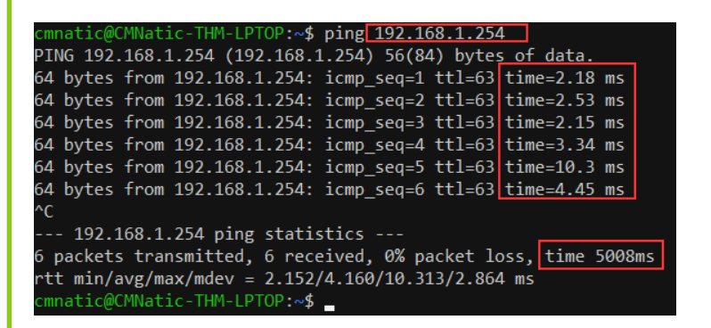

# Networking

The internet is one giant network that consists of many, many small networks within itself.
- These small networks are called private networks

## IP addresses

An Internet Protocol address can be used as a way of identifying a host on a network for a period of time, and after that the same IP address can be used to identify a another device.

IP consists of 4 octets, each between 0-255

IPv4 has a limit of 2^32 = 4.29 billion devices

Next version is IPv6, which supports up to 2^128 IP addresses.

## MAC addresses

Devices on a network will all have a physical network interface, which is a microchip board found on the device's motherboard. This network interface is assigned a unique address at the factory it was built at, called a **MAC** (**M**edia **A**ccess **C**ontrol ) address. 

The MAC address is a **twelve-character** hexadecimal number (_a base sixteen numbering system used in computing to represent numbers_) split into two's and separated by a colon. 

These colons are considered separators. For example, _a4:c3:f0:85:ac:2d_. The first six characters represent the company that made the network interface, and the last six is a unique number.

### MAC address spoofing

However, an interesting thing with MAC addresses is that they can be faked or "spoofed" in a process known as spoofing. This spoofing occurs when a networked device pretends to identify as another using its MAC address. When this occurs, it can often break poorly implemented security designs that assume that devices talking on a network are trustworthy.

## Ping & ICMP

Ping is one of the most fundamental network tools available to us. Ping uses **ICMP** (**I**nternet **C**ontrol **M**essage **P**rotocol) packets to determine the performance of a connection between devices, for example, if the connection exists or is reliable.

The time taken for ICMP packets travelling between devices is measured by ping, such as in the screenshot below. This measuring is done using ICMP's echo packet and then ICMP's echo reply from the target device.

