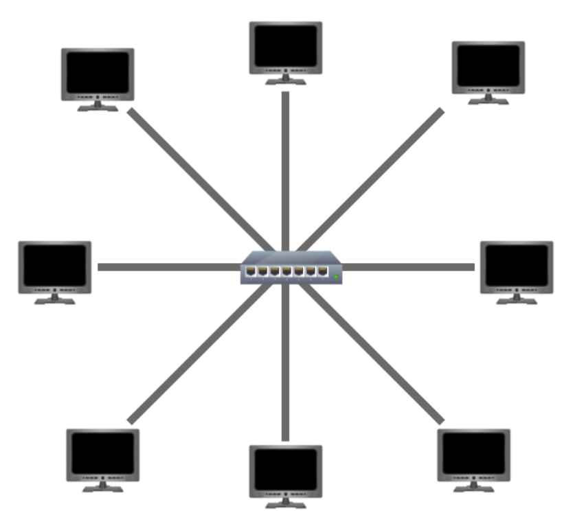
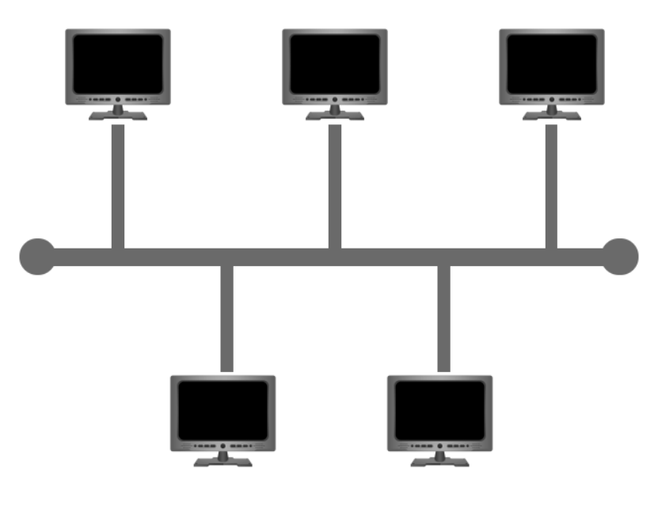
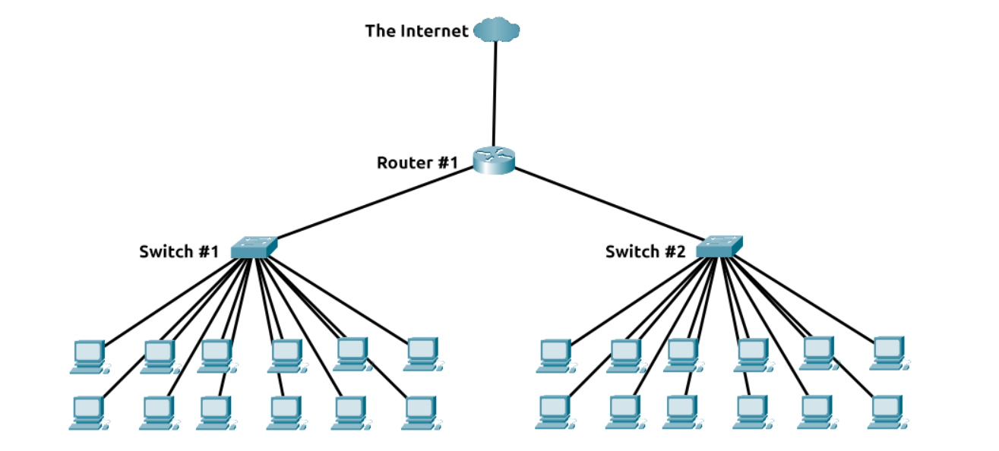

# LAN Topologies

## Star Topology

The main premise of a star topology is that devices are individually connected via a central networking device such as a switch or hub. This topology is the most commonly found today because of its reliability and scalability - despite the cost.

Any information sent to a device in this topology is sent via the central device to which it connects.

Pros:
- more scalable, easy to add more devices

Cons:
- more expensive coz more cabling and dedicated n/w equipment
- more maintenance required to keep the network functional as the network scales
- increased maintenance makes troubleshooting harder

## Bus Topology

This type of connection relies upon a single connection which is known as a backbone cable. This type of topology is similar to the leaf off of a tree in the sense that devices (leaves) stem from where the branches are on this cable.

Pros:
- easy to set up
- cost effective

Cons:
- very prone to bus getting overloaded and becoming a bottleneck
- this bottleneck makes identifying the malfunctioning device hence making troubleshooting harder
- Little redundancy in place in case of failure, as the bus is the single point of failure

## Ring Topology

aka Token topology, Devices such as computers are connected directly to each other to form a loop, meaning that there is little cabling required and less dependence on dedicated hardware such as within a star topology.

A ring topology works by sending data across the loop until it reaches the destined device, using other devices along the loop to forward the data. Interestingly, a device will only send received data from another device in this topology if it does not have any to send itself. If the device happens to have data to send, it will send its own data first before sending data from another device.

Pros: 
- fairly easy to troubleshoot as one direction of data flow
- less prone to bottlenecks

Cons:
- one direction of data flow is not  very efficient
- one fault will result in whole network being down

# Switch

Switches are dedicated devices within a network that are designed to aggregate multiple other devices such as computers, printers, or any other networking-capable device using ethernet. These various devices plug into a switch's port. Switches are usually found in larger networks such as businesses, schools, or similar-sized networks, where there are many devices to connect to the network. Switches can connect a large number of devices by having ports of 4, 8, 16, 24, 32, and 64 for devices to plug into.

Switches are much more efficient than their lesser counterpart (hubs/repeaters). Switches keep track of what device is connected to which port. This way, when they receive a packet, instead of repeating that packet to every port like a hub would do, it just sends it to the intended target, thus reducing network traffic.

# Router

It's a router's job to connect networks and pass data between them. It does this by using routing (hence the name router!).

Routing is the label given to the process of data travelling across networks. Routing involves creating a path between networks so that this data can be successfully delivered.