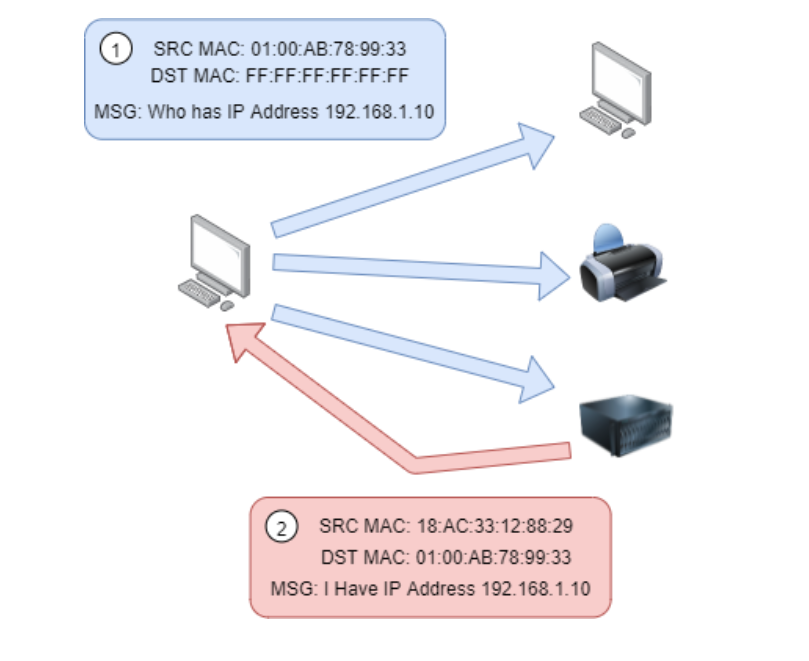
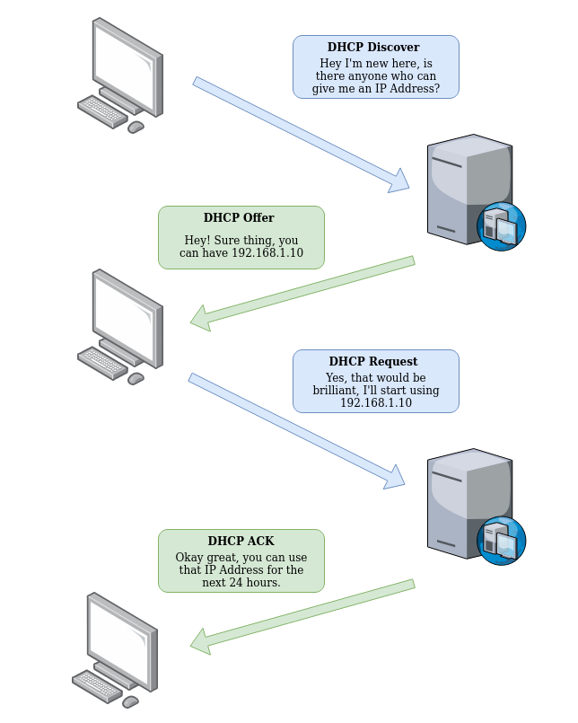

# Subnetting

Just like we need to know the department name in an org to send the correct info, similarly, networks need to know which portion of the network a particular information belongs to.

N/w admins use subnetting to categorise and assign specific parts of a network to reflect this.

Subnetting is achieved by splitting up the number of hosts that can fit within the network, represented by a number called a _subnet mask_

An IP address is made up of four sections called octets. The same goes for a subnet mask which is also represented as a number of four bytes (32 bits), ranging from 0 to 255 (0-255).

Subnets use IP addresses in three different ways:

* Identify the network address
    - This address identifies the start of the actual network and is used to identify a network's existence.
    - For example, a device with the IP address of 192.168.1.100 will be on the network identified by 192.168.1.0
* Identify the host address
    - An IP address here is used to identify a device on the subnet
    - For example, a device will have the network address of 192.168.1.1
* Identify the default gateway
    - The default gateway address is a special address assigned to a device on the network that is capable of sending information to another network
    - Any data that needs to go to a device that isn't on the same network (i.e. isn't on 192.168.1.0) will be sent to this device. These devices can use any host address but usually use either the first or last host address in a network (.1 or .254), e.g. 192.168.1.254

Now, in small networks such as at home, you will be on one subnet as there is an unlikely chance that you need more than 254 devices connected at one time.

However, places such as businesses and offices will have much more of these devices (PCs, printers, cameras and sensors), where subnetting takes place.

Subnetting provides a range of benefits, including:

* Efficiency
* Security
* Full control

# ARP Protocol

Devices can have two identifiers: A MAC address and an IP address.

The **ARP** protocol or **A**ddress **R**esolution **P**rotocol for short, is the technology that is responsible for allowing devices to identify themselves on a network.

Simply, the ARP protocol allows a device to associate its MAC address with an IP address on the network. Each device on a network will keep a log of the MAC addresses associated with other devices.

When devices wish to communicate with another, they will send a broadcast to the entire network searching for the specific device. Devices can use the ARP protocol to find the MAC address (and therefore the physical identifier) of a device for communication.

### How does ARP Work?

Each device within a network has a ledger to store information on, which is called a cache. In the context of the ARP protocol, this cache stores the identifiers of other devices on the network.

In order to map these two identifiers together (IP address and MAC address), the ARP protocol sends two types of messages:

1.  **ARP Request**
2.  **ARP Reply**

When an **ARP request** is sent, a message is broadcasted to every other device found on a network by the device, asking whether or not the device's MAC address matches the requested IP address. 

If the device does have the requested IP address, an **ARP reply** is returned to the initial device to acknowledge this. The initial device will now remember this and store it within its cache (an ARP entry).

# DHCP Protocol

IP addresses can be assigned either manually, by entering them physically into a device, or automatically and most commonly by using a **DHCP** (**D**ynamic **H**ost **C**onfiguration **P**rotocol) server. 

When a device connects to a network, if it has not already been manually assigned an IP address, it sends out a request (DHCP Discover) to see if any DHCP servers are on the network. 

The DHCP server then replies back with an IP address the device could use (DHCP Offer). 

The device then sends a reply confirming it wants the offered IP Address (DHCP Request). 

And then lastly, the DHCP server sends a reply acknowledging this has been completed, and the device can start using the IP Address (DHCP ACK).

