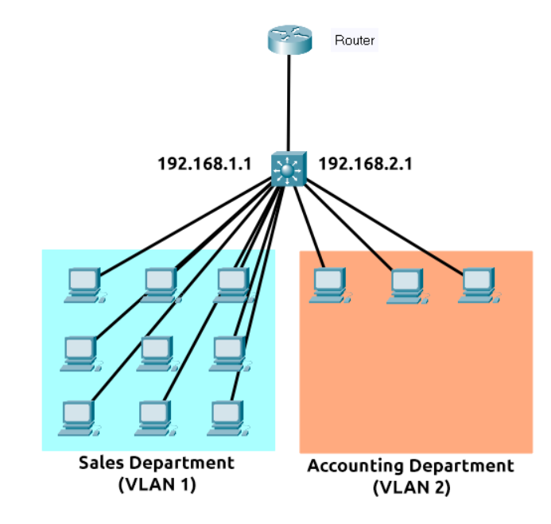

# Port Forwarding

Port forwarding is an essential component in connecting applications and services to the Internet. Without port forwarding, applications and services such as web servers are only available to devices within the same direct network.

Port forwarding is configured at the router of a network.

# Firewalls

A firewall is a device within a network responsible for determining what traffic is allowed to enter and exit. Think of a firewall as border security for a network. An administrator can configure a firewall to **permit** or **deny** traffic from entering or exiting a network based on numerous factors such as:

* Where the traffic is coming from? (has the firewall been told to accept/deny traffic from a specific network?)
* Where is the traffic going to? (has the firewall been told to accept/deny traffic destined for a specific network?)
* What port is the traffic for? (has the firewall been told to accept/deny traffic destined for port 80 only?)
* What protocol is the traffic using? (has the firewall been told to accept/deny traffic that is UDP, TCP or both?)

Firewalls perform packet inspection to determine the answers to these questions.

Firewalls come in all shapes and sizes. From dedicated pieces of hardware (often found in large networks like businesses) that can handle a magnitude of data to residential routers (like at your home!) or software such as [Snort](https://www.snort.org/), firewalls can be categorised into 2 to 5 categories.

Categories: 
1. Stateful: 
    - rather than inspecting an individual packet, this firewall determines the behaviour of a device **based upon the entire connection**.
    - This firewall type consumes many resources in comparison to stateless firewalls as the decision making is dynamic. For example, a firewall could allow the first parts of a TCP handshake that would later fail.
    - If a connection from a host is bad, it will block the entire device.
2. Stateless: 
    - This firewall type uses a static set of rules to determine whether or not **individual packets** are acceptable or not. For example, a device sending a bad packet will not necessarily mean that the entire device is then blocked.
    - Whilst these firewalls use much fewer resources than alternatives, they are much dumber. For example, these firewalls are only effective as the rules that are defined within them. If a rule is not exactly matched, it is effectively useless. 
    - However, these firewalls are great when receiving large amounts of traffic from a set of hosts (such as a Distributed Denial-of-Service attack)

# VPN

A **V**irtual **P**rivate **N**etwork (or **VPN** for short) is a technology that allows devices on separate networks to communicate securely by creating a dedicated path between each other over the Internet (known as a tunnel). Devices connected within this tunnel form their own private network.

1.  Network #1 (Office #1)
2.  Network #2 (Office #2)
3.  Network #3 (Two devices connected via a VPN)

The devices connected on Network #3 are still a part of Network #1 and Network #2 but also form together to create a private network (Network #3) that only devices that are connected via this VPN can communicate over.

Benefits: 
1. Allows networks in different geographical locations to be connected.
2. Offers privacy
    - VPN technology uses encryption to protect data. This means that it can only be understood between the devices it was being sent from and is destined for, meaning the data isn't vulnerable to sniffing.
3. Offers anonymity

# LAN networking devices

Switch vs Router

A Switch connects devices forming a network, a Router connects switches/networks. 

Routers operate at Layer 3 of the OSI model.

They often feature an interactive interface (such as a website or a console) that allows an administrator to configure various rules such as port forwarding or firewalling.

Switches can operate at both layer 2 and layer 3 of the OSI model. However, these are exclusive in the sense that Layer 2 switches cannot operate at layer 3.

Layer 2 switches are responsible for sending frames to the correct device.

Layer 3 re more sophisticated than layer 2, as they can perform some of the responsibilities of a router. Namely, these switches will send frames to devices (as layer 2 does) and route packets to other devices using the IP protocol.

Let's take a look at the diagram below of a layer 3 switch in action. We can see that there are two IP addresses: 

* 192.168.1.1
* 192.168.2.1

A technology called **VLAN** (**V**irtual **L**ocal **A**rea **N**etwork) allows specific devices within a network to be virtually split up. This split means they can all benefit from things such as an Internet connection but are treated separately. This network separation provides security because it means that rules in place determine how specific devices communicate with each other. This segregation is illustrated in the diagram below:

In the context of the diagram above, the "Sales Department" and "Accounting Department" will be able to access the Internet, but not able to communicate with each other (although they are connected to the same switch).