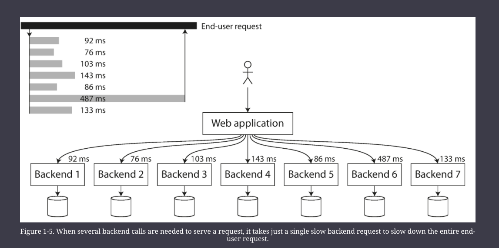

# Foundations

An application has to meet various requirements in order to be useful. 

There are _functional requirements_ 
    - what it should do 
    - such as allowing data to be stored
    - retrieved
    - searched
    - processed in various ways 

and some _nonfunctional requirements_ 
    - general properties like security 
    - reliability
    - compliance
    - scalability
    - compatibility 
    - maintainability

#### Data Intensive vs Compute Intensive

For the former, bigger problems are the amount of data, the complexity of data, and the speed at which it is changing, rather than raw CPU power

#### Data Systems 

Databases, queues, caches and their usage in various combinations are an example of Data Systems (general purpose vs special purpose)

## Reliability

The system should continue to work *correctly* (performing the correct function at the desired level of performance) even in the face of _adversity_ (h/w or s/w faults, and even human error)

Typical reliable software expectations
- The application performs the function that the user expected.
- It can tolerate the user making mistakes or using the software in unexpected ways.
- Its performance is good enough for the required use case, under the expected load and data volume.
- The system prevents any unauthorized access and abuse.

The things that can go wrong are called _faults_, and systems that anticipate faults and can cope with them are called _fault-tolerant_ or _resilient_.

Note that a fault is not the same as a failure. 
    - A fault is usually defined as one component of the system deviating from its spec
    - whereas a failure is when the system as a whole stops providing the required service to the user.

#### Hardware Faults

- Hard disks crash
- RAM becomes faulty
- the power grid has a blackout
- someone unplugs the wrong network cable
- etc…

Our first response is usually to add redundancy to the individual hardware components in order to reduce the failure rate of the system.
    - When one component dies, the redundant component can take its place while the broken component is replaced. 
    - This approach cannot completely prevent hardware problems from causing failures, but it is well understood and can often keep a machine running uninterrupted for years.

However, as data volumes and applications’ computing demands have increased, more applications have begun using larger numbers of machines, which proportionally increases the rate of hardware faults.

Hence there is a move toward systems that can tolerate the loss of entire machines, by using software fault-tolerance techniques in preference or in addition to hardware redundancy.

#### Software Errors

Examples: 

* A software bug that causes every instance of an application server to crash when given a particular bad input. For example, consider the leap second on June 30, 2012, that caused many applications to hang simultaneously due to a bug in the Linux kernel [9](https://learning.oreilly.com/library/view/designing-data-intensive-applications/9781491903063/ch01.html#Minar2012vh_ch1).     
* A runaway process that uses up some shared resource—CPU time, memory, disk space, or network bandwidth.
* A service that the system depends on that slows down, becomes unresponsive, or starts returning corrupted responses.
* Cascading failures, where a small fault in one component triggers a fault in another component, which in turn triggers further faults.

There is no quick solution to the problem of systematic faults in software. Lots of small things can help: 
- carefully thinking about assumptions and interactions in the system; 
- thorough testing; process isolation; 
- allowing processes to crash and restart; 
- measuring, monitoring,
-  and analyzing system behavior in production.

#### Human Errors

How do we make our systems reliable, in spite of unreliable humans? The best systems combine several approaches:

* Design systems in a way that minimizes opportunities for error.
* Decouple the places where people make the most mistakes from the places where they can cause failures. In particular, provide fully featured non-production _sandbox_ environments where people can explore and experiment safely, using real data, without affecting real users.
* Test thoroughly at all levels, from unit tests to whole-system integration tests and manual tests.    
* Allow quick and easy recovery from human errors, to minimize the impact in the case of a failure. For example, make it fast to roll back configuration changes, roll out new code gradually (so that any unexpected bugs affect only a small subset of users), and provide tools to recompute data (in case it turns out that the old computation was incorrect). 
* Set up detailed and clear monitoring, such as performance metrics and error rates. In other engineering disciplines this is referred to as _telemetry_. 
* Implement good management practices and training

## Scalability

As the system grows (in data volume, traffic volume, or complexity), there should be reasonable ways of dealing with that growth)

Scalability is the term we use to describe a system’s ability to cope with increased load.

#### Describing Load and Load Parameters

Load can be described with a few numbers which we call _load parameters_. 

The best choice of parameters depends on the architecture of your system: 
    - it may be requests per second to a web server
    - the ratio of reads to writes in a database
    - the number of simultaneously active users in a chat room
    - the hit rate on a cache, or something else.

#### Describing Performance

We must define Performance numbers for our app when we want to investigate what happens when the load increases
    - When you increase a load parameter and keep the system resources (CPU, memory, network bandwidth, etc.) unchanged, how is the performance of your system affected?
    - When you increase a load parameter, how much do you need to increase the resources if you want to keep performance unchanged?

Common Performace numbers
- Throughput
    - the number of records we can process per second
    - OR, the total time it takes to run a job on a dataset of a certain size
- Response Time 
    - the time between a client sending a request and receiving a response
    - Since Response time vary for each request, Response Time is not a single number but a distribution of values
- Latency
    - Not the same as Response Time
    - The Response time is what the client sees (besides the actual time to process the request (the _service time_), it includes network delays and queueing delays.) 
    - Latency is the duration that a request is waiting to be handled—during which it is _latent_, awaiting service

- _Average_ is not the best measure of performance, usually it is better to use _percentiles_
    - The **median** is also known as the 50th percentiles, abbreviated as p50
    - Note that the median refers to a single request; 
        - if the user makes several requests (over the course of a session, or because several resources are included in a single page), the probability that at least one of them is slower than the median is much greater than 50%.
- In order to figure out how bad your outliers are, you can look at higher percentiles: the _95th_, _99th_, and _99.9th_ percentiles are common (abbreviated _p95_, _p99_, and _p999_). 
    - They are the response time thresholds at which 95%, 99%, or 99.9% of requests are faster than that particular threshold. 
    - For example, if the 95th percentile response time is 1.5 seconds, that means 95 out of 100 requests take less than 1.5 seconds, and 5 out of 100 requests take 1.5 seconds or more.

**Tail Latencies**
- High percentiles of response times, p99, p99.9, p99.99
- tail latencies are important because they directly affect user's experience of the service
- For example, Amazon describes response time requirements for internal services in terms of the 99.9th percentile, even though it only affects 1 in 1,000 requests. 
    - This is because the customers with the slowest requests are often those who have the most data on their accounts because they have made many purchases—that is, they’re the most valuable customers
- On the other hand, optimizing the 99.99th percentile (the slowest 1 in 10,000 requests) was deemed too expensive and to not yield enough benefit for Amazon’s purposes. 
    - Reducing response times at very high percentiles is difficult because they are easily affected by random events outside of your control, and the benefits are diminishing.

Percentiles are often used in _service level objectives_ (SLOs) and _service level agreements_ (SLAs), contracts that define the expected performance and availability of a service.

**head-of-line blocking**
- Queueing delays often account for a large part of the response time at high percentiles. 
- As a server can only process a small number of things in parallel (limited, for example, by its number of CPU cores), it only takes a small number of slow requests to hold up the processing of subsequent requests. 
- Even if those subsequent requests are fast to process on the server, the client will see a slow overall response time due to the time waiting for the prior request to complete. 
- Due to this effect, it is important to measure response times on the client side.

- High percentiles become especially important in backend services that are called multiple times as part of serving a single end-user request. 
- Even if you make the calls in parallel, the end-user request still needs to wait for the slowest of the parallel calls to complete.
- It takes just one slow call to make the entire end-user request slow (see diagram below)
- Even if only a small percentage of backend calls are slow, the chance of getting a slow call increases if an end-user request requires multiple backend calls, and so a higher proportion of end-user requests end up being slow (an effect known as _tail latency amplification_).

#### Coping with Load 

_scaling up_ (_vertical scaling_, moving to a more powerful machine) 

_scaling out_ (_horizontal scaling_, distributing the load across multiple smaller machines). 

Distributing load across multiple machines is also known as a _shared-nothing_ architecture.

Some systems are _elastic_, meaning that they can automatically add computing resources when they detect a load increase, whereas other systems are scaled manually

While distributing stateless services across multiple machines is fairly straightforward, taking stateful data systems from a single node to a distributed setup can introduce a lot of additional complexity. For this reason, common wisdom until recently was to keep your database on a single node (scale up) until scaling cost or high-availability requirements forced you to make it distributed.

As the tools and abstractions for distributed systems get better, this common wisdom may change, at least for some kinds of applications. It is conceivable that distributed data systems will become the default in the future, even for use cases that don’t handle large volumes of data or traffic.

## Maintainability

Over time, many different people will work on the system (engineering and operations, both mainataining current behavious and adapting the system to new use cases), and they should all be aboe to work on it productively.

We can and should design software in such a way that it will hopefully minimize pain during maintenance, and thus avoid creating legacy software ourselves. To this end, we will pay particular attention to three design principles for software systems:

1. Operability
    - Make it easy for operations teams to keep the system running smoothly.
2. Simplicity
    - Make it easy for new engineers to understand the system, by removing as much complexity as possible from the system. (Note this is not the same as simplicity of the user interface.)
3. Evolvability
    - Make it easy for engineers to make changes to the system in the future, adapting it for unanticipated use cases as requirements change. Also known as _extensibility_, _modifiability_, or _plasticity_.

#### Operability: Making life easy for Operations

Operation teams are vital to keeping a software system running smoothly.

A good operation team typically is responsible for the following, and more:
    - Monitoring the health of the system and quickly restoring service if it goes into a bad state
    - Tracking down the cause of problems, such as system failures or degraded performance
    - Keeping software and platforms up to date, including security patches
    - Keeping tabs on how different systems affect each other, so that a problematic change can be avoided before it causes damage
    - Anticipating future problems and solving them before they occur (e.g., capacity planning)
    - Establishing good practices and tools for deployment, configuration management, and more
    - Performing complex maintenance tasks, such as moving an application from one platform to another
    - Maintaining the security of the system as configuration changes are made
    - Defining processes that make operations predictable and help keep the production environment stable
    - Preserving the organization’s knowledge about the system, even as individual people come and go

#### Simplicity: Managing Complexity

- Small software projects can have delightfully simple and expressive code, 
- but as projects get larger, they often become very complex and difficult to understand. 
- This complexity slows down everyone who needs to work on the system, further increasing the cost of maintenance. 

- A software project mired in complexity is sometimes described as a _big ball of mud_

There are various possible symptoms of complexity: 
- explosion of the state space
- tight coupling of modules
- tangled dependencies
- inconsistent naming and terminology
- hacks aimed at solving performance problems
- special-casing to work around issues elsewhere
- and many more.

One of the best tools we have for removing accidental complexity is _abstraction_. 
- A good abstraction can hide a great deal of implementation detail behind a clean, simple-to-understand façade. 
- A good abstraction can also be used for a wide range of different applications.
- However, finding good abstractions is very hard. 
- In the field of distributed systems, although there are many good algorithms, it is much less clear how we should be packaging them into abstractions that help us keep the complexity of the system at a manageable level.

#### Evolvability: Making Change Easy

It’s extremely unlikely that your system’s requirements will remain unchanged forever.

In terms of organizational processes, _Agile_ working patterns provide a framework for adapting to change.