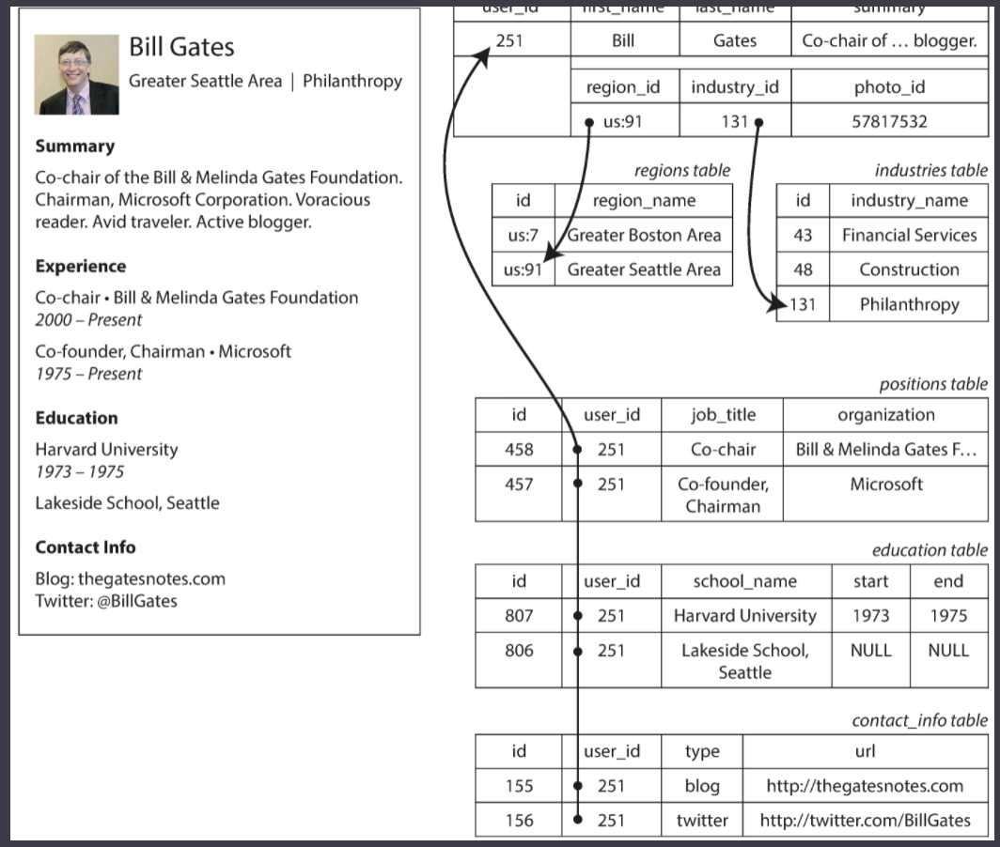
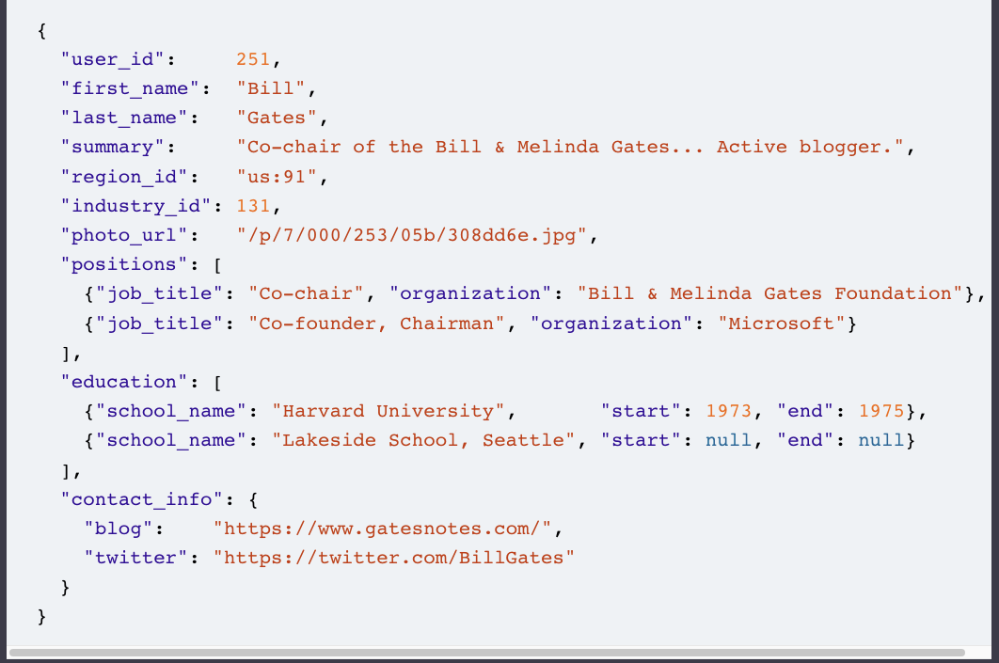
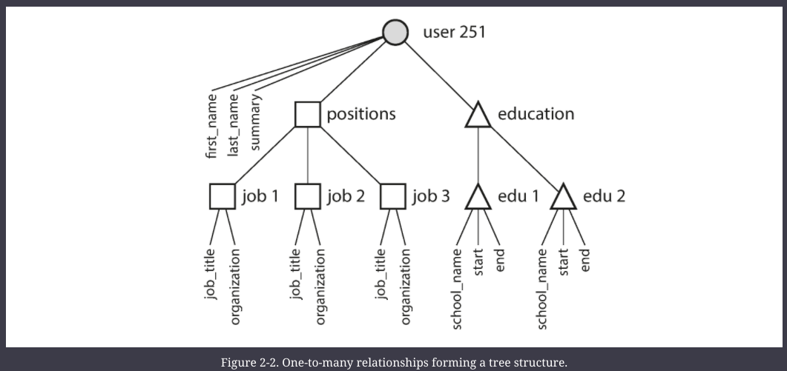
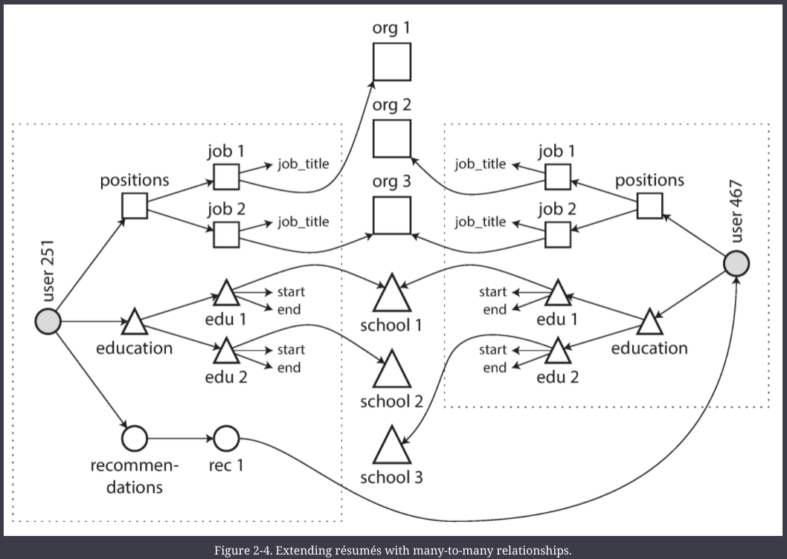
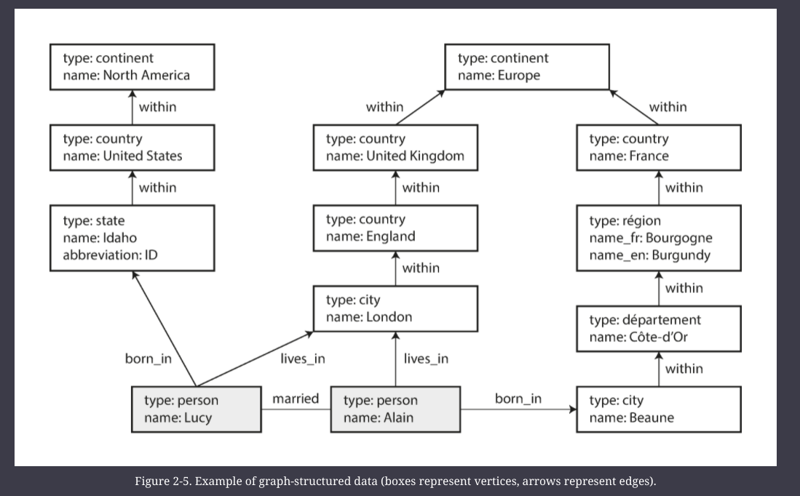
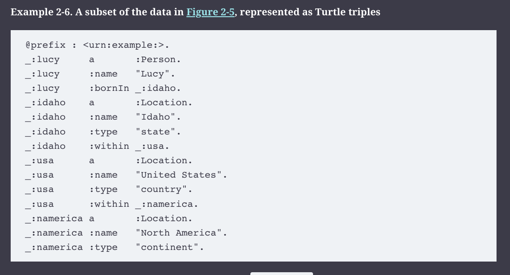

# Data Models and Query Languages

Data models are one of the most important part of developing software, because they have such a profound effect; not only how the software is written, but also on how we think about the problem that we are solving

Most applications are built by layering one data model on top of another.
- For each layer, the question is: how it is represented in terms of the next lower layer
- We model real worlds as objects or Data structures, and APIs to manipulate those
- When we want to store the above models, we use general purpose data model, such as JSON or XML, tables in RDB, or a graph model
- JSON/XML/relational/graph data is represented in terms of bytes in memory or disk
- h/w engineers figure out how to represent bytes in terms of electrical currents, pulses of light, magnetic fields etc

## Relational Model vs Document Model

Relational model
- proposed by Edgar Codd in 1970
- data is organized into _relations_ (called tables in SQL)
- where each relation is an unordered collection of tuples (rows in SQL)

The roots of relations dbs lie in business data processing, which was performed on mainframe computers in 1960s and 70s
- Uses cases were
    - Transaction processing 
        - entering sales or banking transactions
        - airline reservations
        - stock keeping in warehouses
    - Batch Processing 
        - customer invoices
        - payroll
        - reporting

Therre have been many competing approaches to reoational 
    - network model 
    - hierarchical model

Remarkably, relational DBs turned out to generalize well, byond their original scope of business data processing.

#### Birth of NoSQL

There are several driving forces behind the adoption of NoSQL dbs" 
- a need for greater scalability, including very large dbs and very high write throughput
- a widespread preference for free and open source s/w over commercial
- Specialized query operations that are not well supported by the relational model
- Frustration with restrictiveness of relational schemas, a desire for more dynamic and expressive data model

In the foreseeable future, Relational model will continue to be used with a broad variety of non-relational dbs, an idea that is called _polyglot persistence_

#### The Object-Relational Mismatch

If data is stored as SQL tables, an awkward transaction layer is required between the objects in the application code and the db model of tabes, rows and columns. 

This disconnect is also called _impedance mismatch_

Object-relational mapping (ORM) frameworks like ActiveRecord and Hibernate reduce the amount of boilerplate code required for this translation layer, but they can’t completely hide the differences between the two models.

###### Example

How a resume is represented in SQL 

Options on how to represent one-to-many relationship (positions and education table above)
- the most normalized representation is to put `positions`, `education` etc in separate tables, with foreign key reference to the `users`  table
- Later versions of SQL added support for structured datatypes and XML/JSON data
    - this allowed multi-valued data to be stored in a row
    - with support for querying and indexing inside those documents
- Option 3 is the same as option #2 above, but without support for querying and indexing inside the data
    - Just store JSON/XML as text

Here's the same resume represented as a **document**

The JSON representation has better **locality** that the multi-table schema
    - if you want to fetch a profile in relational, you need to either 
        - perform multiple queries
        - or perform a messy multi way join b/w `users` and other tables
    - in JSON, all the relevant information is in one place, and one query is sufficient

The one-to-many relationship form a tree structure, and JSON representation makes this tree structure explicit

#### Many-to-One and Many-to-Many Relationships

Advantages of having standardized list of one-to-many options (rather than text fields e.g. like `region_id` and `industry_id` in above SQL), and storing `id`s instead of text strings
- Consistent style and spelling across profiles
- Avoiding ambiguity (e.g., if there are several cities with the same name)
- Ease of updating—the name is stored in only one place, so it is easy to update across the board    
- Localization support—when the site is translated into other languages, the standardized lists can be localized
- Better search
- less duplication - avoid the need to update all the copies when something changes

many-to-one relationships (many people live in one particular region, many people work in one particular industry) does not fit nicely into the _document_ model
    - whereas, in relational model, its normal to refer to rows in other tables by ids, because joins are easy

Sometimes, even if the initial version of an app fits well in a join-free document model, data has a tendency of becoming more interconnected as features are added.
    - for example, adding organizations and school as entities to the above resume model
    - adding recommendations by one user to another
    - Both these features require many-to-many relationships, and are hard to implement without joins
    - In the diagram below, the data within dotted rectangle can be grouped into one doc, but the references to organizations, schools, and other users need to be represented as references, and require joins when queried

#### History of data models

The most popular database for business data processing in the 1970s was IBMs Information Management System IMS

IMS followed _hierarchical_ model, which has remarkable similarities to JSON model
    - it represented nested records within records
    - IMS worked well for one-to-many relationships
    - but it made many-to-many relationships difficult

Various solutions were proposed to solve the limitations of hierarchical model
    - relational model (which became SQL)
    - network model (initially had large following but fell into obscurity)

###### Network Model 

The network model was standardized by a committee called the Conference on Data Systems Languages (CODASYL)
- it is also known as the _CODASYL model_

In the network model, a record could have multiple parents
- for example, there could be one record for the "Greater Seattle Area" region, and every user who lived in that region could be linked to it

The links between records in the network model were not foreign keys, but more like pointers in a programming language (while still being stored on disk). 
- The only way of accessing a record was to follow a path from a root record along these chains of links. 
- This was called an _access path_.

A query in CODASYL was performed by moving a cursor through the database by iterating over lists of records and following access paths. 
- If a record had multiple parents (i.e., multiple incoming pointers from other records), the application code had to keep track of all the various relationships. 
- Even CODASYL committee members admitted that this was like navigating around an _n_-dimensional data space

###### Relational Model

What the relational model did, by contrast, was to lay out all the data in the open: a relation (table) is simply a collection of tuples (rows), and that’s it.

In a relational database, the query optimizer automatically decides which parts of the query to execute in which order, and which indexes to use. Those choices are effectively the “access path,” 
- but the big difference is that they are made automatically by the query optimizer, not by the application developer, so we rarely need to think about them.

If you want to query your data in new ways, you can just declare a new index, and queries will automatically use whichever indexes are most appropriate.

Query optimizers for relational databases are complicated beasts, and they have consumed many years of research and development effort

When it comes to representing many-to-one and many-to-many relationships, relational and document databases are not fundamentally different: in both cases, the related item is referenced by a unique identifier, which is called a _foreign key_ in the relational model and a _document reference_ in the document model

#### Which data model leads to simpler application code?

- If the data in your application has a document-like structure 
    - (i.e., a tree of one-to-many relationships, where typically the entire tree is loaded at once), 
    - then it’s probably a good idea to use a document model. 
- The relational technique of _shredding_
    - splitting a document-like structure into multiple tables (like `positions`, `education`, and `contact_info` 
    - can lead to cumbersome schemas and unnecessarily complicated application code.

- The document model has limitations: for example, you cannot refer directly to a nested item within a document, but instead you need to say something like “the second item in the list of positions for user 251”
    -  However, as long as documents are not too deeply nested, that is not usually a problem.

- The poor support for joins in document databases may or may not be a problem, depending on the application. 
    - For example, many-to-many relationships may never be needed in an analytics application that uses a document database to record which events occurred at which time.

- However, if your application does use many-to-many relationships, the document model becomes less appealing. 
    - It’s possible to reduce the need for joins by denormalizing
    - but then the application code needs to do additional work to keep the denormalized data consistent.

- Joins can be emulated in application code by making multiple requests to the database
    - but that also moves complexity into the application and is usually slower than a join performed by specialized code inside the database. 
    - In such cases, using a document model can lead to significantly more complex application code and worse performance

###### Schema flexibility in the document model

Most document databases, and the JSON support in relational databases, do not enforce any schema on the data in documents. 
- No schema means that arbitrary keys and values can be added to a document, and when reading, clients have no guarantees as to what fields the documents may contain.

Document databases are sometimes called _schemaless_
- but that’s misleading, as the code that reads the data usually assumes some kind of structure—i.e., there is an implicit schema, but it is not enforced by the database
- A more accurate term is _schema-on-read_ (the structure of the data is implicit, and only interpreted when the data is read)
- in contrast with _schema-on-write_ (the traditional approach of relational databases, where the schema is explicit and the database ensures all written data conforms to it)
- Schema-on-read is like dynamic typed PLs and schema-on-write is like typed PL

The schema-on-read approach is advantageous if the items in the collection don’t all have the same structure for some reason (i.e., the data is heterogeneous)—for example, because:
- There are many different types of objects, and it is not practicable to put each type of object in its own table.
- The structure of the data is determined by external systems over which you have no control and which may change at any time.

###### Data localities for queries

A document is usually stored as a single continuous string, encoded as JSON, XML, or a binary variant thereof (such as MongoDB’s BSON). 
- If your application often needs to access the entire document (for example, to render it on a web page), there is a performance advantage to this _storage locality_. 
- If data is split across multiple tables, multiple index lookups are required to retrieve it all, which may require more disk seeks and take more time.

The locality advantage only applies if you need large parts of the document at the same time.
- On updates to a document, the entire document usually needs to be rewritten
- For these reasons, it is generally recommended that you keep documents fairly small and avoid writes that increase the size of a document

###### Convergence of relational and document dbs

Most relational DBs support XML and JSON

OTOH, RethinkDB supports relational like joins

MongoDB Drivers automaticall resolve document references

It seems that relational and document databases are becoming more similar over time, and that is a good thing: the data models complement each other.

—

## Different Querying Languages

### MapReduce Querying

_MapReduce_ is a programming model for processing large amounts of data in bulk across many machines, popularized by Google. 

A limited form of MapReduce is supported by some NoSQL datastores, including MongoDB and CouchDB, as a mechanism for performing read-only queries across many documents.

MapReduce is neither a declarative query language nor a fully imperative query API, but somewhere in between: the logic of the query is expressed with snippets of code, which are called repeatedly by the processing framework. 

It is based on the `map` (also known as `collect`) and `reduce` (also known as `fold` or `inject`) functions that exist in many functional programming languages.

### Graph Like Data Models

If there are many many connections within our data, representing these many-to-many relationships becomes really complex in RDB and noSQL, that's where graph DBs come in

A graph consists of two kinds of objects: _vertices_ (also known as _nodes_ or _entities_) and _edges_ (also known as _relationships_ or _arcs_). Many kinds of data can be modeled as a graph.

Vertices can represent homogeneous data
    - people, web, pages, road junctions
    - an equally powerful use of graphs is to provide a consistent way of storing completely different types of objects in a single datastore (see diagram below)

#### Property Graphs

In the property graph model, each vertex consists of:

* A unique identifier
* A set of outgoing edges
* A set of incoming edges
* A collection of properties (key-value pairs)

Each edge consists of:

* A unique identifier
* The vertex at which the edge starts (the _tail vertex_)
* The vertex at which the edge ends (the _head vertex_)
* A label to describe the kind of relationship between the two vertices
* A collection of properties (key-value pairs)

The figure above shows Property graphs
- The figure shows a few things that would be difficult to express in a traditional relational schema, such as different kinds of regional structures in different countries (France has _départements_ and _régions_, whereas the US has _counties_ and _states_), quirks of history such as a country within a country (ignoring for now the intricacies of sovereign states and nations), and varying granularity of data (Lucy’s current residence is specified as a city, whereas her place of birth is specified only at the level of a state).

#### Graph Query Languages

- Cypher QL
- Postgres using Recursive CTEs
- Triple Stores and SPARQL
    - The triple-store model is mostly equivalent to the property graph model
    - In a triple-store, all information is stored in the form of very simple three-part statements: (_subject_, _predicate_, _object_). 
    - For example, in the triple (_Jim_, _likes_, _bananas_), _Jim_ is the subject, _likes_ is the predicate (verb), and _bananas_ is the object.
    - The subject of a triple is equivalent to a vertex in a graph. The object is one of two things:
       - A value in a primitive datatype, such as a string or a number. 
           - In that case, the predicate and object of the triple are equivalent to the key and value of a property on the subject vertex. 
           - For example, (_lucy_, _age_, _33_) is like a vertex `lucy` with properties `{"age":33}`.
       - Another vertex in the graph. 
           - In that case, the predicate is an edge in the graph, the subject is the tail vertex, and the object is the head vertex. 
           - For example, in (_lucy_, _marriedTo_, _alain_) the subject and object _lucy_ and _alain_ are both vertices, and the predicate _marriedTo_ is the label of the edge that connects them.

